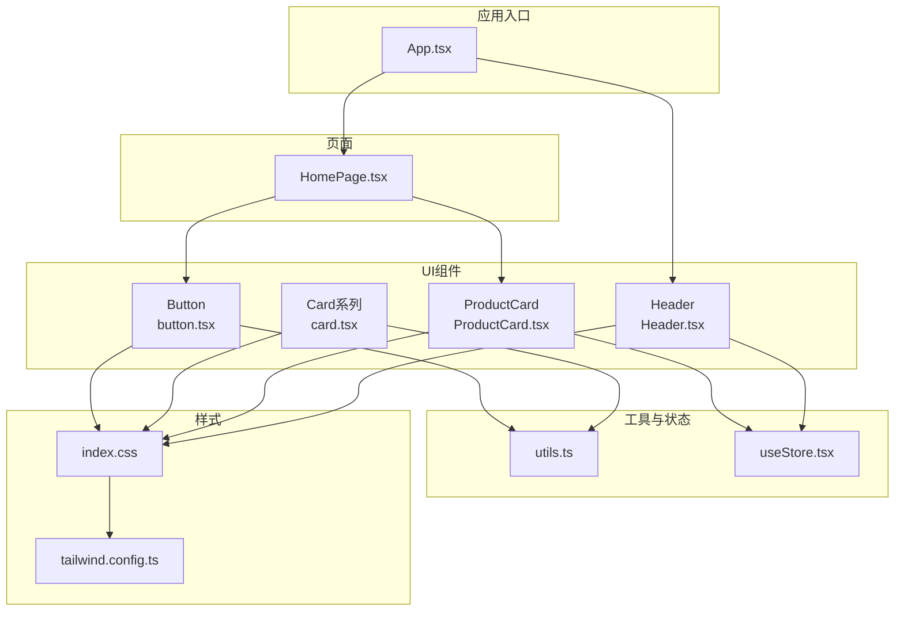
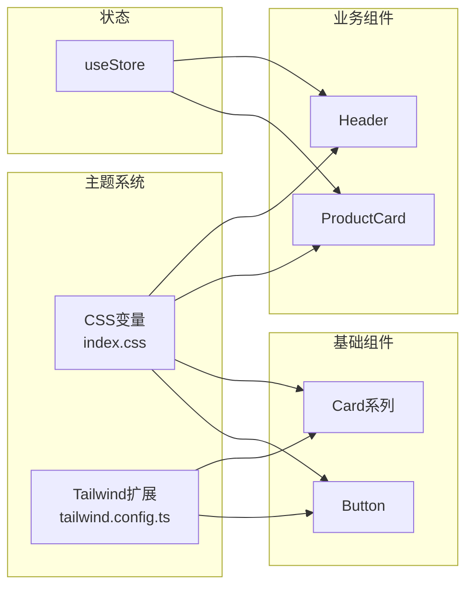
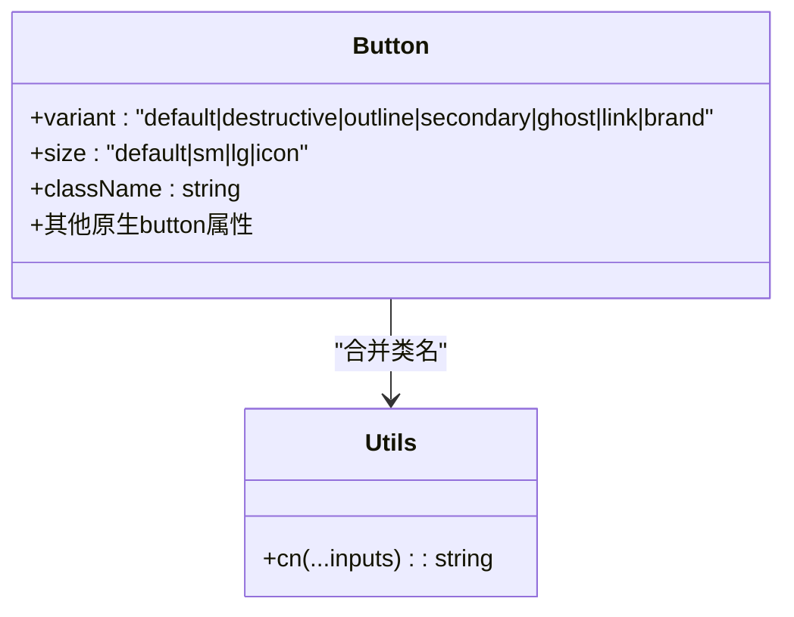
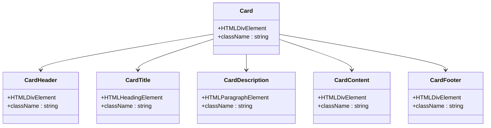
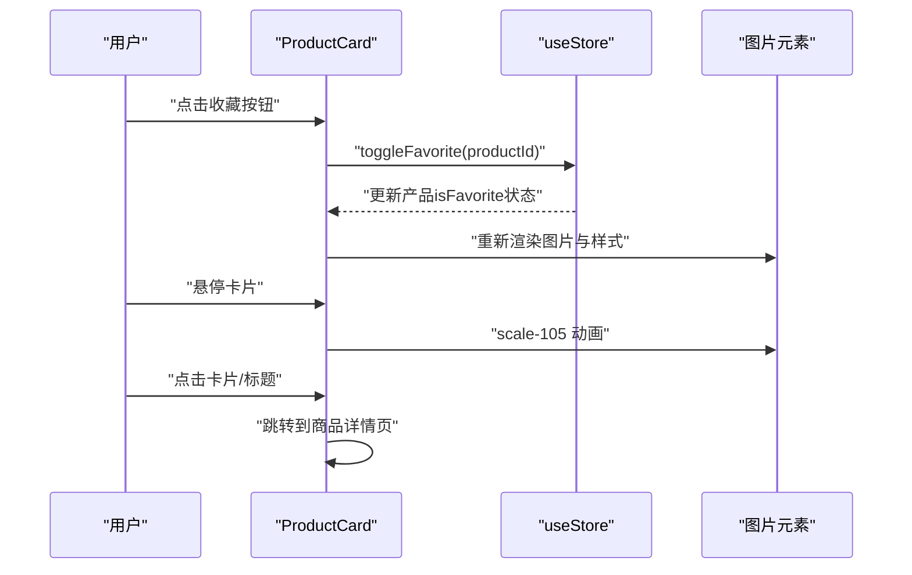
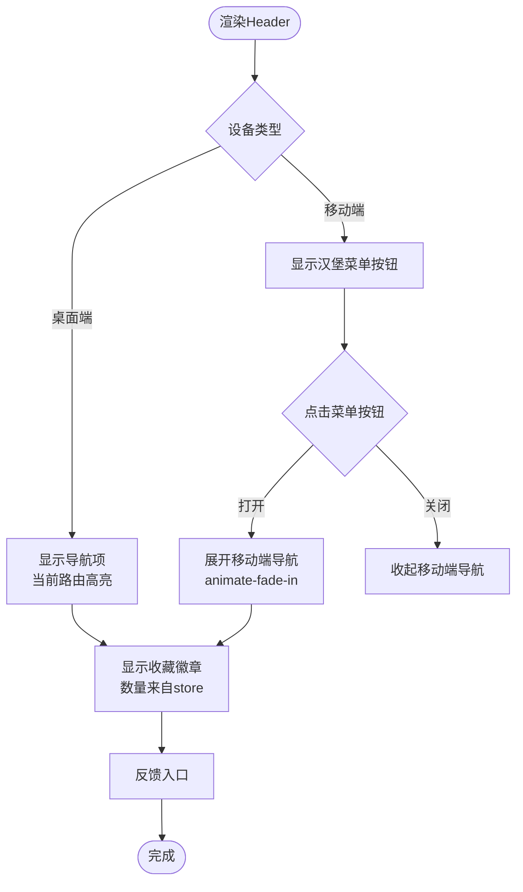
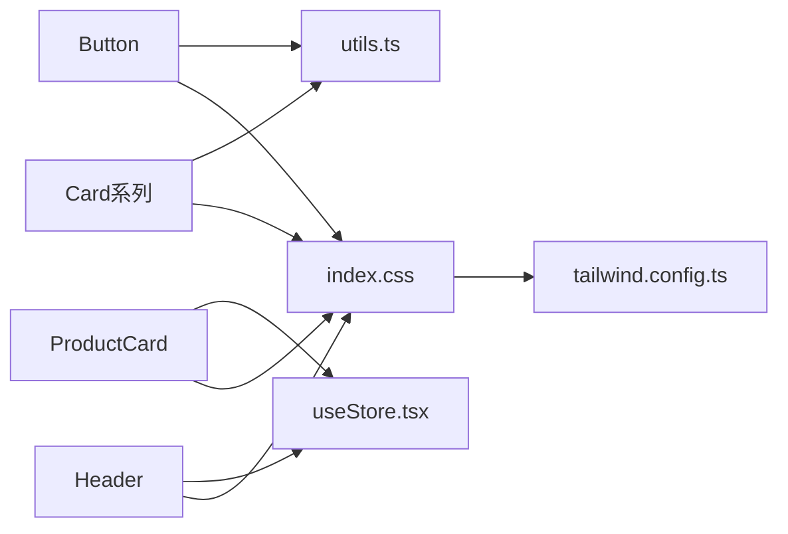

# UI组件库

<cite>
**本文引用的文件列表**
- [button.tsx](file://lienpet-website/src/components/ui/button.tsx)
- [card.tsx](file://lienpet-website/src/components/ui/card.tsx)
- [ProductCard.tsx](file://lienpet-website/src/components/ProductCard.tsx)
- [Header.tsx](file://lienpet-website/src/components/Header.tsx)
- [utils.ts](file://lienpet-website/src/lib/utils.ts)
- [useStore.tsx](file://lienpet-website/src/store/useStore.tsx)
- [index.css](file://lienpet-website/src/index.css)
- [tailwind.config.ts](file://lienpet-website/tailwind.config.ts)
- [App.tsx](file://lienpet-website/src/App.tsx)
- [HomePage.tsx](file://lienpet-website/src/pages/HomePage.tsx)
</cite>

## 目录
1. [简介](#简介)
2. [项目结构](#项目结构)
3. [核心组件](#核心组件)
4. [架构总览](#架构总览)
5. [组件详解](#组件详解)
6. [依赖关系分析](#依赖关系分析)
7. [性能与可访问性](#性能与可访问性)
8. [故障排查](#故障排查)
9. [结论](#结论)
10. [附录：API参考与最佳实践](#附录api参考与最佳实践)

## 简介
本文件为 LienPet 项目的 UI 组件库文档，聚焦于可复用组件的设计原则与实现方法，覆盖 Button、Card 等基础组件的属性接口、样式定制与使用示例；深入解析 ProductCard 商品卡片的复杂交互（图片懒加载、价格显示、收藏状态切换）；解释 Header 导航的响应式设计与移动端适配策略；并提供可访问性支持、主题定制能力与性能优化建议，以及完整的组件 API 参考与最佳实践指南。

## 项目结构
UI 组件主要位于 src/components 下，按功能分层组织：
- 基础 UI 组件：src/components/ui/button.tsx、card.tsx
- 业务组件：src/components/ProductCard.tsx、Header.tsx
- 工具函数：src/lib/utils.ts（类名合并）
- 全局状态：src/store/useStore.tsx（收藏、消息、产品、提示等）
- 主题与样式：src/index.css（CSS 变量、渐变、阴影、过渡）、tailwind.config.ts（Tailwind 扩展）

图表来源
- [App.tsx:13-35](file://lienpet-website/src/App.tsx#L13-L35)
- [HomePage.tsx:1-152](file://lienpet-website/src/pages/HomePage.tsx#L1-L152)
- [button.tsx:1-49](file://lienpet-website/src/components/ui/button.tsx#L1-L49)
- [card.tsx:1-50](file://lienpet-website/src/components/ui/card.tsx#L1-L50)
- [ProductCard.tsx:1-51](file://lienpet-website/src/components/ProductCard.tsx#L1-L51)
- [Header.tsx:1-93](file://lienpet-website/src/components/Header.tsx#L1-L93)
- [utils.ts:1-6](file://lienpet-website/src/lib/utils.ts#L1-L6)
- [useStore.tsx:1-100](file://lienpet-website/src/store/useStore.tsx#L1-L100)
- [index.css:1-115](file://lienpet-website/src/index.css#L1-L115)
- [tailwind.config.ts:1-106](file://lienpet-website/tailwind.config.ts#L1-L106)

章节来源
- [App.tsx:13-35](file://lienpet-website/src/App.tsx#L13-L35)
- [HomePage.tsx:1-152](file://lienpet-website/src/pages/HomePage.tsx#L1-L152)

## 核心组件
- Button：基于 class-variance-authority 的变体系统，支持多种外观与尺寸，通过 cn 合并 Tailwind 类。
- Card：组合容器 Card、CardHeader、CardTitle、CardDescription、CardContent、CardFooter，统一风格与间距。
- ProductCard：商品卡片，集成图片懒加载、价格展示、收藏切换与路由跳转。
- Header：导航栏，含品牌 Logo、主导航、反馈入口、收藏计数徽章与移动端菜单。

章节来源
- [button.tsx:32-49](file://lienpet-website/src/components/ui/button.tsx#L32-L49)
- [card.tsx:4-50](file://lienpet-website/src/components/ui/card.tsx#L4-L50)
- [ProductCard.tsx:10-51](file://lienpet-website/src/components/ProductCard.tsx#L10-L51)
- [Header.tsx:6-93](file://lienpet-website/src/components/Header.tsx#L6-L93)

## 架构总览
组件库采用“基础组件 + 业务组件 + 状态管理 + 主题系统”的分层架构：
- 基础组件：Button、Card 提供一致的视觉与交互语义。
- 业务组件：ProductCard、Header 将业务需求封装为可复用单元。
- 状态管理：useStore 提供全局状态与动作，如收藏切换、消息与产品管理。
- 主题系统：index.css 定义 CSS 变量与渐变、阴影、过渡；tailwind.config.ts 扩展颜色与动画，实现品牌色与一致性。

图表来源
- [index.css:7-115](file://lienpet-website/src/index.css#L7-L115)
- [tailwind.config.ts:10-106](file://lienpet-website/tailwind.config.ts#L10-L106)
- [button.tsx:5-30](file://lienpet-website/src/components/ui/button.tsx#L5-L30)
- [card.tsx:1-50](file://lienpet-website/src/components/ui/card.tsx#L1-L50)
- [ProductCard.tsx:1-51](file://lienpet-website/src/components/ProductCard.tsx#L1-L51)
- [Header.tsx:1-93](file://lienpet-website/src/components/Header.tsx#L1-L93)
- [useStore.tsx:1-100](file://lienpet-website/src/store/useStore.tsx#L1-L100)

## 组件详解

### Button 组件
- 设计原则
  - 使用 class-variance-authority 定义变体与尺寸，保证一致的视觉与交互。
  - 通过 cn 合并默认类名与自定义类名，支持透传原生 button 属性。
  - 支持焦点可见性、禁用态、悬停态与过渡动画。
- 关键属性
  - variant: default、destructive、outline、secondary、ghost、link、brand
  - size: default、sm、lg、icon
  - 其他原生 button 属性均可透传
- 样式定制
  - 通过 Tailwind 颜色变量与品牌色变量控制外观。
  - brand 变体使用品牌渐变背景与阴影。
- 使用示例
  - 在首页中作为“浏览全部商品”、“联系”按钮使用，配合图标与尺寸。

图表来源
- [button.tsx:32-49](file://lienpet-website/src/components/ui/button.tsx#L32-L49)
- [utils.ts:4-6](file://lienpet-website/src/lib/utils.ts#L4-L6)

章节来源
- [button.tsx:5-30](file://lienpet-website/src/components/ui/button.tsx#L5-L30)
- [button.tsx:32-49](file://lienpet-website/src/components/ui/button.tsx#L32-L49)
- [HomePage.tsx:34-44](file://lienpet-website/src/pages/HomePage.tsx#L34-L44)

### Card 组件
- 设计原则
  - 以组合模式提供卡片容器与子块，统一边框、背景、阴影与字体。
  - 子组件 CardHeader、CardTitle、CardDescription、CardContent、CardFooter 负责不同区域的布局与样式。
- 关键属性
  - 所有子组件均透传 HTML 属性，支持 className 自定义。
- 样式定制
  - 基于 card、card-foreground、muted-foreground 等语义化颜色变量。
  - 支持圆角与阴影的 Tailwind 扩展。

图表来源
- [card.tsx:4-50](file://lienpet-website/src/components/ui/card.tsx#L4-L50)

章节来源
- [card.tsx:4-50](file://lienpet-website/src/components/ui/card.tsx#L4-L50)

### ProductCard 商品卡片
- 复杂交互逻辑
  - 图片懒加载：img 标签设置 loading="lazy"，提升首屏性能。
  - 价格显示：从产品数据读取 price 字段并以品牌色高亮。
  - 收藏状态切换：点击收藏按钮调用 useStore.toggleFavorite 切换 isFavorite，并根据状态动态渲染样式与填充。
  - 路由跳转：点击卡片或标题进入商品详情页。
- 性能与体验
  - 图片缩放：悬停时 scale 动画增强交互感。
  - 描述截断：line-clamp 控制文本长度，避免布局溢出。
  - 徽章与过渡：统一使用 transition-smooth 与 hover 效果。

图表来源
- [ProductCard.tsx:10-51](file://lienpet-website/src/components/ProductCard.tsx#L10-L51)
- [useStore.tsx:40-46](file://lienpet-website/src/store/useStore.tsx#L40-L46)

章节来源
- [ProductCard.tsx:10-51](file://lienpet-website/src/components/ProductCard.tsx#L10-L51)
- [useStore.tsx:40-50](file://lienpet-website/src/store/useStore.tsx#L40-L50)

### Header 导航
- 响应式设计
  - 桌面端：水平导航项，当前路由高亮。
  - 移动端：汉堡菜单展开/收起，使用动画类 fade-in。
- 交互细节
  - 收藏徽章：根据收藏数量动态显示，大于 0 时展示计数。
  - 反馈入口：消息图标链接至反馈页。
  - Logo 区域：点击回到首页。
- 主题与样式
  - 使用 backdrop-blur-md 实现毛玻璃效果，sticky 顶部固定。
  - 按钮与链接在 hover 时切换背景色与文字色。

图表来源
- [Header.tsx:6-93](file://lienpet-website/src/components/Header.tsx#L6-L93)
- [useStore.tsx:48-50](file://lienpet-website/src/store/useStore.tsx#L48-L50)

章节来源
- [Header.tsx:6-93](file://lienpet-website/src/components/Header.tsx#L6-L93)
- [useStore.tsx:48-50](file://lienpet-website/src/store/useStore.tsx#L48-L50)

## 依赖关系分析
- 组件依赖
  - Button、Card 依赖 utils.cn 进行类名合并。
  - ProductCard、Header 依赖 useStore 提供的状态与动作。
  - 所有组件共享 index.css 中的 CSS 变量与 Tailwind 扩展。
- 外部依赖
  - class-variance-authority：变体系统
  - lucide-react：图标
  - react-router-dom：路由跳转
  - tailwindcss-animate：动画插件

图表来源
- [button.tsx:2-3](file://lienpet-website/src/components/ui/button.tsx#L2-L3)
- [card.tsx:2](file://lienpet-website/src/components/ui/card.tsx#L2)
- [utils.ts:4-6](file://lienpet-website/src/lib/utils.ts#L4-L6)
- [ProductCard.tsx:3](file://lienpet-website/src/components/ProductCard.tsx#L3)
- [Header.tsx:4](file://lienpet-website/src/components/Header.tsx#L4)
- [useStore.tsx:1-100](file://lienpet-website/src/store/useStore.tsx#L1-L100)
- [index.css:1-115](file://lienpet-website/src/index.css#L1-L115)
- [tailwind.config.ts:103](file://lienpet-website/tailwind.config.ts#L103)

章节来源
- [package.json:11-20](file://lienpet-website/package.json#L11-L20)

## 性能与可访问性
- 性能优化
  - 图片懒加载：ProductCard 与首页分类图使用 loading="lazy"，减少首屏资源占用。
  - 动画与过渡：统一使用 transition-smooth，避免过度动画影响性能。
  - 组件拆分：Button、Card 为纯展示组件，降低重渲染成本。
  - Tailwind 扩展：通过 CSS 变量与预构建动画，减少运行时计算。
- 可访问性
  - 按钮具备焦点可见性样式，便于键盘导航。
  - 图片提供 alt 文本，提升屏幕阅读器可用性。
  - 链接具备明确标题与语义化标签，改善导航体验。
  - 移动端菜单通过按钮切换，保持键盘可达性。

章节来源
- [ProductCard.tsx:17-22](file://lienpet-website/src/components/ProductCard.tsx#L17-L22)
- [button.tsx:6](file://lienpet-website/src/components/ui/button.tsx#L6)
- [index.css:62-64](file://lienpet-website/src/index.css#L62-L64)

## 故障排查
- Button 未生效
  - 检查是否正确引入 cn 并传入 className。
  - 确认 Tailwind 配置已启用动画插件。
- Card 样式异常
  - 确认语义化颜色变量（card、card-foreground）在 index.css 中定义。
- ProductCard 收藏不生效
  - 确认 useStore.toggleFavorite 是否被调用且产品 id 正确。
  - 检查 isFavorite 字段是否存在于产品数据。
- Header 移动端菜单不显示
  - 确认 mobileOpen 状态切换逻辑与动画类 fade-in 正常。
  - 检查路由位置与高亮逻辑。

章节来源
- [utils.ts:4-6](file://lienpet-website/src/lib/utils.ts#L4-L6)
- [tailwind.config.ts:103](file://lienpet-website/tailwind.config.ts#L103)
- [index.css:49-52](file://lienpet-website/src/index.css#L49-L52)
- [useStore.tsx:40-46](file://lienpet-website/src/store/useStore.tsx#L40-L46)
- [Header.tsx:71-90](file://lienpet-website/src/components/Header.tsx#L71-L90)

## 结论
本 UI 组件库通过清晰的分层设计与一致的主题系统，实现了高复用、易维护的前端组件体系。Button 与 Card 提供了稳定的基础能力，ProductCard 与 Header 将业务场景抽象为可配置的交互单元。结合懒加载、动画与语义化样式，整体在性能与可访问性方面表现良好。后续可在组件 API 文档化、测试覆盖与主题变量命名规范上进一步完善。

## 附录：API参考与最佳实践

### Button API
- 属性
  - variant: 变体（default、destructive、outline、secondary、ghost、link、brand）
  - size: 尺寸（default、sm、lg、icon）
  - className: 自定义类名
  - 其他原生 button 属性透传
- 最佳实践
  - 使用 brand 变体突出关键操作。
  - 图标按钮使用 icon 尺寸，确保视觉平衡。
  - 禁用态需显式设置 disabled，保持交互一致性。

章节来源
- [button.tsx:32-49](file://lienpet-website/src/components/ui/button.tsx#L32-L49)

### Card API
- 子组件
  - Card：容器
  - CardHeader：头部容器
  - CardTitle：标题
  - CardDescription：描述
  - CardContent：内容区
  - CardFooter：底部区
- 属性
  - 所有子组件均支持 className 与原生 HTML 属性透传
- 最佳实践
  - 使用 CardHeader + CardTitle 组合呈现标题，CardDescription 提供简要说明。
  - CardContent 用于放置主要内容，CardFooter 放置操作按钮。

章节来源
- [card.tsx:4-50](file://lienpet-website/src/components/ui/card.tsx#L4-L50)

### ProductCard API
- 属性
  - product: Product 对象（包含 id、name、description、price、images、isFavorite）
- 交互
  - 点击收藏：切换 isFavorite，更新状态
  - 悬停：图片放大与阴影变化
  - 点击卡片/标题：跳转至商品详情页
- 最佳实践
  - 为图片提供 fallback，默认图路径需存在。
  - 价格字段使用品牌色高亮，提升可读性。
  - 描述使用 line-clamp 控制长度，避免布局破坏。

章节来源
- [ProductCard.tsx:6-8](file://lienpet-website/src/components/ProductCard.tsx#L6-L8)
- [ProductCard.tsx:10-51](file://lienpet-website/src/components/ProductCard.tsx#L10-L51)

### Header API
- 属性
  - 无外部属性，内部通过路由位置与 store 计算高亮与徽章
- 交互
  - 点击汉堡菜单：切换移动端导航展开/收起
  - 点击导航项：路由跳转，自动高亮当前路由
  - 收藏徽章：点击进入收藏页，显示数量
- 最佳实践
  - 导航项顺序与文案保持一致，避免重复。
  - 移动端菜单使用动画类 fade-in，提升体验。
  - 徽章仅在数量大于 0 时显示，避免视觉噪音。

章节来源
- [Header.tsx:6-93](file://lienpet-website/src/components/Header.tsx#L6-L93)
- [useStore.tsx:48-50](file://lienpet-website/src/store/useStore.tsx#L48-L50)

### 主题定制与可访问性
- 主题定制
  - CSS 变量：通过 :root 定义品牌色、背景、前景、渐变、阴影与过渡。
  - Tailwind 扩展：colors、borderRadius、keyframes、animation。
  - 组件内使用语义化颜色变量与品牌渐变类。
- 可访问性
  - 焦点可见性、语义化标签、图标 alt 文本、键盘可达性。
  - 移动端交互保持可触达性与可理解性。

章节来源
- [index.css:7-115](file://lienpet-website/src/index.css#L7-L115)
- [tailwind.config.ts:18-101](file://lienpet-website/tailwind.config.ts#L18-L101)
- [button.tsx:6](file://lienpet-website/src/components/ui/button.tsx#L6)
- [ProductCard.tsx:19](file://lienpet-website/src/components/ProductCard.tsx#L19)
- [Header.tsx:62-67](file://lienpet-website/src/components/Header.tsx#L62-L67)