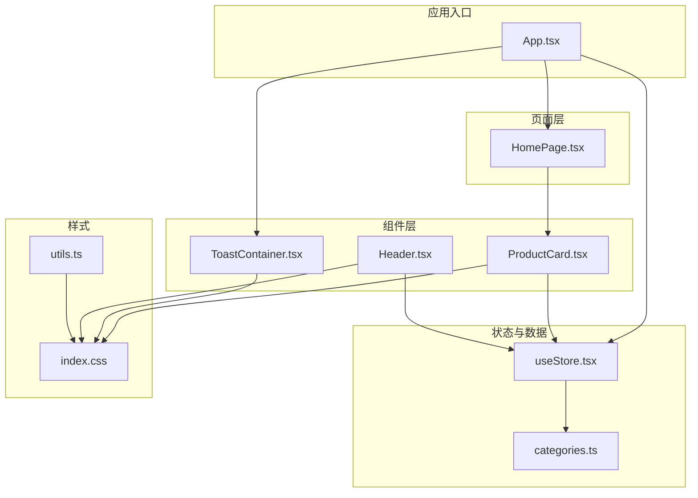
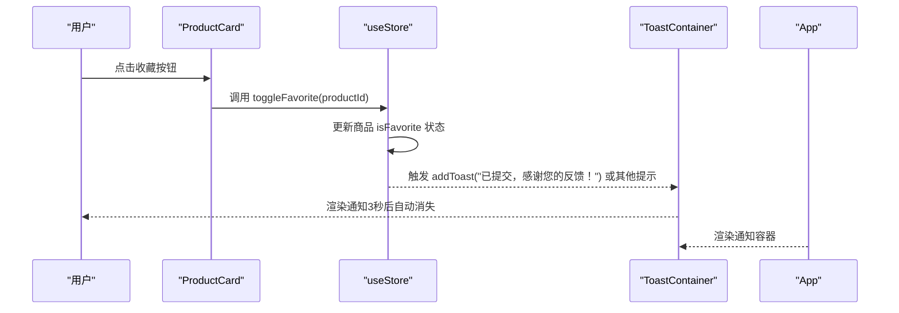
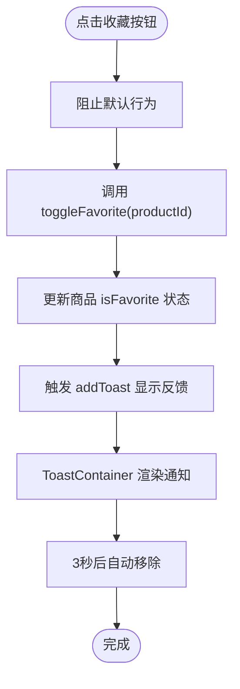
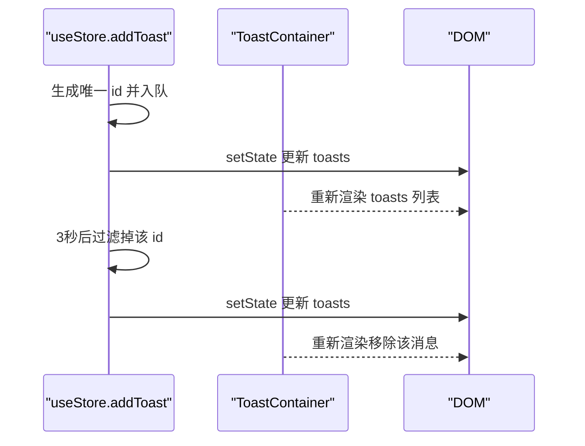
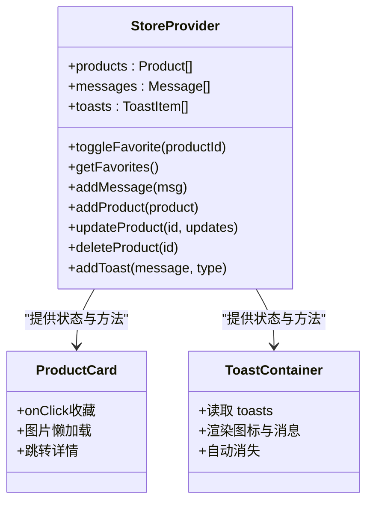
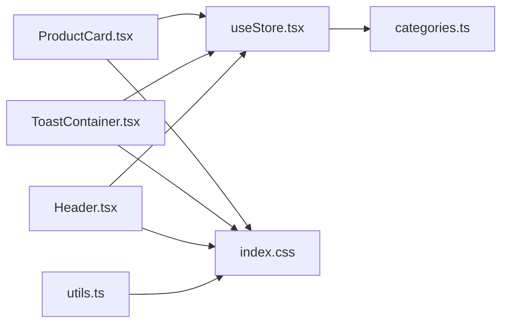

# 业务组件

<cite>
**本文引用的文件列表**
- [ProductCard.tsx](file://lienpet-website/src/components/ProductCard.tsx)
- [ToastContainer.tsx](file://lienpet-website/src/components/ToastContainer.tsx)
- [useStore.tsx](file://lienpet-website/src/store/useStore.tsx)
- [categories.ts](file://lienpet-website/src/data/categories.ts)
- [App.tsx](file://lienpet-website/src/App.tsx)
- [HomePage.tsx](file://lienpet-website/src/pages/HomePage.tsx)
- [Header.tsx](file://lienpet-website/src/components/Header.tsx)
- [index.css](file://lienpet-website/src/index.css)
- [utils.ts](file://lienpet-website/src/lib/utils.ts)
</cite>

## 目录
1. [简介](#简介)
2. [项目结构](#项目结构)
3. [核心组件](#核心组件)
4. [架构总览](#架构总览)
5. [组件详解](#组件详解)
6. [依赖关系分析](#依赖关系分析)
7. [性能考量](#性能考量)
8. [故障排查指南](#故障排查指南)
9. [结论](#结论)
10. [附录：使用与集成指南](#附录使用与集成指南)

## 简介
本文件聚焦于 LienPet 项目的两个关键业务组件：商品卡片组件 ProductCard 与通知容器组件 ToastContainer。我们将从系统架构、组件职责、状态管理、事件处理、性能优化以及使用集成等维度进行深入解析，并提供可视化图示与实践建议，帮助开发者快速理解与扩展这些组件。

## 项目结构
该项目采用基于功能域的组织方式，核心业务组件位于 src/components 下，状态管理通过自定义 Hook StoreProvider 提供，页面组件在 src/pages 中按路由划分，样式通过 Tailwind CSS 与自定义 CSS 变量统一管理。

图表来源
- [App.tsx:13-35](file://lienpet-website/src/App.tsx#L13-L35)
- [HomePage.tsx:8-103](file://lienpet-website/src/pages/HomePage.tsx#L8-L103)
- [ProductCard.tsx:10-51](file://lienpet-website/src/components/ProductCard.tsx#L10-L51)
- [ToastContainer.tsx:4-28](file://lienpet-website/src/components/ToastContainer.tsx#L4-L28)
- [Header.tsx:6-93](file://lienpet-website/src/components/Header.tsx#L6-L93)
- [useStore.tsx:27-94](file://lienpet-website/src/store/useStore.tsx#L27-L94)
- [categories.ts:19-38](file://lienpet-website/src/data/categories.ts#L19-L38)
- [index.css:1-115](file://lienpet-website/src/index.css#L1-L115)
- [utils.ts:1-6](file://lienpet-website/src/lib/utils.ts#L1-L6)

章节来源
- [App.tsx:13-35](file://lienpet-website/src/App.tsx#L13-L35)
- [index.css:1-115](file://lienpet-website/src/index.css#L1-L115)

## 核心组件
- 商品卡片组件 ProductCard：负责渲染单个商品的图片、名称、描述与价格，并提供收藏切换交互；内部使用懒加载图片与路由跳转。
- 通知容器组件 ToastContainer：负责展示全局通知消息，支持成功、错误、信息三类图标与自动消失机制。
- 自定义状态钩子 useStore：集中管理商品列表、收藏状态、消息列表、产品增删改与通知队列，提供统一的事件派发与状态更新能力。

章节来源
- [ProductCard.tsx:10-51](file://lienpet-website/src/components/ProductCard.tsx#L10-L51)
- [ToastContainer.tsx:4-28](file://lienpet-website/src/components/ToastContainer.tsx#L4-L28)
- [useStore.tsx:5-17](file://lienpet-website/src/store/useStore.tsx#L5-L17)

## 架构总览
下图展示了应用启动后，组件与状态之间的交互关系，以及通知系统的触发路径。

图表来源
- [ProductCard.tsx:24-36](file://lienpet-website/src/components/ProductCard.tsx#L24-L36)
- [useStore.tsx:40-46](file://lienpet-website/src/store/useStore.tsx#L40-L46)
- [useStore.tsx:52-60](file://lienpet-website/src/store/useStore.tsx#L52-L60)
- [ToastContainer.tsx:4-28](file://lienpet-website/src/components/ToastContainer.tsx#L4-L28)
- [App.tsx:19](file://lienpet-website/src/App.tsx#L19)

## 组件详解

### 商品卡片组件 ProductCard
- 职责与展示
  - 展示商品主图（懒加载）、名称、简要描述与价格。
  - 支持点击卡片或标题跳转到商品详情页。
  - 收藏按钮根据商品是否已收藏切换样式与填充状态。
- 交互逻辑
  - 点击收藏按钮时阻止默认行为并调用状态钩子切换收藏状态。
  - 图片懒加载提升首屏性能与带宽利用。
- 数据模型
  - 依赖 Product 接口字段：id、name、description、images、price、isFavorite。
- 性能与可访问性
  - 使用 loading="lazy" 实现图片懒加载。
  - 使用 group-hover 扩展悬停动画，避免昂贵的 JavaScript 动画。
- 事件处理模式
  - 在按钮上使用 onClick 阻止默认行为，确保仅触发业务逻辑。
  - 卡片与标题均包裹链接，保证多处可点击进入详情页。

图表来源
- [ProductCard.tsx:24-36](file://lienpet-website/src/components/ProductCard.tsx#L24-L36)
- [useStore.tsx:40-46](file://lienpet-website/src/store/useStore.tsx#L40-L46)
- [useStore.tsx:32-38](file://lienpet-website/src/store/useStore.tsx#L32-L38)
- [ToastContainer.tsx:4-28](file://lienpet-website/src/components/ToastContainer.tsx#L4-L28)

章节来源
- [ProductCard.tsx:10-51](file://lienpet-website/src/components/ProductCard.tsx#L10-L51)
- [categories.ts:19-29](file://lienpet-website/src/data/categories.ts#L19-L29)

### 通知容器组件 ToastContainer
- 职责与展示
  - 固定定位显示通知队列，支持成功、错误、信息三类图标。
  - 消息内容来自全局状态 toasts，无消息时不渲染。
- 实现原理
  - 读取 useStore 的 toasts 列表，映射为一组消息卡片。
  - 通过固定定位与 z-index 确保覆盖在页面内容之上。
- 自动消失机制
  - 每条消息添加时生成唯一 id 并延时 3 秒后从队列中移除。
- 用户交互处理
  - 当前实现为只读展示，不提供手动关闭按钮；如需交互可扩展为带关闭按钮的版本。

图表来源
- [useStore.tsx:32-38](file://lienpet-website/src/store/useStore.tsx#L32-L38)
- [ToastContainer.tsx:16-26](file://lienpet-website/src/components/ToastContainer.tsx#L16-L26)

章节来源
- [ToastContainer.tsx:4-28](file://lienpet-website/src/components/ToastContainer.tsx#L4-L28)
- [useStore.tsx:15-17](file://lienpet-website/src/store/useStore.tsx#L15-L17)

### 状态管理策略与事件处理模式
- 状态聚合
  - StoreProvider 统一维护 products、messages、toasts 三类状态。
  - 提供 toggleFavorite、getFavorites、addMessage、addProduct、updateProduct、deleteProduct、addToast 等方法。
- 事件处理模式
  - 业务操作通过回调函数触发：如 addMessage 调用 addToast 以统一反馈。
  - 使用 useCallback 包裹回调，减少子组件重渲染。
- 价格与收藏状态
  - 价格字段为字符串类型，便于国际化与动态文案展示。
  - 收藏状态 isFavorite 由组件直接消费，无需额外查询。

图表来源
- [useStore.tsx:27-94](file://lienpet-website/src/store/useStore.tsx#L27-L94)
- [ProductCard.tsx:10-51](file://lienpet-website/src/components/ProductCard.tsx#L10-L51)
- [ToastContainer.tsx:4-28](file://lienpet-website/src/components/ToastContainer.tsx#L4-L28)

章节来源
- [useStore.tsx:5-17](file://lienpet-website/src/store/useStore.tsx#L5-L17)
- [useStore.tsx:27-94](file://lienpet-website/src/store/useStore.tsx#L27-L94)

## 依赖关系分析
- 组件依赖
  - ProductCard 依赖 useStore 获取 toggleFavorite 与路由 Link 进行详情跳转。
  - ToastContainer 依赖 useStore 读取 toasts 并渲染。
  - Header 依赖 useStore 获取收藏数量并跳转至收藏页。
- 数据模型
  - Product 接口定义了商品的核心字段，包括图片数组、价格与收藏标记。
- 样式与工具
  - index.css 定义品牌色、阴影、过渡与渐变变量，utils.ts 提供类名合并工具。

图表来源
- [ProductCard.tsx:10-51](file://lienpet-website/src/components/ProductCard.tsx#L10-L51)
- [ToastContainer.tsx:4-28](file://lienpet-website/src/components/ToastContainer.tsx#L4-L28)
- [Header.tsx:9-10](file://lienpet-website/src/components/Header.tsx#L9-L10)
- [useStore.tsx:27-94](file://lienpet-website/src/store/useStore.tsx#L27-L94)
- [categories.ts:19-29](file://lienpet-website/src/data/categories.ts#L19-L29)
- [index.css:1-115](file://lienpet-website/src/index.css#L1-L115)
- [utils.ts:1-6](file://lienpet-website/src/lib/utils.ts#L1-L6)

章节来源
- [categories.ts:19-29](file://lienpet-website/src/data/categories.ts#L19-L29)
- [index.css:1-115](file://lienpet-website/src/index.css#L1-L115)

## 性能考量
- 图片懒加载
  - ProductCard 使用 loading="lazy"，减少首屏资源占用，提升交互流畅度。
- 状态更新与重渲染
  - useStore 中对回调使用 useCallback，避免子组件不必要的重渲染。
- 动画与过渡
  - 通过 CSS 变量与 Tailwind 类控制过渡时间与缓动曲线，保持轻量动画。
- 通知自动消失
  - 3 秒定时器清理消息，避免内存泄漏与 DOM 堆积。

章节来源
- [ProductCard.tsx:17-22](file://lienpet-website/src/components/ProductCard.tsx#L17-L22)
- [useStore.tsx:32-38](file://lienpet-website/src/store/useStore.tsx#L32-L38)
- [index.css:61-65](file://lienpet-website/src/index.css#L61-L65)

## 故障排查指南
- 现象：点击收藏无反应
  - 检查 ProductCard 是否正确调用 toggleFavorite，确认按钮 onClick 未被其他事件覆盖。
  - 章节来源
    - [ProductCard.tsx:24-36](file://lienpet-website/src/components/ProductCard.tsx#L24-L36)
- 现象：通知不显示
  - 确认 App.tsx 已渲染 ToastContainer，且 useStore 提供者包裹了整个应用。
  - 章节来源
    - [App.tsx:19](file://lienpet-website/src/App.tsx#L19)
    - [ToastContainer.tsx:4-28](file://lienpet-website/src/components/ToastContainer.tsx#L4-L28)
- 现象：通知未自动消失
  - 检查 addToast 是否正确设置定时器并移除对应 id。
  - 章节来源
    - [useStore.tsx:32-38](file://lienpet-website/src/store/useStore.tsx#L32-L38)
- 现象：图片未懒加载
  - 确认 img 标签包含 loading="lazy" 属性。
  - 章节来源
    - [ProductCard.tsx:17-22](file://lienpet-website/src/components/ProductCard.tsx#L17-L22)

## 结论
ProductCard 与 ToastContainer 分别承担“商品信息展示与收藏交互”和“全局通知反馈”的职责，二者通过 useStore 实现解耦与统一状态管理。整体设计简洁清晰，具备良好的扩展性与可维护性。后续可在 ToastContainer 增加手动关闭与交互反馈，在 ProductCard 中扩展更多商品属性与价格计算逻辑。

## 附录：使用与集成指南
- 集成步骤
  - 在应用根组件 App.tsx 中引入 StoreProvider 与 ToastContainer。
  - 在需要展示商品卡片的页面（如 HomePage）中传入 Product 对象给 ProductCard。
  - 在需要反馈的业务场景（如提交留言、新增/更新/删除商品）调用 useStore 的相应方法。
- 最佳实践
  - 使用 useCallback 包裹回调，减少重渲染。
  - 为图片添加 loading="lazy"，提升首屏性能。
  - 通过 CSS 变量统一管理品牌色与过渡效果，保持视觉一致性。
- 可扩展点
  - ToastContainer：增加关闭按钮、点击跳转详情、消息分组与持久化。
  - ProductCard：支持多图轮播、价格区间计算、库存状态与促销标签。
  - useStore：引入异步数据源（如 API），封装 CRUD 与错误处理。

章节来源
- [App.tsx:13-35](file://lienpet-website/src/App.tsx#L13-L35)
- [HomePage.tsx:98-101](file://lienpet-website/src/pages/HomePage.tsx#L98-L101)
- [useStore.tsx:27-94](file://lienpet-website/src/store/useStore.tsx#L27-L94)
- [index.css:1-115](file://lienpet-website/src/index.css#L1-L115)