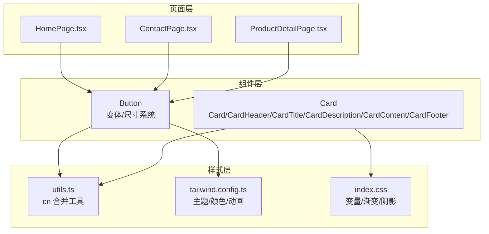
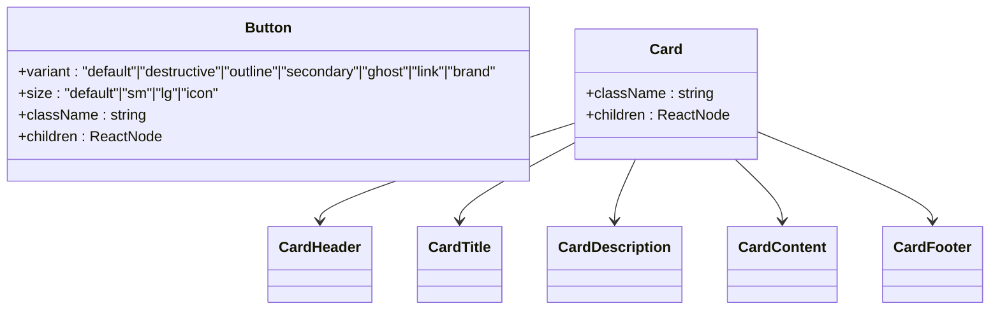
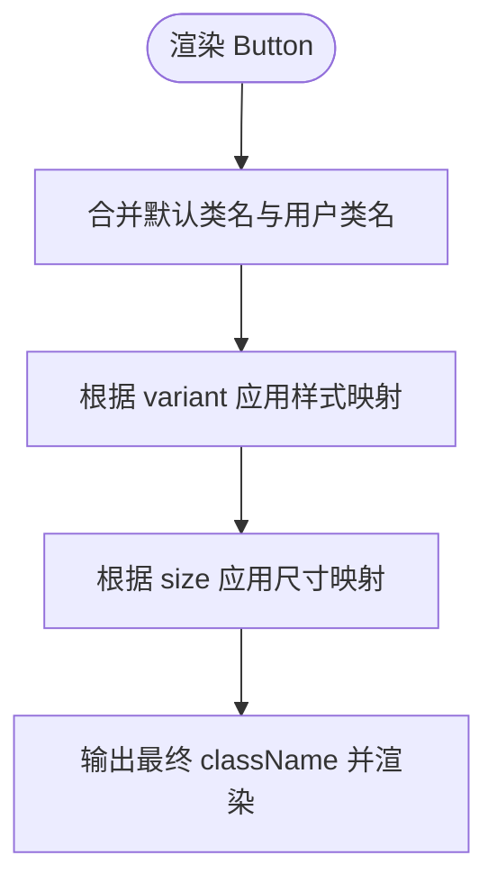
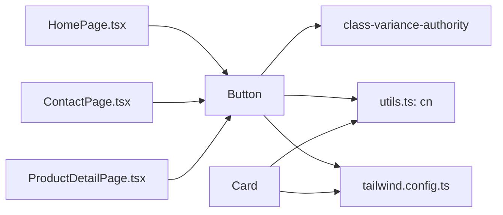

# 基础UI组件

<cite>
**本文引用的文件**
- [button.tsx](file://lienpet-website/src/components/ui/button.tsx)
- [card.tsx](file://lienpet-website/src/components/ui/card.tsx)
- [utils.ts](file://lienpet-website/src/lib/utils.ts)
- [tailwind.config.ts](file://lienpet-website/tailwind.config.ts)
- [index.css](file://lienpet-website/src/index.css)
- [HomePage.tsx](file://lienpet-website/src/pages/HomePage.tsx)
- [ContactPage.tsx](file://lienpet-website/src/pages/ContactPage.tsx)
- [ProductDetailPage.tsx](file://lienpet-website/src/pages/ProductDetailPage.tsx)
</cite>

## 目录
1. [简介](#简介)
2. [项目结构](#项目结构)
3. [核心组件](#核心组件)
4. [架构总览](#架构总览)
5. [详细组件分析](#详细组件分析)
6. [依赖关系分析](#依赖关系分析)
7. [性能考量](#性能考量)
8. [故障排查指南](#故障排查指南)
9. [结论](#结论)
10. [附录：API 参考与最佳实践](#附录api-参考与最佳实践)

## 简介
本文件聚焦 LienPet 项目中的基础 UI 组件：Button 与 Card。我们将从设计理念、实现原理、变体系统、尺寸系统、布局结构、数据流与样式定制等方面进行深入解析，并提供 API 参考、使用示例与最佳实践，帮助开发者在不同业务场景中正确、一致地使用这些组件。

## 项目结构
- 组件位于 src/components/ui 下：
  - Button：基于 class-variance-authority 的变体系统，结合 Tailwind CSS 实现多变体与多尺寸。
  - Card：由多个子组件组合而成，提供卡片容器与语义化布局单元。
- 样式与主题通过 Tailwind 配置与全局 CSS 定义，支持品牌色、渐变与阴影等视觉资产。
- 使用示例分布在首页、联系页、商品详情页等页面中。



图表来源
- [button.tsx:1-49](file://lienpet-website/src/components/ui/button.tsx#L1-L49)
- [card.tsx:1-50](file://lienpet-website/src/components/ui/card.tsx#L1-L50)
- [utils.ts:1-6](file://lienpet-website/src/lib/utils.ts#L1-L6)
- [tailwind.config.ts:1-106](file://lienpet-website/tailwind.config.ts#L1-L106)
- [index.css:1-115](file://lienpet-website/src/index.css#L1-L115)
- [HomePage.tsx:1-152](file://lienpet-website/src/pages/HomePage.tsx#L1-L152)
- [ContactPage.tsx:1-75](file://lienpet-website/src/pages/ContactPage.tsx#L1-L75)
- [ProductDetailPage.tsx:1-254](file://lienpet-website/src/pages/ProductDetailPage.tsx#L1-L254)

章节来源
- [button.tsx:1-49](file://lienpet-website/src/components/ui/button.tsx#L1-L49)
- [card.tsx:1-50](file://lienpet-website/src/components/ui/card.tsx#L1-L50)
- [utils.ts:1-6](file://lienpet-website/src/lib/utils.ts#L1-L6)
- [tailwind.config.ts:1-106](file://lienpet-website/tailwind.config.ts#L1-L106)
- [index.css:1-115](file://lienpet-website/src/index.css#L1-L115)

## 核心组件
- Button：提供统一的交互入口，支持多种视觉变体与尺寸，便于在不同页面与场景中保持一致的交互体验。
- Card：提供卡片容器与语义化布局单元，用于承载内容区块，提升信息层级与可读性。

章节来源
- [button.tsx:32-49](file://lienpet-website/src/components/ui/button.tsx#L32-L49)
- [card.tsx:4-50](file://lienpet-website/src/components/ui/card.tsx#L4-L50)

## 架构总览
- Button 通过 class-variance-authority 定义变体与尺寸映射，运行时根据 props 动态生成类名；通过 cn 工具函数合并默认类名与用户传入的 className，确保样式覆盖顺序合理。
- Card 采用组合模式，将容器、头部、标题、描述、内容、底部等子组件解耦，便于按需组合与复用。
- 主题系统通过 Tailwind 配置与全局 CSS 变量提供品牌色、渐变与阴影等视觉资产，保证组件风格一致性。



图表来源
- [button.tsx:32-49](file://lienpet-website/src/components/ui/button.tsx#L32-L49)
- [card.tsx:4-50](file://lienpet-website/src/components/ui/card.tsx#L4-L50)

## 详细组件分析

### Button 组件
- 设计理念
  - 以“最小可用接口”为核心：仅暴露必要的 props（variant、size、className 等），其余交互能力通过原生 button 属性透传。
  - 通过变体系统与尺寸系统实现“同一组件在不同场景下的差异化表现”，避免重复造轮子。
- 实现原理
  - 使用 class-variance-authority 定义 buttonVariants，集中管理变体与尺寸到类名的映射。
  - 使用 cn 工具函数合并默认类名与用户传入的 className，确保用户自定义样式优先级正确。
  - 通过 forwardRef 暴露 ref，便于外部聚焦、测量等操作。
- 变体系统（variant）
  - default：主色背景与前景对比，悬停时轻微透明度变化，适合主要操作。
  - destructive：破坏性操作（如删除、取消），强调警示。
  - outline：描边样式，背景透明，前景为主色，适合次要或强调对比的按钮。
  - secondary：次级背景，适合非关键路径操作。
  - ghost：仅悬停时生效的轻量背景，适合内联或弱化操作。
  - link：文本链接风格，适合导航或补充说明。
  - brand：品牌渐变背景与阴影，突出品牌调性，常用于引导性按钮。
- 尺寸系统（size）
  - default：常规尺寸，适合大多数场景。
  - sm：紧凑尺寸，适合工具栏或小空间。
  - lg：大尺寸，适合主按钮或强调按钮。
  - icon：仅图标，适合工具栏或微交互。
- 事件与属性
  - 支持所有原生 button 属性（如 onClick、disabled、type 等），便于与表单、路由等集成。
- 样式定制
  - 可通过 className 覆盖默认样式；若需扩展变体或尺寸，可在 buttonVariants 中新增映射。
  - 品牌色与渐变由全局 CSS 变量与 Tailwind 配置提供，确保风格一致。



图表来源
- [button.tsx:5-30](file://lienpet-website/src/components/ui/button.tsx#L5-L30)
- [utils.ts:4-6](file://lienpet-website/src/lib/utils.ts#L4-L6)

章节来源
- [button.tsx:1-49](file://lienpet-website/src/components/ui/button.tsx#L1-L49)
- [utils.ts:1-6](file://lienpet-website/src/lib/utils.ts#L1-L6)
- [tailwind.config.ts:18-62](file://lienpet-website/tailwind.config.ts#L18-L62)
- [index.css:80-102](file://lienpet-website/src/index.css#L80-L102)

### Card 组件
- 设计理念
  - 以“容器 + 语义化分区”的方式组织内容，使卡片具备清晰的信息层次与可读性。
  - 子组件独立命名与导出，便于按需组合，减少不必要的 DOM 结构。
- 实现原理
  - Card 作为根容器，提供基础边框、圆角、阴影与背景。
  - CardHeader、CardTitle、CardDescription、CardContent、CardFooter 分别承担头部、标题、描述、主体内容与底部区域的布局与样式。
  - 所有子组件均通过 cn 合并 className，支持用户自定义覆盖。
- 布局结构与内容组织
  - CardHeader：垂直堆叠，标题与描述之间留有间距。
  - CardTitle：字号与字重适配标题层级。
  - CardDescription：辅助说明，字号较小，颜色较浅。
  - CardContent：主体内容区，顶部留白控制与上一区域的间距。
  - CardFooter：底部区域，常用于放置按钮或补充信息。
- 样式定制
  - 可通过 className 覆盖默认样式；如需扩展子组件样式，建议在对应子组件处添加额外类名。
  - 主题颜色与圆角由 Tailwind 配置提供，确保与整体设计一致。

```mermaid
sequenceDiagram
participant Page as "页面"
participant Card as "Card"
participant Header as "CardHeader"
participant Title as "CardTitle"
participant Desc as "CardDescription"
participant Content as "CardContent"
participant Footer as "CardFooter"
Page->>Card : 渲染卡片容器
Card->>Header : 渲染头部
Header->>Title : 渲染标题
Header->>Desc : 渲染描述
Card->>Content : 渲染内容
Card->>Footer : 渲染底部
Footer-->>Page : 渲染完成
```

图表来源
- [card.tsx:4-50](file://lienpet-website/src/components/ui/card.tsx#L4-L50)

章节来源
- [card.tsx:1-50](file://lienpet-website/src/components/ui/card.tsx#L1-L50)
- [tailwind.config.ts:18-62](file://lienpet-website/tailwind.config.ts#L18-L62)
- [index.css:80-102](file://lienpet-website/src/index.css#L80-L102)

## 依赖关系分析
- Button 依赖
  - class-variance-authority：定义变体与尺寸映射。
  - utils.ts：cn 工具函数合并类名。
  - Tailwind 颜色与主题配置：提供语义化颜色与品牌色。
- Card 依赖
  - utils.ts：cn 工具函数合并类名。
  - 全局 CSS 变量与 Tailwind 配置：提供圆角、阴影与品牌渐变等视觉资产。
- 页面使用
  - 首页、联系页、商品详情页等页面广泛使用 Button 与 Card，体现组件在不同场景下的复用与一致性。



图表来源
- [button.tsx:1-4](file://lienpet-website/src/components/ui/button.tsx#L1-L4)
- [utils.ts:1-6](file://lienpet-website/src/lib/utils.ts#L1-L6)
- [tailwind.config.ts:1-106](file://lienpet-website/tailwind.config.ts#L1-L106)
- [HomePage.tsx:3](file://lienpet-website/src/pages/HomePage.tsx#L3)
- [ContactPage.tsx:3](file://lienpet-website/src/pages/ContactPage.tsx#L3)
- [ProductDetailPage.tsx:4](file://lienpet-website/src/pages/ProductDetailPage.tsx#L4)

章节来源
- [button.tsx:1-49](file://lienpet-website/src/components/ui/button.tsx#L1-L49)
- [card.tsx:1-50](file://lienpet-website/src/components/ui/card.tsx#L1-L50)
- [utils.ts:1-6](file://lienpet-website/src/lib/utils.ts#L1-L6)
- [tailwind.config.ts:1-106](file://lienpet-website/tailwind.config.ts#L1-L106)
- [HomePage.tsx:1-152](file://lienpet-website/src/pages/HomePage.tsx#L1-L152)
- [ContactPage.tsx:1-75](file://lienpet-website/src/pages/ContactPage.tsx#L1-L75)
- [ProductDetailPage.tsx:1-254](file://lienpet-website/src/pages/ProductDetailPage.tsx#L1-L254)

## 性能考量
- 类名合并：通过 cn 工具函数合并类名，避免重复与冲突，减少样式计算开销。
- 变体与尺寸：使用 class-variance-authority 在构建期生成有限的类名集合，降低运行时计算成本。
- 组合组件：Card 采用子组件组合，按需渲染，避免不必要的 DOM 结构与样式。
- 主题系统：Tailwind 配置与 CSS 变量集中管理，减少重复定义与样式体积。

## 故障排查指南
- Button 未显示预期样式
  - 检查是否正确传入 variant 与 size，确认默认值是否被覆盖。
  - 确认 className 是否与默认类名冲突，必要时调整优先级。
- Card 子组件样式异常
  - 确认子组件是否正确导入与使用，避免遗漏。
  - 检查 className 是否覆盖了必要的布局类名。
- 品牌色与渐变不生效
  - 检查全局 CSS 变量与 Tailwind 配置是否正确加载。
  - 确认品牌渐变类名是否正确拼写与使用。

## 结论
Button 与 Card 组件通过简洁的 API、清晰的变体与尺寸体系以及一致的主题风格，为 LienPet 项目提供了高复用、易维护的基础 UI 能力。遵循本文档的使用规范与最佳实践，可以在不同页面与场景中稳定地应用这些组件，提升用户体验与开发效率。

## 附录：API 参考与最佳实践

### Button API 参考
- 接口定义
  - 继承原生 button 属性，扩展如下：
    - variant: "default" | "destructive" | "outline" | "secondary" | "ghost" | "link" | "brand"
    - size: "default" | "sm" | "lg" | "icon"
    - className: string
    - children: ReactNode
- 事件与属性
  - 支持原生 button 的所有事件与属性（如 onClick、disabled、type、formAction 等）。
- 最佳实践
  - 选择合适的变体：主操作使用 default 或 brand；危险操作使用 destructive；弱化操作使用 ghost 或 link。
  - 控制尺寸：大按钮使用 lg，工具栏使用 sm，纯图标使用 icon。
  - 自定义样式：通过 className 覆盖，避免直接修改组件内部样式。
  - 无障碍：为按钮提供明确的文本或 aria-label，确保可访问性。

章节来源
- [button.tsx:32-49](file://lienpet-website/src/components/ui/button.tsx#L32-L49)
- [HomePage.tsx:35-44](file://lienpet-website/src/pages/HomePage.tsx#L35-L44)
- [ContactPage.tsx:67-71](file://lienpet-website/src/pages/ContactPage.tsx#L67-L71)
- [ProductDetailPage.tsx:240](file://lienpet-website/src/pages/ProductDetailPage.tsx#L240)

### Card API 参考
- 接口定义
  - Card：根容器，支持 className 与 children。
  - CardHeader：头部容器，支持 className 与 children。
  - CardTitle：标题，支持 className 与 children。
  - CardDescription：描述，支持 className 与 children。
  - CardContent：内容主体，支持 className 与 children。
  - CardFooter：底部，支持 className 与 children。
- 最佳实践
  - 按需组合：仅引入需要的子组件，避免冗余 DOM。
  - 样式覆盖：通过 className 覆盖默认样式，保持与整体设计一致。
  - 内容组织：将标题、描述与正文分层组织，提升可读性。

章节来源
- [card.tsx:4-50](file://lienpet-website/src/components/ui/card.tsx#L4-L50)

### 使用示例与场景
- 首页
  - 使用 brand 变体与 lg 尺寸的 Button 作为主导航按钮。
  - 使用 outline 变体与 lg 尺寸的 Button 作为次要按钮，并叠加自定义背景与边框类名。
- 联系页
  - 使用 brand 变体与 lg 尺寸的 Button 作为反馈入口。
- 商品详情页
  - 使用 outline 变体的 Button 作为辅助操作按钮。
  - 使用 sm 尺寸的 Button 作为列表项内的微操作按钮。

章节来源
- [HomePage.tsx:35-44](file://lienpet-website/src/pages/HomePage.tsx#L35-L44)
- [ContactPage.tsx:67-71](file://lienpet-website/src/pages/ContactPage.tsx#L67-L71)
- [ProductDetailPage.tsx:240](file://lienpet-website/src/pages/ProductDetailPage.tsx#L240)