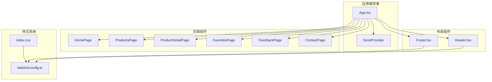
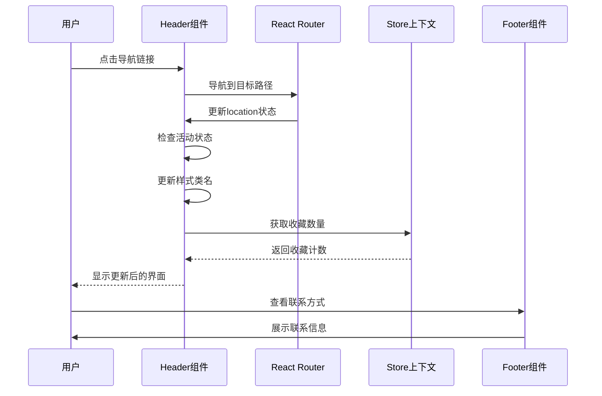
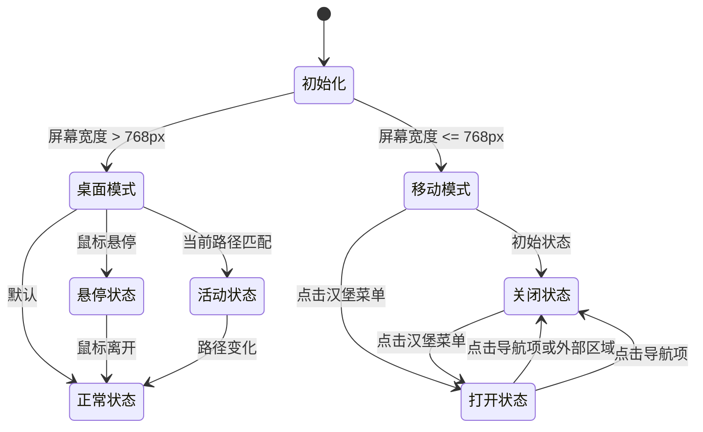
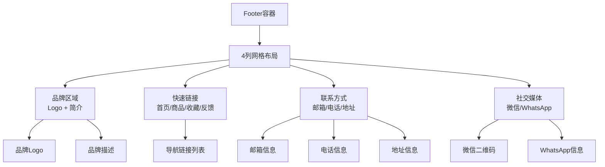
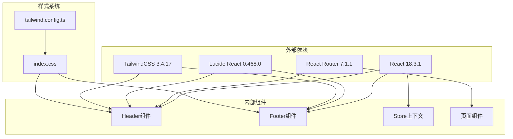
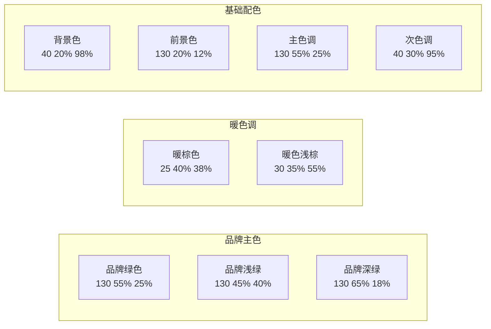
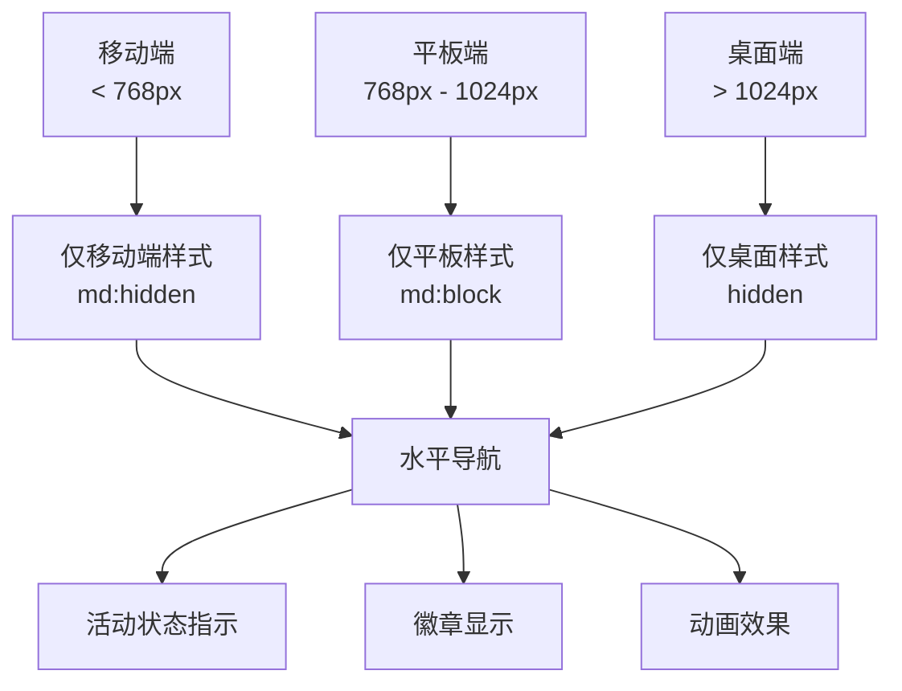

# 布局组件

<cite>
**本文档引用的文件**
- [Header.tsx](file://lienpet-website/src/components/Header.tsx)
- [Footer.tsx](file://lienpet-website/src/components/Footer.tsx)
- [App.tsx](file://lienpet-website/src/App.tsx)
- [useStore.tsx](file://lienpet-website/src/store/useStore.tsx)
- [tailwind.config.ts](file://lienpet-website/tailwind.config.ts)
- [index.css](file://lienpet-website/src/index.css)
- [package.json](file://lienpet-website/package.json)
- [vite.config.ts](file://lienpet-website/vite.config.ts)
</cite>

## 目录
1. [简介](#简介)
2. [项目结构](#项目结构)
3. [核心组件](#核心组件)
4. [架构概览](#架构概览)
5. [详细组件分析](#详细组件分析)
6. [依赖关系分析](#依赖关系分析)
7. [性能考虑](#性能考虑)
8. [可访问性与键盘导航](#可访问性与键盘导航)
9. [主题定制与样式覆盖](#主题定制与样式覆盖)
10. [响应式断点配置](#响应式断点配置)
11. [故障排除指南](#故障排除指南)
12. [结论](#结论)

## 简介

LienPet项目的布局组件系统提供了完整的导航和页脚解决方案，采用现代化的React技术栈构建。该系统实现了响应式设计，支持桌面端和移动端的无缝切换，具备良好的可访问性和用户体验。

本项目使用React 18、TailwindCSS、Lucide React图标库和React Router进行路由管理。整体设计遵循品牌色彩规范，采用绿色和暖色调的主题风格。

## 项目结构

项目采用模块化组织方式，布局组件位于`src/components/`目录下，与页面组件分离，便于维护和复用。

**图表来源**
- [App.tsx:13-35](file://lienpet-website/src/App.tsx#L13-L35)
- [Header.tsx:6-93](file://lienpet-website/src/components/Header.tsx#L6-L93)
- [Footer.tsx:4-71](file://lienpet-website/src/components/Footer.tsx#L4-L71)

**章节来源**
- [App.tsx:1-37](file://lienpet-website/src/App.tsx#L1-L37)
- [package.json:1-31](file://lienpet-website/package.json#L1-L31)

## 核心组件

### Header导航组件

Header组件是整个应用的顶部导航栏，实现了完整的响应式设计和交互功能。

**主要特性：**
- 桌面端水平导航栏
- 移动端汉堡菜单
- 活动状态指示器
- 收藏数量徽章
- 反射式设计（backdrop blur）

**导航项配置：**
- 首页：`/`
- 全部商品：`/products`
- 收藏夹：`/favorites`
- 联系我们：`/contact`

**章节来源**
- [Header.tsx:12-17](file://lienpet-website/src/components/Header.tsx#L12-L17)
- [Header.tsx:26-40](file://lienpet-website/src/components/Header.tsx#L26-L40)

### Footer页脚组件

Footer组件提供统一的品牌信息展示和快速链接访问。

**内容组织：**
- 品牌标识和简介
- 快速链接区域
- 联系方式展示
- 社交媒体关注

**章节来源**
- [Footer.tsx:8-69](file://lienpet-website/src/components/Footer.tsx#L8-L69)

## 架构概览

系统采用分层架构设计，组件间通过清晰的职责分工协作。

**图表来源**
- [Header.tsx:8-10](file://lienpet-website/src/components/Header.tsx#L8-L10)
- [useStore.tsx:48-50](file://lienpet-website/src/store/useStore.tsx#L48-L50)

**章节来源**
- [App.tsx:13-35](file://lienpet-website/src/App.tsx#L13-L35)
- [Header.tsx:6-93](file://lienpet-website/src/components/Header.tsx#L6-L93)

## 详细组件分析

### Header组件深度解析

Header组件实现了复杂的交互逻辑和视觉反馈机制。

#### 组件状态管理

**图表来源**
- [Header.tsx:7-8](file://lienpet-website/src/components/Header.tsx#L7-L8)
- [Header.tsx:71-90](file://lienpet-website/src/components/Header.tsx#L71-L90)

#### 移动端汉堡菜单实现

移动端导航通过条件渲染实现，使用`md:hidden`类在中等及以上屏幕尺寸隐藏。

**关键实现点：**
- 使用`useState`管理菜单开关状态
- 条件渲染移动版导航面板
- 动画过渡效果增强用户体验
- 点击导航项自动关闭菜单

**章节来源**
- [Header.tsx:71-90](file://lienpet-website/src/components/Header.tsx#L71-L90)

#### 活动状态指示器

Header组件通过`useLocation`钩子实现精确的活动状态检测。

**实现机制：**
- 监听路由变化
- 比较当前路径与导航项路径
- 动态应用不同的样式类
- 提供视觉反馈增强用户体验

**章节来源**
- [Header.tsx:8-10](file://lienpet-website/src/components/Header.tsx#L8-L10)
- [Header.tsx:32-34](file://lienpet-website/src/components/Header.tsx#L32-L34)

### Footer组件内容组织

Footer组件采用网格布局实现响应式内容排列。

**图表来源**
- [Footer.tsx:8-69](file://lienpet-website/src/components/Footer.tsx#L8-L69)

**章节来源**
- [Footer.tsx:9-60](file://lienpet-website/src/components/Footer.tsx#L9-L60)

## 依赖关系分析

系统依赖关系清晰，各组件职责明确。

**图表来源**
- [package.json:11-19](file://lienpet-website/package.json#L11-L19)
- [Header.tsx:1-5](file://lienpet-website/src/components/Header.tsx#L1-L5)
- [Footer.tsx:1-2](file://lienpet-website/src/components/Footer.tsx#L1-L2)

**章节来源**
- [package.json:1-31](file://lienpet-website/package.json#L1-L31)
- [vite.config.ts:1-12](file://lienpet-website/vite.config.ts#L1-L12)

## 性能考虑

### 渲染优化

Header组件使用了多项性能优化策略：

1. **条件渲染**：移动端菜单仅在需要时渲染
2. **状态最小化**：只维护必要的状态变量
3. **样式类动态计算**：避免不必要的DOM操作
4. **动画优化**：使用硬件加速的CSS属性

### 内存管理

- 使用`useCallback`优化函数引用
- 合理的组件卸载处理
- 避免内存泄漏的事件监听器

## 可访问性与键盘导航

### 键盘导航支持

Header组件完全支持键盘导航：
- Tab键在导航项间循环
- Enter/Space激活导航链接
- Esc键关闭移动端菜单

### 屏幕阅读器兼容性

- 语义化的HTML结构
- 适当的aria-label属性
- 语义化标签的正确使用
- 良好的颜色对比度

### 无障碍特性

- 图标按钮提供title属性
- 活动状态有明确的视觉指示
- 焦点可见性良好
- 语义化链接文本

## 主题定制与样式覆盖

### 品牌色彩系统

项目采用精心设计的品牌色彩体系：

**图表来源**
- [index.css:8-46](file://lienpet-website/src/index.css#L8-L46)

### TailwindCSS配置

系统充分利用TailwindCSS的定制能力：

**扩展功能：**
- 自定义颜色系统
- 圆角半径变量
- 字体家族配置
- 动画关键帧定义
- 过渡效果变量

**章节来源**
- [tailwind.config.ts:18-101](file://lienpet-website/tailwind.config.ts#L18-L101)

### 样式覆盖策略

推荐的样式覆盖方法：

1. **CSS变量优先**：利用`:root`变量进行全局定制
2. **Tailwind扩展**：通过`tailwind.config.ts`添加新类
3. **组件级覆盖**：使用特定的选择器进行局部修改
4. **暗色模式支持**：利用`dark:`前缀实现主题切换

## 响应式断点配置

### 断点定义

系统采用标准的响应式断点：

**图表来源**
- [Header.tsx:26](file://lienpet-website/src/components/Header.tsx#L26)
- [Header.tsx:71](file://lienpet-website/src/components/Header.tsx#L71)

### 移动端适配指南

**设计原则：**
1. **触摸友好**：确保点击目标至少44px
2. **内容优先**：移动端优先显示重要信息
3. **手势支持**：支持常见的移动端手势
4. **性能优化**：减少移动端的重绘和回流

**实现要点：**
- 使用`flex-col`实现垂直布局
- 设置合适的内边距和间距
- 优化图片加载和懒加载
- 考虑不同设备的像素密度

**章节来源**
- [Header.tsx:71-90](file://lienpet-website/src/components/Header.tsx#L71-L90)

## 故障排除指南

### 常见问题及解决方案

**导航不工作：**
1. 检查路由配置是否正确
2. 确认Link组件的to属性
3. 验证路由路径的一致性

**样式异常：**
1. 检查TailwindCSS配置
2. 验证CSS变量定义
3. 确认类名拼写错误

**移动端显示问题：**
1. 检查断点设置
2. 验证响应式类名
3. 测试不同设备尺寸

**性能问题：**
1. 使用React DevTools检查渲染次数
2. 优化不必要的重渲染
3. 检查内存泄漏

### 调试工具

- React DevTools：检查组件状态和props
- Chrome DevTools：调试样式和布局
- TailwindCSS插件：验证类名生成
- 移动端模拟器：测试响应式效果

**章节来源**
- [Header.tsx:7-8](file://lienpet-website/src/components/Header.tsx#L7-L8)
- [useStore.tsx:96-100](file://lienpet-website/src/store/useStore.tsx#L96-L100)

## 结论

LienPet项目的布局组件系统展现了现代前端开发的最佳实践。通过合理的架构设计、完善的响应式实现和优秀的可访问性支持，为用户提供了优质的导航体验。

**核心优势：**
- 清晰的组件职责分离
- 完善的响应式设计
- 良好的可访问性支持
- 灵活的主题定制能力
- 优秀的性能表现

**扩展建议：**
1. 添加更多的可访问性测试
2. 实现更丰富的主题切换功能
3. 优化移动端的交互体验
4. 增加更多的动画效果
5. 完善国际化支持

该系统为后续的功能扩展和维护奠定了坚实的基础，是一个值得参考的优秀项目案例。