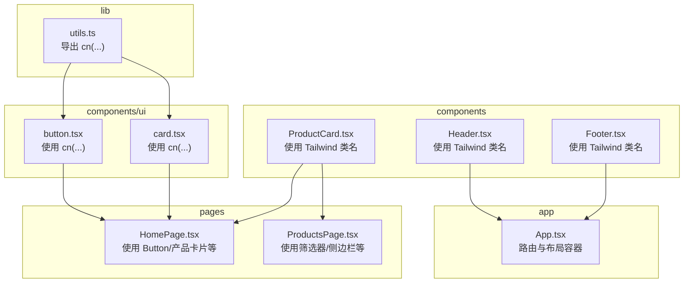
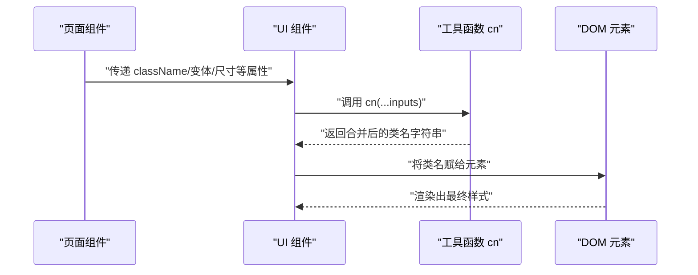
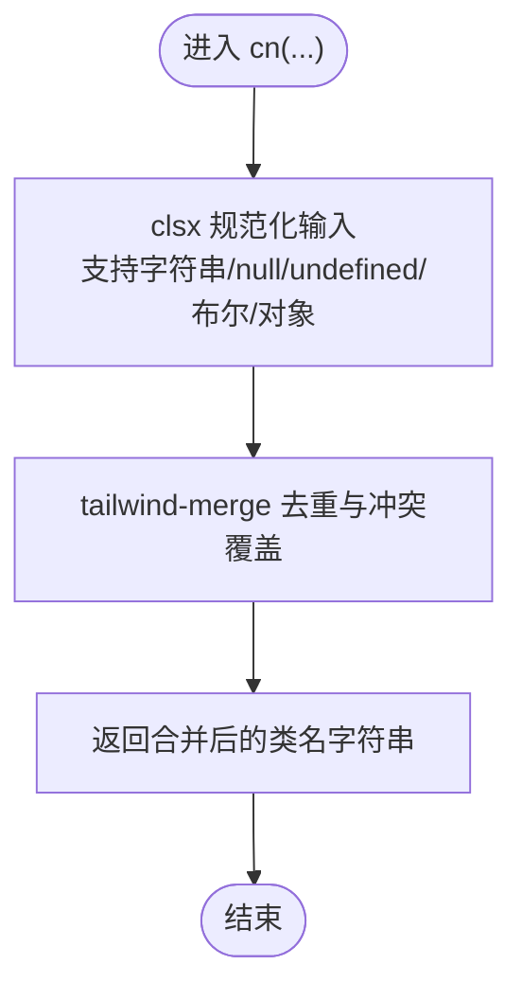
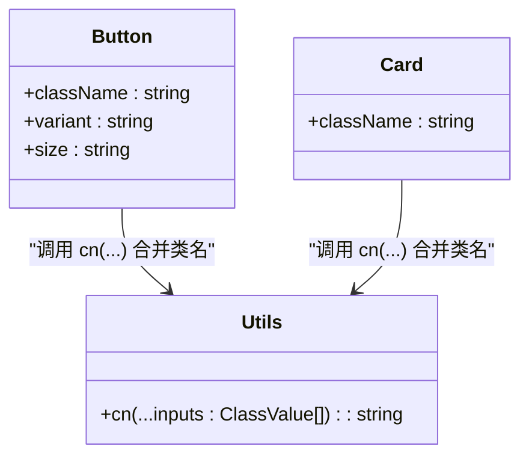
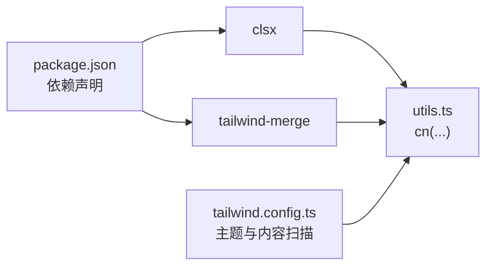

# 工具函数与辅助模块

<cite>
**本文引用的文件**
- [utils.ts](file://lienpet-website/src/lib/utils.ts)
- [package.json](file://lienpet-website/package.json)
- [tailwind.config.ts](file://lienpet-website/tailwind.config.ts)
- [button.tsx](file://lienpet-website/src/components/ui/button.tsx)
- [card.tsx](file://lienpet-website/src/components/ui/card.tsx)
- [ProductCard.tsx](file://lienpet-website/src/components/ProductCard.tsx)
- [Header.tsx](file://lienpet-website/src/components/Header.tsx)
- [Footer.tsx](file://lienpet-website/src/components/Footer.tsx)
- [HomePage.tsx](file://lienpet-website/src/pages/HomePage.tsx)
- [ProductsPage.tsx](file://lienpet-website/src/pages/ProductsPage.tsx)
- [App.tsx](file://lienpet-website/src/App.tsx)
- [useStore.tsx](file://lienpet-website/src/store/useStore.tsx)
</cite>

## 目录
1. [简介](#简介)
2. [项目结构](#项目结构)
3. [核心组件](#核心组件)
4. [架构总览](#架构总览)
5. [详细组件分析](#详细组件分析)
6. [依赖分析](#依赖分析)
7. [性能考虑](#性能考虑)
8. [故障排查指南](#故障排查指南)
9. [结论](#结论)
10. [附录](#附录)

## 简介
本章节聚焦 LienPet 项目中的工具函数与辅助模块，重点解析位于 src/lib/utils.ts 的类名合并工具函数 cn，并结合项目中对 clsx 与 tailwind-merge 的使用，系统阐述其在组件样式组合中的作用、最佳实践与扩展方法。同时，结合项目中大量使用 Tailwind CSS 的设计系统，说明类型安全与样式合并如何协同工作，确保组件在不同状态下的样式一致性与可维护性。

## 项目结构
本项目采用按功能分层的组织方式：页面组件（pages）、UI 组件（components/ui）、业务逻辑（store）、公共工具（lib）。工具函数 cn 位于 lib 层，被 UI 组件与页面组件广泛复用，形成“样式组合 → 组件渲染”的清晰链路。

图表来源
- [utils.ts:1-6](file://lienpet-website/src/lib/utils.ts#L1-L6)
- [button.tsx:1-49](file://lienpet-website/src/components/ui/button.tsx#L1-L49)
- [card.tsx:1-50](file://lienpet-website/src/components/ui/card.tsx#L1-L50)
- [ProductCard.tsx:1-51](file://lienpet-website/src/components/ProductCard.tsx#L1-L51)
- [Header.tsx:1-93](file://lienpet-website/src/components/Header.tsx#L1-L93)
- [Footer.tsx:1-71](file://lienpet-website/src/components/Footer.tsx#L1-L71)
- [HomePage.tsx:1-152](file://lienpet-website/src/pages/HomePage.tsx#L1-L152)
- [ProductsPage.tsx:1-167](file://lienpet-website/src/pages/ProductsPage.tsx#L1-L167)
- [App.tsx:1-37](file://lienpet-website/src/App.tsx#L1-L37)

章节来源
- [utils.ts:1-6](file://lienpet-website/src/lib/utils.ts#L1-L6)
- [package.json:1-31](file://lienpet-website/package.json#L1-L31)

## 核心组件
本节围绕 utils.ts 中的 cn 函数展开，说明其职责、输入输出与在项目中的应用模式。

- 函数签名与职责
  - 名称：cn
  - 参数：可变参数，类型为 ClassValue（由 clsx 导入）
  - 返回值：字符串（经 tailwind-merge 合并后的类名）
  - 职责：将多个类名输入通过 clsx 规范化后，再交由 tailwind-merge 去重与冲突覆盖，最终返回稳定、无冲突的类名字符串

- 输入类型 ClassValue
  - 支持的输入类型包括：字符串、null、undefined、布尔值、对象字面量（键为类名、值为布尔条件）
  - 这使得在组件中根据 props 或状态动态拼接类名时，能以声明式的方式表达条件逻辑

- 在组件中的典型用法
  - UI 组件：按钮、卡片等通过 cn(...) 将默认类名与变体类名、尺寸类名、外部传入的 className 合并
  - 页面组件：通过 cn(...) 与静态类名组合，保证在交互态下仍保持样式一致性

- 与 Tailwind CSS 的协作
  - cn(...) 输出的类名遵循 Tailwind 的原子化原则，配合主题配置（颜色、圆角、动画等）实现一致的设计语言
  - 通过 tailwind-merge 的冲突覆盖策略，避免重复或相互冲突的类名导致样式异常

章节来源
- [utils.ts:1-6](file://lienpet-website/src/lib/utils.ts#L1-L6)
- [button.tsx:1-49](file://lienpet-website/src/components/ui/button.tsx#L1-L49)
- [card.tsx:1-50](file://lienpet-website/src/components/ui/card.tsx#L1-L50)

## 架构总览
下图展示了 cn 函数在组件渲染流程中的位置与调用关系，体现从“样式组合”到“组件渲染”的完整路径。

图表来源
- [utils.ts:1-6](file://lienpet-website/src/lib/utils.ts#L1-L6)
- [button.tsx:1-49](file://lienpet-website/src/components/ui/button.tsx#L1-L49)
- [card.tsx:1-50](file://lienpet-website/src/components/ui/card.tsx#L1-L50)

## 详细组件分析

### 工具函数 cn 的实现与使用
- 实现要点
  - 使用 clsx 对输入进行规范化处理，支持条件类名与对象形式
  - 使用 tailwind-merge 对类名进行去重与冲突覆盖，确保最终类名集合最小且无冲突
- 使用场景
  - UI 组件：在按钮、卡片等组件中，将默认类名、变体类名、尺寸类名与外部传入的 className 合并
  - 页面组件：在首页、商品页等页面中，将交互态样式与静态样式合并

图表来源
- [utils.ts:1-6](file://lienpet-website/src/lib/utils.ts#L1-L6)

章节来源
- [utils.ts:1-6](file://lienpet-website/src/lib/utils.ts#L1-L6)
- [button.tsx:1-49](file://lienpet-website/src/components/ui/button.tsx#L1-L49)
- [card.tsx:1-50](file://lienpet-website/src/components/ui/card.tsx#L1-L50)

### UI 组件中的类名合并模式
- 按钮组件
  - 使用 cva 定义变体与尺寸，再通过 cn(...) 将变体类名、尺寸类名与外部传入的 className 合并
  - 该模式确保按钮在不同状态（如 hover/focus/disabled）下，样式组合稳定且可预测
- 卡片组件
  - 通过 cn(...) 将基础卡片类名与外部传入的 className 合并，便于在页面中灵活定制卡片外观

图表来源
- [utils.ts:1-6](file://lienpet-website/src/lib/utils.ts#L1-L6)
- [button.tsx:1-49](file://lienpet-website/src/components/ui/button.tsx#L1-L49)
- [card.tsx:1-50](file://lienpet-website/src/components/ui/card.tsx#L1-L50)

章节来源
- [button.tsx:1-49](file://lienpet-website/src/components/ui/button.tsx#L1-L49)
- [card.tsx:1-50](file://lienpet-website/src/components/ui/card.tsx#L1-L50)

### 页面组件中的样式组合
- 首页与商品页
  - 大量使用静态 Tailwind 类名与交互态类名（如 hover、transition-smooth），并通过 cn(...) 与组件内部类名合并
  - 该模式在复杂布局中保持样式的一致性与可维护性

章节来源
- [HomePage.tsx:1-152](file://lienpet-website/src/pages/HomePage.tsx#L1-L152)
- [ProductsPage.tsx:1-167](file://lienpet-website/src/pages/ProductsPage.tsx#L1-L167)

### 类型定义文件与 TypeScript 类型安全
- 类型定义文件
  - vite-env.d.ts 提供 Vite 环境的类型声明，确保开发时的类型感知
- 类型安全在工具函数中的体现
  - cn(...) 的参数类型为 ClassValue[]，由 clsx 提供，确保传入的类名类型合法
  - UI 组件通过 Variants 与尺寸枚举，进一步约束类名组合的范围，减少运行时错误

章节来源
- [vite-env.d.ts:1-1](file://lienpet-website/src/vite-env.d.ts#L1-L1)
- [button.tsx:1-49](file://lienpet-website/src/components/ui/button.tsx#L1-L49)

## 依赖分析
- 工具函数依赖
  - clsx：用于规范化类名输入，支持条件类名与对象形式
  - tailwind-merge：用于去重与冲突覆盖，确保最终类名集合最小且无冲突
- 项目配置
  - package.json 中声明了 clsx 与 tailwind-merge 的版本
  - tailwind.config.ts 中定义了主题、动画与内容扫描路径，为 cn(...) 输出的类名提供样式支持

图表来源
- [package.json:1-31](file://lienpet-website/package.json#L1-L31)
- [utils.ts:1-6](file://lienpet-website/src/lib/utils.ts#L1-L6)
- [tailwind.config.ts:1-106](file://lienpet-website/tailwind.config.ts#L1-L106)

章节来源
- [package.json:1-31](file://lienpet-website/package.json#L1-L31)
- [tailwind.config.ts:1-106](file://lienpet-website/tailwind.config.ts#L1-L106)

## 性能考虑
- 类名合并的性能
  - clsx 与 tailwind-merge 均为纯函数，计算开销小；在组件渲染频繁的场景下，建议尽量减少不必要的类名拼接
- 样式生成的性能
  - Tailwind CSS 通过预编译生成类名，运行时仅做字符串拼接与去重，性能优异
- 最佳实践
  - 在组件中优先使用 cn(...) 统一管理类名，避免直接拼接字符串
  - 对于高频更新的状态，尽量只变更必要的类名，减少样式重排

## 故障排查指南
- 常见问题
  - 类名冲突：当传入多个相互冲突的类名时，tailwind-merge 会保留后者；若出现样式不符合预期，检查传入顺序与条件
  - 条件类名无效：确保传入的对象形式键为类名、值为布尔条件；布尔值为假时对应类名不会生效
  - 动态类名未生效：确认传入的 className 是否被正确合并，以及 Tailwind 内容扫描路径是否包含相关文件
- 排查步骤
  - 打印 cn(...) 的返回值，核对类名集合
  - 检查组件传入的 props 与状态，确认条件类名的分支逻辑
  - 校验 tailwind.config.ts 的 content 配置，确保新类名被纳入扫描范围

章节来源
- [utils.ts:1-6](file://lienpet-website/src/lib/utils.ts#L1-L6)
- [tailwind.config.ts:1-106](file://lienpet-website/tailwind.config.ts#L1-L106)

## 结论
LienPet 项目通过在 utils.ts 中封装 cn(...)，实现了统一、可维护的类名合并机制。结合 clsx 与 tailwind-merge，项目在组件层面实现了稳定的样式组合与冲突控制；配合 Tailwind 主题配置，保证了设计系统的一致性与可扩展性。该模式适用于大多数 UI 组件与页面布局场景，是提升代码质量与开发效率的有效手段。

## 附录

### 使用示例与集成方法
- 在 UI 组件中使用 cn(...)
  - 步骤：导入 cn，将默认类名、变体类名、尺寸类名与外部传入的 className 作为参数传入
  - 参考路径：[button.tsx:1-49](file://lienpet-website/src/components/ui/button.tsx#L1-L49)、[card.tsx:1-50](file://lienpet-website/src/components/ui/card.tsx#L1-L50)
- 在页面组件中使用 cn(...)
  - 步骤：在需要动态样式的元素上，将交互态类名与静态类名通过 cn(...) 合并
  - 参考路径：[HomePage.tsx:1-152](file://lienpet-website/src/pages/HomePage.tsx#L1-L152)、[ProductsPage.tsx:1-167](file://lienpet-website/src/pages/ProductsPage.tsx#L1-L167)
- 在业务组件中使用 Tailwind 类名
  - 步骤：直接在元素上使用 Tailwind 类名，无需额外封装
  - 参考路径：[ProductCard.tsx:1-51](file://lienpet-website/src/components/ProductCard.tsx#L1-L51)、[Header.tsx:1-93](file://lienpet-website/src/components/Header.tsx#L1-L93)、[Footer.tsx:1-71](file://lienpet-website/src/components/Footer.tsx#L1-L71)

### 类型定义文件的作用
- vite-env.d.ts
  - 作用：为 Vite 环境提供类型声明，确保开发时的类型感知与自动补全
  - 参考路径：[vite-env.d.ts:1-1](file://lienpet-website/src/vite-env.d.ts#L1-L1)

### 扩展指南与自定义工具函数开发规范
- 扩展点
  - 在 utils.ts 中新增工具函数时，建议遵循以下规范：
    - 明确单一职责：每个工具函数只解决一个具体问题
    - 保持纯函数：不依赖外部状态，输入相同输出相同
    - 类型安全：使用明确的类型签名，必要时导出类型定义
    - 文档注释：为工具函数添加简要说明，便于团队协作
- 自定义工具函数示例思路
  - 条件类名组合：基于现有 cn(...) 的模式，封装更复杂的条件逻辑
  - 样式映射：将枚举值映射为类名集合，减少重复判断
  - 组合器：将多个工具函数组合为更高层的样式生成器