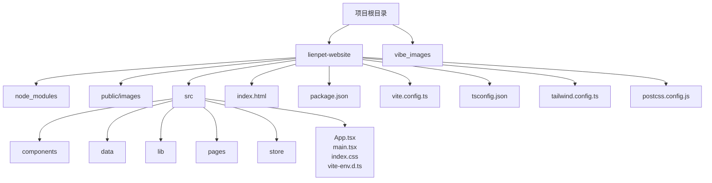
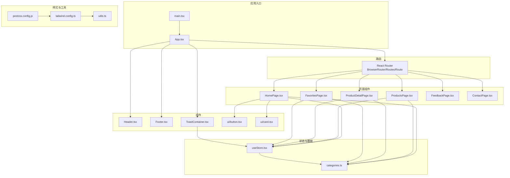

# 快速开始

<cite>
**本文引用的文件**
- [package.json](file://lienpet-website/package.json)
- [vite.config.ts](file://lienpet-website/vite.config.ts)
- [tsconfig.json](file://lienpet-website/tsconfig.json)
- [tailwind.config.ts](file://lienpet-website/tailwind.config.ts)
- [postcss.config.js](file://lienpet-website/postcss.config.js)
- [index.html](file://lienpet-website/index.html)
- [main.tsx](file://lienpet-website/src/main.tsx)
- [App.tsx](file://lienpet-website/src/App.tsx)
- [Header.tsx](file://lienpet-website/src/components/Header.tsx)
- [HomePage.tsx](file://lienpet-website/src/pages/HomePage.tsx)
- [useStore.tsx](file://lienpet-website/src/store/useStore.tsx)
- [categories.ts](file://lienpet-website/src/data/categories.ts)
- [utils.ts](file://lienpet-website/src/lib/utils.ts)
</cite>

## 目录
1. [简介](#简介)
2. [开发环境要求](#开发环境要求)
3. [项目克隆与安装](#项目克lon与安装)
4. [本地开发服务器启动](#本地开发服务器启动)
5. [常用开发命令](#常用开发命令)
6. [项目目录结构](#项目目录结构)
7. [关键配置文件说明](#关键配置文件说明)
8. [首次运行常见问题与调试](#首次运行常见问题与调试)
9. [架构概览](#架构概览)
10. [结语](#结语)

## 简介
本指南面向新加入 LienPet 项目的开发者，帮助你在最短时间内完成环境准备、项目启动与基础开发流程。LienPet 是一个基于 React 18、Vite 6、TypeScript 5 和 TailwindCSS 的宠物用品电商网站前端项目，采用 React Router 进行页面路由管理，并通过自定义全局状态管理实现收藏、消息与提示等核心功能。

## 开发环境要求
- Node.js 版本：建议使用 LTS 版本（如 18.x 或 20.x），以确保与项目依赖兼容
- 包管理器：推荐使用 npm（Node Package Manager），与项目脚本保持一致
- 文本编辑器：支持 TypeScript 与 JSX 语法高亮的现代编辑器（如 VS Code）
- 浏览器：Chrome/Firefox 等现代浏览器，便于调试与预览

## 项目克隆与安装
1. 克隆仓库到本地
   - 使用 Git 将项目克隆至本地目录
2. 进入项目目录
   - 切换到项目根目录：lienpet-website
3. 安装依赖
   - 在项目根目录执行：npm install
   - 该命令会根据 package.json 安装所有依赖与开发依赖

**章节来源**
- [package.json:1-31](file://lienpet-website/package.json#L1-L31)

## 本地开发服务器启动
- 启动开发服务器
  - 在项目根目录执行：npm run dev
  - Vite 将启动本地开发服务器，默认端口为 5173
- 访问应用
  - 打开浏览器访问 http://localhost:5173
  - 首页应显示 LienPet 的首页内容，包含分类导航、精选商品与联系信息

**章节来源**
- [package.json:6-10](file://lienpet-website/package.json#L6-L10)
- [vite.config.ts:1-12](file://lienpet-website/vite.config.ts#L1-L12)

## 常用开发命令
- 开发模式
  - npm run dev：启动 Vite 开发服务器，支持热更新
- 构建生产包
  - npm run build：先编译 TypeScript，再打包构建静态资源
- 预览生产包
  - npm run preview：在本地预览构建后的静态资源，用于验证部署效果

**章节来源**
- [package.json:6-10](file://lienpet-website/package.json#L6-L10)

## 项目目录结构
- 根目录
  - lienpet-website：前端项目根目录
  - vibe_images：图片资源目录（非代码）
- lienpet-website 内部
  - node_modules：依赖包目录（由 npm install 生成）
  - public/images：公共资源目录（如图片）
  - src：
    - components：可复用 UI 组件（如 Header、Footer、ToastContainer、ui/button、ui/card）
    - data：数据模型与示例数据（如 categories.ts）
    - lib：工具函数（如 cn）
    - pages：页面组件（如 HomePage、ProductsPage、ProductDetailPage、FavoritesPage、FeedbackPage、ContactPage）
    - store：全局状态管理（useStore.tsx）
    - App.tsx、main.tsx、index.css、vite-env.d.ts：应用入口与样式入口
  - index.html：应用 HTML 模板
  - package.json、vite.config.ts、tsconfig.json、tailwind.config.ts、postcss.config.js：关键配置文件

**图表来源**
- [index.html:1-14](file://lienpet-website/index.html#L1-L14)
- [main.tsx:1-10](file://lienpet-website/src/main.tsx#L1-L10)
- [App.tsx:1-37](file://lienpet-website/src/App.tsx#L1-L37)

**章节来源**
- [index.html:1-14](file://lienpet-website/index.html#L1-L14)
- [main.tsx:1-10](file://lienpet-website/src/main.tsx#L1-L10)
- [App.tsx:1-37](file://lienpet-website/src/App.tsx#L1-L37)

## 关键配置文件说明
- package.json
  - 脚本命令：dev、build、preview
  - 依赖：React 18、react-router-dom、TailwindCSS 生态、Lucide React 图标库等
  - 开发依赖：Vite 6、TypeScript 5、PostCSS、TailwindCSS、React 插件等
- vite.config.ts
  - 配置 React 插件与路径别名 @ 指向 src 目录
- tsconfig.json
  - 使用引用式配置，指向 tsconfig.app.json
- tailwind.config.ts
  - 配置暗色模式、内容扫描范围、主题扩展（颜色、圆角、字体、动画）、插件
- postcss.config.js
  - 配置 TailwindCSS 与 Autoprefixer 插件

**章节来源**
- [package.json:1-31](file://lienpet-website/package.json#L1-L31)
- [vite.config.ts:1-12](file://lienpet-website/vite.config.ts#L1-L12)
- [tsconfig.json:1-6](file://lienpet-website/tsconfig.json#L1-L6)
- [tailwind.config.ts:1-106](file://lienpet-website/tailwind.config.ts#L1-L106)
- [postcss.config.js:1-6](file://lienpet-website/postcss.config.js#L1-L6)

## 首次运行常见问题与调试
- 无法启动开发服务器
  - 确认已安装 Node.js 并在项目根目录执行 npm install
  - 若端口被占用，Vite 会自动尝试其他端口；可在控制台日志中查看实际访问地址
- 页面空白或样式异常
  - 检查 index.html 中的根容器与入口脚本是否正确
  - 确认 TailwindCSS 已正确配置，且 index.css 已在 main.tsx 中引入
- 路由跳转无效
  - 确认 App.tsx 中 BrowserRouter 包裹了整个应用
  - 检查路由路径与 Link 组件的 to 属性是否匹配
- 收藏功能不生效
  - 确认 Header.tsx 正确使用了 useStore 获取收藏数量
  - 检查 useStore.tsx 中 toggleFavorite 与 getFavorites 的实现
- 构建失败
  - 确保 TypeScript 编译无错误后再执行构建
  - 检查 tsconfig.json 的引用配置是否正确
- 图片资源加载失败
  - 确认图片路径与 public/images 目录结构一致
  - 首页中使用的 hero 图片与 logo 应放置在 public/images 下

**章节来源**
- [index.html:1-14](file://lienpet-website/index.html#L1-L14)
- [main.tsx:1-10](file://lienpet-website/src/main.tsx#L1-L10)
- [App.tsx:1-37](file://lienpet-website/src/App.tsx#L1-L37)
- [Header.tsx:1-93](file://lienpet-website/src/components/Header.tsx#L1-L93)
- [useStore.tsx:1-100](file://lienpet-website/src/store/useStore.tsx#L1-L100)
- [tsconfig.json:1-6](file://lienpet-website/tsconfig.json#L1-L6)

## 架构概览
LienPet 采用前端单页应用架构，核心模块包括：
- 应用入口与路由：main.tsx 作为入口，App.tsx 使用 React Router 管理页面路由
- 组件层：Header、Footer、ToastContainer、UI 组件（button、card）等
- 页面层：首页、产品列表、产品详情、收藏页、反馈页、联系页
- 数据与状态：categories.ts 提供数据模型与示例数据，useStore.tsx 提供全局状态管理
- 样式与工具：TailwindCSS 主题配置、PostCSS 自动前缀、工具函数 cn

**图表来源**
- [main.tsx:1-10](file://lienpet-website/src/main.tsx#L1-L10)
- [App.tsx:1-37](file://lienpet-website/src/App.tsx#L1-L37)
- [Header.tsx:1-93](file://lienpet-website/src/components/Header.tsx#L1-L93)
- [HomePage.tsx:1-152](file://lienpet-website/src/pages/HomePage.tsx#L1-L152)
- [useStore.tsx:1-100](file://lienpet-website/src/store/useStore.tsx#L1-L100)
- [categories.ts:1-244](file://lienpet-website/src/data/categories.ts#L1-L244)
- [utils.ts:1-6](file://lienpet-website/src/lib/utils.ts#L1-L6)
- [tailwind.config.ts:1-106](file://lienpet-website/tailwind.config.ts#L1-L106)
- [postcss.config.js:1-6](file://lienpet-website/postcss.config.js#L1-L6)

## 结语
通过以上步骤，你已经完成了 LienPet 项目的环境准备、依赖安装与本地开发服务器启动。建议在熟悉基础结构后，逐步探索页面组件、状态管理与样式系统，以便更高效地进行二次开发与维护。