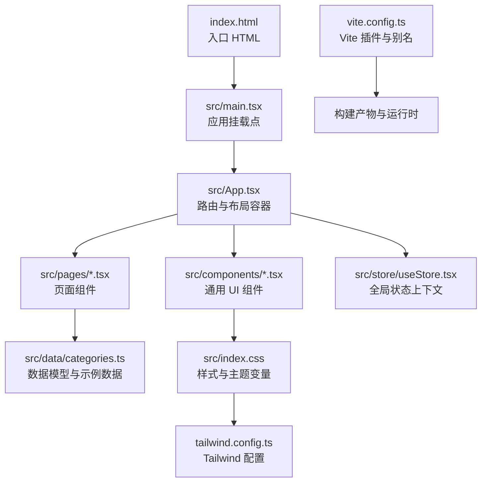
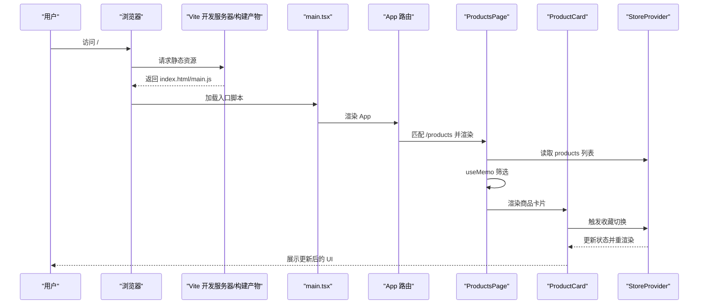
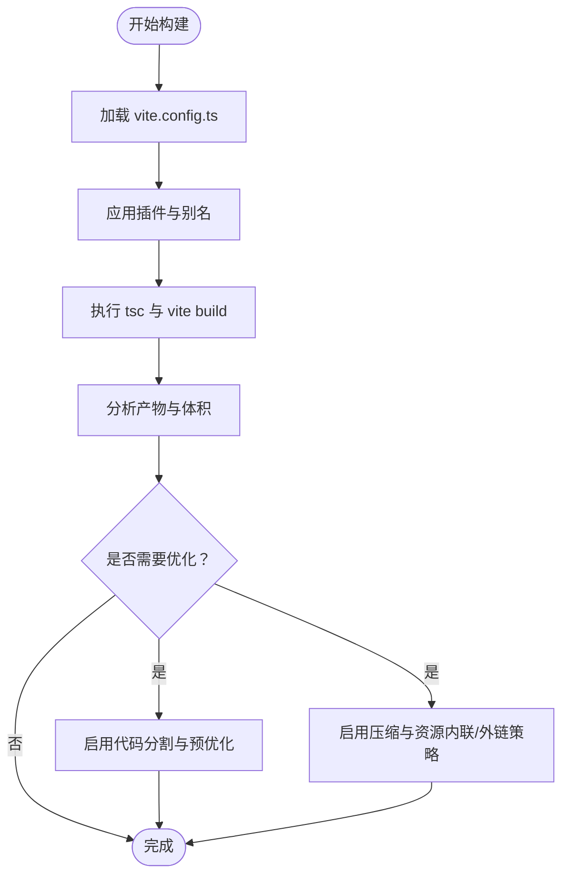
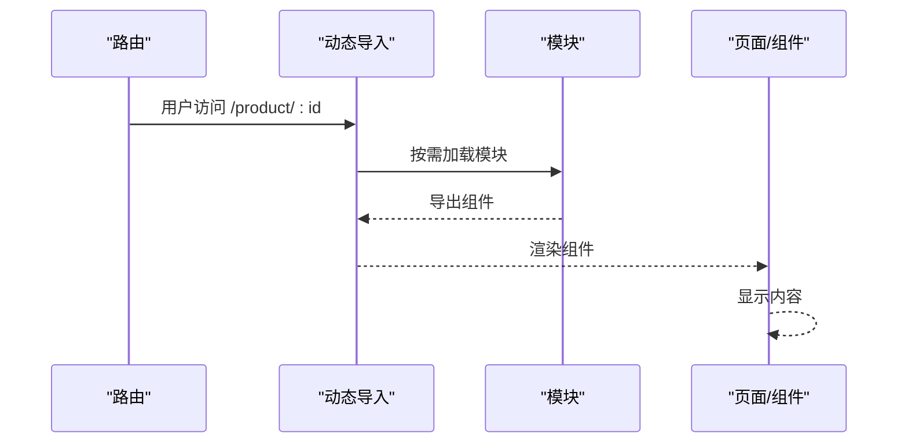
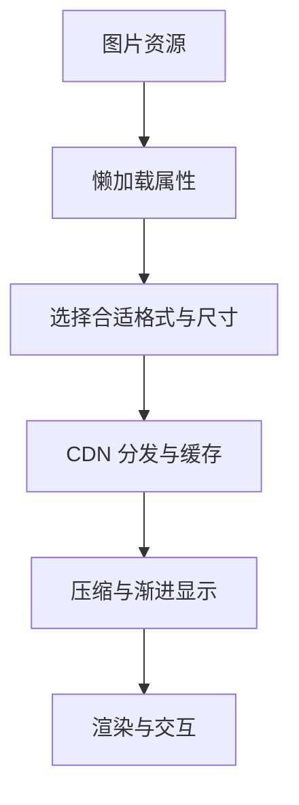
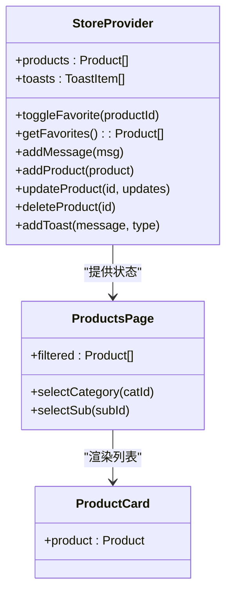
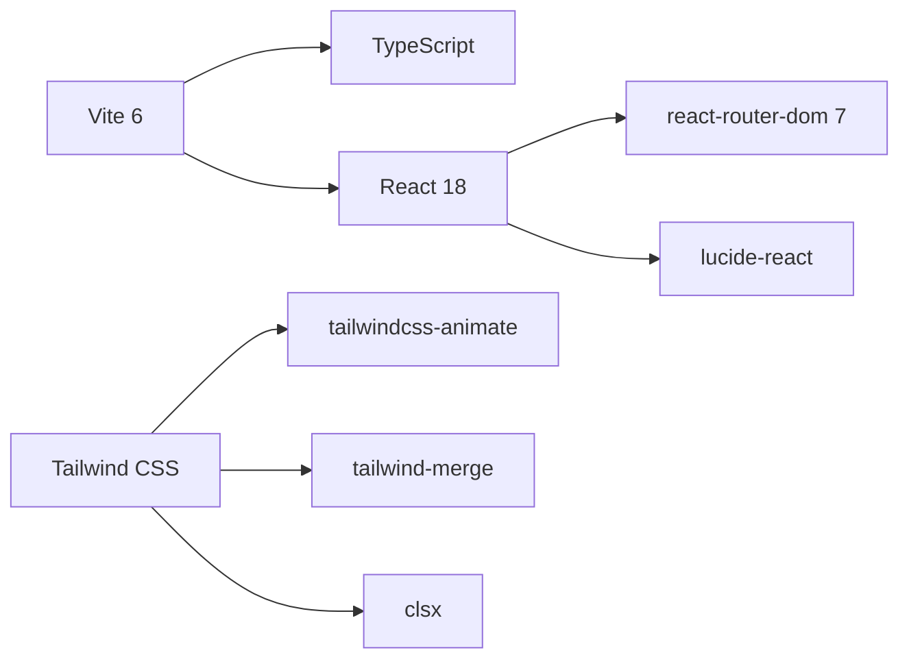

# 性能优化

<cite>
**本文引用的文件**
- [vite.config.ts](file://lienpet-website/vite.config.ts)
- [package.json](file://lienpet-website/package.json)
- [index.html](file://lienpet-website/index.html)
- [src/main.tsx](file://lienpet-website/src/main.tsx)
- [src/App.tsx](file://lienpet-website/src/App.tsx)
- [src/store/useStore.tsx](file://lienpet-website/src/store/useStore.tsx)
- [src/pages/ProductsPage.tsx](file://lienpet-website/src/pages/ProductsPage.tsx)
- [src/components/ProductCard.tsx](file://lienpet-website/src/components/ProductCard.tsx)
- [src/components/Header.tsx](file://lienpet-website/src/components/Header.tsx)
- [src/data/categories.ts](file://lienpet-website/src/data/categories.ts)
- [src/index.css](file://lienpet-website/src/index.css)
- [tailwind.config.ts](file://lienpet-website/tailwind.config.ts)
</cite>

## 目录
1. [引言](#引言)
2. [项目结构](#项目结构)
3. [核心组件](#核心组件)
4. [架构总览](#架构总览)
5. [详细组件分析](#详细组件分析)
6. [依赖关系分析](#依赖关系分析)
7. [性能考量与优化策略](#性能考量与优化策略)
8. [故障排查指南](#故障排查指南)
9. [结论](#结论)
10. [附录](#附录)

## 引言
本文件面向 LienPet 项目，系统性梳理并提出一套可落地的性能优化策略，覆盖 Vite 构建与打包、代码分割与懒加载、图片与资源优化、缓存策略、React 组件性能（memo 化、懒组件、虚拟滚动）、Web Vitals 监控与改进、以及生产环境部署与 CDN 配置建议。内容基于仓库现有代码进行分析与扩展，确保与实际实现一致。

## 项目结构
LienPet 是一个基于 React 18、Vite 6、Tailwind CSS 的前端单页应用（SPA）。项目采用按功能分层的目录组织方式：页面、组件、数据模型、样式与构建配置相对独立。路由通过 react-router-dom 管理，全局状态通过自定义 Context Provider 提供，UI 基于 Tailwind 与少量自定义动画类。

图表来源
- [index.html:1-14](file://lienpet-website/index.html#L1-L14)
- [src/main.tsx:1-10](file://lienpet-website/src/main.tsx#L1-L10)
- [src/App.tsx:1-37](file://lienpet-website/src/App.tsx#L1-L37)
- [src/store/useStore.tsx:1-100](file://lienpet-website/src/store/useStore.tsx#L1-L100)
- [src/pages/ProductsPage.tsx:1-167](file://lienpet-website/src/pages/ProductsPage.tsx#L1-L167)
- [src/components/ProductCard.tsx:1-51](file://lienpet-website/src/components/ProductCard.tsx#L1-L51)
- [src/data/categories.ts:1-244](file://lienpet-website/src/data/categories.ts#L1-L244)
- [src/index.css:1-115](file://lienpet-website/src/index.css#L1-L115)
- [tailwind.config.ts:1-106](file://lienpet-website/tailwind.config.ts#L1-L106)
- [vite.config.ts:1-12](file://lienpet-website/vite.config.ts#L1-L12)

章节来源
- [index.html:1-14](file://lienpet-website/index.html#L1-L14)
- [src/main.tsx:1-10](file://lienpet-website/src/main.tsx#L1-L10)
- [src/App.tsx:1-37](file://lienpet-website/src/App.tsx#L1-L37)
- [vite.config.ts:1-12](file://lienpet-website/vite.config.ts#L1-L12)

## 核心组件
- 应用入口与路由：应用在入口脚本中挂载到 DOM，并通过 BrowserRouter 管理路由；App 定义了首页、产品列表、详情、收藏、反馈、联系等路由。
- 全局状态：StoreProvider 提供商品、消息、提示等状态，使用 useCallback 包裹动作函数，避免渲染抖动。
- 页面与组件：ProductsPage 使用 useMemo 进行筛选计算；ProductCard 展示商品卡片并支持收藏切换；Header 展示导航与收藏数量。
- 数据模型：categories.ts 定义分类、子分类与示例商品，支撑页面渲染与筛选逻辑。
- 样式与主题：index.css 定义品牌色与阴影、过渡等变量；tailwind.config.ts 扩展颜色、动画与字体族。

章节来源
- [src/App.tsx:1-37](file://lienpet-website/src/App.tsx#L1-L37)
- [src/store/useStore.tsx:1-100](file://lienpet-website/src/store/useStore.tsx#L1-L100)
- [src/pages/ProductsPage.tsx:1-167](file://lienpet-website/src/pages/ProductsPage.tsx#L1-L167)
- [src/components/ProductCard.tsx:1-51](file://lienpet-website/src/components/ProductCard.tsx#L1-L51)
- [src/components/Header.tsx:1-93](file://lienpet-website/src/components/Header.tsx#L1-L93)
- [src/data/categories.ts:1-244](file://lienpet-website/src/data/categories.ts#L1-L244)
- [src/index.css:1-115](file://lienpet-website/src/index.css#L1-L115)
- [tailwind.config.ts:1-106](file://lienpet-website/tailwind.config.ts#L1-L106)

## 架构总览
下图展示从浏览器请求到页面渲染的关键路径，以及与构建、路由、状态与图片懒加载的交互。

图表来源
- [index.html:1-14](file://lienpet-website/index.html#L1-L14)
- [src/main.tsx:1-10](file://lienpet-website/src/main.tsx#L1-L10)
- [src/App.tsx:1-37](file://lienpet-website/src/App.tsx#L1-L37)
- [src/pages/ProductsPage.tsx:1-167](file://lienpet-website/src/pages/ProductsPage.tsx#L1-L167)
- [src/components/ProductCard.tsx:1-51](file://lienpet-website/src/components/ProductCard.tsx#L1-L51)
- [src/store/useStore.tsx:1-100](file://lienpet-website/src/store/useStore.tsx#L1-L100)

## 详细组件分析

### Vite 构建与打包配置
- 当前配置启用 React 插件与路径别名，未显式开启预构建、动态导入拆包或压缩插件。
- 建议在生产构建中引入压缩、预优化与代码分割策略，以降低首屏体积与提升加载速度。

图表来源
- [vite.config.ts:1-12](file://lienpet-website/vite.config.ts#L1-L12)
- [package.json:1-31](file://lienpet-website/package.json#L1-L31)

章节来源
- [vite.config.ts:1-12](file://lienpet-website/vite.config.ts#L1-L12)
- [package.json:1-31](file://lienpet-website/package.json#L1-L31)

### 代码分割与懒加载
- 页面级懒加载：将各页面组件改为动态导入，仅在访问对应路由时加载，减少初始包体。
- 组件级懒加载：对重型组件（如商品详情、图片画廊）使用 React.lazy 与 Suspense 包裹，避免阻塞首屏。
- 动态导入实践要点：结合路由配置，确保路由命中后才触发模块下载与渲染。

图表来源
- [src/App.tsx:1-37](file://lienpet-website/src/App.tsx#L1-L37)
- [src/pages/ProductsPage.tsx:1-167](file://lienpet-website/src/pages/ProductsPage.tsx#L1-L167)

章节来源
- [src/App.tsx:1-37](file://lienpet-website/src/App.tsx#L1-L37)
- [src/pages/ProductsPage.tsx:1-167](file://lienpet-website/src/pages/ProductsPage.tsx#L1-L167)

### 图片优化与资源压缩
- 图片懒加载：商品主图已使用 loading="lazy"，建议为画廊缩略图与背景图统一添加该属性。
- 图片格式与尺寸：优先使用现代格式（如 WebP），按展示尺寸裁剪与压缩；对多图场景提供多分辨率占位与 srcset。
- 资源内联与外链：小图标与 SVG 可内联为 React 组件或内联到 CSS；大图与静态资源走 CDN。
- CSS 与字体：Tailwind 已按需生成，建议开启 CSS 压缩与字体子集化（如仅加载 Inter 的必要字重）。

图表来源
- [src/components/ProductCard.tsx:1-51](file://lienpet-website/src/components/ProductCard.tsx#L1-L51)
- [src/pages/ProductDetailPage.tsx:103-137](file://lienpet-website/src/pages/ProductDetailPage.tsx#L103-L137)
- [src/index.css:1-115](file://lienpet-website/src/index.css#L1-L115)
- [tailwind.config.ts:1-106](file://lienpet-website/tailwind.config.ts#L1-L106)

章节来源
- [src/components/ProductCard.tsx:1-51](file://lienpet-website/src/components/ProductCard.tsx#L1-L51)
- [src/pages/ProductDetailPage.tsx:103-137](file://lienpet-website/src/pages/ProductDetailPage.tsx#L103-L137)
- [src/index.css:1-115](file://lienpet-website/src/index.css#L1-L115)
- [tailwind.config.ts:1-106](file://lienpet-website/tailwind.config.ts#L1-L106)

### 缓存策略
- HTTP 缓存：静态资源（JS/CSS/图片）设置长缓存与版本化命名；HTML 设置较短缓存或不缓存。
- 浏览器缓存：利用 ETag/Last-Modified 与 Cache-Control 控制；对变更频繁的内容缩短缓存时间。
- Service Worker：可选实现离线回退与缓存预热，提升弱网体验。
- CDN：启用压缩、边缘缓存与智能路由，就近分发资源。

章节来源
- [package.json:1-31](file://lienpet-website/package.json#L1-L31)
- [index.html:1-14](file://lienpet-website/index.html#L1-L14)

### React 组件性能优化
- memo 化：对纯展示组件（如 ProductCard）使用 React.memo，避免无谓重渲染。
- 回调稳定化：StoreProvider 中的动作函数已使用 useCallback，保持引用稳定，减少下游组件重渲染。
- 状态下沉：将高频更新的状态限定在局部组件，避免全局状态波动影响非相关区域。
- 虚拟滚动：当商品列表规模扩大时，采用虚拟滚动组件（如 react-window 或 react-virtualized）只渲染可视区域，显著降低 DOM 与内存占用。

图表来源
- [src/store/useStore.tsx:1-100](file://lienpet-website/src/store/useStore.tsx#L1-L100)
- [src/pages/ProductsPage.tsx:1-167](file://lienpet-website/src/pages/ProductsPage.tsx#L1-L167)
- [src/components/ProductCard.tsx:1-51](file://lienpet-website/src/components/ProductCard.tsx#L1-L51)

章节来源
- [src/store/useStore.tsx:1-100](file://lienpet-website/src/store/useStore.tsx#L1-L100)
- [src/pages/ProductsPage.tsx:1-167](file://lienpet-website/src/pages/ProductsPage.tsx#L1-L167)
- [src/components/ProductCard.tsx:1-51](file://lienpet-website/src/components/ProductCard.tsx#L1-L51)

### Web Vitals 监控与改进
- 指标采集：在生产环境注入 Web Vitals 脚本，收集 TTFB、FCP、LCP、FID、CLS 等指标。
- 改进方向：优先优化 LCP（延迟图片与关键渲染路径）、CLS（布局稳定与占位符）、FID（交互响应）。
- 基准对比：每次发布前后对比指标变化，确保优化效果可追踪。

章节来源
- [index.html:1-14](file://lienpet-website/index.html#L1-L14)

## 依赖关系分析
- 构建与运行时：Vite 6、TypeScript、React 18、react-router-dom 7。
- 样式与动画：Tailwind CSS、tailwindcss-animate、clsx、tailwind-merge。
- 图标与 UI：lucide-react、class-variance-authority。

图表来源
- [package.json:1-31](file://lienpet-website/package.json#L1-L31)
- [tailwind.config.ts:1-106](file://lienpet-website/tailwind.config.ts#L1-L106)

章节来源
- [package.json:1-31](file://lienpet-website/package.json#L1-L31)
- [tailwind.config.ts:1-106](file://lienpet-website/tailwind.config.ts#L1-L106)

## 性能考量与优化策略

### Vite 构建与打包优化
- 启用预构建（depAssetsInclude）与依赖预扫描，减少冷启动等待。
- 使用 rollup 插件进行代码分割：按路由或页面拆分 chunk，配合动态导入。
- 生产构建启用压缩（如 terser 或 esbuild），并开启资源内联阈值控制。
- 版本化与指纹：静态资源命名带哈希，确保缓存失效可控。

章节来源
- [vite.config.ts:1-12](file://lienpet-website/vite.config.ts#L1-L12)
- [package.json:1-31](file://lienpet-website/package.json#L1-L31)

### 代码分割与懒加载
- 页面级：将 HomePage、ProductsPage、ProductDetailPage、FavoritesPage、FeedbackPage、ContactPage 改为动态导入。
- 组件级：商品详情中的图片画廊、富文本内容等使用 React.lazy 与 Suspense。
- 路由守卫与骨架：在加载期间提供骨架屏或最小可用 UI，改善感知性能。

章节来源
- [src/App.tsx:1-37](file://lienpet-website/src/App.tsx#L1-L37)
- [src/pages/ProductsPage.tsx:1-167](file://lienpet-website/src/pages/ProductsPage.tsx#L1-L167)
- [src/pages/ProductDetailPage.tsx:103-137](file://lienpet-website/src/pages/ProductDetailPage.tsx#L103-L137)

### 图片与资源优化
- 图片：使用 WebP，按展示尺寸裁剪；为画廊与背景图统一 lazy；提供 srcset 与占位符。
- 字体：仅加载必要字重，启用字体子集化与预加载关键字形。
- CSS：Tailwind 已按需生成，建议开启 CSS 压缩与关键 CSS 内联。

章节来源
- [src/components/ProductCard.tsx:1-51](file://lienpet-website/src/components/ProductCard.tsx#L1-L51)
- [src/pages/HomePage.tsx:50-74](file://lienpet-website/src/pages/HomePage.tsx#L50-L74)
- [src/index.css:1-115](file://lienpet-website/src/index.css#L1-L115)
- [tailwind.config.ts:1-106](file://lienpet-website/tailwind.config.ts#L1-L106)

### 缓存与 CDN
- 静态资源：JS/CSS/图片设置长缓存与版本化；HTML 设置短缓存或 no-store。
- CDN：启用压缩、边缘缓存与智能路由；对热点资源做预热。
- Service Worker：可选实现离线回退与缓存策略。

章节来源
- [package.json:1-31](file://lienpet-website/package.json#L1-L31)
- [index.html:1-14](file://lienpet-website/index.html#L1-L14)

### React 组件性能
- memo 化：对 ProductCard 等纯展示组件使用 React.memo。
- useCallback：StoreProvider 中的动作函数已稳定，避免子组件重渲染。
- 状态管理：将高频更新限定在局部，减少全局波动。
- 虚拟滚动：列表规模扩大时采用虚拟滚动，降低 DOM 与内存压力。

章节来源
- [src/store/useStore.tsx:1-100](file://lienpet-website/src/store/useStore.tsx#L1-L100)
- [src/components/ProductCard.tsx:1-51](file://lienpet-website/src/components/ProductCard.tsx#L1-L51)

### Web Vitals 监控与改进
- 采集：在生产环境注入 Web Vitals 脚本，记录 TTFB、FCP、LCP、FID、CLS。
- 改进：优先优化 LCP（图片与关键渲染）、CLS（布局稳定）、FID（交互响应）。
- 对比：每次发布前后对比指标，形成优化闭环。

章节来源
- [index.html:1-14](file://lienpet-website/index.html#L1-L14)

## 故障排查指南
- 构建失败：检查 TypeScript 编译与 Vite 插件版本兼容性；确认 vite.config.ts 中的别名与插件配置正确。
- 首屏慢：确认是否启用代码分割与懒加载；检查图片是否过大或未懒加载；核对缓存策略与 CDN 配置。
- 交互卡顿：排查 StoreProvider 中动作函数是否导致不必要的重渲染；对重型组件使用 React.lazy 与 Suspense。
- 样式异常：检查 Tailwind 配置与 CSS 生成范围，确保 content 路径覆盖新增组件。

章节来源
- [vite.config.ts:1-12](file://lienpet-website/vite.config.ts#L1-L12)
- [package.json:1-31](file://lienpet-website/package.json#L1-L31)
- [tailwind.config.ts:1-106](file://lienpet-website/tailwind.config.ts#L1-L106)

## 结论
通过对 LienPet 项目的现状分析，建议围绕“构建优化、代码分割、图片与资源优化、缓存与 CDN、React 组件性能、Web Vitals 监控”六个维度推进优化。优先实施懒加载与按需导入，配合 CDN 与缓存策略，可显著降低首屏时间与资源体积；同时通过 Web Vitals 持续跟踪与改进，确保用户体验稳步提升。

## 附录
- 关键实现参考路径
  - 应用入口与路由：[src/main.tsx:1-10](file://lienpet-website/src/main.tsx#L1-L10)，[src/App.tsx:1-37](file://lienpet-website/src/App.tsx#L1-L37)
  - 全局状态与动作：[src/store/useStore.tsx:1-100](file://lienpet-website/src/store/useStore.tsx#L1-L100)
  - 商品列表与筛选：[src/pages/ProductsPage.tsx:1-167](file://lienpet-website/src/pages/ProductsPage.tsx#L1-L167)
  - 商品卡片与图片懒加载：[src/components/ProductCard.tsx:1-51](file://lienpet-website/src/components/ProductCard.tsx#L1-L51)
  - 样式与主题变量：[src/index.css:1-115](file://lienpet-website/src/index.css#L1-L115)，[tailwind.config.ts:1-106](file://lienpet-website/tailwind.config.ts#L1-L106)
  - 构建与依赖：[vite.config.ts:1-12](file://lienpet-website/vite.config.ts#L1-L12)，[package.json:1-31](file://lienpet-website/package.json#L1-L31)