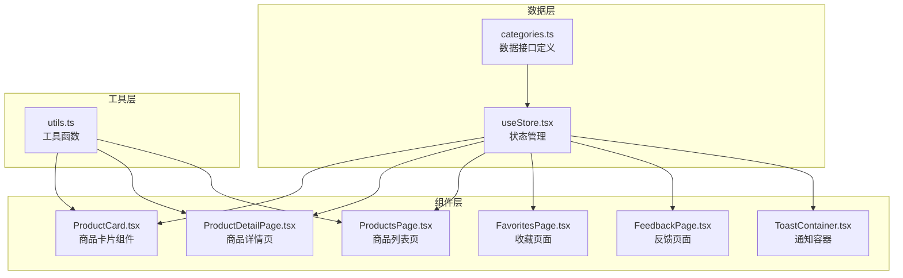
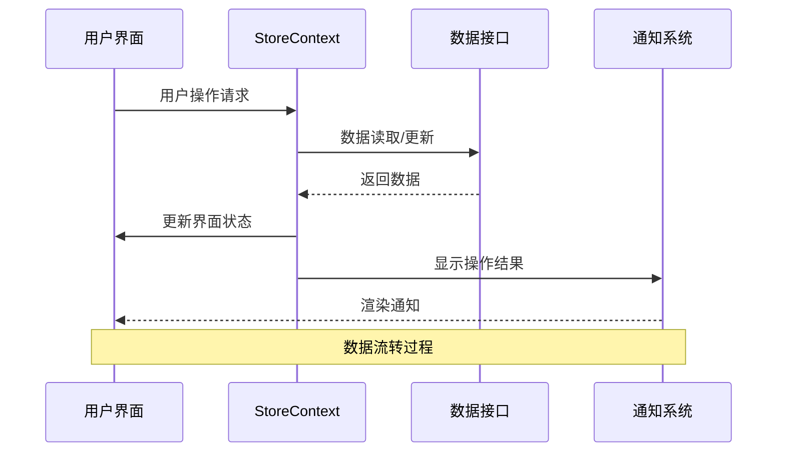
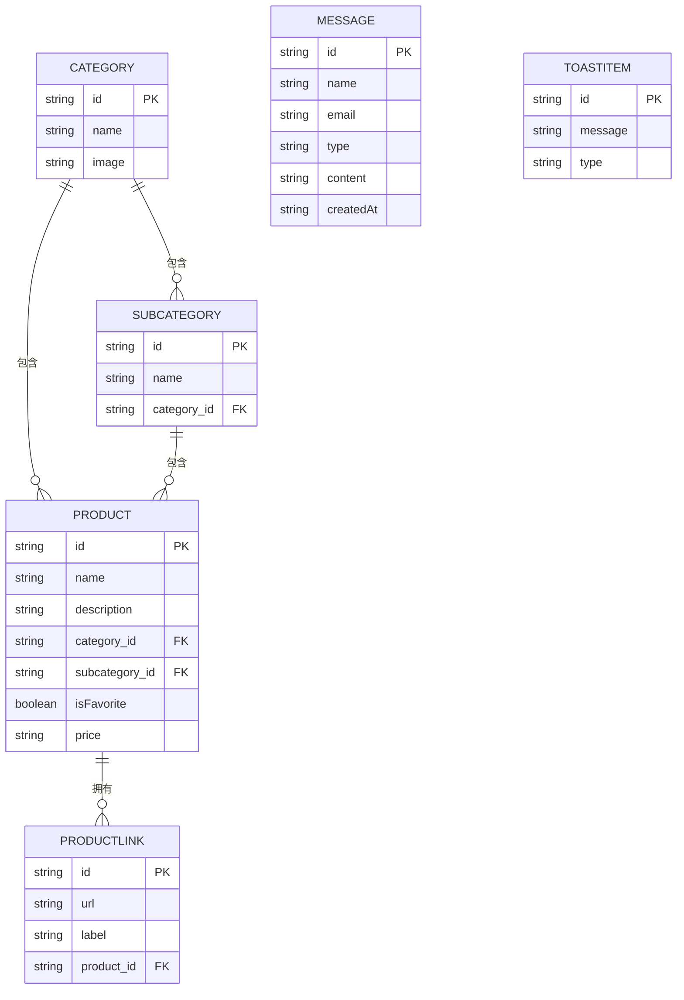
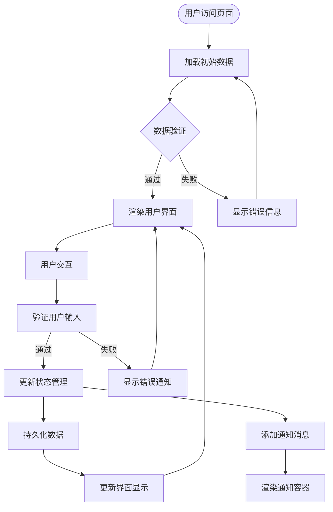
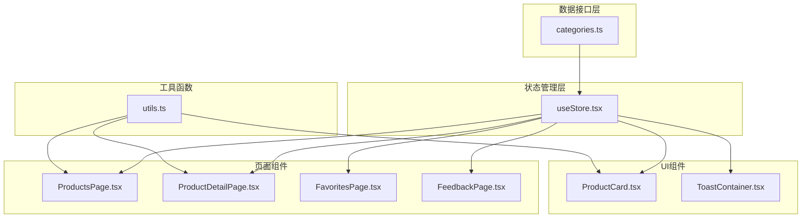

# 数据模型

<cite>
**本文档引用的文件**
- [categories.ts](file://lienpet-website/src/data/categories.ts)
- [useStore.tsx](file://lienpet-website/src/store/useStore.tsx)
- [ToastContainer.tsx](file://lienpet-website/src/components/ToastContainer.tsx)
- [ProductDetailPage.tsx](file://lienpet-website/src/pages/ProductDetailPage.tsx)
- [ProductsPage.tsx](file://lienpet-website/src/pages/ProductsPage.tsx)
- [ProductCard.tsx](file://lienpet-website/src/components/ProductCard.tsx)
- [FavoritesPage.tsx](file://lienpet-website/src/pages/FavoritesPage.tsx)
- [FeedbackPage.tsx](file://lienpet-website/src/pages/FeedbackPage.tsx)
- [utils.ts](file://lienpet-website/src/lib/utils.ts)
</cite>

## 目录
1. [简介](#简介)
2. [项目结构](#项目结构)
3. [核心数据接口](#核心数据接口)
4. [架构概览](#架构概览)
5. [详细组件分析](#详细组件分析)
6. [依赖关系分析](#依赖关系分析)
7. [性能考虑](#性能考虑)
8. [故障排除指南](#故障排除指南)
9. [结论](#结论)

## 简介

LienPet是一个宠物用品电商平台，采用React + TypeScript构建。本数据模型文档详细定义了系统中的核心数据结构，包括商品分类、商品详情、用户消息和通知消息等关键实体。文档旨在为开发者提供清晰的数据结构理解和使用指南，确保数据的一致性和完整性。

## 项目结构

LienPet项目采用模块化架构设计，数据模型主要分布在以下目录结构中：

**图表来源**
- [categories.ts:1-244](file://lienpet-website/src/data/categories.ts#L1-L244)
- [useStore.tsx:1-100](file://lienpet-website/src/store/useStore.tsx#L1-L100)

**章节来源**
- [categories.ts:1-244](file://lienpet-website/src/data/categories.ts#L1-L244)
- [useStore.tsx:1-100](file://lienpet-website/src/store/useStore.tsx#L1-L100)

## 核心数据接口

### Category（商品分类）

商品分类是系统中最基础的数据结构，用于组织和管理商品的层次结构。

| 字段名 | 类型 | 必填 | 默认值 | 描述 |
|--------|------|------|--------|------|
| id | string | 是 | 无 | 分类唯一标识符，使用短横线分隔的英文单词 |
| name | string | 是 | 无 | 分类名称，支持中英文显示 |
| image | string | 是 | 无 | 分类对应的图片路径 |
| subcategories | SubCategory[] | 是 | [] | 子分类数组 |

**章节来源**
- [categories.ts:6-11](file://lienpet-website/src/data/categories.ts#L6-L11)

### SubCategory（子分类）

子分类用于进一步细分商品类别，提供更精确的商品组织方式。

| 字段名 | 类型 | 必填 | 默认值 | 描述 |
|--------|------|------|--------|------|
| id | string | 是 | 无 | 子分类唯一标识符 |
| name | string | 是 | 无 | 子分类名称 |

**章节来源**
- [categories.ts:1-4](file://lienpet-website/src/data/categories.ts#L1-L4)

### Product（商品详情）

商品详情是系统的核心数据结构，包含了商品的所有相关信息。

| 字段名 | 类型 | 必填 | 默认值 | 描述 |
|--------|------|------|--------|------|
| id | string | 是 | 无 | 商品唯一标识符，格式为'p' + 数字 |
| name | string | 是 | 无 | 商品名称 |
| description | string | 是 | 无 | 商品详细描述 |
| categoryId | string | 是 | 无 | 所属主分类ID |
| subcategoryId | string | 是 | 无 | 所属子分类ID |
| images | string[] | 是 | [] | 商品图片URL数组，最多10张 |
| links | ProductLink[] | 否 | [] | 商品链接数组 |
| price | string? | 否 | undefined | 商品价格，可能为空字符串或'询价' |
| isFavorite | boolean | 是 | false | 是否为收藏商品 |

**章节来源**
- [categories.ts:19-29](file://lienpet-website/src/data/categories.ts#L19-L29)

### ProductLink（商品链接）

商品链接用于关联外部购买渠道或其他相关信息。

| 字段名 | 类型 | 必填 | 默认值 | 描述 |
|--------|------|------|--------|------|
| id | string | 是 | 无 | 链接唯一标识符 |
| url | string | 是 | 无 | 外部链接URL |
| label | string | 是 | 无 | 链接显示标签 |

**章节来源**
- [categories.ts:13-17](file://lienpet-website/src/data/categories.ts#L13-L17)

### Message（用户消息）

用户消息用于收集用户反馈和建议，支持两种消息类型。

| 字段名 | 类型 | 必填 | 默认值 | 描述 |
|--------|------|------|--------|------|
| id | string | 是 | 无 | 消息唯一标识符 |
| name | string | 是 | 无 | 用户姓名 |
| email | string | 是 | 无 | 用户邮箱地址 |
| type | 'suggestion' \| 'product-request' | 是 | 无 | 消息类型枚举 |
| content | string | 是 | 无 | 消息内容 |
| createdAt | string | 是 | 无 | 创建时间戳（ISO 8601格式） |

**章节来源**
- [categories.ts:31-38](file://lienpet-website/src/data/categories.ts#L31-L38)

### ToastItem（通知消息）

ToastItem用于管理界面通知消息，提供用户友好的操作反馈。

| 字段名 | 类型 | 必填 | 默认值 | 描述 |
|--------|------|------|--------|------|
| id | string | 是 | 无 | 通知唯一标识符 |
| message | string | 是 | 无 | 通知消息文本 |
| type | 'success' \| 'error' \| 'info' | 是 | 'success' | 通知类型枚举 |

**章节来源**
- [useStore.tsx:19-23](file://lienpet-website/src/store/useStore.tsx#L19-L23)

## 架构概览

LienPet的数据模型采用分层架构设计，从底层的数据接口到上层的业务逻辑形成了清晰的数据流。

**图表来源**
- [useStore.tsx:27-94](file://lienpet-website/src/store/useStore.tsx#L27-L94)
- [categories.ts:40-141](file://lienpet-website/src/data/categories.ts#L40-L141)

## 详细组件分析

### 数据模型关系图

**图表来源**
- [categories.ts:6-29](file://lienpet-website/src/data/categories.ts#L6-L29)
- [useStore.tsx:19-23](file://lienpet-website/src/store/useStore.tsx#L19-L23)

### 数据验证规则

系统实现了多层次的数据验证机制：

#### 基础类型验证
- 所有必填字段必须提供有效值
- ID字段遵循特定格式规范
- URL字段使用正则表达式验证
- 邮箱字段使用标准邮箱格式

#### 业务规则验证
- 商品图片数量限制：最多10张
- 收藏功能：isFavorite布尔值控制
- 价格字段：可为空或特殊值'询价'
- 链接标签：若未提供则使用URL作为默认值

#### 空值处理策略
- 可选字段允许为空值
- 默认值通过工厂函数生成
- 空数组初始化确保数组类型安全

**章节来源**
- [ProductDetailPage.tsx:34-76](file://lienpet-website/src/pages/ProductDetailPage.tsx#L34-L76)
- [useStore.tsx:62-81](file://lienpet-website/src/store/useStore.tsx#L62-L81)

### 数据流转过程

**图表来源**
- [useStore.tsx:27-94](file://lienpet-website/src/store/useStore.tsx#L27-L94)
- [ProductDetailPage.tsx:78-254](file://lienpet-website/src/pages/ProductDetailPage.tsx#L78-L254)

**章节来源**
- [ProductsPage.tsx:16-25](file://lienpet-website/src/pages/ProductsPage.tsx#L16-L25)
- [FavoritesPage.tsx:8-9](file://lienpet-website/src/pages/FavoritesPage.tsx#L8-L9)

## 依赖关系分析

### 组件间依赖关系

**图表来源**
- [useStore.tsx:1-17](file://lienpet-website/src/store/useStore.tsx#L1-L17)
- [ProductCard.tsx:1-8](file://lienpet-website/src/components/ProductCard.tsx#L1-L8)

### 数据依赖链

系统中的数据依赖关系形成了清晰的调用链：

1. **数据源**：categories.ts提供基础数据接口
2. **状态管理**：useStore.tsx管理全局状态和业务逻辑
3. **页面组件**：各页面组件消费状态数据
4. **UI组件**：基础UI组件复用业务逻辑
5. **工具函数**：utils.ts提供通用工具方法

**章节来源**
- [useStore.tsx:27-94](file://lienpet-website/src/store/useStore.tsx#L27-L94)
- [ProductCard.tsx:10-36](file://lienpet-website/src/components/ProductCard.tsx#L10-L36)

## 性能考虑

### 数据结构优化

1. **内存使用优化**
   - 使用扁平化数据结构减少嵌套层级
   - 图片URL存储而非二进制数据
   - 数组长度限制防止内存溢出

2. **查询性能优化**
   - ID字段建立索引机制
   - 分类筛选使用索引查找
   - 收藏功能使用过滤器缓存

3. **渲染性能优化**
   - useMemo缓存计算结果
   - useCallback优化函数引用
   - 条件渲染减少DOM节点

### 缓存策略

- **本地缓存**：浏览器localStorage存储用户偏好
- **组件缓存**：useMemo缓存昂贵计算结果
- **网络缓存**：HTTP缓存头优化静态资源

## 故障排除指南

### 常见问题及解决方案

#### 数据类型不匹配
**问题**：字段类型与预期不符
**解决方案**：
- 使用TypeScript编译时检查
- 实现运行时类型验证
- 提供默认值处理

#### 数据一致性问题
**问题**：多处修改导致数据不同步
**解决方案**：
- 使用单一数据源原则
- 实现状态同步机制
- 添加数据校验逻辑

#### 性能问题
**问题**：页面渲染缓慢
**解决方案**：
- 实施虚拟滚动
- 优化重渲染逻辑
- 减少不必要的组件重新挂载

**章节来源**
- [useStore.tsx:32-38](file://lienpet-website/src/store/useStore.tsx#L32-L38)
- [ToastContainer.tsx:13-27](file://lienpet-website/src/components/ToastContainer.tsx#L13-L27)

### 调试技巧

1. **开发工具**：使用React DevTools检查组件状态
2. **日志记录**：在关键位置添加调试日志
3. **单元测试**：为数据模型编写测试用例
4. **性能监控**：使用性能分析工具识别瓶颈

## 结论

LienPet项目的数据模型设计体现了现代前端应用的最佳实践。通过清晰的接口定义、严格的类型约束和完善的验证机制，系统确保了数据的一致性和可靠性。

### 主要优势

1. **类型安全**：完整的TypeScript类型定义
2. **数据完整性**：严格的验证规则和默认值处理
3. **扩展性**：模块化的数据结构便于功能扩展
4. **用户体验**：实时的状态更新和友好的反馈机制

### 发展建议

1. **数据持久化**：考虑实现本地存储和服务器同步
2. **数据迁移**：为未来版本升级准备数据迁移方案
3. **性能监控**：实施更全面的性能指标监控
4. **测试覆盖**：增加数据模型的自动化测试

这个数据模型为LienPet项目提供了坚实的基础，支持当前的功能需求并为未来的扩展做好了准备。