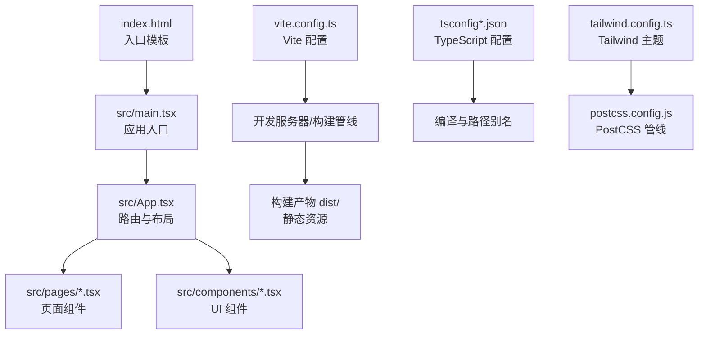
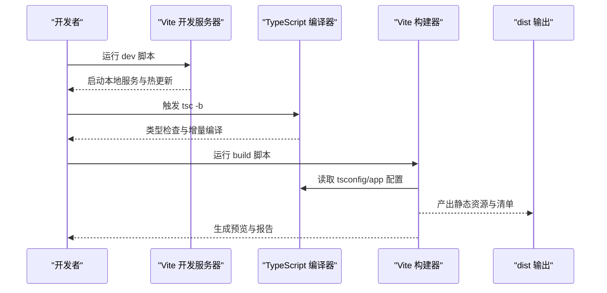
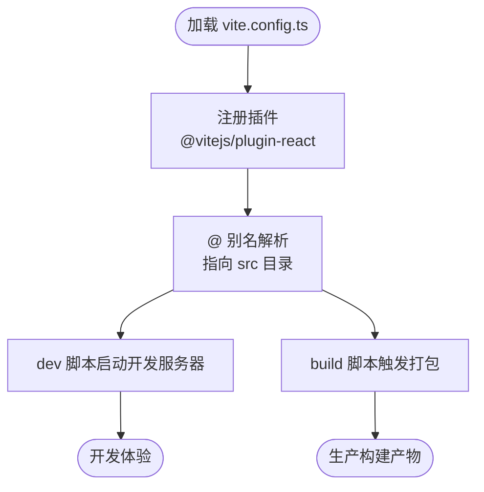
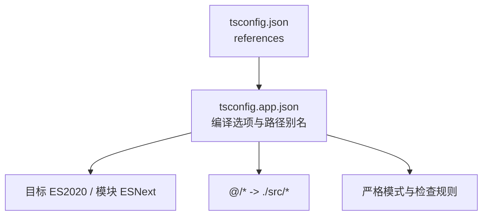
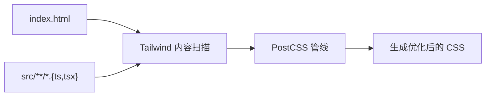
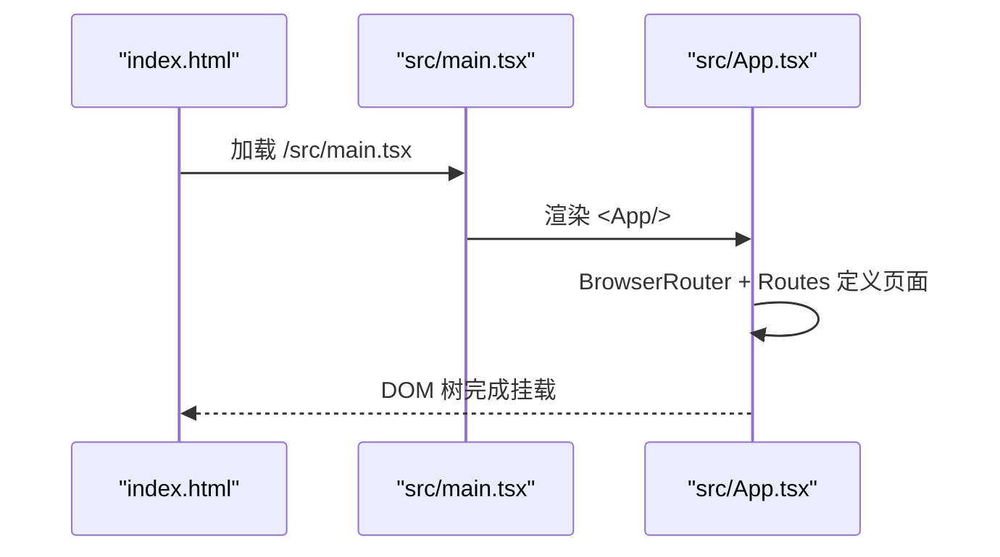
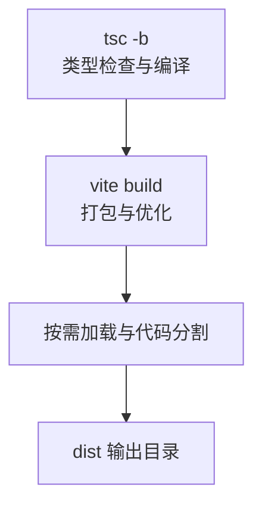
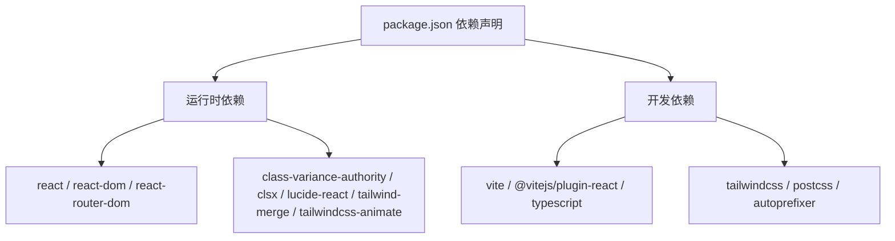

# 构建与部署架构

<cite>
**本文档引用的文件**
- [vite.config.ts](file://lienpet-website/vite.config.ts)
- [package.json](file://lienpet-website/package.json)
- [tsconfig.json](file://lienpet-website/tsconfig.json)
- [tsconfig.app.json](file://lienpet-website/tsconfig.app.json)
- [tailwind.config.ts](file://lienpet-website/tailwind.config.ts)
- [postcss.config.js](file://lienpet-website/postcss.config.js)
- [src/main.tsx](file://lienpet-website/src/main.tsx)
- [src/App.tsx](file://lienpet-website/src/App.tsx)
- [index.html](file://lienpet-website/index.html)
</cite>

## 目录
1. [简介](#简介)
2. [项目结构](#项目结构)
3. [核心组件](#核心组件)
4. [架构总览](#架构总览)
5. [详细组件分析](#详细组件分析)
6. [依赖分析](#依赖分析)
7. [性能考虑](#性能考虑)
8. [故障排查指南](#故障排查指南)
9. [结论](#结论)
10. [附录](#附录)

## 简介
本文件系统性梳理 LienPet 项目的构建与部署架构，围绕 Vite 6.0.5 的现代工具链展开，覆盖开发服务器配置、生产构建优化、代码分割策略、路径别名与插件配置、TypeScript 编译与类型检查、PostCSS/Tailwind 集成、以及可扩展的部署与性能监控建议。文档同时提供构建优化技巧、缓存策略与 CDN 集成方案，帮助团队在保证开发体验的同时实现高性能的生产交付。

## 项目结构
LienPet 采用单页应用（SPA）架构，前端以 React + TypeScript 开发，使用 Vite 作为构建与开发服务器，Tailwind CSS 提供样式基础，PostCSS 负责自动前缀与样式管线处理。关键目录与文件职责如下：
- src：源代码根目录，包含组件、页面、路由、状态管理与工具函数
- public/images：静态资源（图标、图片等）
- vite.config.ts：Vite 构建与开发服务器配置
- tsconfig.*：TypeScript 编译配置与路径映射
- tailwind.config.ts：Tailwind 样式主题与内容扫描范围
- postcss.config.js：PostCSS 插件管线（Tailwind + Autoprefixer）
- package.json：脚本命令、依赖与版本约束
- index.html：入口 HTML 模板，挂载 React 应用根节点

**图表来源**
- [index.html:1-14](file://lienpet-website/index.html#L1-L14)
- [src/main.tsx:1-10](file://lienpet-website/src/main.tsx#L1-L10)
- [src/App.tsx:1-37](file://lienpet-website/src/App.tsx#L1-L37)
- [vite.config.ts:1-12](file://lienpet-website/vite.config.ts#L1-L12)
- [tsconfig.json:1-6](file://lienpet-website/tsconfig.json#L1-L6)
- [tsconfig.app.json:1-25](file://lienpet-website/tsconfig.app.json#L1-L25)
- [tailwind.config.ts:1-106](file://lienpet-website/tailwind.config.ts#L1-L106)
- [postcss.config.js:1-6](file://lienpet-website/postcss.config.js#L1-L6)

**章节来源**
- [index.html:1-14](file://lienpet-website/index.html#L1-L14)
- [src/main.tsx:1-10](file://lienpet-website/src/main.tsx#L1-L10)
- [src/App.tsx:1-37](file://lienpet-website/src/App.tsx#L1-L37)
- [vite.config.ts:1-12](file://lienpet-website/vite.config.ts#L1-L12)
- [tsconfig.json:1-6](file://lienpet-website/tsconfig.json#L1-L6)
- [tsconfig.app.json:1-25](file://lienpet-website/tsconfig.app.json#L1-L25)
- [tailwind.config.ts:1-106](file://lienpet-website/tailwind.config.ts#L1-L106)
- [postcss.config.js:1-6](file://lienpet-website/postcss.config.js#L1-L6)

## 核心组件
- Vite 开发服务器与构建器：提供快速热更新、按需编译与生产级打包能力
- React + TypeScript：类型安全的组件化开发
- Tailwind CSS + PostCSS：原子化样式与自动前缀
- 路由与状态：BrowserRouter + 自定义状态容器
- 资源与别名：通过路径别名 @ 指向 src，提升导入可读性

**章节来源**
- [vite.config.ts:1-12](file://lienpet-website/vite.config.ts#L1-L12)
- [package.json:1-31](file://lienpet-website/package.json#L1-L31)
- [tsconfig.app.json:1-25](file://lienpet-website/tsconfig.app.json#L1-L25)
- [tailwind.config.ts:1-106](file://lienpet-website/tailwind.config.ts#L1-L106)
- [postcss.config.js:1-6](file://lienpet-website/postcss.config.js#L1-L6)
- [src/App.tsx:1-37](file://lienpet-website/src/App.tsx#L1-L37)

## 架构总览
下图展示从开发到生产的端到端流程：开发时由 Vite 启动本地服务，热更新响应源码变更；构建阶段先执行 TypeScript 编译，再由 Vite 打包生成静态资源，并输出到 dist 目录。

**图表来源**
- [package.json:6-10](file://lienpet-website/package.json#L6-L10)
- [vite.config.ts:1-12](file://lienpet-website/vite.config.ts#L1-L12)
- [tsconfig.app.json:1-25](file://lienpet-website/tsconfig.app.json#L1-L25)

## 详细组件分析

### Vite 配置与路径别名
- 插件体系：启用 @vitejs/plugin-react，支持 JSX 转换与 React Fast Refresh
- 路径别名：通过 resolve.alias 将 @ 映射至 src，简化相对路径导入
- 开发与构建：dev 脚本启动开发服务器；build 脚本先执行 tsc -b 再进行打包

**图表来源**
- [vite.config.ts:5-12](file://lienpet-website/vite.config.ts#L5-L12)

**章节来源**
- [vite.config.ts:1-12](file://lienpet-website/vite.config.ts#L1-L12)

### TypeScript 编译配置
- 多配置文件组织：根 tsconfig.json 引用 tsconfig.app.json，实现分层管理
- 编译目标与模块：ES2020 目标、ESNext 模块、bundler 解析策略
- 路径别名同步：compilerOptions.paths 中的 @/* 与 Vite 别名保持一致
- 严格模式：启用严格类型检查与未使用项检测，减少运行时风险

**图表来源**
- [tsconfig.json:1-6](file://lienpet-website/tsconfig.json#L1-L6)
- [tsconfig.app.json:1-25](file://lienpet-website/tsconfig.app.json#L1-L25)

**章节来源**
- [tsconfig.json:1-6](file://lienpet-website/tsconfig.json#L1-L6)
- [tsconfig.app.json:1-25](file://lienpet-website/tsconfig.app.json#L1-L25)

### Tailwind CSS 与 PostCSS 集成
- Tailwind 主题：深色模式、容器、颜色系统、动画与字体族扩展
- 内容扫描：扫描 index.html 与 src 下的 ts/tsx 文件，按需生成样式
- PostCSS 管线：启用 tailwindcss 与 autoprefixer，自动补全浏览器前缀

**图表来源**
- [tailwind.config.ts:4-8](file://lienpet-website/tailwind.config.ts#L4-L8)
- [postcss.config.js:1-6](file://lienpet-website/postcss.config.js#L1-L6)

**章节来源**
- [tailwind.config.ts:1-106](file://lienpet-website/tailwind.config.ts#L1-L106)
- [postcss.config.js:1-6](file://lienpet-website/postcss.config.js#L1-L6)

### 应用入口与路由
- 入口挂载：index.html 中挂载 #root，main.tsx 渲染 App
- 路由结构：BrowserRouter 包裹 Routes，定义首页、产品、详情、收藏、反馈、联系等页面路由
- 状态提供：StoreProvider 为全局状态容器提供上下文

**图表来源**
- [index.html:10-13](file://lienpet-website/index.html#L10-L13)
- [src/main.tsx:1-10](file://lienpet-website/src/main.tsx#L1-L10)
- [src/App.tsx:1-37](file://lienpet-website/src/App.tsx#L1-L37)

**章节来源**
- [index.html:1-14](file://lienpet-website/index.html#L1-L14)
- [src/main.tsx:1-10](file://lienpet-website/src/main.tsx#L1-L10)
- [src/App.tsx:1-37](file://lienpet-website/src/App.tsx#L1-L37)

### 生产构建与代码分割
- 构建顺序：先执行 tsc -b 进行类型检查与增量编译，再由 Vite 执行打包
- 代码分割：Vite 基于动态导入与路由拆分实现按需加载，结合 React Router 的页面级路由，自然形成代码分割
- 输出优化：默认输出至 dist 目录，包含 HTML、JS、CSS 与静态资源

**图表来源**
- [package.json:8](file://lienpet-website/package.json#L8)
- [vite.config.ts:1-12](file://lienpet-website/vite.config.ts#L1-L12)

**章节来源**
- [package.json:6-10](file://lienpet-website/package.json#L6-L10)
- [vite.config.ts:1-12](file://lienpet-website/vite.config.ts#L1-L12)

## 依赖分析
- 运行时依赖：React、React DOM、React Router DOM、Tailwind 相关工具库
- 开发依赖：Vite 6、@vitejs/plugin-react、TypeScript、Tailwind CSS、PostCSS、Autoprefixer
- 版本关系：Vite 6 与 React 18.3.x、TypeScript ~5.6.2 协同工作

**图表来源**
- [package.json:11-30](file://lienpet-website/package.json#L11-L30)

**章节来源**
- [package.json:1-31](file://lienpet-website/package.json#L1-L31)

## 性能考虑
- 代码分割策略
  - 页面级路由天然形成分割点，建议对大组件或第三方库使用动态导入进一步细化分割
  - 对首屏关键路径进行优先加载，非关键资源延迟加载
- 构建优化
  - 启用最小化与 Tree Shaking（Vite 默认开启），确保仅打包实际使用的导出
  - 使用外部化策略（如对稳定第三方库进行 CDN 引入）降低包体
- 缓存策略
  - 静态资源采用强缓存（带内容指纹），HTML 不缓存或短缓存
  - 通过 HTTP/2 多路复用与 Gzip/Brotli 压缩提升传输效率
- CDN 集成
  - 将 React、React DOM、Tailwind 等稳定依赖交由 CDN 加载，缩短首包体积
  - 通过构建时注入公共路径（base）与资源哈希，确保缓存命中与更新可控
- 监控与分析
  - 在生产环境接入 Web Vitals 或自定义指标上报，持续观测首屏时间、交互延迟与稳定性

[本节为通用性能指导，不直接分析具体文件，故无“章节来源”]

## 故障排查指南
- 开发服务器无法启动
  - 检查端口占用与网络权限；确认 Vite 插件安装与版本兼容
- 路径别名失效
  - 确认 Vite 与 TypeScript 的 @/* 别名保持一致，避免混用相对路径
- 样式未生效
  - 检查 Tailwind 内容扫描范围是否包含新增文件，确认 PostCSS 管线正常
- 构建失败或产物异常
  - 先执行 tsc -b 排查类型错误，再运行 vite build 获取详细报错
- 预览与线上表现差异
  - 确认 base 路径、静态资源引用与 CDN 配置一致

**章节来源**
- [vite.config.ts:1-12](file://lienpet-website/vite.config.ts#L1-L12)
- [tsconfig.app.json:1-25](file://lienpet-website/tsconfig.app.json#L1-L25)
- [tailwind.config.ts:1-106](file://lienpet-website/tailwind.config.ts#L1-L106)
- [postcss.config.js:1-6](file://lienpet-website/postcss.config.js#L1-L6)
- [package.json:6-10](file://lienpet-website/package.json#L6-L10)

## 结论
LienPet 的构建与部署架构以 Vite 为核心，结合 React + TypeScript + Tailwind 的现代化技术栈，实现了高效开发与高质量生产构建。通过路径别名、严格的类型检查、Tailwind 内容扫描与 PostCSS 管线，项目在可维护性与样式一致性方面具备良好基础。建议在生产环境中引入 CDN、缓存与监控策略，持续优化首屏性能与用户体验。

[本节为总结性内容，不直接分析具体文件，故无“章节来源”]

## 附录
- 部署流程建议
  - 构建：在 CI 中先执行类型检查，再执行生产构建
  - 发布：将 dist 目录部署至静态托管（如 GitHub Pages、Vercel、Netlify）或 CDN
  - 预览：在本地使用 vite preview 验证构建产物
- 环境变量管理
  - 使用 .env 文件与 Vite 环境变量前缀（VITE_）注入客户端可见变量
  - 服务端敏感信息不暴露于前端
- ESLint 集成（建议）
  - 安装 eslint 与 @typescript-eslint/parser，配置规则以匹配 tsconfig 的严格模式
  - 在 CI 中执行 lint 与类型检查，确保代码质量

**章节来源**
- [package.json:6-10](file://lienpet-website/package.json#L6-L10)
- [vite.config.ts:1-12](file://lienpet-website/vite.config.ts#L1-L12)
- [tsconfig.app.json:1-25](file://lienpet-website/tsconfig.app.json#L1-L25)