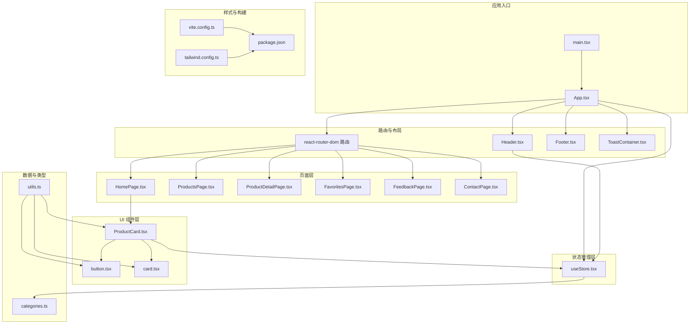
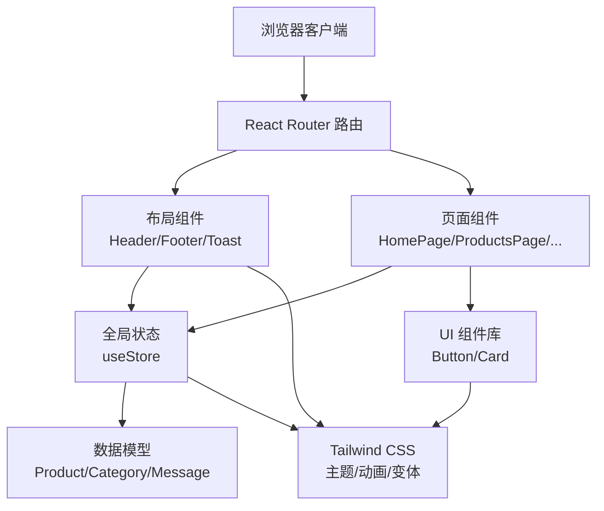
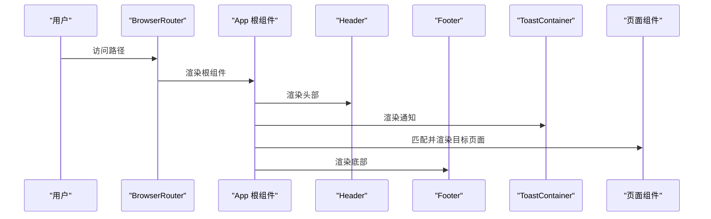
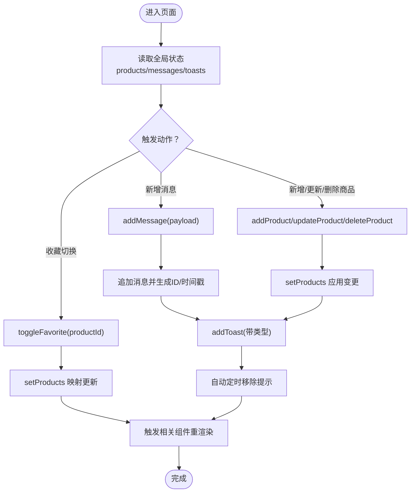
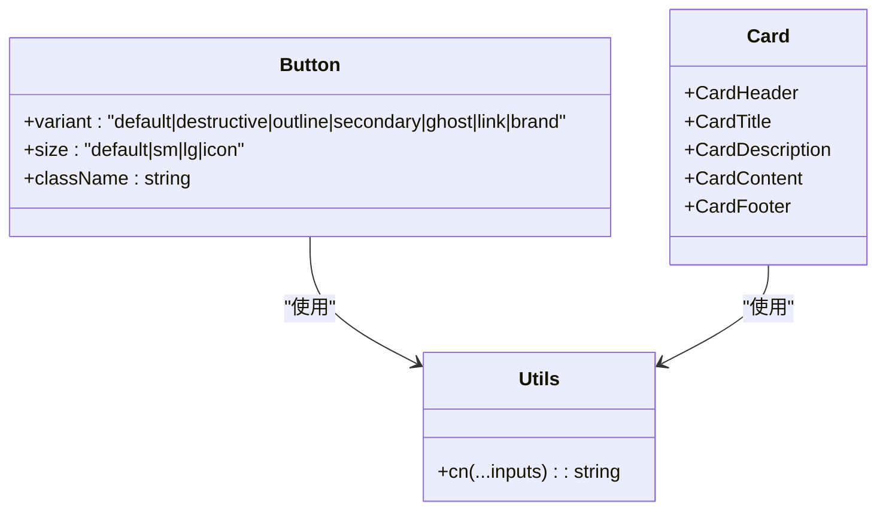
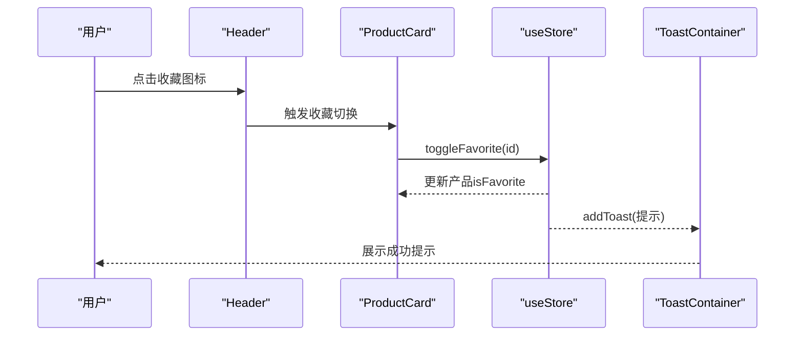
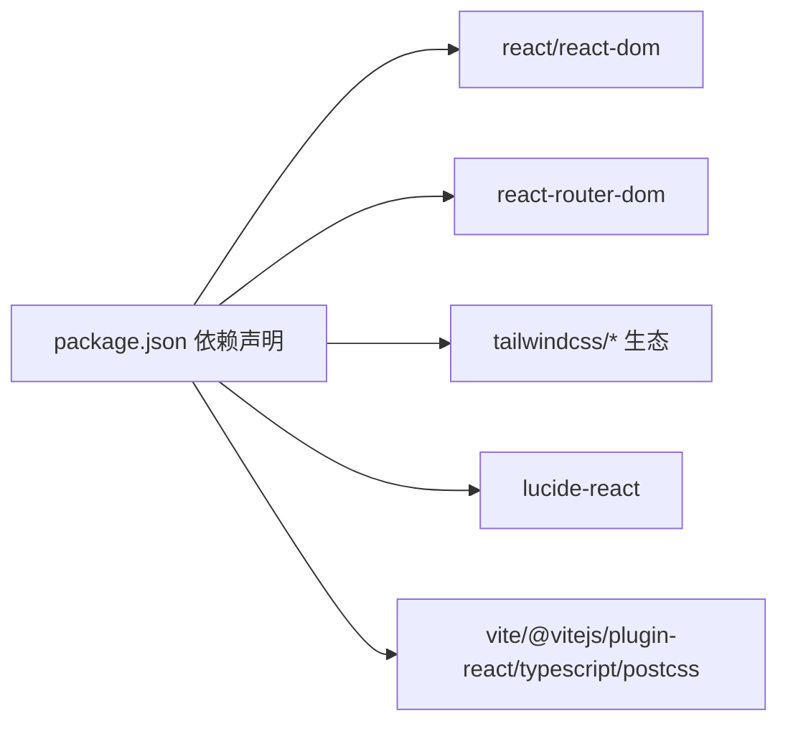

# 架构设计

<cite>
**本文引用的文件**
- [App.tsx](file://lienpet-website/src/App.tsx)
- [main.tsx](file://lienpet-website/src/main.tsx)
- [package.json](file://lienpet-website/package.json)
- [tailwind.config.ts](file://lienpet-website/tailwind.config.ts)
- [vite.config.ts](file://lienpet-website/vite.config.ts)
- [useStore.tsx](file://lienpet-website/src/store/useStore.tsx)
- [Header.tsx](file://lienpet-website/src/components/Header.tsx)
- [Footer.tsx](file://lienpet-website/src/components/Footer.tsx)
- [HomePage.tsx](file://lienpet-website/src/pages/HomePage.tsx)
- [utils.ts](file://lienpet-website/src/lib/utils.ts)
- [categories.ts](file://lienpet-website/src/data/categories.ts)
- [button.tsx](file://lienpet-website/src/components/ui/button.tsx)
- [card.tsx](file://lienpet-website/src/components/ui/card.tsx)
- [ProductCard.tsx](file://lienpet-website/src/components/ProductCard.tsx)
- [ToastContainer.tsx](file://lienpet-website/src/components/ToastContainer.tsx)
</cite>

## 目录
1. [引言](#引言)
2. [项目结构](#项目结构)
3. [核心组件](#核心组件)
4. [架构总览](#架构总览)
5. [详细组件分析](#详细组件分析)
6. [依赖分析](#依赖分析)
7. [性能考量](#性能考量)
8. [故障排查指南](#故障排查指南)
9. [结论](#结论)
10. [附录](#附录)

## 引言
本文件为 LienPet 单页应用的架构设计文档，聚焦于组件化设计模式、状态管理模式与路由系统设计；深入解析 React 18 并发特性在项目中的利用方式、TypeScript 类型系统的设计理念以及 Tailwind CSS 原子化样式带来的架构优势。文档同时对项目的分层结构进行剖析：表现层（UI 组件）、业务层（状态管理）、数据层（类型定义），并给出技术选型与架构决策的权衡考量，最后提供系统边界、组件交互关系图与数据流向图。

## 项目结构
LienPet 采用基于功能域的组织方式，结合 Vite + React 18 的现代前端工程化实践。项目根目录下包含应用入口、页面、组件、状态管理、工具库与数据模型等模块。通过路径别名与构建配置，确保开发体验与可维护性。

图表来源
- [main.tsx:1-10](file://lienpet-website/src/main.tsx#L1-L10)
- [App.tsx:1-37](file://lienpet-website/src/App.tsx#L1-L37)
- [useStore.tsx:1-100](file://lienpet-website/src/store/useStore.tsx#L1-L100)
- [HomePage.tsx:1-152](file://lienpet-website/src/pages/HomePage.tsx#L1-L152)
- [ProductCard.tsx:1-51](file://lienpet-website/src/components/ProductCard.tsx#L1-L51)
- [Header.tsx:1-93](file://lienpet-website/src/components/Header.tsx#L1-L93)
- [Footer.tsx:1-71](file://lienpet-website/src/components/Footer.tsx#L1-L71)
- [ToastContainer.tsx:1-28](file://lienpet-website/src/components/ToastContainer.tsx#L1-L28)
- [button.tsx:1-49](file://lienpet-website/src/components/ui/button.tsx#L1-L49)
- [card.tsx:1-50](file://lienpet-website/src/components/ui/card.tsx#L1-L50)
- [categories.ts:1-244](file://lienpet-website/src/data/categories.ts#L1-L244)
- [utils.ts:1-6](file://lienpet-website/src/lib/utils.ts#L1-L6)
- [tailwind.config.ts:1-106](file://lienpet-website/tailwind.config.ts#L1-L106)
- [vite.config.ts:1-12](file://lienpet-website/vite.config.ts#L1-L12)
- [package.json:1-31](file://lienpet-website/package.json#L1-L31)

章节来源
- [main.tsx:1-10](file://lienpet-website/src/main.tsx#L1-L10)
- [App.tsx:1-37](file://lienpet-website/src/App.tsx#L1-L37)
- [vite.config.ts:1-12](file://lienpet-website/vite.config.ts#L1-L12)
- [package.json:1-31](file://lienpet-website/package.json#L1-L31)

## 核心组件
- 应用根组件与路由：应用根组件负责包裹路由与全局状态提供者，并在顶层渲染头部、底部与通知容器，页面内容通过路由切换。
- 状态管理：自定义 Hook 提供产品收藏、消息与提示等状态，集中管理业务数据与副作用。
- UI 组件：按钮与卡片组件通过变体系统与原子类组合实现一致的视觉与交互规范。
- 数据模型：明确的产品、分类、消息类型定义，支撑页面渲染与业务逻辑。

章节来源
- [App.tsx:1-37](file://lienpet-website/src/App.tsx#L1-L37)
- [useStore.tsx:1-100](file://lienpet-website/src/store/useStore.tsx#L1-L100)
- [button.tsx:1-49](file://lienpet-website/src/components/ui/button.tsx#L1-L49)
- [card.tsx:1-50](file://lienpet-website/src/components/ui/card.tsx#L1-L50)
- [categories.ts:1-244](file://lienpet-website/src/data/categories.ts#L1-L244)

## 架构总览
LienPet 采用“路由驱动 + 全局状态 + 组合式 UI”的单页应用架构。路由负责页面级视图切换，全局状态提供者统一管理业务数据与用户反馈，UI 组件通过变体与原子类实现一致风格。Tailwind CSS 的原子化与主题变量体系，使样式具备高可组合性与低耦合性。

图表来源
- [App.tsx:1-37](file://lienpet-website/src/App.tsx#L1-L37)
- [useStore.tsx:1-100](file://lienpet-website/src/store/useStore.tsx#L1-L100)
- [HomePage.tsx:1-152](file://lienpet-website/src/pages/HomePage.tsx#L1-L152)
- [button.tsx:1-49](file://lienpet-website/src/components/ui/button.tsx#L1-L49)
- [card.tsx:1-50](file://lienpet-website/src/components/ui/card.tsx#L1-L50)
- [tailwind.config.ts:1-106](file://lienpet-website/tailwind.config.ts#L1-L106)

## 详细组件分析

### 路由与应用边界
- 应用根组件使用路由容器包裹，定义多条静态路由，覆盖首页、商品列表、详情、收藏、反馈与联系页面。
- 应用边界清晰：顶层仅负责布局与状态注入，页面组件专注于自身业务逻辑。

图表来源
- [App.tsx:1-37](file://lienpet-website/src/App.tsx#L1-L37)
- [Header.tsx:1-93](file://lienpet-website/src/components/Header.tsx#L1-L93)
- [Footer.tsx:1-71](file://lienpet-website/src/components/Footer.tsx#L1-L71)
- [ToastContainer.tsx:1-28](file://lienpet-website/src/components/ToastContainer.tsx#L1-L28)

章节来源
- [App.tsx:1-37](file://lienpet-website/src/App.tsx#L1-L37)

### 状态管理与并发特性
- 自定义状态提供者集中管理产品、消息与提示三类状态，通过回调函数暴露操作接口，避免深层传递。
- 使用 React 18 的并发特性：严格模式下的并发渲染、自动批处理与 Suspense 预留能力，提升交互流畅度与首屏性能。
- 通过 useCallback 缓存回调，减少子组件重渲染，配合细粒度状态拆分降低更新范围。

图表来源
- [useStore.tsx:1-100](file://lienpet-website/src/store/useStore.tsx#L1-L100)
- [ToastContainer.tsx:1-28](file://lienpet-website/src/components/ToastContainer.tsx#L1-L28)

章节来源
- [useStore.tsx:1-100](file://lienpet-website/src/store/useStore.tsx#L1-L100)

### UI 组件与原子化样式
- 按钮与卡片组件采用变体系统与原子类组合，统一尺寸、颜色与过渡效果，便于扩展与复用。
- 工具函数整合类名合并与冲突修复，保证样式链路稳定。
- 主题配置支持暗色模式、品牌色系与动画变体，满足品牌一致性与交互细节。

图表来源
- [button.tsx:1-49](file://lienpet-website/src/components/ui/button.tsx#L1-L49)
- [card.tsx:1-50](file://lienpet-website/src/components/ui/card.tsx#L1-L50)
- [utils.ts:1-6](file://lienpet-website/src/lib/utils.ts#L1-L6)

章节来源
- [button.tsx:1-49](file://lienpet-website/src/components/ui/button.tsx#L1-L49)
- [card.tsx:1-50](file://lienpet-website/src/components/ui/card.tsx#L1-L50)
- [utils.ts:1-6](file://lienpet-website/src/lib/utils.ts#L1-L6)
- [tailwind.config.ts:1-106](file://lienpet-website/tailwind.config.ts#L1-L106)

### 页面与数据模型
- 首页聚合展示分类、精选商品与联系方式，通过链接跳转至对应页面。
- 商品卡组件在点击收藏时调用全局状态方法，实现无感知更新与提示反馈。
- 数据模型定义清晰的接口，保障类型安全与可维护性。

图表来源
- [Header.tsx:1-93](file://lienpet-website/src/components/Header.tsx#L1-L93)
- [ProductCard.tsx:1-51](file://lienpet-website/src/components/ProductCard.tsx#L1-L51)
- [useStore.tsx:1-100](file://lienpet-website/src/store/useStore.tsx#L1-L100)
- [ToastContainer.tsx:1-28](file://lienpet-website/src/components/ToastContainer.tsx#L1-L28)

章节来源
- [HomePage.tsx:1-152](file://lienpet-website/src/pages/HomePage.tsx#L1-L152)
- [ProductCard.tsx:1-51](file://lienpet-website/src/components/ProductCard.tsx#L1-L51)
- [categories.ts:1-244](file://lienpet-website/src/data/categories.ts#L1-L244)

## 依赖分析
- 运行时依赖：React 18、React Router DOM、Tailwind 生态与图标库，构成应用核心运行环境。
- 开发依赖：Vite、React 插件、PostCSS、Tailwind CSS、TypeScript，提供现代化构建与类型检查能力。
- 路径别名：通过 Vite 别名简化导入路径，提升可读性与迁移成本控制。

图表来源
- [package.json:1-31](file://lienpet-website/package.json#L1-L31)
- [vite.config.ts:1-12](file://lienpet-website/vite.config.ts#L1-L12)

章节来源
- [package.json:1-31](file://lienpet-website/package.json#L1-L31)
- [vite.config.ts:1-12](file://lienpet-website/vite.config.ts#L1-L12)

## 性能考量
- 并发渲染与自动批处理：利用 React 18 的并发特性，减少长任务阻塞，提升交互响应速度。
- 细粒度状态与回调缓存：通过 useCallback 缓存回调，避免子组件不必要重渲染。
- 原子化样式与主题变量：Tailwind 原子类减少重复样式定义，主题变量统一视觉语言，降低打包体积与样式冲突风险。
- 图片懒加载与过渡动画：页面中使用懒加载与轻量动画，平衡视觉体验与性能开销。

## 故障排查指南
- 路由无法匹配：确认路由路径与页面组件注册是否一致，检查根组件包裹是否正确。
- 收藏状态不同步：检查全局状态提供者是否被正确注入，组件内是否使用了正确的 Hook。
- 样式异常：核对 Tailwind 配置与类名拼接逻辑，确保工具函数正确合并类名。
- 构建失败：检查 Vite 别名与 TypeScript 配置，确保路径解析与类型检查正常。

## 结论
LienPet 通过 React 18 的并发能力、TypeScript 的强类型约束与 Tailwind CSS 的原子化样式，构建出高可维护、高性能且易扩展的单页应用。路由、状态与 UI 的分层设计清晰，组件间职责明确，适合在中大型前端项目中推广与演进。

## 附录
- 技术栈与版本：React 18、React Router DOM、Tailwind CSS、Lucide React、Vite、TypeScript。
- 构建与预览：通过 Vite 提供开发服务器与生产构建，TypeScript 负责类型检查与编译。