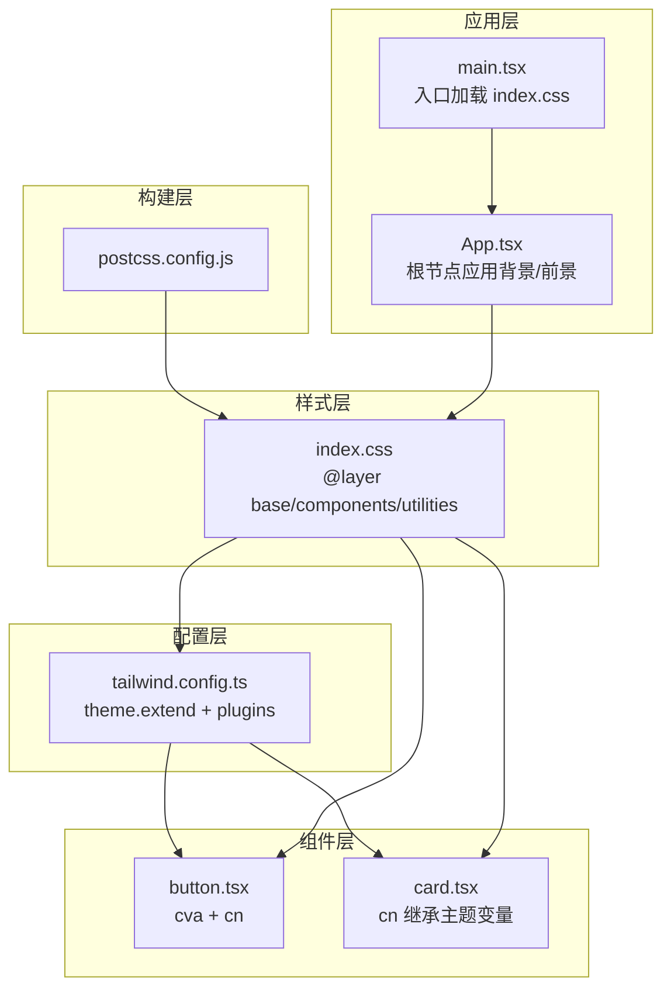
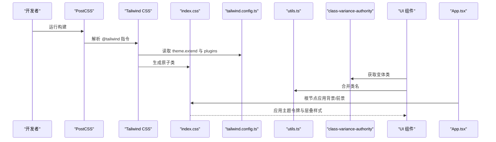
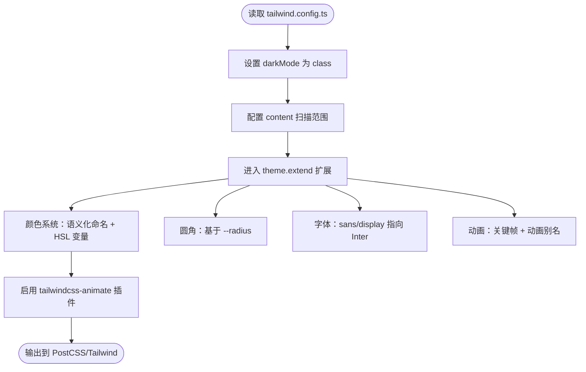
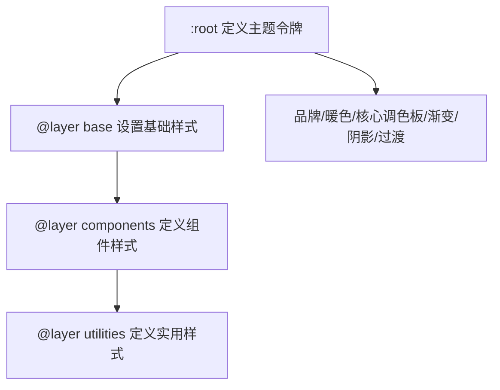
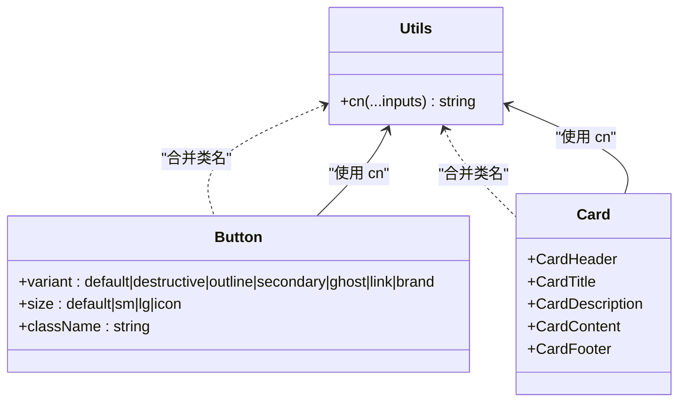
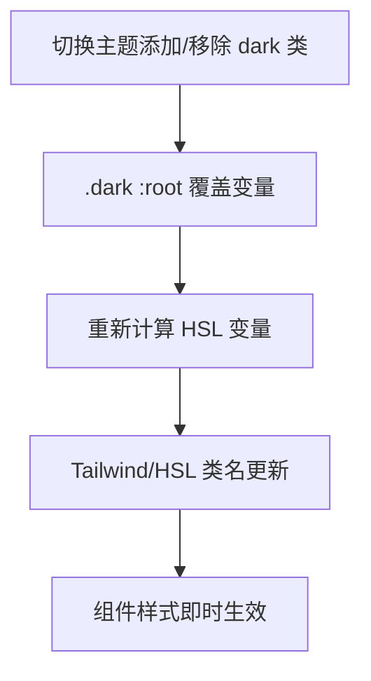
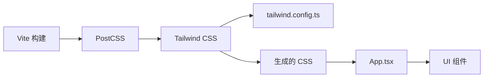

# 样式与主题系统

<cite>
**本文档引用的文件**
- [tailwind.config.ts](file://lienpet-website/tailwind.config.ts)
- [index.css](file://lienpet-website/src/index.css)
- [utils.ts](file://lienpet-website/src/lib/utils.ts)
- [button.tsx](file://lienpet-website/src/components/ui/button.tsx)
- [card.tsx](file://lienpet-website/src/components/ui/card.tsx)
- [postcss.config.js](file://lienpet-website/postcss.config.js)
- [package.json](file://lienpet-website/package.json)
- [useStore.tsx](file://lienpet-website/src/store/useStore.tsx)
- [App.tsx](file://lienpet-website/src/App.tsx)
- [main.tsx](file://lienpet-website/src/main.tsx)
</cite>

## 目录
1. [简介](#简介)
2. [项目结构](#项目结构)
3. [核心组件](#核心组件)
4. [架构总览](#架构总览)
5. [详细组件分析](#详细组件分析)
6. [依赖关系分析](#依赖关系分析)
7. [性能考量](#性能考量)
8. [故障排除指南](#故障排除指南)
9. [结论](#结论)
10. [附录](#附录)

## 简介
本文件系统性阐述 LienPet 项目的样式与主题系统，围绕 Tailwind CSS 3.4.17 的原子化样式架构展开，重点覆盖以下方面：
- 自定义主题配置：颜色系统、圆角半径、字体族、动画与过渡
- 基于 CSS 变量的主题继承机制与暗色模式策略
- 类名合并工具函数与 CSS-in-JS 实现（class-variance-authority）
- 响应式设计原则与跨浏览器兼容性
- 主题切换策略与扩展指南，以及设计系统最佳实践

## 项目结构
样式与主题系统由以下层次构成：
- 构建层：PostCSS 配置启用 Tailwind 和 Autoprefixer
- 样式层：全局 CSS 使用 @tailwind 指令与多层（base/components/utilities）组织，并通过 CSS 变量定义主题令牌
- 配置层：tailwind.config.ts 扩展颜色、圆角、字体、动画等
- 组件层：UI 组件采用 class-variance-authority 定义变体，结合 cn 合并工具生成最终类名
- 应用层：应用根节点应用基础背景与前景色，承载路由与页面

**图表来源**
- [postcss.config.js:1-6](file://lienpet-website/postcss.config.js#L1-L6)
- [index.css:1-115](file://lienpet-website/src/index.css#L1-L115)
- [tailwind.config.ts:1-106](file://lienpet-website/tailwind.config.ts#L1-L106)
- [button.tsx:1-49](file://lienpet-website/src/components/ui/button.tsx#L1-L49)
- [card.tsx:1-50](file://lienpet-website/src/components/ui/card.tsx#L1-L50)
- [App.tsx:13-32](file://lienpet-website/src/App.tsx#L13-L32)
- [main.tsx:1-10](file://lienpet-website/src/main.tsx#L1-L10)

**章节来源**
- [postcss.config.js:1-6](file://lienpet-website/postcss.config.js#L1-L6)
- [index.css:1-115](file://lienpet-website/src/index.css#L1-L115)
- [tailwind.config.ts:1-106](file://lienpet-website/tailwind.config.ts#L1-L106)
- [App.tsx:13-32](file://lienpet-website/src/App.tsx#L13-L32)
- [main.tsx:1-10](file://lienpet-website/src/main.tsx#L1-L10)

## 核心组件
- Tailwind 配置与主题扩展
  - 暗色模式：class 选择器，配合 CSS 变量在 :root 与 .dark 中切换
  - 颜色系统：基于 HSL 变量的语义化命名（如 --background、--foreground、--primary、--brand、--warm）
  - 圆角：通过 CSS 变量 --radius 控制层级
  - 字体：sans 与 display 字体族，均指向 Inter
  - 动画：扩展 accordion、fade-in、slide-in-right、scale-in 等关键帧与动画
- 全局样式与主题令牌
  - 在 @layer base 中定义 :root 主题令牌，包含品牌色、暖色、卡片、弹出层、主要/次要、静音、强调、破坏性、边框、输入、环形高亮、渐变、阴影与过渡
  - 在 @layer components 定义可复用的样式类（如品牌/暖色渐变、阴影、过渡）
  - 在 @layer utilities 定义文本平衡与滚动条隐藏等实用类
- 类名合并与变体系统
  - 工具函数 cn：封装 clsx 与 tailwind-merge，确保类名冲突时正确合并
  - 组件变体：button.tsx 使用 class-variance-authority 定义多种变体与尺寸，自动继承主题色
  - 卡片组件：直接继承主题变量，保持一致的边框、背景与阴影
- 应用根节点
  - App.tsx 根容器应用最小高度、背景与前景色，保证全站主题一致性

**章节来源**
- [tailwind.config.ts:3-106](file://lienpet-website/tailwind.config.ts#L3-L106)
- [index.css:7-115](file://lienpet-website/src/index.css#L7-L115)
- [utils.ts:1-6](file://lienpet-website/src/lib/utils.ts#L1-L6)
- [button.tsx:1-49](file://lienpet-website/src/components/ui/button.tsx#L1-L49)
- [card.tsx:1-50](file://lienpet-website/src/components/ui/card.tsx#L1-L50)
- [App.tsx:17-17](file://lienpet-website/src/App.tsx#L17-L17)

## 架构总览
下图展示从构建到运行时的主题与样式链路：

**图表来源**
- [postcss.config.js:1-6](file://lienpet-website/postcss.config.js#L1-L6)
- [tailwind.config.ts:1-106](file://lienpet-website/tailwind.config.ts#L1-L106)
- [index.css:1-3](file://lienpet-website/src/index.css#L1-L3)
- [utils.ts:4-6](file://lienpet-website/src/lib/utils.ts#L4-L6)
- [button.tsx:2-30](file://lienpet-website/src/components/ui/button.tsx#L2-L30)
- [App.tsx:17-17](file://lienpet-website/src/App.tsx#L17-L17)

## 详细组件分析

### Tailwind 配置与主题扩展
- 配置要点
  - 暗色模式：class 模式，便于通过根元素添加 dark 类进行切换
  - 内容扫描：扫描 HTML 与 TSX 文件，按需生成类
  - 主题扩展：
    - 颜色：语义化命名（border/input/ring/background/foreground/primary/secondary/destructive/muted/accent/popover/card），值均为 HSL 变量，与 CSS 变量一一对应
    - 圆角：基于 --radius 变量，提供 lg/md/sm 三档
    - 字体：sans 与 display 均指向 Inter
    - 动画：扩展多个关键帧与动画，用于折叠面板、淡入、滑入、缩放等交互
  - 插件：tailwindcss-animate 提供便捷动画类
- 设计意图
  - 将设计令牌集中于 CSS 变量，通过 Tailwind 的 HSL 变量桥接，实现“设计令牌 → 主题变量 → 原子类”的单向流动
  - 通过 class-variance-authority 与 cn，组件层面以“语义变体”驱动，避免硬编码颜色与尺寸

**图表来源**
- [tailwind.config.ts:3-106](file://lienpet-website/tailwind.config.ts#L3-L106)

**章节来源**
- [tailwind.config.ts:3-106](file://lienpet-website/tailwind.config.ts#L3-L106)

### 全局样式与主题令牌
- 主题令牌定义
  - 在 :root 中定义品牌绿、暖棕、核心调色板、卡片、弹出层、主要/次要、静音、强调、破坏性、边框、输入、环形高亮、圆角、渐变、阴影与过渡
- 层级组织
  - base：重置边框、设置 body 背景/文字/字体、标题字重
  - components：品牌/暖色渐变、阴影、过渡等可复用样式
  - utilities：文本平衡、滚动条隐藏等实用类
- 响应式与可访问性
  - 使用 antialiased 与合理的字体族提升可读性
  - 通过圆角与阴影变量统一视觉层级

**图表来源**
- [index.css:7-115](file://lienpet-website/src/index.css#L7-L115)

**章节来源**
- [index.css:7-115](file://lienpet-website/src/index.css#L7-L115)

### 类名合并与变体系统（CSS-in-JS）
- 工具函数 cn
  - 封装 clsx 与 tailwind-merge，确保传入多个 ClassValue 时去重与优先级正确
- 组件变体（按钮）
  - 使用 class-variance-authority 定义多种变体（默认/破坏/描边/次要/幽影/链接/品牌）与尺寸（默认/小/大/图标）
  - 自动继承主题变量（如 bg-primary/text-primary-foreground），无需在组件内重复写颜色
- 卡片组件
  - 直接继承 border/bg-card/text-card-foreground/shadow-sm 等主题变量，保证风格一致

**图表来源**
- [utils.ts:4-6](file://lienpet-website/src/lib/utils.ts#L4-L6)
- [button.tsx:2-30](file://lienpet-website/src/components/ui/button.tsx#L2-L30)
- [card.tsx:2-12](file://lienpet-website/src/components/ui/card.tsx#L2-L12)

**章节来源**
- [utils.ts:1-6](file://lienpet-website/src/lib/utils.ts#L1-L6)
- [button.tsx:1-49](file://lienpet-website/src/components/ui/button.tsx#L1-L49)
- [card.tsx:1-50](file://lienpet-website/src/components/ui/card.tsx#L1-L50)

### 暗色模式与主题切换策略
- 当前实现
  - tailwind.config.ts 启用 darkMode: ["class"]，未在仓库中发现 .dark 选择器或切换逻辑代码
  - index.css 未定义 :is(.dark :root) 或其他暗色模式变量覆盖
- 切换策略建议
  - 在根元素上切换 "dark" 类（例如通过本地存储或用户偏好）
  - 在 :root 下为 .dark 状态提供变量覆盖，形成明/暗两套令牌
  - 对需要反转对比度的组件（如卡片、弹出层）提供额外覆盖
- 影响范围
  - 所有使用 HSL 变量的颜色类（bg-foreground/text-background 等）会随 :root 变量变化而变化
  - 渐变、阴影与过渡变量同样受 :root/.dark 影响

[本节为策略建议，不直接分析具体文件，故无“章节来源”]

### 响应式设计原则
- 断点与容器
  - 容器居中与最大宽度约束，确保内容在大屏下的可读性与对齐
- 字体与排版
  - 使用 sans 与 display 字体族，标题字重与行高统一
- 交互反馈
  - 通过扩展动画（淡入、滑入、缩放）与过渡变量增强可用性
- 可访问性
  - 使用 antialiased、语义化标题标签与对比度良好的前景/背景组合

**章节来源**
- [tailwind.config.ts:10-17](file://lienpet-website/tailwind.config.ts#L10-L17)
- [index.css:68-78](file://lienpet-website/src/index.css#L68-L78)
- [index.css:96-101](file://lienpet-website/src/index.css#L96-L101)

### 跨浏览器兼容性
- PostCSS 配置
  - 启用 Autoprefixer，自动为 CSS 属性添加厂商前缀
- 字体与属性
  - 字体通过 Google Fonts 引入，属性如 text-wrap、-ms-overflow-style、scrollbar-width 等已做兼容处理
- 建议
  - 在新特性（如某些 CSS 变量或动画）上线前，使用 Autoprefixer 与测试环境验证

**章节来源**
- [postcss.config.js:1-6](file://lienpet-website/postcss.config.js#L1-L6)
- [index.css:5](file://lienpet-website/src/index.css#L5-L5)
- [index.css:104-115](file://lienpet-website/src/index.css#L104-L115)

## 依赖关系分析
- 外部依赖
  - Tailwind CSS 3.4.17、tailwindcss-animate、clsx、tailwind-merge、class-variance-authority
- 构建链路
  - Vite 通过 PostCSS 加载 Tailwind 与 Autoprefixer，再由 Tailwind 读取 tailwind.config.ts 并生成原子类
- 运行时链路
  - index.css 在入口加载，App.tsx 根节点应用背景/前景，组件通过 cn 与变体系统消费主题变量

**图表来源**
- [package.json:11-30](file://lienpet-website/package.json#L11-L30)
- [postcss.config.js:1-6](file://lienpet-website/postcss.config.js#L1-L6)
- [tailwind.config.ts:1-106](file://lienpet-website/tailwind.config.ts#L1-L106)
- [main.tsx:1-10](file://lienpet-website/src/main.tsx#L1-L10)
- [App.tsx:13-32](file://lienpet-website/src/App.tsx#L13-L32)

**章节来源**
- [package.json:11-30](file://lienpet-website/package.json#L11-L30)
- [postcss.config.js:1-6](file://lienpet-website/postcss.config.js#L1-L6)
- [tailwind.config.ts:1-106](file://lienpet-website/tailwind.config.ts#L1-L106)
- [main.tsx:1-10](file://lienpet-website/src/main.tsx#L1-L10)
- [App.tsx:13-32](file://lienpet-website/src/App.tsx#L13-L32)

## 性能考量
- 按需生成
  - content 配置仅扫描必要文件，减少无关类生成
- 类名合并
  - 使用 tailwind-merge 避免重复类导致的体积膨胀
- 动画与过渡
  - 关键帧与动画数量适中，避免过度复杂动画影响渲染性能
- 字体加载
  - 通过 Google Fonts 引入 Inter，建议在生产环境考虑字体预加载策略

[本节为通用指导，不直接分析具体文件，故无“章节来源”]

## 故障排除指南
- 类名冲突或样式异常
  - 检查是否正确使用 cn 合并类名，避免重复传入相同类
  - 确认 tailwind.config.ts 中的 theme.extend 是否与组件变体一致
- 暗色模式无效
  - 确认根元素存在 dark 类，且 :root/.dark 下的变量覆盖已生效
- 动画不生效
  - 检查 tailwindcss-animate 插件是否启用，keyframes 与 animation 名称是否匹配
- 字体显示异常
  - 确认 Google Fonts 链接可达，或替换为本地字体资源

**章节来源**
- [utils.ts:4-6](file://lienpet-website/src/lib/utils.ts#L4-L6)
- [tailwind.config.ts:103](file://lienpet-website/tailwind.config.ts#L103)
- [index.css:5](file://lienpet-website/src/index.css#L5-L5)

## 结论
LienPet 的样式与主题系统以 Tailwind CSS 为核心，结合 CSS 变量与 class-variance-authority，实现了“设计令牌 → 主题变量 → 原子类 → 组件变体”的清晰链路。该体系具备良好的可维护性与扩展性，建议后续完善暗色模式的变量覆盖与切换逻辑，并持续优化动画与字体加载策略。

## 附录
- 设计系统最佳实践
  - 以语义化命名为主，避免“视觉命名”
  - 将设计令牌集中管理，优先通过 CSS 变量与 Tailwind HSL 变量传递
  - 组件变体应聚焦功能维度（如尺寸、状态、强调），而非视觉细节
  - 使用 cn 与 tailwind-merge 统一类名合并策略
  - 为暗色模式预留变量覆盖方案，并在根元素上提供切换入口

[本节为通用指导，不直接分析具体文件，故无“章节来源”]