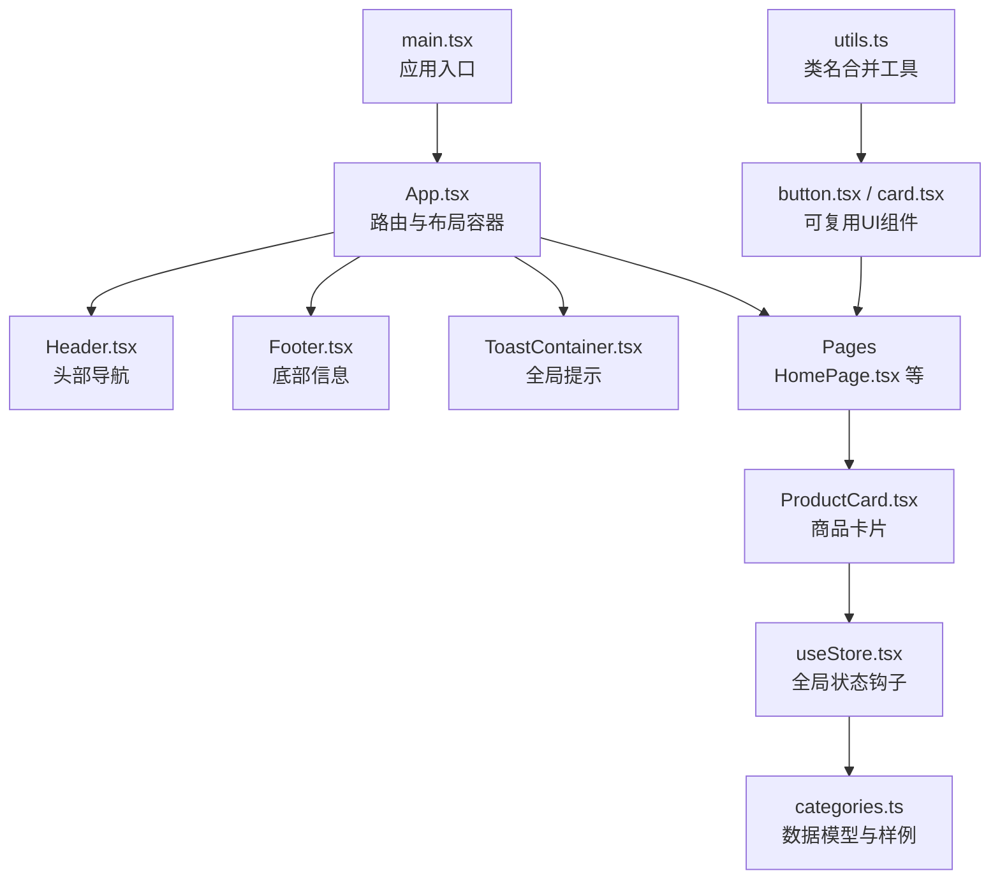
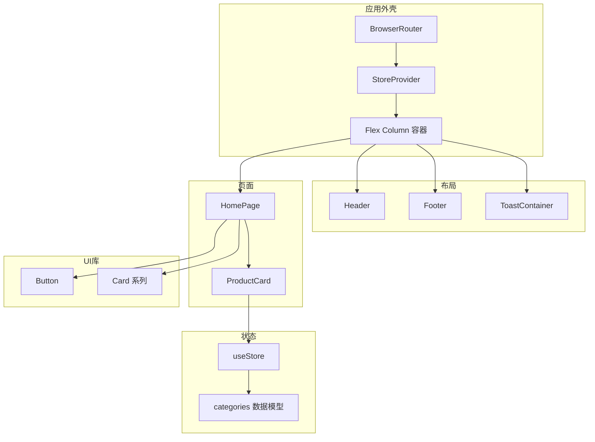
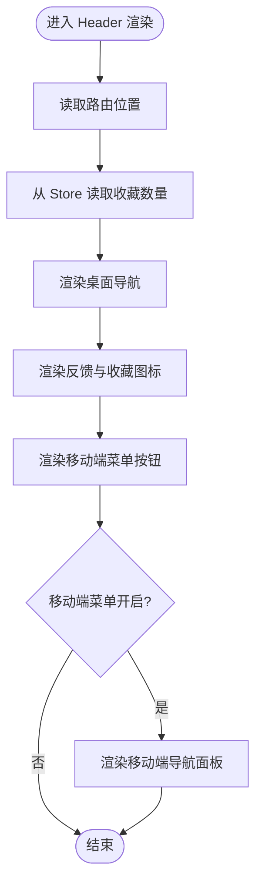
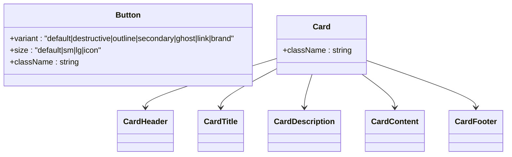
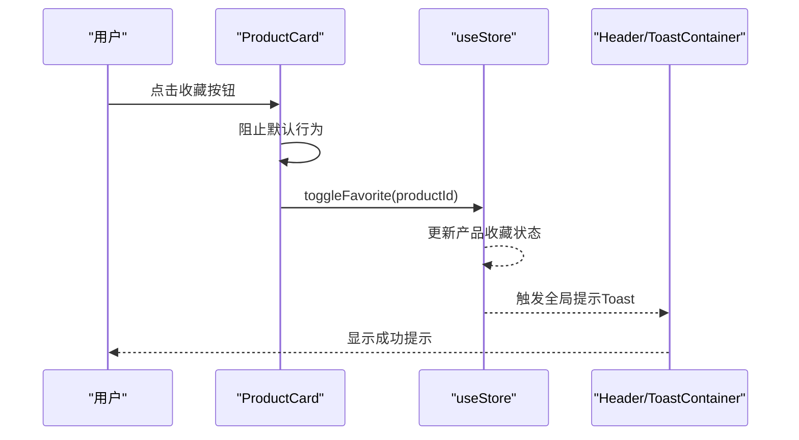
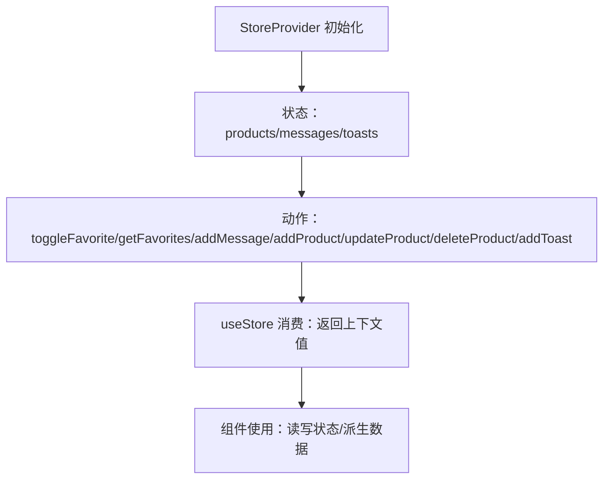
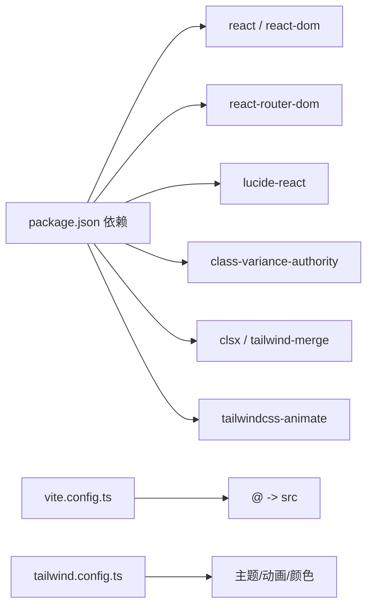

# 组件架构设计

<cite>
**本文引用的文件**
- [App.tsx](file://lienpet-website/src/App.tsx)
- [main.tsx](file://lienpet-website/src/main.tsx)
- [Header.tsx](file://lienpet-website/src/components/Header.tsx)
- [Footer.tsx](file://lienpet-website/src/components/Footer.tsx)
- [button.tsx](file://lienpet-website/src/components/ui/button.tsx)
- [card.tsx](file://lienpet-website/src/components/ui/card.tsx)
- [useStore.tsx](file://lienpet-website/src/store/useStore.tsx)
- [utils.ts](file://lienpet-website/src/lib/utils.ts)
- [ProductCard.tsx](file://lienpet-website/src/components/ProductCard.tsx)
- [HomePage.tsx](file://lienpet-website/src/pages/HomePage.tsx)
- [categories.ts](file://lienpet-website/src/data/categories.ts)
- [ToastContainer.tsx](file://lienpet-website/src/components/ToastContainer.tsx)
- [package.json](file://lienpet-website/package.json)
- [vite.config.ts](file://lienpet-website/vite.config.ts)
- [tailwind.config.ts](file://lienpet-website/tailwind.config.ts)
</cite>

## 目录
1. [引言](#引言)
2. [项目结构](#项目结构)
3. [核心组件](#核心组件)
4. [架构总览](#架构总览)
5. [详细组件分析](#详细组件分析)
6. [依赖关系分析](#依赖关系分析)
7. [性能考量](#性能考量)
8. [故障排查指南](#故障排查指南)
9. [结论](#结论)
10. [附录](#附录)

## 引言
本文件系统性梳理 LienPet 项目的组件架构设计，围绕基于 React 18 的函数组件理念，阐述组件层次结构与组件间通信模式；重点解析 Header、Footer 等布局组件的设计取舍，以及可复用 UI 组件（Button、Card）的抽象设计；总结 Props 传递模式、事件处理机制、生命周期管理、性能优化策略与可维护性建议，并通过具体文件路径指引最佳实践。

## 项目结构
LienPet 采用按功能域组织的目录结构：components（布局与通用 UI）、pages（页面级容器）、store（全局状态）、data（数据模型与样例）、lib（工具方法）、public/images（静态资源）。入口在 main.tsx 中挂载 App，在 App 中装配路由、全局 Provider 与布局组件。

图表来源
- [main.tsx:1-10](file://lienpet-website/src/main.tsx#L1-L10)
- [App.tsx:1-37](file://lienpet-website/src/App.tsx#L1-L37)
- [Header.tsx:1-93](file://lienpet-website/src/components/Header.tsx#L1-L93)
- [Footer.tsx:1-71](file://lienpet-website/src/components/Footer.tsx#L1-L71)
- [ToastContainer.tsx:1-28](file://lienpet-website/src/components/ToastContainer.tsx#L1-L28)
- [HomePage.tsx:1-152](file://lienpet-website/src/pages/HomePage.tsx#L1-L152)
- [ProductCard.tsx:1-51](file://lienpet-website/src/components/ProductCard.tsx#L1-L51)
- [useStore.tsx:1-100](file://lienpet-website/src/store/useStore.tsx#L1-L100)
- [categories.ts:1-244](file://lienpet-website/src/data/categories.ts#L1-L244)
- [button.tsx:1-49](file://lienpet-website/src/components/ui/button.tsx#L1-L49)
- [card.tsx:1-50](file://lienpet-website/src/components/ui/card.tsx#L1-L50)
- [utils.ts:1-6](file://lienpet-website/src/lib/utils.ts#L1-L6)

章节来源
- [main.tsx:1-10](file://lienpet-website/src/main.tsx#L1-L10)
- [App.tsx:1-37](file://lienpet-website/src/App.tsx#L1-L37)

## 核心组件
- 布局组件
  - Header：负责品牌 Logo、导航、移动端菜单、收藏数量徽标与反馈入口，使用路由位置高亮当前页签，内部状态控制移动端菜单开关。
  - Footer：提供快速链接、联系方式、关注方式与版权信息，网格布局适配多列。
- 可复用 UI 组件
  - Button：通过变体与尺寸的变体工厂实现统一风格，支持 forwardRef 透传 DOM 属性。
  - Card：组合式卡片容器，包含头部、标题、描述、内容、尾部等子组件，便于语义化与样式扩展。
- 页面组件
  - HomePage：首页聚合轮播、分类网格、精选商品、联系区块与按钮，使用 Button 与 ProductCard。
  - ProductCard：展示商品图片、标题、简介、价格与收藏按钮，调用全局状态切换收藏。
- 全局状态
  - useStore：集中管理产品、消息、收藏、提示等状态，提供增删改查与吐司提示能力，使用 Context 提供给子树消费。
- 工具与样式
  - utils/cn：类名合并工具，结合 Tailwind Merge 实现冲突覆盖。
  - Tailwind 配置：主题色板、圆角、字体、动画等扩展，配合组件内 className 使用。

章节来源
- [Header.tsx:1-93](file://lienpet-website/src/components/Header.tsx#L1-L93)
- [Footer.tsx:1-71](file://lienpet-website/src/components/Footer.tsx#L1-L71)
- [button.tsx:1-49](file://lienpet-website/src/components/ui/button.tsx#L1-L49)
- [card.tsx:1-50](file://lienpet-website/src/components/ui/card.tsx#L1-L50)
- [HomePage.tsx:1-152](file://lienpet-website/src/pages/HomePage.tsx#L1-L152)
- [ProductCard.tsx:1-51](file://lienpet-website/src/components/ProductCard.tsx#L1-L51)
- [useStore.tsx:1-100](file://lienpet-website/src/store/useStore.tsx#L1-L100)
- [utils.ts:1-6](file://lienpet-website/src/lib/utils.ts#L1-L6)
- [tailwind.config.ts:1-106](file://lienpet-website/tailwind.config.ts#L1-L106)

## 架构总览
整体采用“页面容器 + 布局 + 可复用 UI + 全局状态”的分层设计。页面容器负责业务拼装与交互编排；布局组件负责跨页面一致的导航与信息展示；可复用 UI 组件提供一致的视觉与交互基线；全局状态通过 Context 抽象，避免跨层级 Props 下传。

图表来源
- [App.tsx:13-35](file://lienpet-website/src/App.tsx#L13-L35)
- [Header.tsx:6-93](file://lienpet-website/src/components/Header.tsx#L6-L93)
- [Footer.tsx:4-71](file://lienpet-website/src/components/Footer.tsx#L4-L71)
- [ToastContainer.tsx:4-28](file://lienpet-website/src/components/ToastContainer.tsx#L4-L28)
- [HomePage.tsx:8-152](file://lienpet-website/src/pages/HomePage.tsx#L8-L152)
- [ProductCard.tsx:10-51](file://lienpet-website/src/components/ProductCard.tsx#L10-L51)
- [button.tsx:32-49](file://lienpet-website/src/components/ui/button.tsx#L32-L49)
- [card.tsx:4-50](file://lienpet-website/src/components/ui/card.tsx#L4-L50)
- [useStore.tsx:27-100](file://lienpet-website/src/store/useStore.tsx#L27-L100)
- [categories.ts:19-38](file://lienpet-website/src/data/categories.ts#L19-L38)

## 详细组件分析

### Header 组件分析
- 设计要点
  - 使用路由 Hook 判断当前路径，动态高亮导航项。
  - 内部状态控制移动端菜单开合，响应式隐藏桌面端导航。
  - 从全局状态读取收藏列表长度，实时显示徽标。
  - 导航项与文案本地化，便于国际化扩展。
- Props 与事件
  - 无外部 Props 输入；通过点击事件切换移动端菜单状态。
- 生命周期与副作用
  - 无显式生命周期钩子；依赖路由位置变化触发重渲染。
- 性能与可维护性
  - 将导航项定义为常量数组，减少重复计算。
  - 使用 forwardRef 与 className 合并工具提升可定制性。

图表来源
- [Header.tsx:6-93](file://lienpet-website/src/components/Header.tsx#L6-L93)
- [useStore.tsx:48-50](file://lienpet-website/src/store/useStore.tsx#L48-L50)

章节来源
- [Header.tsx:1-93](file://lienpet-website/src/components/Header.tsx#L1-L93)
- [useStore.tsx:1-100](file://lienpet-website/src/store/useStore.tsx#L1-L100)

### Footer 组件分析
- 设计要点
  - 四列栅格布局，移动端自适应为单列。
  - 快速链接、联系方式、关注方式清晰分组。
  - 版权信息与年份动态生成。
- 可维护性
  - 使用 Link 统一跳转，便于后续路由调整。
  - 文案集中管理，利于本地化与更新。

章节来源
- [Footer.tsx:1-71](file://lienpet-website/src/components/Footer.tsx#L1-L71)

### Button 与 Card 组件分析
- Button
  - 通过变体工厂定义多种风格与尺寸，支持 className 扩展与 forwardRef。
  - 与 Tailwind 动画类配合，提供过渡与悬停效果。
- Card
  - 组合式子组件，语义清晰，便于在不同页面复用。
  - 通过 className 合并工具实现扩展与覆盖。

图表来源
- [button.tsx:32-49](file://lienpet-website/src/components/ui/button.tsx#L32-L49)
- [card.tsx:4-50](file://lienpet-website/src/components/ui/card.tsx#L4-L50)

章节来源
- [button.tsx:1-49](file://lienpet-website/src/components/ui/button.tsx#L1-L49)
- [card.tsx:1-50](file://lienpet-website/src/components/ui/card.tsx#L1-L50)
- [utils.ts:4-6](file://lienpet-website/src/lib/utils.ts#L4-L6)

### ProductCard 组件分析
- 职责分离
  - 展示层：渲染图片、标题、描述、价格与收藏按钮。
  - 交互层：点击收藏按钮切换收藏状态。
- Props 模式
  - 接收产品对象作为只读输入，避免在组件内修改外部数据。
- 事件处理
  - 收藏按钮阻止默认行为后调用全局状态切换收藏。
- 性能
  - 图片懒加载与缩略图占位，降低首屏压力。

图表来源
- [ProductCard.tsx:24-36](file://lienpet-website/src/components/ProductCard.tsx#L24-L36)
- [useStore.tsx:40-46](file://lienpet-website/src/store/useStore.tsx#L40-L46)
- [ToastContainer.tsx:4-28](file://lienpet-website/src/components/ToastContainer.tsx#L4-L28)

章节来源
- [ProductCard.tsx:1-51](file://lienpet-website/src/components/ProductCard.tsx#L1-L51)
- [useStore.tsx:1-100](file://lienpet-website/src/store/useStore.tsx#L1-L100)
- [ToastContainer.tsx:1-28](file://lienpet-website/src/components/ToastContainer.tsx#L1-L28)

### HomePage 组件分析
- 职责与组织
  - 负责首页内容区的拼装：Hero 区、分类网格、精选商品、联系区块。
  - 使用 Button 与 ProductCard，体现组件复用与一致性。
- 数据来源
  - 从全局状态读取产品列表，选取前若干条作为精选商品。
- 交互与样式
  - 使用 Link 统一跳转，配合动画类增强体验。

章节来源
- [HomePage.tsx:1-152](file://lienpet-website/src/pages/HomePage.tsx#L1-L152)
- [useStore.tsx:8-10](file://lienpet-website/src/store/useStore.tsx#L8-L10)

### 全局状态 useStore 分析
- 设计原则
  - Context 抽象：提供统一的状态访问入口，避免跨层级 Props。
  - 不可变更新：通过映射与过滤生成新数组，保持引用稳定。
  - 回调优化：使用 useCallback 缓存动作函数，减少子组件重渲染。
- 能力边界
  - 管理产品、消息、收藏、提示等；提供 CRUD 与派生查询（如收藏列表）。
- 错误处理
  - 访问钩子未包裹时抛出错误，强制正确使用。

图表来源
- [useStore.tsx:27-100](file://lienpet-website/src/store/useStore.tsx#L27-L100)

章节来源
- [useStore.tsx:1-100](file://lienpet-website/src/store/useStore.tsx#L1-L100)

## 依赖关系分析
- 运行时依赖
  - React 18、react-router-dom、lucide-react、class-variance-authority、clsx、tailwind-merge、tailwindcss-animate。
- 构建与工具
  - Vite、TailwindCSS、TypeScript、PostCSS。
- 路径别名
  - @ 指向 src，简化导入路径。

图表来源
- [package.json:11-20](file://lienpet-website/package.json#L11-L20)
- [vite.config.ts:5-12](file://lienpet-website/vite.config.ts#L5-L12)
- [tailwind.config.ts:18-100](file://lienpet-website/tailwind.config.ts#L18-L100)

章节来源
- [package.json:1-31](file://lienpet-website/package.json#L1-L31)
- [vite.config.ts:1-12](file://lienpet-website/vite.config.ts#L1-L12)
- [tailwind.config.ts:1-106](file://lienpet-website/tailwind.config.ts#L1-L106)

## 性能考量
- 渲染优化
  - 使用 useCallback 缓存动作函数，减少子组件重渲染。
  - 通过不可变更新策略，确保浅比较有效。
- 图像与交互
  - 商品图片懒加载，减少首屏带宽与内存占用。
  - 悬停缩放与过渡动画使用 CSS 类，避免 JS 动画阻塞。
- 状态粒度
  - 将 Toast 独立为容器组件，避免频繁重渲染主内容区域。
- 构建与打包
  - Vite 快速开发与按需打包，Tailwind 自动裁剪未使用样式。

## 故障排查指南
- 访问 useStore 报错
  - 现象：在未包裹 StoreProvider 的组件中调用 useStore 抛出异常。
  - 处理：确认根组件已包裹 StoreProvider。
  - 参考：[useStore.tsx:96-100](file://lienpet-website/src/store/useStore.tsx#L96-L100)
- Toast 不显示
  - 现象：调用添加提示但界面无反应。
  - 排查：确认 ToastContainer 已渲染且 Store 中 toasts 非空。
  - 参考：[ToastContainer.tsx:4-28](file://lienpet-website/src/components/ToastContainer.tsx#L4-L28)
- 收藏状态不更新
  - 现象：点击收藏按钮无变化。
  - 排查：检查 ProductCard 是否正确调用 toggleFavorite，确认产品 ID 有效。
  - 参考：[ProductCard.tsx:24-36](file://lienpet-website/src/components/ProductCard.tsx#L24-L36)，[useStore.tsx:40-46](file://lienpet-website/src/store/useStore.tsx#L40-L46)
- 路由跳转无效
  - 现象：Link 点击无响应或刷新页面。
  - 排查：确认 BrowserRouter 包裹根组件，路由路径正确。
  - 参考：[App.tsx:13-35](file://lienpet-website/src/App.tsx#L13-L35)

章节来源
- [useStore.tsx:96-100](file://lienpet-website/src/store/useStore.tsx#L96-L100)
- [ToastContainer.tsx:1-28](file://lienpet-website/src/components/ToastContainer.tsx#L1-L28)
- [ProductCard.tsx:1-51](file://lienpet-website/src/components/ProductCard.tsx#L1-L51)
- [App.tsx:1-37](file://lienpet-website/src/App.tsx#L1-L37)

## 结论
LienPet 的组件架构以函数组件为核心，通过布局组件统一视觉与交互，通过可复用 UI 组件保证一致性，通过全局状态上下文实现跨组件数据共享。该设计遵循职责分离、Props 单向流动与不可变更新原则，辅以工具函数与 Tailwind 扩展，兼顾性能与可维护性。建议在后续迭代中持续完善类型约束、测试覆盖与国际化文案管理。

## 附录
- 最佳实践清单
  - 使用 forwardRef 与 className 合并工具提升可定制性。
  - 将交互逻辑收敛到最小必要范围，避免过度渲染。
  - 通过 useCallback 缓存动作函数，减少子组件重渲染。
  - 使用 Link 统一路由跳转，保持导航一致性。
  - 在容器组件中进行数据拼装，展示组件专注渲染。