# 路由系统设计

<cite>
**本文档引用的文件**
- [App.tsx](file://lienpet-website/src/App.tsx)
- [main.tsx](file://lienpet-website/src/main.tsx)
- [package.json](file://lienpet-website/package.json)
- [vite.config.ts](file://lienpet-website/vite.config.ts)
- [Header.tsx](file://lienpet-website/src/components/Header.tsx)
- [HomePage.tsx](file://lienpet-website/src/pages/HomePage.tsx)
- [ProductsPage.tsx](file://lienpet-website/src/pages/ProductsPage.tsx)
- [ProductDetailPage.tsx](file://lienpet-website/src/pages/ProductDetailPage.tsx)
- [FavoritesPage.tsx](file://lienpet-website/src/pages/FavoritesPage.tsx)
- [FeedbackPage.tsx](file://lienpet-website/src/pages/FeedbackPage.tsx)
- [ContactPage.tsx](file://lienpet-website/src/pages/ContactPage.tsx)
- [useStore.tsx](file://lienpet-website/src/store/useStore.tsx)
- [categories.ts](file://lienpet-website/src/data/categories.ts)
</cite>

## 目录
1. [简介](#简介)
2. [项目结构](#项目结构)
3. [核心组件](#核心组件)
4. [架构概览](#架构概览)
5. [详细组件分析](#详细组件分析)
6. [依赖关系分析](#依赖关系分析)
7. [性能考虑](#性能考虑)
8. [故障排除指南](#故障排除指南)
9. [结论](#结论)
10. [附录](#附录)

## 简介

LienPet项目采用基于React Router DOM 7.1.1的单页应用(SPA)路由架构，为宠物用品电商平台提供流畅的用户体验。该路由系统支持静态路由、动态路由和参数传递机制，实现了从首页到产品详情页的完整导航流程。

本项目使用现代前端技术栈：React 18.3.1、TypeScript、Tailwind CSS和Vite构建工具，通过BrowserRouter提供客户端路由功能，实现无刷新页面切换和状态管理集成。

## 项目结构

LienPet项目的路由系统采用模块化组织方式，主要文件结构如下：

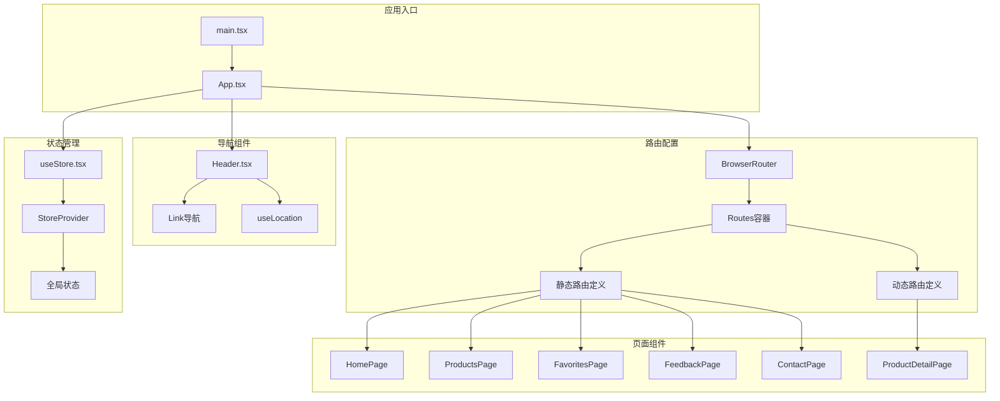

**图表来源**
- [App.tsx:13-35](file://lienpet-website/src/App.tsx#L13-L35)
- [main.tsx:6-9](file://lienpet-website/src/main.tsx#L6-L9)

**章节来源**
- [App.tsx:1-37](file://lienpet-website/src/App.tsx#L1-L37)
- [main.tsx:1-10](file://lienpet-website/src/main.tsx#L1-L10)
- [package.json:11-20](file://lienpet-website/package.json#L11-L20)

## 核心组件

### 路由配置核心

应用的路由配置集中在主App组件中，使用React Router DOM 7.1.1提供的BrowserRouter、Routes和Route组件实现：

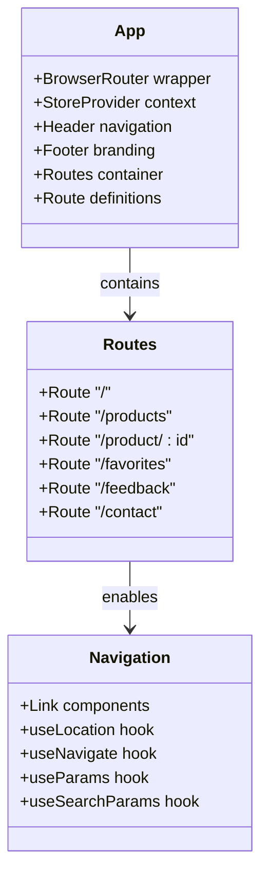

**图表来源**
- [App.tsx:13-35](file://lienpet-website/src/App.tsx#L13-L35)

### 页面路由定义

系统包含以下主要路由：

| 路由路径 | 组件名称 | 功能描述 | 参数类型 |
|---------|----------|----------|----------|
| `/` | HomePage | 首页展示，包含英雄横幅、分类网格、精选商品和联系信息 | 无 |
| `/products` | ProductsPage | 商品列表页面，支持分类筛选和搜索参数 | 查询参数: category, sub |
| `/product/:id` | ProductDetailPage | 商品详情页面，动态路由参数 | 路径参数: id |
| `/favorites` | FavoritesPage | 收藏夹页面，显示用户收藏的商品 | 无 |
| `/feedback` | FeedbackPage | 用户反馈页面，表单提交功能 | 无 |
| `/contact` | ContactPage | 联系我们页面，展示联系方式 | 无 |

**章节来源**
- [App.tsx:21-28](file://lienpet-website/src/App.tsx#L21-L28)

## 架构概览

LienPet的路由系统采用分层架构设计，确保代码的可维护性和扩展性：

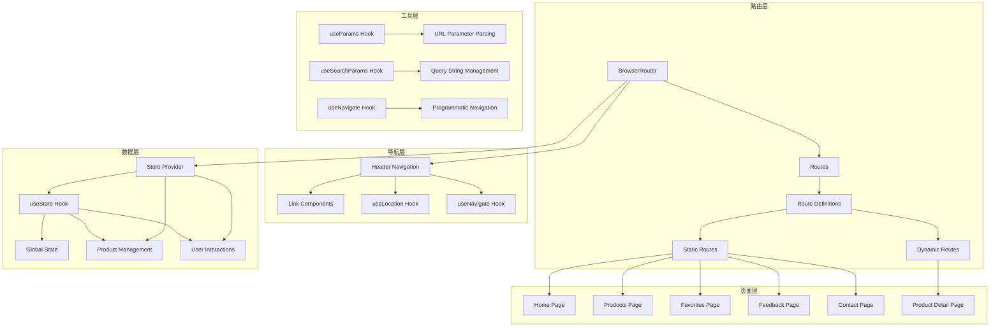

**图表来源**
- [App.tsx:13-35](file://lienpet-website/src/App.tsx#L13-L35)
- [Header.tsx:6-17](file://lienpet-website/src/components/Header.tsx#L6-L17)

## 详细组件分析

### 主应用组件 (App.tsx)

App.tsx作为整个应用的根组件，负责路由配置和全局状态管理：

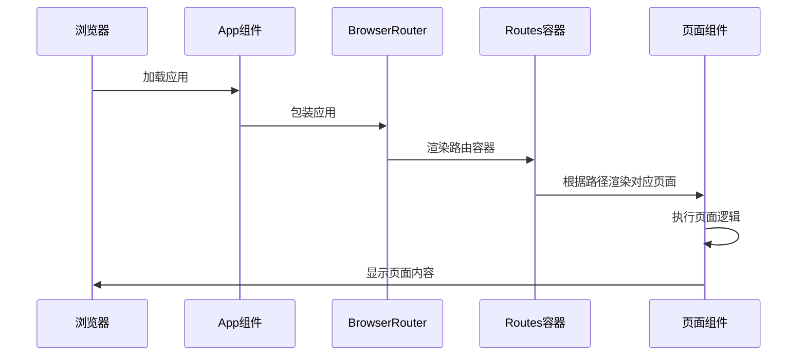

**图表来源**
- [App.tsx:13-35](file://lienpet-website/src/App.tsx#L13-L35)

**章节来源**
- [App.tsx:13-35](file://lienpet-website/src/App.tsx#L13-L35)

### 导航组件 (Header.tsx)

Header组件实现了响应式导航栏，集成了路由导航功能：

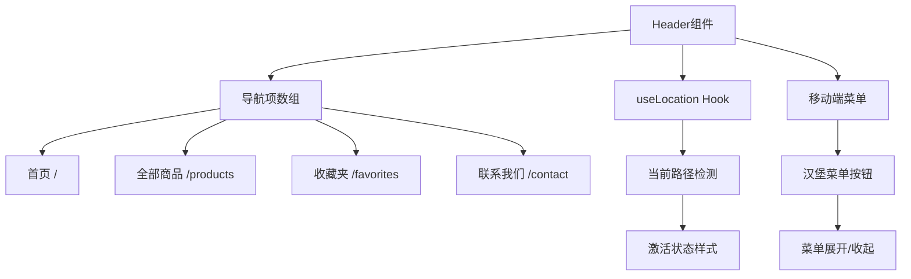

**图表来源**
- [Header.tsx:12-17](file://lienpet-website/src/components/Header.tsx#L12-L17)
- [Header.tsx:8](file://lienpet-website/src/components/Header.tsx#L8)

**章节来源**
- [Header.tsx:1-93](file://lienpet-website/src/components/Header.tsx#L1-L93)

### 产品列表页面 (ProductsPage.tsx)

ProductsPage实现了基于查询参数的动态筛选功能：

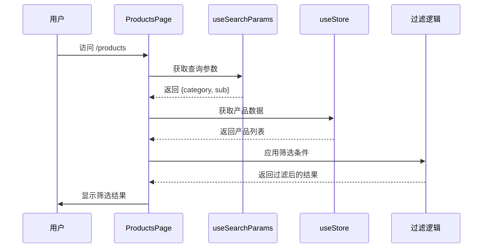

**图表来源**
- [ProductsPage.tsx:10-25](file://lienpet-website/src/pages/ProductsPage.tsx#L10-L25)

**章节来源**
- [ProductsPage.tsx:1-167](file://lienpet-website/src/pages/ProductsPage.tsx#L1-L167)

### 商品详情页面 (ProductDetailPage.tsx)

ProductDetailPage处理动态路由参数和用户交互：

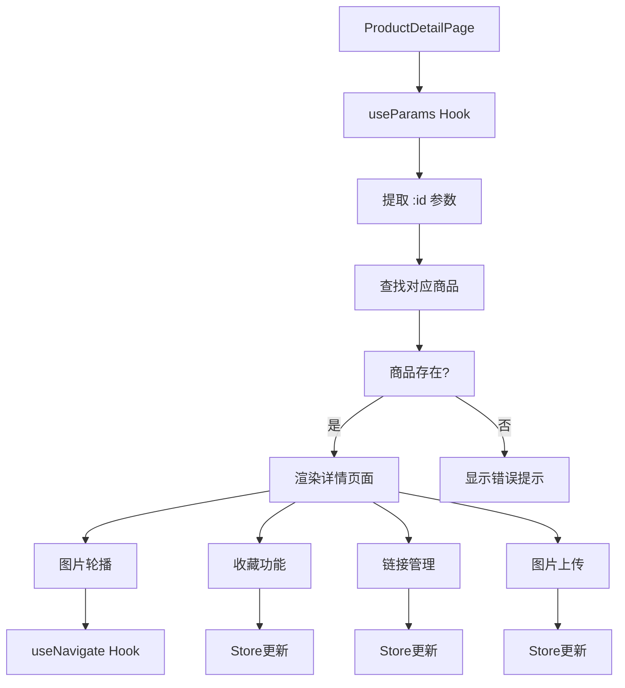

**图表来源**
- [ProductDetailPage.tsx:9](file://lienpet-website/src/pages/ProductDetailPage.tsx#L9)
- [ProductDetailPage.tsx:18-25](file://lienpet-website/src/pages/ProductDetailPage.tsx#L18-L25)

**章节来源**
- [ProductDetailPage.tsx:1-254](file://lienpet-website/src/pages/ProductDetailPage.tsx#L1-L254)

### 状态管理集成 (useStore.tsx)

路由系统与全局状态管理的集成：

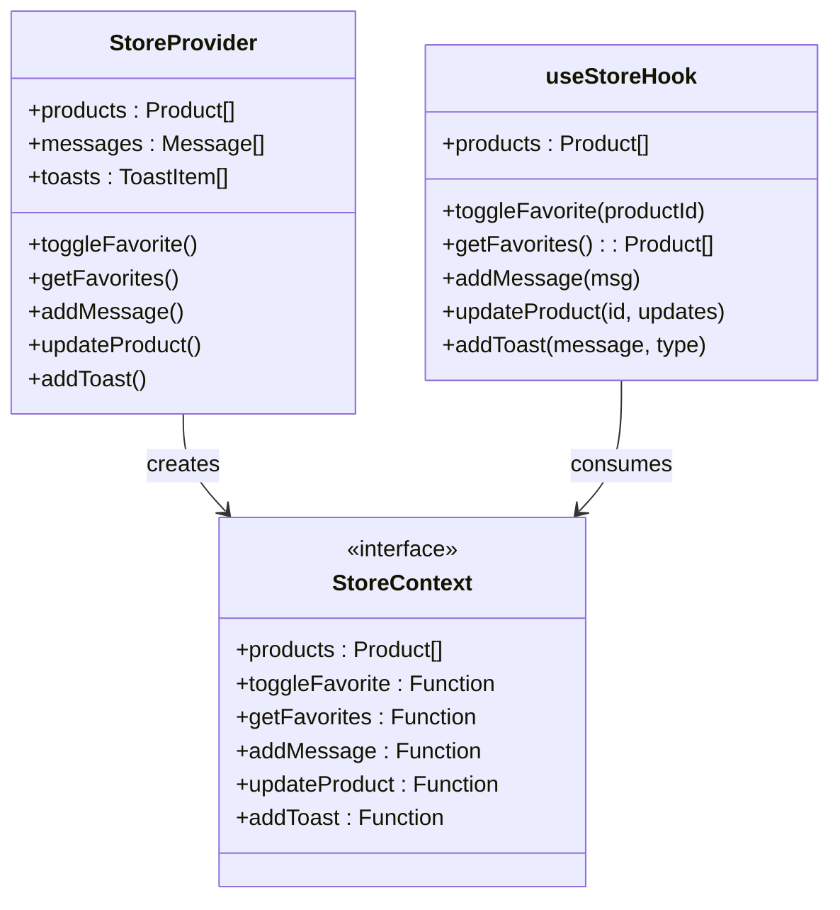

**图表来源**
- [useStore.tsx:5-17](file://lienpet-website/src/store/useStore.tsx#L5-L17)
- [useStore.tsx:27-94](file://lienpet-website/src/store/useStore.tsx#L27-L94)

**章节来源**
- [useStore.tsx:1-100](file://lienpet-website/src/store/useStore.tsx#L1-L100)

## 依赖关系分析

### 外部依赖

项目的核心依赖关系如下：

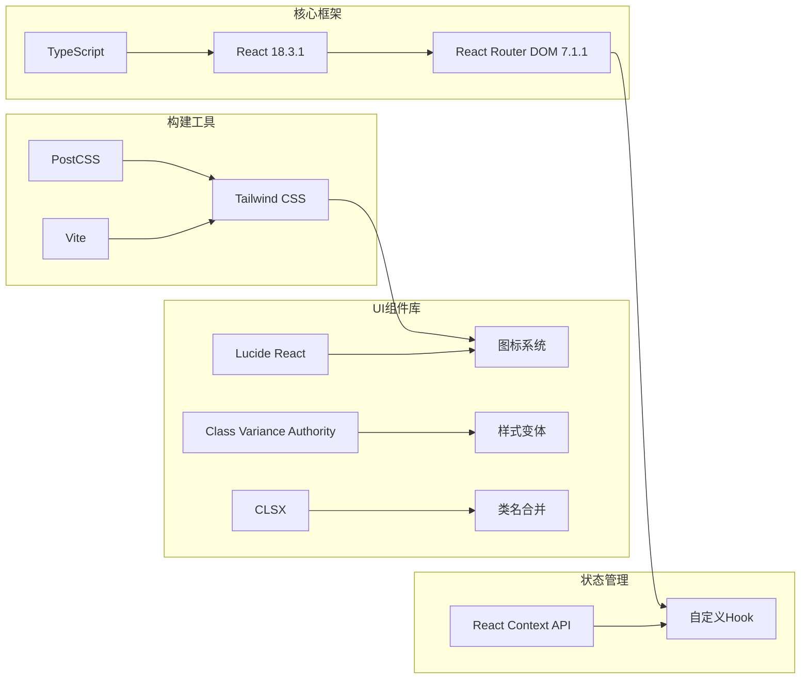

**图表来源**
- [package.json:11-20](file://lienpet-website/package.json#L11-L20)
- [vite.config.ts:7-11](file://lienpet-website/vite.config.ts#L7-L11)

### 内部依赖关系

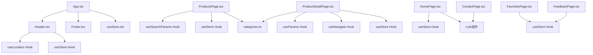

**图表来源**
- [App.tsx:1-11](file://lienpet-website/src/App.tsx#L1-L11)
- [Header.tsx:1-4](file://lienpet-website/src/components/Header.tsx#L1-L4)

**章节来源**
- [package.json:1-31](file://lienpet-website/package.json#L1-L31)

## 性能考虑

### 懒加载策略

虽然当前项目未实现代码分割，但推荐的懒加载实现方案：

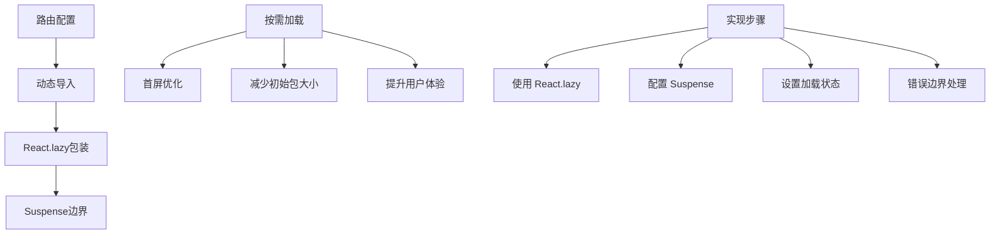

### SEO优化

当前路由系统在SEO方面的考虑：

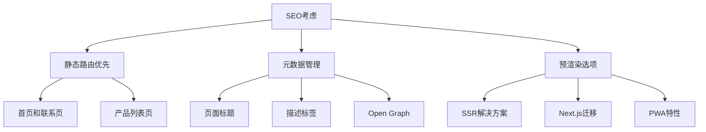

### 性能监控

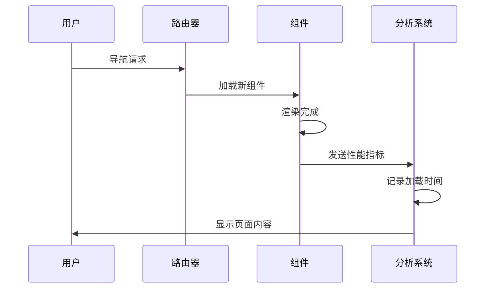

## 故障排除指南

### 常见问题诊断

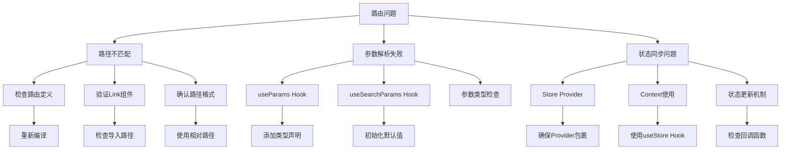

### 调试技巧

1. **路由调试**：
   - 使用浏览器开发者工具查看网络请求
   - 检查控制台是否有路由相关错误
   - 验证URL参数是否正确传递

2. **状态调试**：
   - 在组件中添加console.log输出
   - 使用React DevTools检查组件树
   - 验证状态更新是否触发重新渲染

3. **性能调试**：
   - 监控页面加载时间
   - 检查内存使用情况
   - 优化不必要的重渲染

**章节来源**
- [ProductDetailPage.tsx:18-25](file://lienpet-website/src/pages/ProductDetailPage.tsx#L18-L25)

## 结论

LienPet项目的路由系统设计体现了现代React应用的最佳实践，通过清晰的组件分离、完善的类型安全和良好的状态管理实现了高效的单页应用体验。

系统的主要优势包括：
- **简洁的路由配置**：基于React Router DOM 7.1.1的直观API
- **灵活的参数处理**：支持静态路由和动态路由参数
- **强类型支持**：TypeScript确保开发时的类型安全
- **状态集成**：与全局状态管理无缝协作
- **响应式设计**：适配不同设备尺寸

未来可以考虑的改进方向：
- 实现代码分割和懒加载
- 添加路由守卫和认证机制
- 集成SEO优化和预渲染
- 扩展路由配置的灵活性

## 附录

### 路由扩展指南

#### 添加新路由
1. 在App.tsx中添加新的Route定义
2. 创建对应的页面组件
3. 在Header.tsx中添加导航链接
4. 更新类型定义和导入语句

#### 动态路由参数
```typescript
// 在组件中使用
const { id } = useParams<{ id: string }>();
const navigate = useNavigate();

// 参数验证
if (!id) {
  // 处理无效参数
  navigate('/products');
}
```

#### 查询参数管理
```typescript
// 获取和设置查询参数
const [searchParams, setSearchParams] = useSearchParams();
const category = searchParams.get('category');

// 条件设置
setSearchParams({
  category: categoryId,
  sub: subcategoryId
});
```

#### 路由守卫实现
```typescript
// 基于用户状态的路由保护
function ProtectedRoute({ children }: { children: React.ReactNode }) {
  const isAuthenticated = useStore().isAuthenticated;
  
  return isAuthenticated ? children : <Navigate to="/login" />;
}
```

### 最佳实践建议

1. **路由命名规范**：
   - 使用小写字母和连字符
   - 避免使用特殊字符
   - 保持路径层次清晰

2. **参数处理**：
   - 始终验证路由参数
   - 提供默认值和回退机制
   - 使用类型安全的参数访问

3. **性能优化**：
   - 合理使用Suspense和React.lazy
   - 避免不必要的重渲染
   - 优化大型列表的渲染

4. **错误处理**：
   - 实现404页面
   - 提供友好的错误提示
   - 记录路由相关的错误日志

5. **测试策略**：
   - 编写路由单元测试
   - 测试参数解析逻辑
   - 验证导航行为