# 样式与主题

<cite>
**本文引用的文件**
- [tailwind.config.ts](file://lienpet-website/tailwind.config.ts)
- [postcss.config.js](file://lienpet-website/postcss.config.js)
- [index.css](file://lienpet-website/src/index.css)
- [vite.config.ts](file://lienpet-website/vite.config.ts)
- [package.json](file://lienpet-website/package.json)
- [button.tsx](file://lienpet-website/src/components/ui/button.tsx)
- [card.tsx](file://lienpet-website/src/components/ui/card.tsx)
- [utils.ts](file://lienpet-website/src/lib/utils.ts)
- [Header.tsx](file://lienpet-website/src/components/Header.tsx)
- [HomePage.tsx](file://lienpet-website/src/pages/HomePage.tsx)
</cite>

## 目录
1. [简介](#简介)
2. [项目结构](#项目结构)
3. [核心组件](#核心组件)
4. [架构总览](#架构总览)
5. [详细组件分析](#详细组件分析)
6. [依赖关系分析](#依赖关系分析)
7. [性能考量](#性能考量)
8. [故障排查指南](#故障排查指南)
9. [结论](#结论)
10. [附录](#附录)

## 简介
本文件系统性梳理 LienPet 项目的样式与主题体系，覆盖 Tailwind CSS 的配置与定制、PostCSS 处理流程、响应式设计策略、动画系统、主题切换方案（基于类名的明暗模式）、CSS 变量最佳实践、样式组织与命名规范，以及性能优化建议。目标是帮助开发者快速理解并高效扩展样式系统。

## 项目结构
样式与主题系统由以下关键部分组成：
- Tailwind 配置：定义容器、颜色、圆角、字体、动画与插件。
- PostCSS 配置：启用 Tailwind 与 Autoprefixer。
- 全局样式：定义 CSS 变量、基础层、组件层与工具层。
- 组件层：通过 class-variance-authority 与 clsx/tailwind-merge 实现可组合的变体组件。
- 响应式与交互：在页面与组件中广泛使用 Tailwind 断点与动画类。

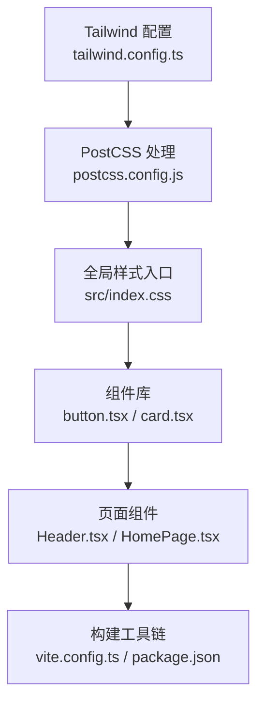

图表来源
- [tailwind.config.ts:1-106](file://lienpet-website/tailwind.config.ts#L1-L106)
- [postcss.config.js:1-6](file://lienpet-website/postcss.config.js#L1-L6)
- [index.css:1-115](file://lienpet-website/src/index.css#L1-L115)
- [button.tsx:1-49](file://lienpet-website/src/components/ui/button.tsx#L1-L49)
- [card.tsx:1-50](file://lienpet-website/src/components/ui/card.tsx#L1-L50)
- [vite.config.ts:1-12](file://lienpet-website/vite.config.ts#L1-L12)
- [package.json:1-31](file://lienpet-website/package.json#L1-L31)

章节来源
- [tailwind.config.ts:1-106](file://lienpet-website/tailwind.config.ts#L1-L106)
- [postcss.config.js:1-6](file://lienpet-website/postcss.config.js#L1-L6)
- [index.css:1-115](file://lienpet-website/src/index.css#L1-L115)
- [vite.config.ts:1-12](file://lienpet-website/vite.config.ts#L1-L12)
- [package.json:1-31](file://lienpet-website/package.json#L1-L31)

## 核心组件
- Tailwind 主题扩展
  - 容器与断点：容器居中与最大宽度；扩展断点用于大屏布局。
  - 颜色系统：基于 CSS 变量的语义化命名，支持明/暗模式切换。
  - 圆角与字体：统一圆角半径与字体族，确保视觉一致性。
  - 动画：内置多种 keyframes 与 animation 别名，便于复用。
- PostCSS 流程：Tailwind 生成所需类，Autoprefixer 补全浏览器前缀。
- 全局样式层
  - base 层：重置边框、设置背景与文字色、标题字重。
  - components 层：品牌渐变、阴影与过渡等常用组件样式。
  - utilities 层：文本平衡、滚动条隐藏等实用工具。
- 组件层
  - Button：通过变体系统提供多尺寸与多风格，结合 CSS 变量实现主题联动。
  - Card：语义化容器，继承卡片背景与前景色。
- 工具函数：cn 聚合 clsx 与 tailwind-merge，避免冲突类名叠加。

章节来源
- [tailwind.config.ts:10-103](file://lienpet-website/tailwind.config.ts#L10-L103)
- [index.css:7-115](file://lienpet-website/src/index.css#L7-L115)
- [button.tsx:5-30](file://lienpet-website/src/components/ui/button.tsx#L5-L30)
- [card.tsx:4-13](file://lienpet-website/src/components/ui/card.tsx#L4-L13)
- [utils.ts:1-6](file://lienpet-website/src/lib/utils.ts#L1-L6)

## 架构总览
下图展示从配置到运行时的样式管线：Tailwind 配置 → PostCSS 处理 → 全局样式注入 → 组件使用 → 构建打包。

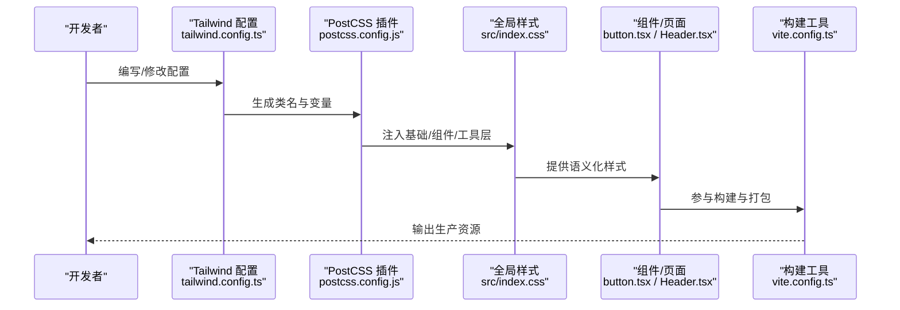

图表来源
- [tailwind.config.ts:1-106](file://lienpet-website/tailwind.config.ts#L1-L106)
- [postcss.config.js:1-6](file://lienpet-website/postcss.config.js#L1-L6)
- [index.css:1-115](file://lienpet-website/src/index.css#L1-L115)
- [button.tsx:1-49](file://lienpet-website/src/components/ui/button.tsx#L1-L49)
- [Header.tsx:1-93](file://lienpet-website/src/components/Header.tsx#L1-L93)
- [vite.config.ts:1-12](file://lienpet-website/vite.config.ts#L1-L12)

## 详细组件分析

### Tailwind 配置与定制
- 明/暗模式：通过类名驱动，配合 CSS 变量实现主题切换。
- 内容扫描：自动扫描 HTML 与 TSX 文件，按需生成类。
- 主题扩展
  - 颜色：语义化命名（如 primary、secondary、muted、accent），均映射至 CSS 变量。
  - 圆角：基于 CSS 变量统一管理，支持 lg/md/sm 三档。
  - 字体：sans 与 display 使用 Inter 字体族，保证一致的排版体验。
  - 动画：提供手风琴、淡入、滑入、缩放等动画别名，提升交互表现力。
- 插件：tailwindcss-animate 提供更丰富的动画能力。

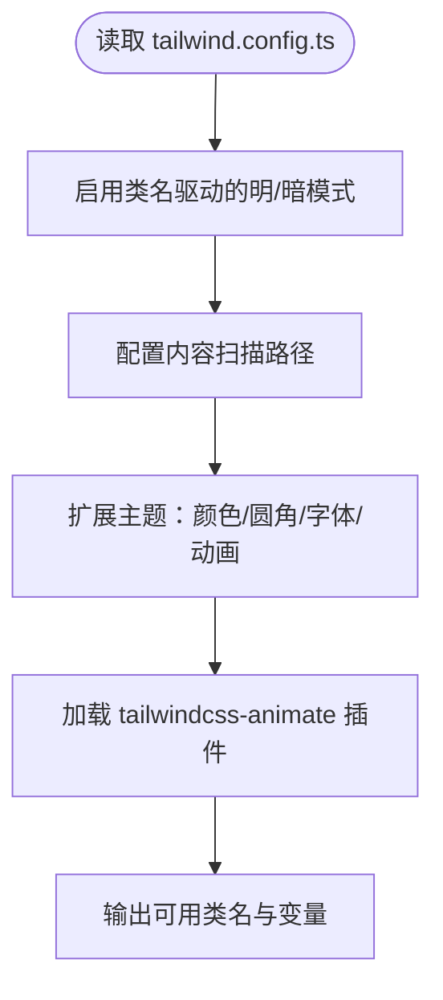

图表来源
- [tailwind.config.ts:3-103](file://lienpet-website/tailwind.config.ts#L3-L103)

章节来源
- [tailwind.config.ts:3-103](file://lienpet-website/tailwind.config.ts#L3-L103)

### PostCSS 处理流程
- 插件链：先执行 Tailwind 生成类，再由 Autoprefixer 补齐浏览器兼容前缀。
- 产物：最终生成可在浏览器直接使用的 CSS。

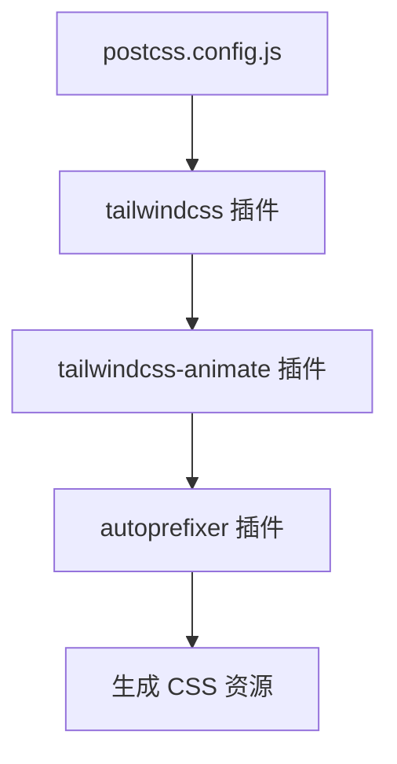

图表来源
- [postcss.config.js:1-6](file://lienpet-website/postcss.config.js#L1-L6)

章节来源
- [postcss.config.js:1-6](file://lienpet-website/postcss.config.js#L1-L6)

### 全局样式与 CSS 变量
- :root 变量：集中定义品牌色、核心调色板、渐变、阴影与过渡。
- base 层：统一边框、背景、文字色与标题字重。
- components 层：品牌渐变、阴影与过渡等常用组件样式。
- utilities 层：文本平衡、滚动条隐藏等实用工具。

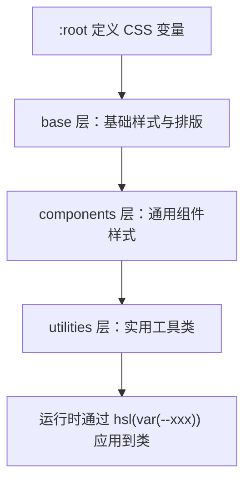

图表来源
- [index.css:7-115](file://lienpet-website/src/index.css#L7-L115)

章节来源
- [index.css:7-115](file://lienpet-website/src/index.css#L7-L115)

### Button 组件与变体系统
- 变体：default、destructive、outline、secondary、ghost、link、brand。
- 尺寸：default、sm、lg、icon。
- 语义化：基于 CSS 变量，随主题切换自动适配。
- 合并与去重：通过 cn 聚合多个类，避免重复与冲突。

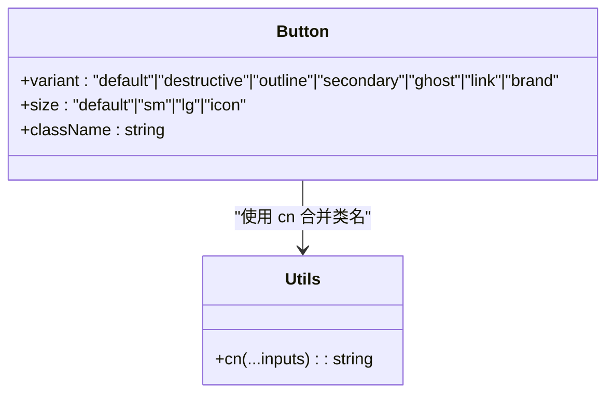

图表来源
- [button.tsx:5-30](file://lienpet-website/src/components/ui/button.tsx#L5-L30)
- [utils.ts:4-6](file://lienpet-website/src/lib/utils.ts#L4-L6)

章节来源
- [button.tsx:5-30](file://lienpet-website/src/components/ui/button.tsx#L5-L30)
- [utils.ts:4-6](file://lienpet-website/src/lib/utils.ts#L4-L6)

### Card 组件与语义化容器
- 语义化背景与前景色：继承卡片主题变量。
- 结构化：Header、Title、Description、Content、Footer 组合使用。

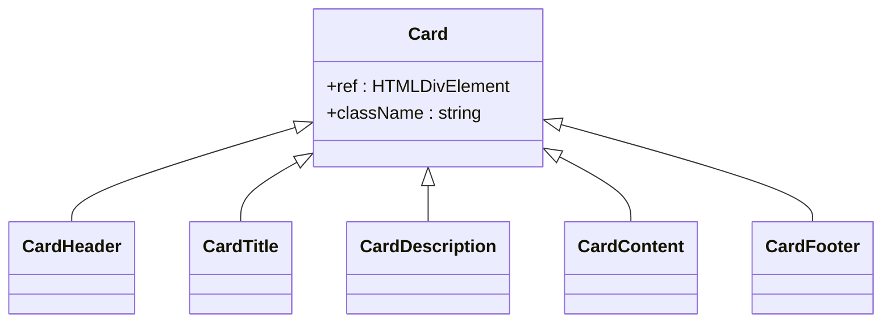

图表来源
- [card.tsx:4-50](file://lienpet-website/src/components/ui/card.tsx#L4-L50)

章节来源
- [card.tsx:4-50](file://lienpet-website/src/components/ui/card.tsx#L4-L50)

### 响应式设计与移动端优先
- 断点策略：在组件与页面中广泛使用 md/lg 等断点，实现移动端优先的布局。
- 示例：导航栏在小屏隐藏，在 md 断点以上显示；网格布局在不同断点下调整列数与间距。
- 动画与过渡：通过过渡类与动画类增强交互体验。

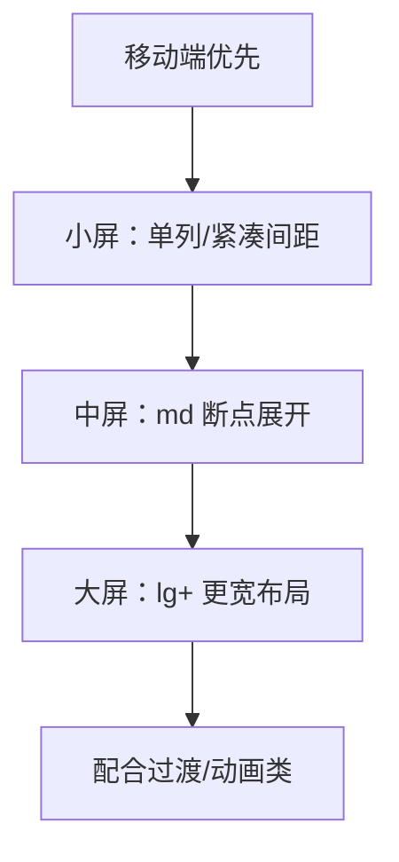

图表来源
- [Header.tsx:25-72](file://lienpet-website/src/components/Header.tsx#L25-L72)
- [HomePage.tsx:56-101](file://lienpet-website/src/pages/HomePage.tsx#L56-L101)

章节来源
- [Header.tsx:25-72](file://lienpet-website/src/components/Header.tsx#L25-L72)
- [HomePage.tsx:56-101](file://lienpet-website/src/pages/HomePage.tsx#L56-L101)

### 动画系统配置与使用
- 配置：内置多种 keyframes（手风琴、淡入、滑入、缩放）与对应 animation 别名。
- 使用：在组件与页面中直接以类名调用，例如 fade-in、slide-in-right、scale-in。
- 交互：与用户操作（如菜单展开）结合，提升反馈与流畅度。

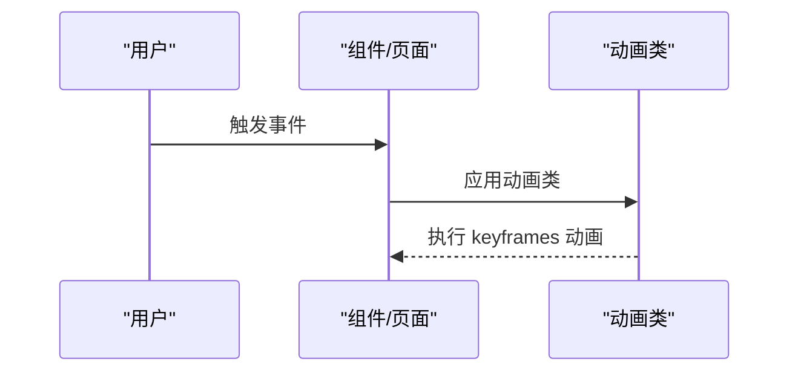

图表来源
- [tailwind.config.ts:72-100](file://lienpet-website/tailwind.config.ts#L72-L100)
- [Header.tsx:71-90](file://lienpet-website/src/components/Header.tsx#L71-L90)

章节来源
- [tailwind.config.ts:72-100](file://lienpet-website/tailwind.config.ts#L72-L100)
- [Header.tsx:71-90](file://lienpet-website/src/components/Header.tsx#L71-L90)

### 主题切换方案与 CSS 变量最佳实践
- 切换机制：通过在根元素或特定容器上切换类名实现明/暗模式切换，Tailwind 配置已启用类名驱动的 darkMode。
- 变量使用：所有语义化颜色均映射到 CSS 变量，组件通过 hsl(var(--xxx)) 应用，无需硬编码。
- 最佳实践
  - 在 :root 中集中定义变量，避免分散维护。
  - 使用语义化命名（如 primary、secondary、muted），减少对具体色值的耦合。
  - 为过渡与阴影等通用属性也提供变量，保持全局一致性。

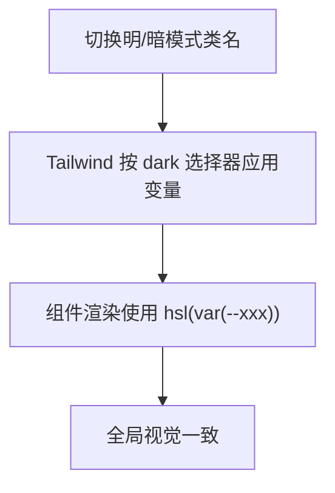

图表来源
- [tailwind.config.ts:4](file://lienpet-website/tailwind.config.ts#L4)
- [index.css:8-66](file://lienpet-website/src/index.css#L8-L66)

章节来源
- [tailwind.config.ts:4](file://lienpet-website/tailwind.config.ts#L4)
- [index.css:8-66](file://lienpet-website/src/index.css#L8-L66)

## 依赖关系分析
- 构建与运行
  - Vite 提供开发服务器与打包能力，并通过别名 @ 指向 src 目录。
  - React 插件用于 JSX/TSX 渲染。
- 样式与工具
  - Tailwind CSS 与 tailwindcss-animate 提供原子类与动画能力。
  - PostCSS 与 Autoprefixer 保障兼容性。
  - clsx 与 tailwind-merge 用于类名合并与去重。

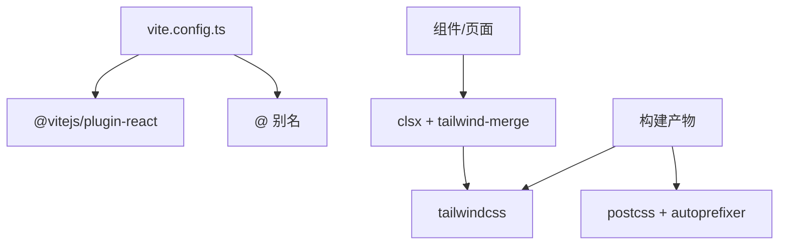

图表来源
- [vite.config.ts:5-12](file://lienpet-website/vite.config.ts#L5-L12)
- [package.json:11-30](file://lienpet-website/package.json#L11-L30)

章节来源
- [vite.config.ts:5-12](file://lienpet-website/vite.config.ts#L5-L12)
- [package.json:11-30](file://lienpet-website/package.json#L11-L30)

## 性能考量
- 按需生成：Tailwind 配置仅扫描必要目录，减少无关文件参与编译。
- 类名合并：使用 cn 聚合多个类，避免冗余与冲突，降低运行时开销。
- 动画与过渡：合理使用过渡与动画类，避免过度复杂的关键帧导致渲染压力。
- 资源体积：在生产构建中由 Vite 与 PostCSS 优化输出，确保最小化体积。

## 故障排查指南
- 类名不生效
  - 检查 Tailwind 内容扫描路径是否包含当前文件。
  - 确认未被 Purge 或 Tree Shaking 移除。
- 颜色异常
  - 确认 :root 中变量定义正确，组件是否使用了正确的语义化类名。
- 动画无效
  - 检查是否正确引入 tailwindcss-animate 插件，动画类名是否拼写正确。
- 响应式异常
  - 确认断点类名使用正确，且父容器具备合适的布局属性。

章节来源
- [tailwind.config.ts:5-8](file://lienpet-website/tailwind.config.ts#L5-L8)
- [index.css:8-66](file://lienpet-website/src/index.css#L8-L66)
- [package.json:19](file://lienpet-website/package.json#L19)

## 结论
LienPet 的样式与主题系统以 Tailwind CSS 为核心，结合 PostCSS 与 CSS 变量，实现了高内聚、低耦合、可扩展的主题与响应式体系。通过语义化颜色、统一的圆角与字体、丰富的动画与过渡，以及组件化的变体系统，既保证了开发效率，也确保了视觉一致性与良好的用户体验。建议在后续迭代中持续完善变量命名规范与动画策略，进一步优化构建与运行时性能。

## 附录
- 命名规范建议
  - 颜色：优先使用语义化名称（primary、secondary、muted、accent、destructive）。
  - 尺寸：采用默认、sm、lg、icon 四档，避免自定义尺寸。
  - 动画：以功能命名（fade-in、slide-in-right、scale-in）。
- 维护建议
  - 在 :root 中集中维护变量，避免散落定义。
  - 对新增组件遵循 cva 变体系统，统一风格。
  - 在页面中尽量使用断点类而非内联样式，保持响应式一致性。