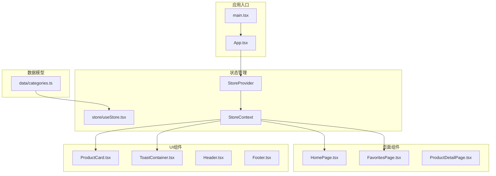
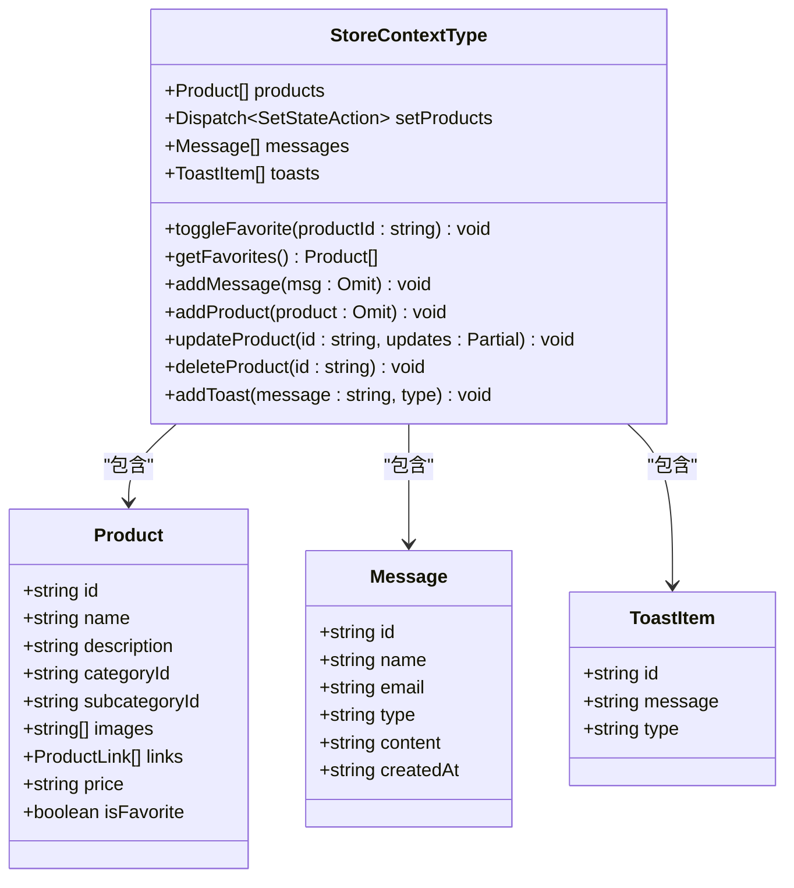
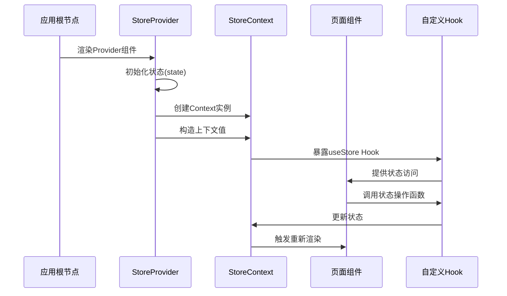
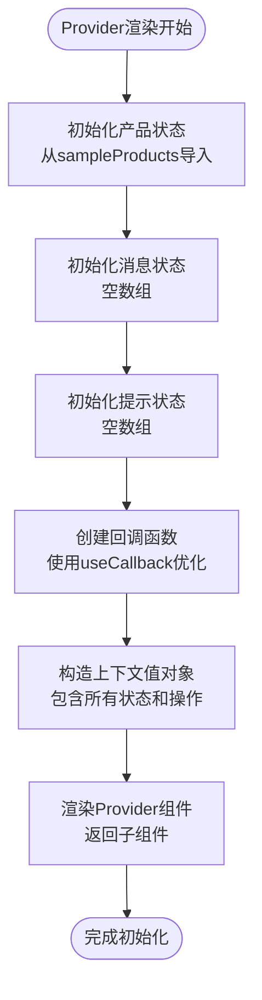
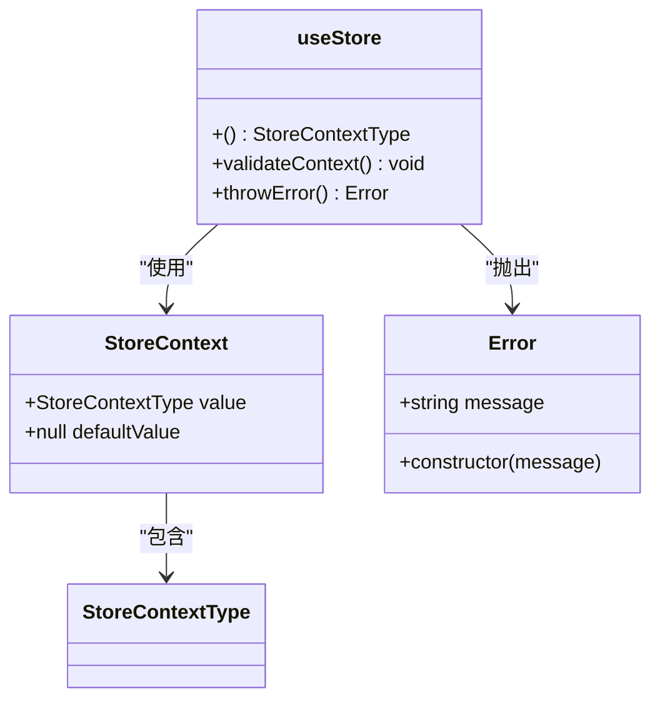
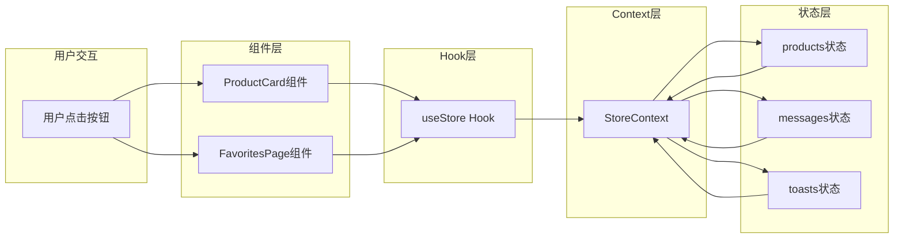
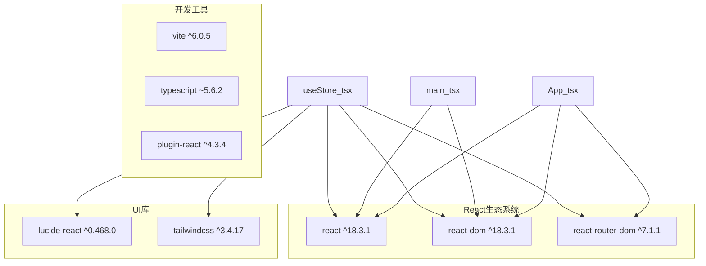
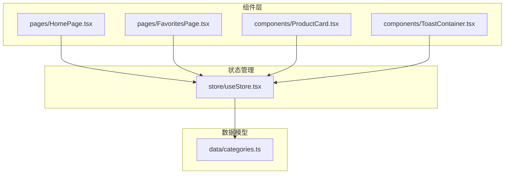

# Context API 实现

<cite>
**本文档引用的文件**
- [useStore.tsx](file://lienpet-website/src/store/useStore.tsx)
- [App.tsx](file://lienpet-website/src/App.tsx)
- [main.tsx](file://lienpet-website/src/main.tsx)
- [ToastContainer.tsx](file://lienpet-website/src/components/ToastContainer.tsx)
- [HomePage.tsx](file://lienpet-website/src/pages/HomePage.tsx)
- [FavoritesPage.tsx](file://lienpet-website/src/pages/FavoritesPage.tsx)
- [ProductCard.tsx](file://lienpet-website/src/components/ProductCard.tsx)
- [categories.ts](file://lienpet-website/src/data/categories.ts)
- [package.json](file://lienpet-website/package.json)
</cite>

## 目录
1. [简介](#简介)
2. [项目结构](#项目结构)
3. [核心组件](#核心组件)
4. [架构概览](#架构概览)
5. [详细组件分析](#详细组件分析)
6. [依赖关系分析](#依赖关系分析)
7. [性能考虑](#性能考虑)
8. [故障排除指南](#故障排除指南)
9. [结论](#结论)

## 简介

LienPet项目采用React Context API实现了一个集中式的状态管理系统。该系统通过自定义的StoreContext提供者组件，实现了跨组件的状态共享、组件订阅和性能优化。本文档深入分析了StoreContext的创建过程、Provider组件的设计模式以及Context值的传递机制，并提供了具体的使用示例和最佳实践指导。

## 项目结构

LienPet项目采用模块化架构，Context API相关的代码主要集中在以下目录结构中：

**图表来源**
- [main.tsx:1-10](file://lienpet-website/src/main.tsx#L1-L10)
- [App.tsx:1-37](file://lienpet-website/src/App.tsx#L1-L37)
- [useStore.tsx:1-100](file://lienpet-website/src/store/useStore.tsx#L1-L100)

**章节来源**
- [main.tsx:1-10](file://lienpet-website/src/main.tsx#L1-L10)
- [App.tsx:1-37](file://lienpet-website/src/App.tsx#L1-L37)

## 核心组件

### StoreContext 类型定义

项目的核心是自定义的StoreContext，它定义了整个应用的状态接口：

**图表来源**
- [useStore.tsx:5-23](file://lienpet-website/src/store/useStore.tsx#L5-L23)
- [categories.ts:19-38](file://lienpet-website/src/data/categories.ts#L19-L38)

### StoreProvider 组件实现

StoreProvider是Context API的核心实现，负责状态初始化和上下文值的构造：

**章节来源**
- [useStore.tsx:27-94](file://lienpet-website/src/store/useStore.tsx#L27-L94)

## 架构概览

LienPet项目的Context API架构采用了分层设计模式，确保了良好的可维护性和扩展性：

**图表来源**
- [App.tsx:13-35](file://lienpet-website/src/App.tsx#L13-L35)
- [useStore.tsx:27-100](file://lienpet-website/src/store/useStore.tsx#L27-L100)

## 详细组件分析

### StoreProvider 组件深度解析

StoreProvider组件实现了完整的状态管理功能，包括状态初始化、上下文值构造和错误处理机制：

#### 状态初始化流程

**图表来源**
- [useStore.tsx:27-94](file://lienpet-website/src/store/useStore.tsx#L27-L94)

#### 上下文值构造机制

StoreProvider通过一个精心构造的对象来提供所有状态和操作方法：

**章节来源**
- [useStore.tsx:83-93](file://lienpet-website/src/store/useStore.tsx#L83-L93)

### useStore Hook 实现

自定义Hook useStore提供了类型安全的状态访问机制：

**图表来源**
- [useStore.tsx:96-100](file://lienpet-website/src/store/useStore.tsx#L96-L100)

**章节来源**
- [useStore.tsx:96-100](file://lienpet-website/src/store/useStore.tsx#L96-L100)

### 组件订阅机制

多个组件通过useStore Hook订阅状态变化：

#### ToastContainer 组件

ToastContainer展示了如何订阅和显示状态：

**章节来源**
- [ToastContainer.tsx:4-28](file://lienpet-website/src/components/ToastContainer.tsx#L4-L28)

#### ProductCard 组件

ProductCard演示了如何使用状态操作函数：

**章节来源**
- [ProductCard.tsx:10-51](file://lienpet-website/src/components/ProductCard.tsx#L10-L51)

#### FavoritesPage 组件

FavoritesPage展示了如何使用只读状态访问：

**章节来源**
- [FavoritesPage.tsx:7-42](file://lienpet-website/src/pages/FavoritesPage.tsx#L7-L42)

### 数据流分析

**图表来源**
- [useStore.tsx:27-100](file://lienpet-website/src/store/useStore.tsx#L27-L100)
- [ProductCard.tsx:10-51](file://lienpet-website/src/components/ProductCard.tsx#L10-L51)
- [FavoritesPage.tsx:7-42](file://lienpet-website/src/pages/FavoritesPage.tsx#L7-L42)

## 依赖关系分析

### 外部依赖

项目使用了现代化的React生态系统工具链：

**图表来源**
- [package.json:11-30](file://lienpet-website/package.json#L11-L30)

**章节来源**
- [package.json:11-30](file://lienpet-website/package.json#L11-L30)

### 内部依赖关系

**图表来源**
- [useStore.tsx:1-4](file://lienpet-website/src/store/useStore.tsx#L1-L4)
- [HomePage.tsx:5-6](file://lienpet-website/src/pages/HomePage.tsx#L5-L6)

## 性能考虑

### useCallback 优化策略

项目广泛使用useCallback来避免不必要的重渲染：

#### 性能优化点分析

1. **状态更新函数优化**
   - toggleFavorite: 基于products依赖的回调函数
   - getFavorites: 基于products依赖的纯函数
   - addMessage: 基于addToast依赖的回调函数

2. **自动清理机制**
   - Toast自动3秒后清理
   - 避免内存泄漏和状态膨胀

3. **状态分割策略**
   - 将不同类型的业务状态分离到独立的状态变量
   - 减少不必要的全局重渲染

**章节来源**
- [useStore.tsx:32-81](file://lienpet-website/src/store/useStore.tsx#L32-L81)

### 最佳实践建议

1. **合理使用useCallback**
   - 为每个状态操作函数添加适当的依赖数组
   - 避免在回调函数中捕获过期的状态

2. **状态扁平化设计**
   - 将嵌套状态结构扁平化
   - 使用索引或ID映射来组织关联数据

3. **条件渲染优化**
   - 在ToastContainer中使用条件渲染避免空状态渲染
   - 对大型列表使用虚拟化技术

## 故障排除指南

### 常见问题及解决方案

#### 错误：useStore必须在StoreProvider内部使用

**问题描述**: 当组件在StoreProvider外部调用useStore时会抛出错误。

**解决方案**: 确保所有使用useStore的组件都在StoreProvider的子树内。

**章节来源**
- [useStore.tsx:96-100](file://lienpet-website/src/store/useStore.tsx#L96-L100)

#### 性能问题：频繁重渲染

**问题描述**: 组件在不需要的情况下频繁重渲染。

**解决方案**:
1. 检查useCallback的依赖数组是否正确
2. 使用React.memo包装纯组件
3. 考虑使用useMemo优化计算结果

#### 状态不一致问题

**问题描述**: 不同组件看到的状态不一致。

**解决方案**:
1. 确保所有状态操作都通过StoreProvider提供的函数进行
2. 避免直接修改状态变量
3. 使用不可变更新模式

## 结论

LienPet项目的Context API实现展现了现代React应用的最佳实践。通过精心设计的StoreProvider组件、类型安全的useStore Hook和优化的状态管理策略，该项目成功实现了：

1. **清晰的架构层次**: 分层设计确保了代码的可维护性和可扩展性
2. **高效的性能表现**: useCallback优化和条件渲染减少了不必要的重渲染
3. **良好的开发体验**: 类型安全的API和明确的错误处理提高了开发效率
4. **完善的错误处理**: 完整的边界检查和错误提示机制

这个实现为其他React应用提供了优秀的参考模板，特别是在状态管理、组件设计和性能优化方面都有很好的借鉴价值。