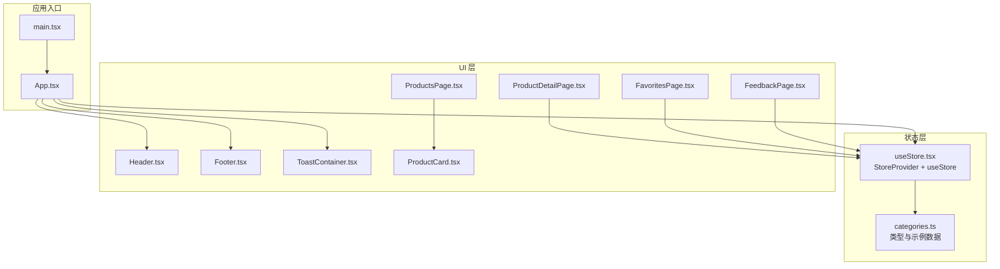
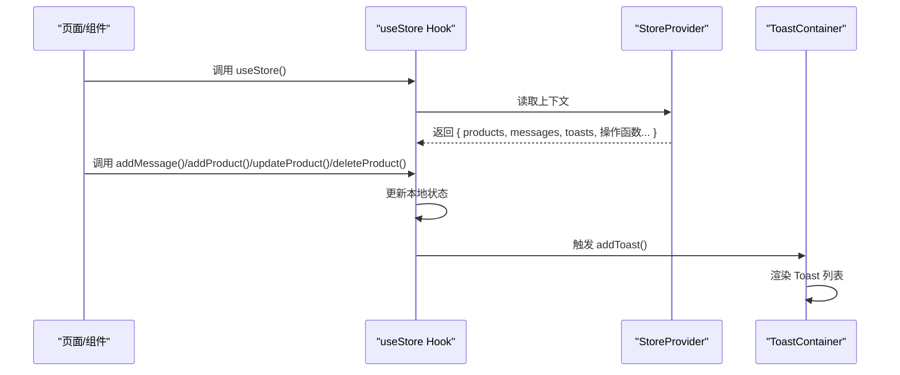
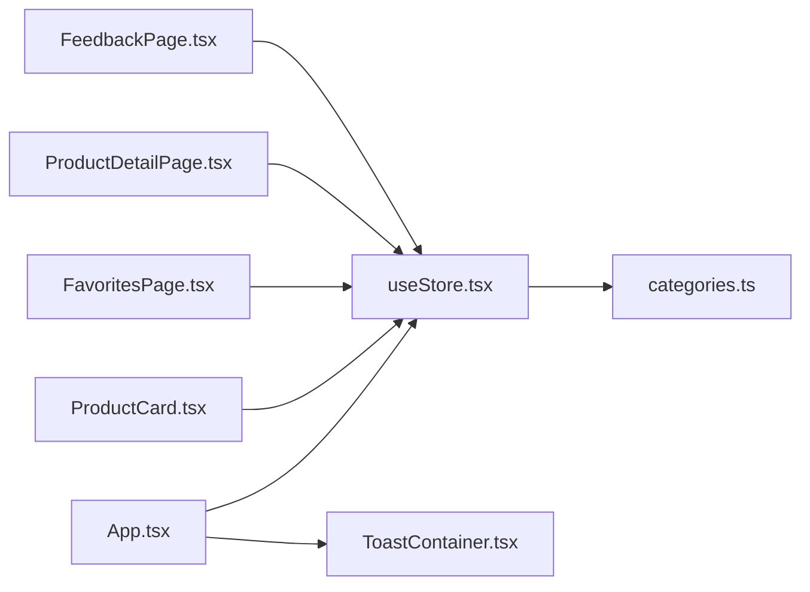

# Hook 函数详解

<cite>
**本文档引用的文件**
- [useStore.tsx](file://lienpet-website/src/store/useStore.tsx)
- [ProductCard.tsx](file://lienpet-website/src/components/ProductCard.tsx)
- [FavoritesPage.tsx](file://lienpet-website/src/pages/FavoritesPage.tsx)
- [ToastContainer.tsx](file://lienpet-website/src/components/ToastContainer.tsx)
- [categories.ts](file://lienpet-website/src/data/categories.ts)
- [App.tsx](file://lienpet-website/src/App.tsx)
- [ProductsPage.tsx](file://lienpet-website/src/pages/ProductsPage.tsx)
- [ProductDetailPage.tsx](file://lienpet-website/src/pages/ProductDetailPage.tsx)
- [FeedbackPage.tsx](file://lienpet-website/src/pages/FeedbackPage.tsx)
</cite>

## 目录
1. [简介](#简介)
2. [项目结构](#项目结构)
3. [核心组件](#核心组件)
4. [架构总览](#架构总览)
5. [详细组件分析](#详细组件分析)
6. [依赖关系分析](#依赖关系分析)
7. [性能考虑](#性能考虑)
8. [故障排除指南](#故障排除指南)
9. [结论](#结论)
10. [附录](#附录)

## 简介
本文件聚焦于 LienPet 项目的自定义 Hook 函数，尤其是 useStore Hook 的实现与使用方法。我们将深入解析以下状态操作函数：
- toggleFavorite：切换商品收藏状态
- getFavorites：获取收藏商品列表
- addMessage：添加用户反馈消息
- addProduct：新增商品
- updateProduct：更新商品信息
- deleteProduct：删除商品
- addToast：添加提示消息（Toast）

同时，我们将分析 useCallback 的使用策略与性能优化技巧，并提供 Hook 调用示例、最佳实践以及错误处理与边界情况的处理方式。

## 项目结构
LienPet 采用基于功能模块的组织方式，store 目录存放全局状态管理逻辑，components 与 pages 目录分别包含 UI 组件与页面级组件，data 目录提供类型定义与示例数据。

图表来源
- [App.tsx:13-35](file://lienpet-website/src/App.tsx#L13-L35)
- [useStore.tsx:27-94](file://lienpet-website/src/store/useStore.tsx#L27-L94)
- [categories.ts:19-38](file://lienpet-website/src/data/categories.ts#L19-L38)

章节来源
- [App.tsx:13-35](file://lienpet-website/src/App.tsx#L13-L35)
- [useStore.tsx:27-94](file://lienpet-website/src/store/useStore.tsx#L27-L94)
- [categories.ts:19-38](file://lienpet-website/src/data/categories.ts#L19-L38)

## 核心组件
本节聚焦 useStore Hook 的接口设计与实现要点，包括上下文类型、状态字段与操作函数的职责划分。

- 上下文类型定义
  - products：商品数组，setProducts：用于更新商品列表
  - toggleFavorite：根据商品 ID 切换 isFavorite 标志
  - getFavorites：返回所有收藏商品
  - messages：用户反馈消息数组，addMessage：添加新消息
  - addProduct、updateProduct、deleteProduct：对商品进行增删改
  - toasts：Toast 列表，addToast：添加并自动移除提示

- 关键实现特性
  - 使用 React.Context 提供全局状态访问
  - 所有操作函数均通过 useCallback 包裹，避免子组件重渲染
  - addToast 自动定时移除，提升用户体验
  - addMessage、addProduct、updateProduct、deleteProduct 均在成功后触发 addToast

章节来源
- [useStore.tsx:5-17](file://lienpet-website/src/store/useStore.tsx#L5-L17)
- [useStore.tsx:27-94](file://lienpet-website/src/store/useStore.tsx#L27-L94)

## 架构总览
useStore 将全局状态与业务操作封装在一个 Provider 中，各页面与组件通过 useStore 获取所需状态与方法。ToastContainer 作为独立展示层订阅 toasts 并渲染提示。

图表来源
- [useStore.tsx:27-94](file://lienpet-website/src/store/useStore.tsx#L27-L94)
- [ToastContainer.tsx:4-27](file://lienpet-website/src/components/ToastContainer.tsx#L4-L27)

## 详细组件分析

### useStore Hook 实现与使用
- Provider 初始化
  - products：从示例数据初始化
  - messages：空数组
  - toasts：空数组
- 操作函数
  - toggleFavorite：映射商品数组，匹配 ID 后翻转 isFavorite
  - getFavorites：过滤 products 中 isFavorite 为 true 的项
  - addMessage：生成唯一 id 与时间戳，追加到 messages，并触发成功提示
  - addProduct：生成唯一 id，追加到 products，并触发成功提示
  - updateProduct：映射商品数组，匹配 ID 后合并更新字段，并触发成功提示
  - deleteProduct：过滤掉指定 ID 的商品，并触发已删除提示
  - addToast：生成唯一 id，追加到 toasts；3 秒后自动移除对应项

- 性能优化策略
  - useCallback：所有操作函数均包裹 useCallback，依赖项分别为 addToast 或 products，确保函数引用稳定，减少子组件重渲染
  - 依赖数组：getFavorites 依赖 products，确保仅在商品列表变化时重新计算收藏集合
  - addToast 定时清理：避免 toasts 持续增长造成内存压力

- 错误处理与边界情况
  - useStore 内部校验：若未在 StoreProvider 内使用，抛出错误
  - addMessage：必填字段校验（名称与内容）在页面层处理
  - updateProduct：图片与链接更新时的边界检查（如最少保留一张图、最多上传数量限制）在页面层处理

章节来源
- [useStore.tsx:27-94](file://lienpet-website/src/store/useStore.tsx#L27-L94)
- [useStore.tsx:96-100](file://lienpet-website/src/store/useStore.tsx#L96-L100)

### 商品收藏交互（ProductCard）
- 功能点
  - 通过 useStore 获取 toggleFavorite
  - 点击收藏按钮时调用 toggleFavorite(product.id)
  - 根据 isFavorite 动态切换样式与图标填充状态

- 边界情况
  - 阻止默认事件冒泡，确保点击行为符合预期

章节来源
- [ProductCard.tsx:10-36](file://lienpet-website/src/components/ProductCard.tsx#L10-L36)

### 收藏页（FavoritesPage）
- 功能点
  - 通过 useStore 获取 getFavorites 并渲染收藏商品卡片
  - 当收藏为空时显示引导文案与跳转按钮

- 性能注意
  - getFavorites 依赖 products，当商品列表变化时才重新计算收藏集合

章节来源
- [FavoritesPage.tsx:7-39](file://lienpet-website/src/pages/FavoritesPage.tsx#L7-L39)

### 商品详情页（ProductDetailPage）
- 功能点
  - 通过 useStore 获取 products、toggleFavorite、updateProduct、addToast
  - 图片上传与删除：限制最多 10 张，至少保留 1 张
  - 添加/删除产品链接：支持动态增删
  - 导航面包屑：根据分类与子分类层级导航

- 边界情况
  - 未找到商品时显示提示并返回上一页
  - 输入校验：链接 URL 必须有效，回车提交

章节来源
- [ProductDetailPage.tsx:8-254](file://lienpet-website/src/pages/ProductDetailPage.tsx#L8-L254)

### 反馈页（FeedbackPage）
- 功能点
  - 通过 useStore 获取 addMessage
  - 表单类型选择：建议或商品需求
  - 提交前校验必填字段

- 边界情况
  - 名称与内容为空时阻止提交

章节来源
- [FeedbackPage.tsx:6-110](file://lienpet-website/src/pages/FeedbackPage.tsx#L6-L110)

### Toast 提示容器（ToastContainer）
- 功能点
  - 通过 useStore 获取 toasts
  - 根据类型渲染不同图标与颜色
  - 无 Toast 时不渲染容器

- 性能注意
  - 仅在 toasts 非空时渲染，避免不必要的 DOM 节点

章节来源
- [ToastContainer.tsx:4-27](file://lienpet-website/src/components/ToastContainer.tsx#L4-L27)

### 数据模型与示例数据
- 类型定义
  - Product：包含 id、name、description、categoryId、subcategoryId、images、links、price、isFavorite
  - Message：包含 id、name、email、type、content、createdAt
- 示例数据
  - sampleProducts：演示用商品列表，初始 isFavorite 为 false

章节来源
- [categories.ts:19-38](file://lienpet-website/src/data/categories.ts#L19-L38)
- [categories.ts:144-244](file://lienpet-website/src/data/categories.ts#L144-L244)

## 依赖关系分析
- 组件与 Hook 的依赖
  - ProductCard、FavoritesPage、ProductDetailPage、FeedbackPage 均依赖 useStore
  - ToastContainer 依赖 useStore 的 toasts
- Provider 与数据源
  - StoreProvider 依赖 categories.ts 中的示例数据
- 应用入口
  - App.tsx 在根节点包裹 StoreProvider，并挂载 ToastContainer

图表来源
- [useStore.tsx:27-94](file://lienpet-website/src/store/useStore.tsx#L27-L94)
- [App.tsx:13-35](file://lienpet-website/src/App.tsx#L13-L35)
- [categories.ts:19-38](file://lienpet-website/src/data/categories.ts#L19-L38)

章节来源
- [useStore.tsx:27-94](file://lienpet-website/src/store/useStore.tsx#L27-L94)
- [App.tsx:13-35](file://lienpet-website/src/App.tsx#L13-L35)

## 性能考虑
- useCallback 的使用策略
  - 所有操作函数均包裹 useCallback，确保函数引用稳定，避免子组件因函数重新创建而重渲染
  - 依赖数组选择：
    - addToast：无外部依赖，仅依赖自身内部逻辑
    - toggleFavorite/getFavorites：依赖 products，确保仅在商品列表变化时更新
    - addMessage/addProduct/updateProduct/deleteProduct：依赖 addToast，保证提示消息链路一致
- useMemo 的配合使用
  - ProductsPage 中使用 useMemo 对商品进行筛选，避免每次渲染都重新计算
- 渲染控制
  - ToastContainer 仅在 toasts 非空时渲染，降低不必要开销

章节来源
- [useStore.tsx:32-81](file://lienpet-website/src/store/useStore.tsx#L32-L81)
- [ProductsPage.tsx:16-25](file://lienpet-website/src/pages/ProductsPage.tsx#L16-L25)
- [ToastContainer.tsx:13-27](file://lienpet-website/src/components/ToastContainer.tsx#L13-L27)

## 故障排除指南
- “useStore 必须在 StoreProvider 内使用”的错误
  - 现象：在未包裹 StoreProvider 的组件中调用 useStore 抛出异常
  - 处理：确保 App.tsx 根节点包裹 StoreProvider
  - 参考路径：[App.tsx:16](file://lienpet-website/src/App.tsx#L16)
- 商品收藏状态未更新
  - 现象：点击收藏按钮后 UI 未变化
  - 处理：确认 ProductCard 正确调用 toggleFavorite；检查商品是否包含 isFavorite 字段
  - 参考路径：[ProductCard.tsx:24-36](file://lienpet-website/src/components/ProductCard.tsx#L24-L36)
- Toast 不显示或立即消失
  - 现象：提示消息未显示或显示即消失
  - 处理：确认 ToastContainer 已挂载；检查 addToast 是否被正确调用；确认定时器逻辑
  - 参考路径：[useStore.tsx:32-38](file://lienpet-website/src/store/useStore.tsx#L32-L38)，[ToastContainer.tsx:13-27](file://lienpet-website/src/components/ToastContainer.tsx#L13-L27)
- 商品图片上传失败或超出限制
  - 现象：上传超过 10 张或少于 1 张导致错误提示
  - 处理：在页面层进行输入校验与提示；调用 updateProduct 时传入新的 images 数组
  - 参考路径：[ProductDetailPage.tsx:34-60](file://lienpet-website/src/pages/ProductDetailPage.tsx#L34-L60)

章节来源
- [useStore.tsx:96-100](file://lienpet-website/src/store/useStore.tsx#L96-L100)
- [App.tsx:16](file://lienpet-website/src/App.tsx#L16)
- [ProductCard.tsx:24-36](file://lienpet-website/src/components/ProductCard.tsx#L24-L36)
- [ToastContainer.tsx:13-27](file://lienpet-website/src/components/ToastContainer.tsx#L13-L27)
- [ProductDetailPage.tsx:34-60](file://lienpet-website/src/pages/ProductDetailPage.tsx#L34-L60)

## 结论
useStore Hook 通过 React Context 提供了统一的全局状态访问与操作接口，结合 useCallback 与 useMemo 的合理使用，实现了良好的性能表现与可维护性。各页面与组件围绕 useStore 进行解耦协作，ToastContainer 独立负责提示展示，整体架构清晰、职责明确。建议在后续扩展中继续遵循现有模式，保持依赖数组与回调函数的稳定性，并完善边界条件的输入校验与错误提示。

## 附录

### Hook 调用示例与最佳实践
- 在组件中使用 useStore
  - 获取状态与方法：const { products, toggleFavorite, addMessage, addToast } = useStore()
  - 注意：不要直接修改状态，应通过提供的方法进行更新
- 最佳实践
  - 为所有操作函数使用 useCallback，确保子组件不会因函数重新创建而重渲染
  - 在需要计算结果的组件中使用 useMemo，避免重复计算
  - 对用户输入进行必要的校验，再调用 addMessage、updateProduct 等方法
  - 使用 addToast 提供即时反馈，提升用户体验

章节来源
- [useStore.tsx:32-81](file://lienpet-website/src/store/useStore.tsx#L32-L81)
- [ProductsPage.tsx:16-25](file://lienpet-website/src/pages/ProductsPage.tsx#L16-L25)
- [ProductDetailPage.tsx:11](file://lienpet-website/src/pages/ProductDetailPage.tsx#L11)