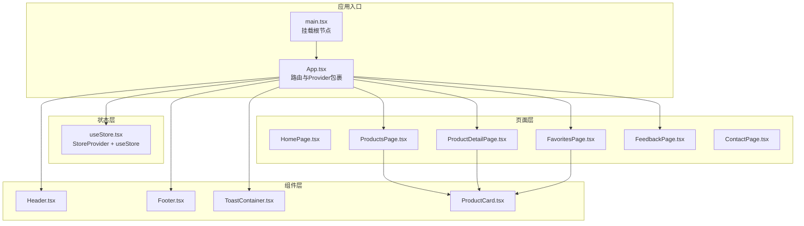
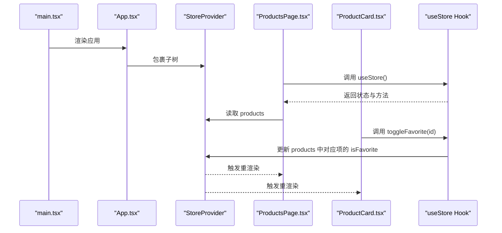
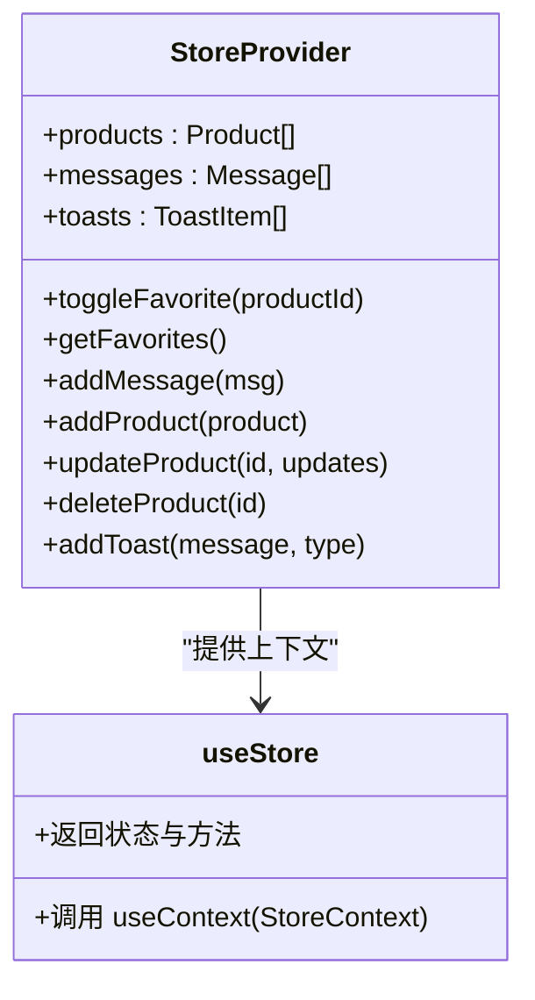
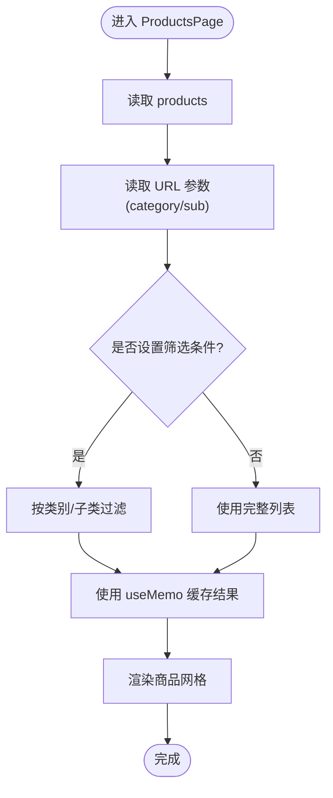
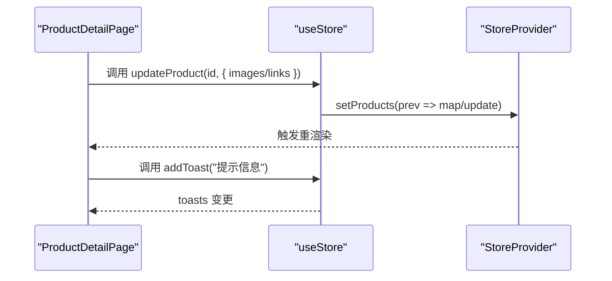
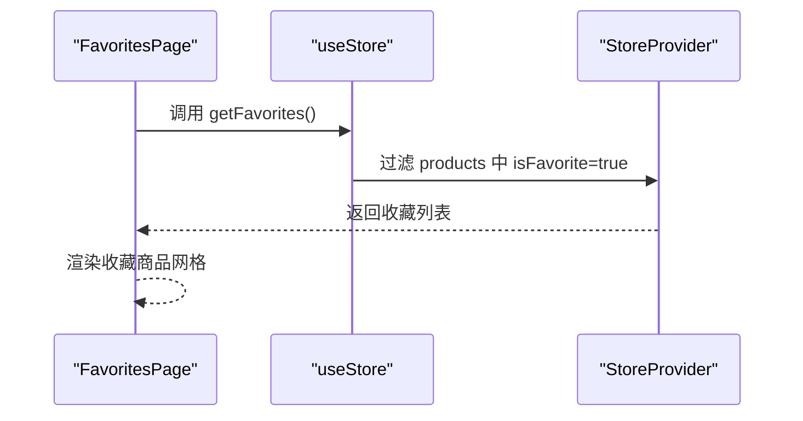
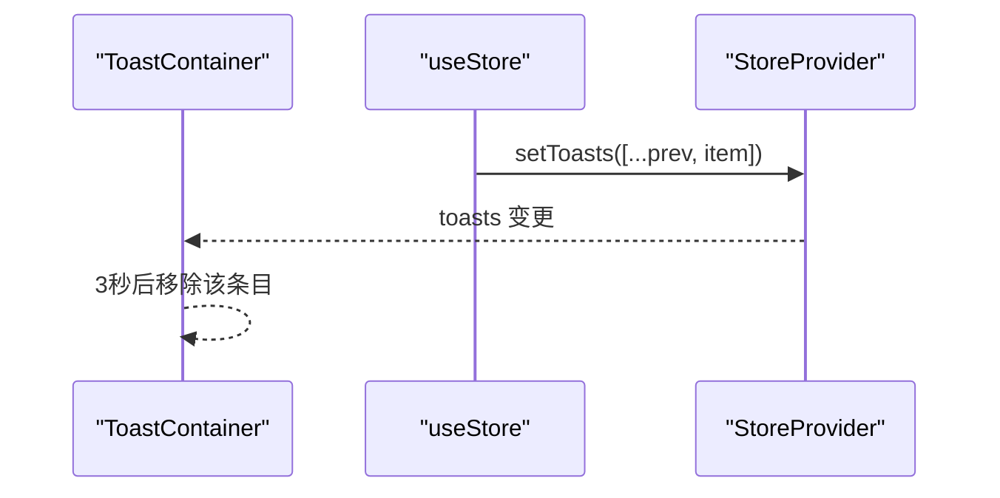
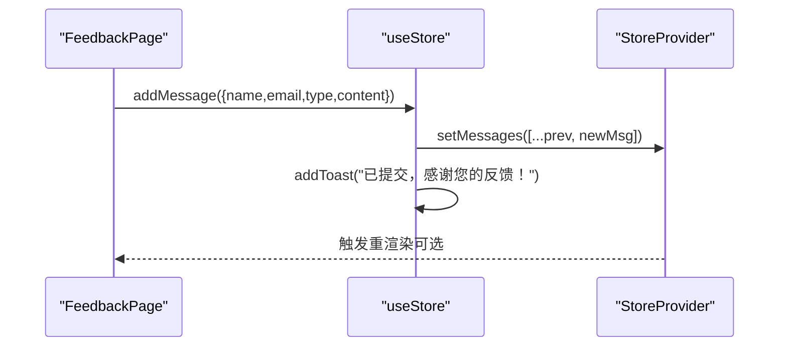
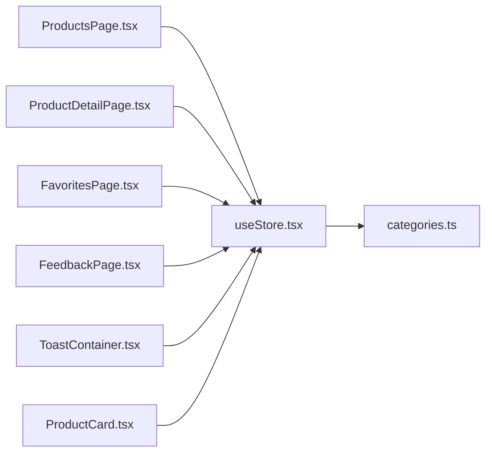

# 状态管理

<cite>
**本文引用的文件**
- [useStore.tsx](file://lienpet-website/src/store/useStore.tsx)
- [App.tsx](file://lienpet-website/src/App.tsx)
- [main.tsx](file://lienpet-website/src/main.tsx)
- [categories.ts](file://lienpet-website/src/data/categories.ts)
- [ToastContainer.tsx](file://lienpet-website/src/components/ToastContainer.tsx)
- [ProductCard.tsx](file://lienpet-website/src/components/ProductCard.tsx)
- [ProductsPage.tsx](file://lienpet-website/src/pages/ProductsPage.tsx)
- [ProductDetailPage.tsx](file://lienpet-website/src/pages/ProductDetailPage.tsx)
- [FavoritesPage.tsx](file://lienpet-website/src/pages/FavoritesPage.tsx)
- [FeedbackPage.tsx](file://lienpet-website/src/pages/FeedbackPage.tsx)
- [package.json](file://lienpet-website/package.json)
</cite>

## 目录
1. [简介](#简介)
2. [项目结构](#项目结构)
3. [核心组件](#核心组件)
4. [架构总览](#架构总览)
5. [详细组件分析](#详细组件分析)
6. [依赖关系分析](#依赖关系分析)
7. [性能考量](#性能考量)
8. [故障排查指南](#故障排查指南)
9. [结论](#结论)
10. [附录](#附录)

## 简介
本文件面向 LienPet 项目的前端状态管理，系统性阐述基于 React Context API 与自定义 Hook 的状态管理模式。文档覆盖全局状态的数据结构设计（商品列表、收藏状态、用户消息与通知系统）、状态更新触发机制、数据流向与组件订阅模式，并提供最佳实践（状态分割策略、性能优化技巧、内存管理）及持久化建议。为便于不同技术背景读者理解，文档采用分层讲解与可视化图示相结合的方式呈现。

## 项目结构
LienPet 前端采用 Vite + React 18 + TailwindCSS 构建，状态管理集中于 store 层，通过 Provider 包裹应用根节点，各页面与组件通过自定义 Hook 订阅状态并触发更新。

图表来源
- [main.tsx:1-10](file://lienpet-website/src/main.tsx#L1-L10)
- [App.tsx:13-35](file://lienpet-website/src/App.tsx#L13-L35)
- [useStore.tsx:27-94](file://lienpet-website/src/store/useStore.tsx#L27-L94)
- [ProductsPage.tsx:1-167](file://lienpet-website/src/pages/ProductsPage.tsx#L1-L167)
- [ProductDetailPage.tsx:1-254](file://lienpet-website/src/pages/ProductDetailPage.tsx#L1-L254)
- [FavoritesPage.tsx:1-42](file://lienpet-website/src/pages/FavoritesPage.tsx#L1-L42)
- [FeedbackPage.tsx:1-111](file://lienpet-website/src/pages/FeedbackPage.tsx#L1-L111)
- [ToastContainer.tsx:1-28](file://lienpet-website/src/components/ToastContainer.tsx#L1-L28)
- [ProductCard.tsx:1-51](file://lienpet-website/src/components/ProductCard.tsx#L1-L51)

章节来源
- [main.tsx:1-10](file://lienpet-website/src/main.tsx#L1-L10)
- [App.tsx:13-35](file://lienpet-website/src/App.tsx#L13-L35)
- [package.json:1-31](file://lienpet-website/package.json#L1-L31)

## 核心组件
- StoreProvider：全局状态容器，负责初始化商品、消息、通知等状态，并提供状态更新与查询方法。
- useStore：自定义 Hook，封装上下文读取逻辑，确保在 Provider 外部使用时抛出明确错误。
- 数据模型：
  - 商品 Product：包含标识、名称、描述、分类信息、图片数组、链接集合、价格与收藏标记。
  - 消息 Message：包含标识、姓名、邮箱、类型（建议/产品需求）、内容、创建时间。
  - 通知 ToastItem：包含标识、消息文本、类型（成功/错误/信息）。

章节来源
- [useStore.tsx:5-25](file://lienpet-website/src/store/useStore.tsx#L5-L25)
- [categories.ts:19-38](file://lienpet-website/src/data/categories.ts#L19-L38)

## 架构总览
下图展示了状态从 Provider 到组件的流向，以及组件如何通过 Hook 触发状态更新。

图表来源
- [main.tsx:6-9](file://lienpet-website/src/main.tsx#L6-L9)
- [App.tsx:16-32](file://lienpet-website/src/App.tsx#L16-L32)
- [useStore.tsx:27-94](file://lienpet-website/src/store/useStore.tsx#L27-L94)
- [ProductsPage.tsx:14](file://lienpet-website/src/pages/ProductsPage.tsx#L14)
- [ProductCard.tsx:11](file://lienpet-website/src/components/ProductCard.tsx#L11)

## 详细组件分析

### StoreProvider 与 useStore 自定义 Hook
- 设计要点
  - 使用 React.Context 暴露统一状态对象，避免深层传递 props。
  - 将状态更新函数以 useCallback 包装，减少子组件重渲染。
  - 提供只读派生方法（如 getFavorites），避免重复计算。
  - 通过 addToast 统一处理用户反馈，自动定时清理。
- 关键能力
  - 商品 CRUD：addProduct、updateProduct、deleteProduct。
  - 收藏切换：toggleFavorite、getFavorites。
  - 用户消息：addMessage（自动提交后提示）。
  - 通知系统：addToast（成功/错误/信息三类）。

图表来源
- [useStore.tsx:27-94](file://lienpet-website/src/store/useStore.tsx#L27-L94)
- [useStore.tsx:96-100](file://lienpet-website/src/store/useStore.tsx#L96-L100)

章节来源
- [useStore.tsx:27-94](file://lienpet-website/src/store/useStore.tsx#L27-L94)
- [useStore.tsx:96-100](file://lienpet-website/src/store/useStore.tsx#L96-L100)

### 商品列表与筛选（ProductsPage）
- 数据流
  - 从 useStore 获取 products。
  - 通过 URL 查询参数控制类别与子类别的筛选条件。
  - 使用 useMemo 对筛选结果进行稳定缓存，避免不必要的重算。
- 交互流程
  - 选择分类或子分类时更新 URL 参数，页面根据参数动态过滤商品。
  - 点击“全部商品”清除筛选条件。
- 性能注意
  - 仅在 products 或筛选参数变化时重新计算过滤结果。

图表来源
- [ProductsPage.tsx:9-25](file://lienpet-website/src/pages/ProductsPage.tsx#L9-L25)
- [ProductsPage.tsx:14](file://lienpet-website/src/pages/ProductsPage.tsx#L14)

章节来源
- [ProductsPage.tsx:9-25](file://lienpet-website/src/pages/ProductsPage.tsx#L9-L25)

### 商品详情页（ProductDetailPage）
- 功能点
  - 图片轮播与缩略图导航。
  - 图片上传与删除（受数量限制）。
  - 商品链接增删。
  - 收藏切换与面包屑导航。
- 数据流
  - 通过 useParams 获取当前商品 ID，从 store.products 中查找目标商品。
  - 通过 updateProduct 动态更新商品的图片与链接字段。
  - 通过 addToast 提示操作结果。
- 错误处理
  - 图片数量上限与最少保留张数的边界检查。

图表来源
- [ProductDetailPage.tsx:11](file://lienpet-website/src/pages/ProductDetailPage.tsx#L11)
- [ProductDetailPage.tsx:34-76](file://lienpet-website/src/pages/ProductDetailPage.tsx#L34-L76)
- [useStore.tsx:71-81](file://lienpet-website/src/store/useStore.tsx#L71-L81)

章节来源
- [ProductDetailPage.tsx:11](file://lienpet-website/src/pages/ProductDetailPage.tsx#L11)
- [ProductDetailPage.tsx:34-76](file://lienpet-website/src/pages/ProductDetailPage.tsx#L34-L76)

### 收藏页（FavoritesPage）
- 功能点
  - 通过 getFavorites 获取收藏商品列表。
  - 无收藏时引导跳转到商品列表。
- 数据流
  - 从 useStore 获取 getFavorites 并渲染商品卡片。

图表来源
- [FavoritesPage.tsx:8-9](file://lienpet-website/src/pages/FavoritesPage.tsx#L8-L9)
- [useStore.tsx:48-50](file://lienpet-website/src/store/useStore.tsx#L48-L50)

章节来源
- [FavoritesPage.tsx:8-9](file://lienpet-website/src/pages/FavoritesPage.tsx#L8-L9)
- [useStore.tsx:48-50](file://lienpet-website/src/store/useStore.tsx#L48-L50)

### 通知系统（ToastContainer）
- 功能点
  - 读取 toasts 列表并渲染。
  - 根据类型显示不同图标与样式。
  - 自动定时移除过期通知。
- 数据流
  - 通过 useStore 订阅 toasts。
  - addToast 在触发时写入新条目，定时器在 3 秒后移除。

图表来源
- [ToastContainer.tsx:4-27](file://lienpet-website/src/components/ToastContainer.tsx#L4-L27)
- [useStore.tsx:32-38](file://lienpet-website/src/store/useStore.tsx#L32-L38)

章节来源
- [ToastContainer.tsx:4-27](file://lienpet-website/src/components/ToastContainer.tsx#L4-L27)
- [useStore.tsx:32-38](file://lienpet-website/src/store/useStore.tsx#L32-L38)

### 留言与反馈（FeedbackPage）
- 功能点
  - 表单收集姓名、邮箱、类型（建议/产品需求）、内容。
  - 提交后通过 addMessage 写入消息列表，并触发 toast 提示。
- 数据流
  - 通过 useStore.addMessage 写入消息，内部生成唯一 id 与创建时间。

图表来源
- [FeedbackPage.tsx:13-20](file://lienpet-website/src/pages/FeedbackPage.tsx#L13-L20)
- [useStore.tsx:52-60](file://lienpet-website/src/store/useStore.tsx#L52-L60)

章节来源
- [FeedbackPage.tsx:13-20](file://lienpet-website/src/pages/FeedbackPage.tsx#L13-L20)
- [useStore.tsx:52-60](file://lienpet-website/src/store/useStore.tsx#L52-L60)

## 依赖关系分析
- 组件与状态层
  - 所有页面与组件通过 useStore 订阅状态，避免跨层级传递。
  - 仅在需要时调用回调方法，减少不必要的重渲染。
- 数据模型依赖
  - 商品与消息接口定义集中在 data/categories.ts，被 store 与页面共享。
- 外部依赖
  - react-router-dom 用于路由与查询参数驱动筛选。
  - lucide-react 用于图标渲染。

图表来源
- [useStore.tsx:1-3](file://lienpet-website/src/store/useStore.tsx#L1-L3)
- [categories.ts:19-38](file://lienpet-website/src/data/categories.ts#L19-L38)
- [ProductsPage.tsx:6-7](file://lienpet-website/src/pages/ProductsPage.tsx#L6-L7)
- [ProductDetailPage.tsx:5-6](file://lienpet-website/src/pages/ProductDetailPage.tsx#L5-L6)
- [FavoritesPage.tsx:5](file://lienpet-website/src/pages/FavoritesPage.tsx#L5)
- [FeedbackPage.tsx:4](file://lienpet-website/src/pages/FeedbackPage.tsx#L4)
- [ToastContainer.tsx:1](file://lienpet-website/src/components/ToastContainer.tsx#L1)
- [ProductCard.tsx:3](file://lienpet-website/src/components/ProductCard.tsx#L3)

章节来源
- [useStore.tsx:1-3](file://lienpet-website/src/store/useStore.tsx#L1-L3)
- [categories.ts:19-38](file://lienpet-website/src/data/categories.ts#L19-L38)
- [ProductsPage.tsx:6-7](file://lienpet-website/src/pages/ProductsPage.tsx#L6-L7)
- [ProductDetailPage.tsx:5-6](file://lienpet-website/src/pages/ProductDetailPage.tsx#L5-L6)
- [FavoritesPage.tsx:5](file://lienpet-website/src/pages/FavoritesPage.tsx#L5)
- [FeedbackPage.tsx:4](file://lienpet-website/src/pages/FeedbackPage.tsx#L4)
- [ToastContainer.tsx:1](file://lienpet-website/src/components/ToastContainer.tsx#L1)
- [ProductCard.tsx:3](file://lienpet-website/src/components/ProductCard.tsx#L3)

## 性能考量
- 状态分割策略
  - 将商品列表、消息列表、通知列表拆分为独立状态，避免无关状态变更导致的重渲染。
  - 对派生数据（如收藏列表）使用 useMemo 或派生方法，减少重复计算。
- 回调函数优化
  - 使用 useCallback 包装状态更新函数，降低子组件重渲染概率。
- 渲染粒度控制
  - 商品卡片等高频组件尽量保持纯展示，将交互事件委托给上层组件处理。
- 通知系统
  - 通知自动定时清理，避免长期持有大量临时状态。
- 内存管理
  - 避免在状态中存储大对象或临时 URL；图片上传场景中及时释放临时 URL。
  - 通知列表按需清理，防止无限增长。

[本节为通用性能指导，不直接分析具体文件]

## 故障排查指南
- “useStore 必须在 StoreProvider 内使用”
  - 现象：在 Provider 外部调用 useStore 抛出错误。
  - 排查：确认组件树是否正确包裹 StoreProvider。
  - 参考路径：[useStore.tsx:96-100](file://lienpet-website/src/store/useStore.tsx#L96-L100)
- 收藏切换无效
  - 现象：点击收藏按钮未生效。
  - 排查：确认传入的 productId 是否与商品 id 匹配；检查 toggleFavorite 的调用链路。
  - 参考路径：[ProductCard.tsx:24-28](file://lienpet-website/src/components/ProductCard.tsx#L24-L28)，[useStore.tsx:40-46](file://lienpet-website/src/store/useStore.tsx#L40-L46)
- 筛选不生效
  - 现象：切换分类后商品列表未更新。
  - 排查：确认 URL 查询参数是否正确设置；检查 useMemo 的依赖项是否包含 products。
  - 参考路径：[ProductsPage.tsx:9-25](file://lienpet-website/src/pages/ProductsPage.tsx#L9-L25)
- 通知不消失
  - 现象：提示弹窗一直存在。
  - 排查：确认 addToast 的定时器是否执行；检查 toasts 列表是否被正确更新。
  - 参考路径：[useStore.tsx:32-38](file://lienpet-website/src/store/useStore.tsx#L32-L38)，[ToastContainer.tsx:13-27](file://lienpet-website/src/components/ToastContainer.tsx#L13-L27)
- 留言提交失败
  - 现象：表单提交后无反馈。
  - 排查：确认必填字段是否为空；检查 addMessage 的调用与 toast 触发。
  - 参考路径：[FeedbackPage.tsx:13-20](file://lienpet-website/src/pages/FeedbackPage.tsx#L13-L20)，[useStore.tsx:52-60](file://lienpet-website/src/store/useStore.tsx#L52-L60)

章节来源
- [useStore.tsx:96-100](file://lienpet-website/src/store/useStore.tsx#L96-L100)
- [ProductCard.tsx:24-28](file://lienpet-website/src/components/ProductCard.tsx#L24-L28)
- [ProductsPage.tsx:9-25](file://lienpet-website/src/pages/ProductsPage.tsx#L9-L25)
- [useStore.tsx:32-38](file://lienpet-website/src/store/useStore.tsx#L32-L38)
- [ToastContainer.tsx:13-27](file://lienpet-website/src/components/ToastContainer.tsx#L13-L27)
- [FeedbackPage.tsx:13-20](file://lienpet-website/src/pages/FeedbackPage.tsx#L13-L20)
- [useStore.tsx:52-60](file://lienpet-website/src/store/useStore.tsx#L52-L60)

## 结论
LienPet 的状态管理以 Context API 为核心，结合自定义 Hook 实现了清晰的全局状态访问与更新机制。通过合理的状态分割、回调函数优化与派生数据缓存，系统在功能完整性与性能之间取得了良好平衡。建议后续在生产环境中引入持久化方案（如本地存储）与更细粒度的订阅策略，以进一步提升用户体验与可维护性。

[本节为总结性内容，不直接分析具体文件]

## 附录
- 如何在组件中使用状态钩子
  - 在页面或组件中导入并调用 useStore，即可获得 products、messages、toasts 以及对应的增删改查与派生方法。
  - 示例参考路径：
    - [ProductsPage.tsx:14](file://lienpet-website/src/pages/ProductsPage.tsx#L14)
    - [ProductDetailPage.tsx:11](file://lienpet-website/src/pages/ProductDetailPage.tsx#L11)
    - [FavoritesPage.tsx:8-9](file://lienpet-website/src/pages/FavoritesPage.tsx#L8-L9)
    - [FeedbackPage.tsx:7](file://lienpet-website/src/pages/FeedbackPage.tsx#L7)
- 状态持久化建议
  - 通知系统：由于通知为一次性提示，通常无需持久化。
  - 商品与收藏：可考虑将收藏状态与用户偏好写入本地存储，刷新后恢复。
  - 用户消息：可在服务端持久化，客户端仅做展示与本地草稿暂存。
  - 上传的临时图片：避免持久化临时 URL，应在离开页面或提交后释放。

[本节为通用实践建议，不直接分析具体文件]