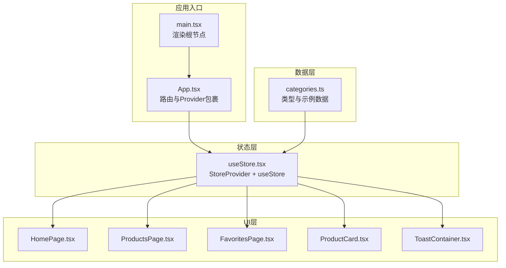
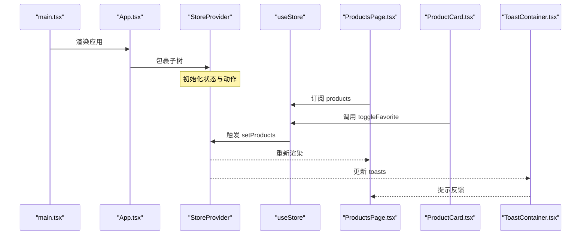
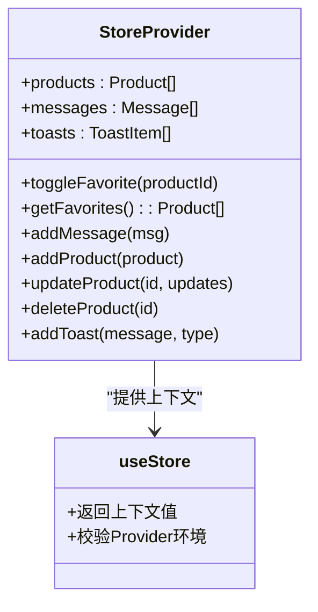
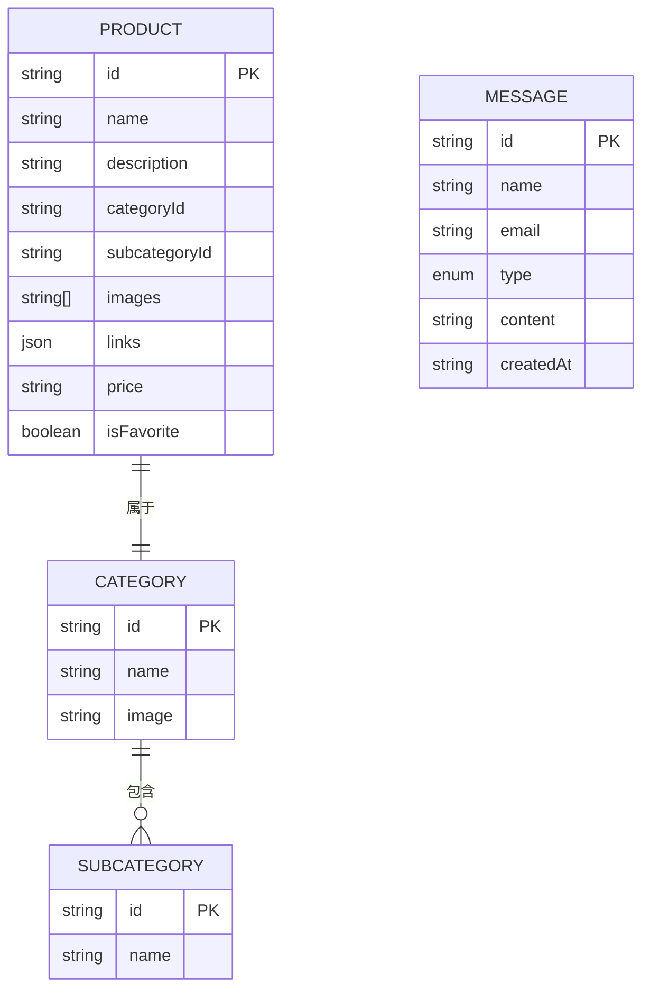
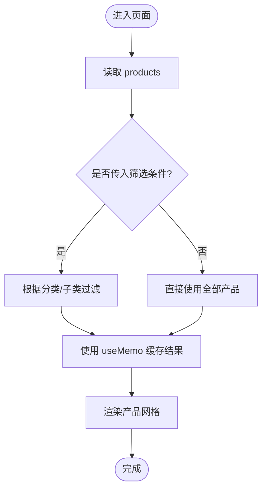
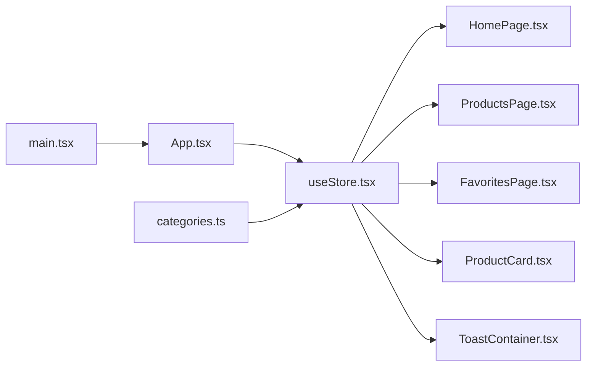

# 状态管理模式

<cite>
**本文引用的文件**
- [useStore.tsx](file://lienpet-website/src/store/useStore.tsx)
- [App.tsx](file://lienpet-website/src/App.tsx)
- [main.tsx](file://lienpet-website/src/main.tsx)
- [ToastContainer.tsx](file://lienpet-website/src/components/ToastContainer.tsx)
- [HomePage.tsx](file://lienpet-website/src/pages/HomePage.tsx)
- [ProductsPage.tsx](file://lienpet-website/src/pages/ProductsPage.tsx)
- [FavoritesPage.tsx](file://lienpet-website/src/pages/FavoritesPage.tsx)
- [ProductCard.tsx](file://lienpet-website/src/components/ProductCard.tsx)
- [categories.ts](file://lienpet-website/src/data/categories.ts)
- [package.json](file://lienpet-website/package.json)
</cite>

## 目录
1. [简介](#简介)
2. [项目结构](#项目结构)
3. [核心组件](#核心组件)
4. [架构总览](#架构总览)
5. [详细组件分析](#详细组件分析)
6. [依赖关系分析](#依赖关系分析)
7. [性能考量](#性能考量)
8. [故障排查指南](#故障排查指南)
9. [结论](#结论)
10. [附录](#附录)

## 简介
本文件系统性梳理 LienPet 项目的前端状态管理模式，围绕基于 React Context API 与自定义 Hook 的设计展开，重点解释：
- 状态更新触发机制与数据流向
- 组件订阅模式与上下文传播
- 状态分割策略与性能优化
- 内存管理与生命周期
- 状态持久化与数据同步方案
- 最佳实践、常见问题与调试技巧

该模式以单一 Provider 包裹应用根节点，通过自定义 Hook 暴露状态与动作，使各页面与组件按需订阅，避免跨层级传递繁琐。

## 项目结构
LienPet 前端采用模块化组织：页面、组件、数据模型与状态管理分层清晰。状态管理位于 store 目录，页面与组件通过自定义 Hook 订阅状态。

图表来源
- [main.tsx:1-10](file://lienpet-website/src/main.tsx#L1-L10)
- [App.tsx:1-37](file://lienpet-website/src/App.tsx#L1-L37)
- [useStore.tsx:1-100](file://lienpet-website/src/store/useStore.tsx#L1-L100)
- [HomePage.tsx:1-152](file://lienpet-website/src/pages/HomePage.tsx#L1-L152)
- [ProductsPage.tsx:1-167](file://lienpet-website/src/pages/ProductsPage.tsx#L1-L167)
- [FavoritesPage.tsx:1-42](file://lienpet-website/src/pages/FavoritesPage.tsx#L1-L42)
- [ProductCard.tsx:1-51](file://lienpet-website/src/components/ProductCard.tsx#L1-L51)
- [ToastContainer.tsx:1-28](file://lienpet-website/src/components/ToastContainer.tsx#L1-L28)
- [categories.ts:1-244](file://lienpet-website/src/data/categories.ts#L1-L244)

章节来源
- [main.tsx:1-10](file://lienpet-website/src/main.tsx#L1-L10)
- [App.tsx:1-37](file://lienpet-website/src/App.tsx#L1-L37)
- [useStore.tsx:1-100](file://lienpet-website/src/store/useStore.tsx#L1-L100)
- [categories.ts:1-244](file://lienpet-website/src/data/categories.ts#L1-L244)

## 核心组件
- StoreProvider：集中管理产品、消息、提示等状态，并暴露一组动作函数（添加/更新/删除产品、收藏切换、消息提交、提示弹出等）。
- useStore：自定义 Hook，封装对上下文的访问与错误处理，确保在 Provider 外部调用时抛出明确错误。
- ToastContainer：订阅 toasts 并渲染全局提示，支持自动消失。
- 页面与组件：如 HomePage、ProductsPage、FavoritesPage、ProductCard 通过 useStore 订阅状态并触发动作。

章节来源
- [useStore.tsx:1-100](file://lienpet-website/src/store/useStore.tsx#L1-L100)
- [ToastContainer.tsx:1-28](file://lienpet-website/src/components/ToastContainer.tsx#L1-L28)
- [HomePage.tsx:1-152](file://lienpet-website/src/pages/HomePage.tsx#L1-L152)
- [ProductsPage.tsx:1-167](file://lienpet-website/src/pages/ProductsPage.tsx#L1-L167)
- [FavoritesPage.tsx:1-42](file://lienpet-website/src/pages/FavoritesPage.tsx#L1-L42)
- [ProductCard.tsx:1-51](file://lienpet-website/src/components/ProductCard.tsx#L1-L51)

## 架构总览
下图展示从入口到状态消费的完整流程，以及状态更新如何驱动 UI 变更。

图表来源
- [main.tsx:1-10](file://lienpet-website/src/main.tsx#L1-L10)
- [App.tsx:1-37](file://lienpet-website/src/App.tsx#L1-L37)
- [useStore.tsx:1-100](file://lienpet-website/src/store/useStore.tsx#L1-L100)
- [ProductsPage.tsx:1-167](file://lienpet-website/src/pages/ProductsPage.tsx#L1-L167)
- [ProductCard.tsx:1-51](file://lienpet-website/src/components/ProductCard.tsx#L1-L51)
- [ToastContainer.tsx:1-28](file://lienpet-website/src/components/ToastContainer.tsx#L1-L28)

## 详细组件分析

### StoreProvider 与 useStore 设计
- 上下文类型定义：StoreContextType 暴露状态字段与动作，包括产品列表、消息列表、提示列表，以及 toggleFavorite、getFavorites、addMessage、addProduct、updateProduct、deleteProduct、addToast 等。
- Provider 内部状态：使用 useState 分别维护 products、messages、toasts 三类状态。
- 动作函数：
  - toggleFavorite：通过映射更新单个产品的收藏标记。
  - getFavorites：基于当前 products 过滤收藏项。
  - addMessage：生成带时间戳的消息并入队，同时触发 addToast。
  - addProduct/updateProduct/deleteProduct：对 products 执行新增/更新/删除，并触发 addToast。
  - addToast：生成唯一 id 的 toast 入队，并在定时器后自动移除。
- 自定义 Hook：useStore 返回上下文值；若未在 Provider 内部调用则抛错，保证使用安全。

图表来源
- [useStore.tsx:1-100](file://lienpet-website/src/store/useStore.tsx#L1-L100)

章节来源
- [useStore.tsx:1-100](file://lienpet-website/src/store/useStore.tsx#L1-L100)

### 数据模型与初始数据
- 类型定义：Product、Message、Category、SubCategory、ProductLink 等接口清晰描述数据结构。
- 初始数据：sampleProducts 提供演示用产品集合，包含 id、名称、描述、分类、图片、链接、价格与收藏标记等字段。

图表来源
- [categories.ts:1-244](file://lienpet-website/src/data/categories.ts#L1-L244)

章节来源
- [categories.ts:1-244](file://lienpet-website/src/data/categories.ts#L1-L244)

### 页面与组件的状态消费
- HomePage：读取 products 并展示精选商品。
- ProductsPage：读取 products，结合路由参数进行筛选，使用 useMemo 缓存过滤结果。
- FavoritesPage：通过 getFavorites 获取收藏列表。
- ProductCard：在点击收藏按钮时调用 toggleFavorite。
- ToastContainer：订阅 toasts 并渲染提示，自动消失。

图表来源
- [ProductsPage.tsx:1-167](file://lienpet-website/src/pages/ProductsPage.tsx#L1-L167)

章节来源
- [HomePage.tsx:1-152](file://lienpet-website/src/pages/HomePage.tsx#L1-L152)
- [ProductsPage.tsx:1-167](file://lienpet-website/src/pages/ProductsPage.tsx#L1-L167)
- [FavoritesPage.tsx:1-42](file://lienpet-website/src/pages/FavoritesPage.tsx#L1-L42)
- [ProductCard.tsx:1-51](file://lienpet-website/src/components/ProductCard.tsx#L1-L51)
- [ToastContainer.tsx:1-28](file://lienpet-website/src/components/ToastContainer.tsx#L1-L28)

## 依赖关系分析
- 应用入口依赖路由与 Provider：main.tsx 渲染 App，App 使用 BrowserRouter 与 StoreProvider 包裹。
- 页面依赖自定义 Hook：各页面通过 useStore 访问状态与动作。
- 组件依赖 Hook：ProductCard、ToastContainer 等组件通过 useStore 订阅状态。
- 数据模型依赖：页面与组件依赖 categories.ts 中的数据类型与示例数据。

图表来源
- [main.tsx:1-10](file://lienpet-website/src/main.tsx#L1-L10)
- [App.tsx:1-37](file://lienpet-website/src/App.tsx#L1-L37)
- [useStore.tsx:1-100](file://lienpet-website/src/store/useStore.tsx#L1-L100)
- [HomePage.tsx:1-152](file://lienpet-website/src/pages/HomePage.tsx#L1-L152)
- [ProductsPage.tsx:1-167](file://lienpet-website/src/pages/ProductsPage.tsx#L1-L167)
- [FavoritesPage.tsx:1-42](file://lienpet-website/src/pages/FavoritesPage.tsx#L1-L42)
- [ProductCard.tsx:1-51](file://lienpet-website/src/components/ProductCard.tsx#L1-L51)
- [ToastContainer.tsx:1-28](file://lienpet-website/src/components/ToastContainer.tsx#L1-L28)
- [categories.ts:1-244](file://lienpet-website/src/data/categories.ts#L1-L244)

章节来源
- [package.json:1-31](file://lienpet-website/package.json#L1-L31)

## 性能考量
- 状态分割与最小化重渲染
  - 将 products、messages、toasts 分离为独立状态，避免无关状态变更导致的重渲染。
  - 在 ProductsPage 中使用 useMemo 对过滤结果进行缓存，减少重复计算。
- 回调函数稳定化
  - 使用 useCallback 包装动作函数，降低子组件因 props 引用变化而重渲染的概率。
- 组件订阅粒度
  - 页面仅订阅所需状态（如 ProductsPage 仅读取 products），避免过度订阅。
- 提示自动清理
  - addToast 在固定时间后自动移除，避免 toasts 长期增长造成内存压力。
- 图片懒加载
  - ProductCard 与 HomePage 中使用懒加载属性，降低首屏资源压力。

章节来源
- [ProductsPage.tsx:1-167](file://lienpet-website/src/pages/ProductsPage.tsx#L1-L167)
- [useStore.tsx:1-100](file://lienpet-website/src/store/useStore.tsx#L1-L100)
- [ProductCard.tsx:1-51](file://lienpet-website/src/components/ProductCard.tsx#L1-L51)
- [HomePage.tsx:1-152](file://lienpet-website/src/pages/HomePage.tsx#L1-L152)

## 故障排查指南
- 在 Provider 外部使用 useStore 抛错
  - 现象：运行时报错，提示必须在 StoreProvider 内使用 useStore。
  - 排查：确认 App.tsx 已包裹 StoreProvider，且未在 Provider 之外调用 useStore。
- 收藏切换无效
  - 现象：点击收藏按钮无反应。
  - 排查：检查 ProductCard 是否正确调用 toggleFavorite；确认 useStore 返回的动作函数存在且未被覆盖。
- 筛选结果不更新
  - 现象：切换分类或子类后页面未刷新。
  - 排查：确认 ProductsPage 正确读取 products 并使用 useMemo 缓存；检查路由参数变化是否触发重新计算。
- 提示不消失
  - 现象：提示持续显示。
  - 排查：检查 addToast 的定时器逻辑；确认 toasts 数组在定时器后被正确移除。
- 路由与筛选冲突
  - 现象：切换分类后 URL 参数异常。
  - 排查：检查 ProductsPage 中 setSearchParams 的调用逻辑，确保在切换时正确设置或清空参数。

章节来源
- [App.tsx:1-37](file://lienpet-website/src/App.tsx#L1-L37)
- [useStore.tsx:1-100](file://lienpet-website/src/store/useStore.tsx#L1-L100)
- [ProductsPage.tsx:1-167](file://lienpet-website/src/pages/ProductsPage.tsx#L1-L167)
- [ProductCard.tsx:1-51](file://lienpet-website/src/components/ProductCard.tsx#L1-L51)
- [ToastContainer.tsx:1-28](file://lienpet-website/src/components/ToastContainer.tsx#L1-L28)

## 结论
LienPet 的状态管理模式以 Context API 为核心，通过自定义 Hook 将状态与动作统一暴露给组件，形成“Provider 集中管理 + Hook 订阅”的清晰架构。配合 useMemo、useCallback 等优化手段，实现了良好的性能与可维护性。建议在后续迭代中引入持久化与同步策略，进一步提升用户体验与数据一致性。

## 附录

### 状态持久化与数据同步方案
- 本地存储持久化
  - 方案：将关键状态（如 toasts、用户偏好）写入 localStorage 或 sessionStorage，应用启动时恢复。
  - 注意：避免持久化大体量数据；对敏感信息加密存储。
- 同步策略
  - 读取顺序：启动时先从本地恢复，再拉取远端数据进行合并与去重。
  - 写入策略：本地变更与远端请求并行，成功后再更新本地状态，失败回滚。
- 与现有代码的集成点
  - StoreProvider 初始化阶段可注入恢复逻辑。
  - addToast、toggleFavorite、addMessage、addProduct、updateProduct、deleteProduct 等动作可扩展为“本地持久化 + 远端同步”双通道。

### 最佳实践清单
- 保持状态最小化：仅在 Provider 内维护必要状态，避免过度集中。
- 明确动作边界：每个动作只做一件事，便于测试与追踪。
- 使用 useMemo/useCallback：对昂贵计算与回调进行稳定化处理。
- 组件订阅粒度：按需订阅，避免全量状态重渲染。
- 错误处理：Provider 外部调用 useStore 明确报错，便于定位问题。
- 文档与注释：为复杂动作与数据流补充注释，提升可维护性。