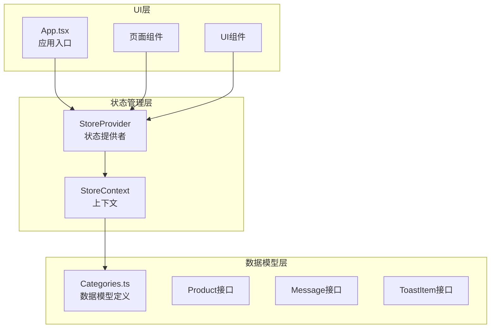
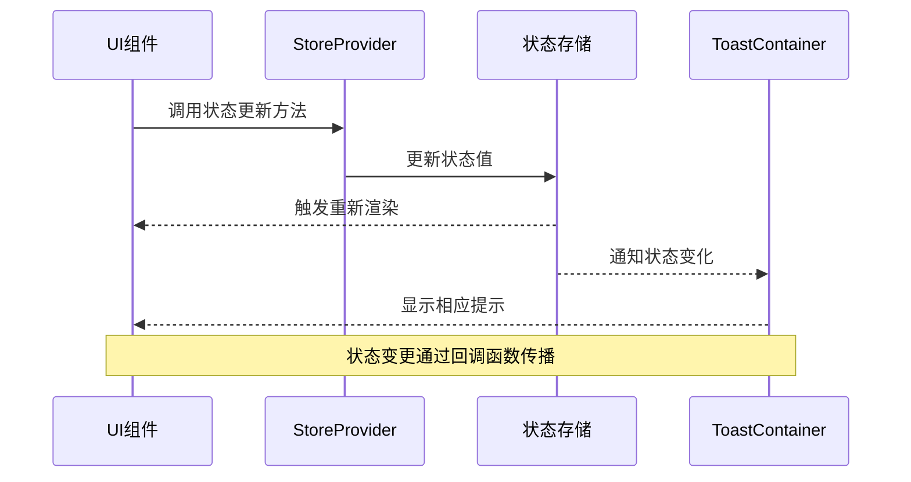
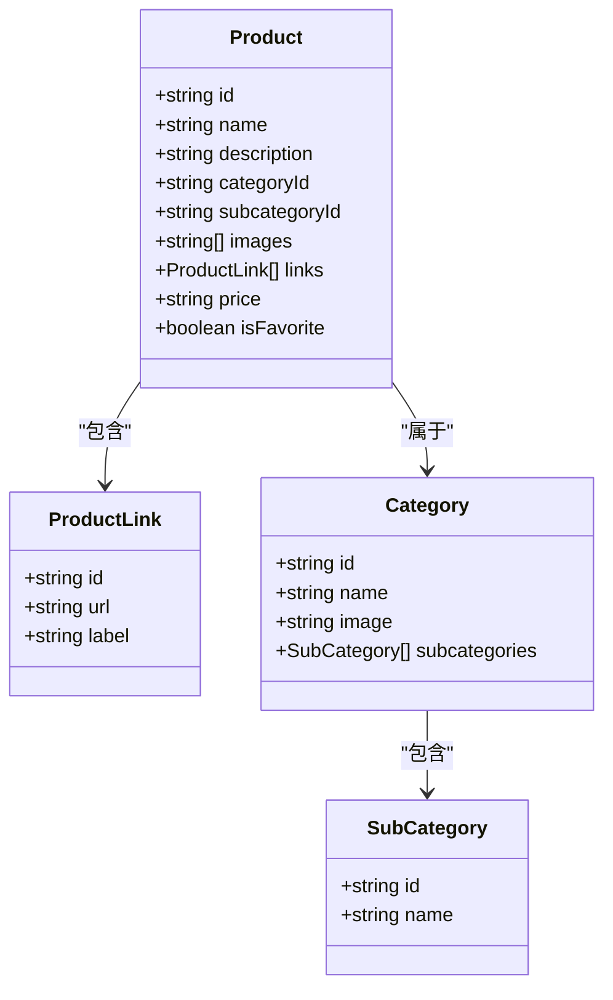
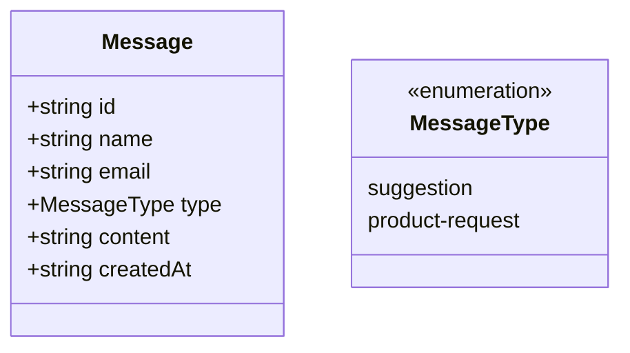
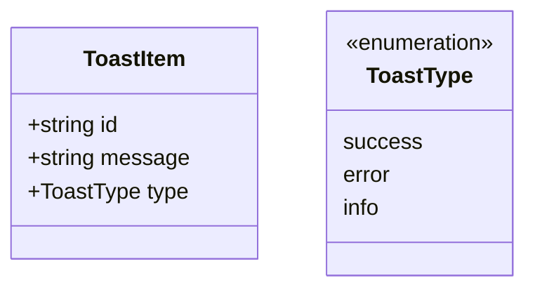
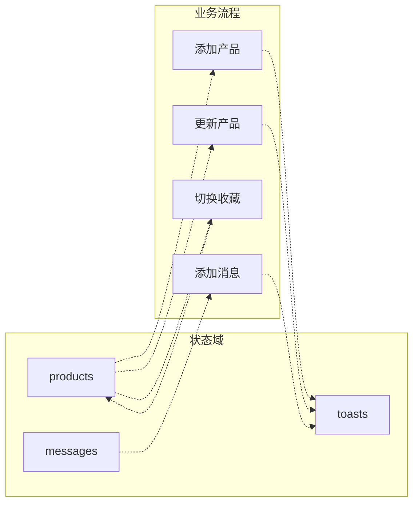
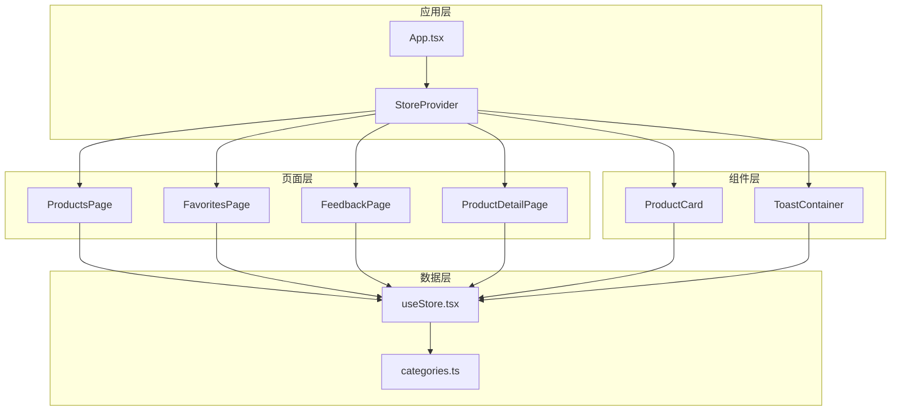
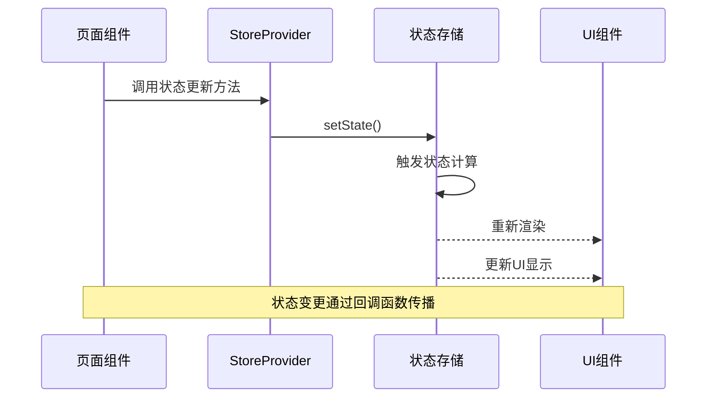

# 状态结构设计

<cite>
**本文档引用的文件**
- [useStore.tsx](file://lienpet-website/src/store/useStore.tsx)
- [categories.ts](file://lienpet-website/src/data/categories.ts)
- [App.tsx](file://lienpet-website/src/App.tsx)
- [ToastContainer.tsx](file://lienpet-website/src/components/ToastContainer.tsx)
- [ProductsPage.tsx](file://lienpet-website/src/pages/ProductsPage.tsx)
- [FavoritesPage.tsx](file://lienpet-website/src/pages/FavoritesPage.tsx)
- [FeedbackPage.tsx](file://lienpet-website/src/pages/FeedbackPage.tsx)
- [ProductCard.tsx](file://lienpet-website/src/components/ProductCard.tsx)
- [ProductDetailPage.tsx](file://lienpet-website/src/pages/ProductDetailPage.tsx)
</cite>

## 目录
1. [引言](#引言)
2. [项目结构](#项目结构)
3. [核心组件](#核心组件)
4. [架构概览](#架构概览)
5. [详细组件分析](#详细组件分析)
6. [依赖关系分析](#依赖关系分析)
7. [性能考虑](#性能考虑)
8. [故障排除指南](#故障排除指南)
9. [结论](#结论)

## 引言

本文件详细分析LienPet项目的全局状态结构设计，重点阐述products、messages、toasts三个核心状态域的数据模型设计。该应用采用React Context作为状态管理方案，通过自定义Hook提供全局状态访问能力。系统通过统一的状态存储实现了产品管理、用户反馈收集和通知提示等核心功能。

## 项目结构

LienPet项目采用模块化架构，状态管理集中在store目录下，数据模型定义在data目录中，UI组件分布在components和pages目录中。

**图表来源**
- [useStore.tsx:1-100](file://lienpet-website/src/store/useStore.tsx#L1-L100)
- [categories.ts:19-38](file://lienpet-website/src/data/categories.ts#L19-L38)

**章节来源**
- [useStore.tsx:1-100](file://lienpet-website/src/store/useStore.tsx#L1-L100)
- [App.tsx:1-37](file://lienpet-website/src/App.tsx#L1-L37)

## 核心组件

### StoreProvider - 状态提供者

StoreProvider是整个应用的状态根节点，负责：
- 初始化三个核心状态域：products、messages、toasts
- 提供状态更新方法：toggleFavorite、addMessage、addProduct、updateProduct、deleteProduct、addToast
- 管理状态的生命周期和依赖关系

### StoreContext - 上下文定义

StoreContext定义了完整的状态接口，包括：
- 产品状态：products数组及其操作方法
- 消息状态：messages数组及其添加方法
- 通知状态：toasts数组及其添加方法
- 辅助方法：toggleFavorite、getFavorites等

**章节来源**
- [useStore.tsx:5-25](file://lienpet-website/src/store/useStore.tsx#L5-L25)
- [useStore.tsx:27-94](file://lienpet-website/src/store/useStore.tsx#L27-L94)

## 架构概览

系统采用单向数据流架构，状态变更通过回调函数传播到所有订阅组件。

**图表来源**
- [useStore.tsx:32-38](file://lienpet-website/src/store/useStore.tsx#L32-L38)
- [ToastContainer.tsx:4-28](file://lienpet-website/src/components/ToastContainer.tsx#L4-L28)

## 详细组件分析

### 产品状态域 (products)

#### 数据模型结构

**图表来源**
- [categories.ts:19-29](file://lienpet-website/src/data/categories.ts#L19-L29)
- [categories.ts:13-17](file://lienpet-website/src/data/categories.ts#L13-L17)
- [categories.ts:6-11](file://lienpet-website/src/data/categories.ts#L6-L11)

#### 字段含义与业务逻辑

| 字段名 | 类型 | 必填 | 默认值 | 业务含义 |
|--------|------|------|--------|----------|
| id | string | 是 | 自动生成 | 产品唯一标识符 |
| name | string | 是 | 空字符串 | 产品名称 |
| description | string | 是 | 空字符串 | 产品描述信息 |
| categoryId | string | 是 | 空字符串 | 所属主分类ID |
| subcategoryId | string | 是 | 空字符串 | 所属子分类ID |
| images | string[] | 否 | [''] | 产品图片URL数组 |
| links | ProductLink[] | 否 | [] | 外部链接数组 |
| price | string | 否 | undefined | 产品价格信息 |
| isFavorite | boolean | 否 | false | 收藏状态标记 |

#### 数据转换逻辑

产品状态的转换遵循以下规则：
- ID生成：使用时间戳前缀确保唯一性
- 图片处理：支持多图上传，限制最多10张
- 链接管理：动态添加和删除外部链接
- 收藏切换：通过布尔值反转实现

**章节来源**
- [categories.ts:19-29](file://lienpet-website/src/data/categories.ts#L19-L29)
- [useStore.tsx:62-76](file://lienpet-website/src/store/useStore.tsx#L62-L76)

### 消息状态域 (messages)

#### 数据模型结构

**图表来源**
- [categories.ts:31-38](file://lienpet-website/src/data/categories.ts#L31-L38)

#### 字段含义与业务逻辑

| 字段名 | 类型 | 必填 | 默认值 | 业务含义 |
|--------|------|------|--------|----------|
| id | string | 是 | 自动生成 | 消息唯一标识符 |
| name | string | 是 | 空字符串 | 用户姓名 |
| email | string | 否 | 空字符串 | 用户邮箱地址 |
| type | 'suggestion' \| 'product-request' | 是 | 枚举值 | 消息类型 |
| content | string | 是 | 空字符串 | 消息内容 |
| createdAt | string | 是 | ISO时间戳 | 创建时间 |

#### 数据验证规则

消息状态的验证遵循以下规则：
- 必填字段检查：姓名和内容必须非空
- 邮箱格式验证：可选字段，格式验证
- 类型枚举约束：仅允许指定的两种类型
- 时间戳自动生成：使用ISO 8601格式

**章节来源**
- [categories.ts:31-38](file://lienpet-website/src/data/categories.ts#L31-L38)
- [useStore.tsx:52-60](file://lienpet-website/src/store/useStore.tsx#L52-L60)

### 通知状态域 (toasts)

#### 数据模型结构

**图表来源**
- [useStore.tsx:19-23](file://lienpet-website/src/store/useStore.tsx#L19-L23)

#### 字段含义与业务逻辑

| 字段名 | 类型 | 必填 | 默认值 | 业务含义 |
|--------|------|------|--------|----------|
| id | string | 是 | 时间戳 | 通知唯一标识符 |
| message | string | 是 | 空字符串 | 通知文本内容 |
| type | 'success' \| 'error' \| 'info' | 否 | 'success' | 通知类型 |

#### 自动清理机制

通知状态具有自动清理特性：
- 3秒延迟后自动移除
- 基于ID的精确匹配删除
- 支持多种通知类型显示

**章节来源**
- [useStore.tsx:19-23](file://lienpet-website/src/store/useStore.tsx#L19-L23)
- [useStore.tsx:32-38](file://lienpet-website/src/store/useStore.tsx#L32-L38)

### 状态间关联关系

**图表来源**
- [useStore.tsx:62-81](file://lienpet-website/src/store/useStore.tsx#L62-L81)
- [useStore.tsx:52-60](file://lienpet-website/src/store/useStore.tsx#L52-L60)

## 依赖关系分析

### 组件依赖图

**图表来源**
- [App.tsx:13-35](file://lienpet-website/src/App.tsx#L13-L35)
- [useStore.tsx:27-94](file://lienpet-website/src/store/useStore.tsx#L27-L94)

### 状态更新流程

**图表来源**
- [ProductsPage.tsx:14-25](file://lienpet-website/src/pages/ProductsPage.tsx#L14-L25)
- [FavoritesPage.tsx:8-9](file://lienpet-website/src/pages/FavoritesPage.tsx#L8-L9)

**章节来源**
- [ProductsPage.tsx:14-25](file://lienpet-website/src/pages/ProductsPage.tsx#L14-L25)
- [FavoritesPage.tsx:8-9](file://lienpet-website/src/pages/FavoritesPage.tsx#L8-L9)

## 性能考虑

### 状态优化策略

1. **状态分离**：将不同类型的业务状态分离存储，避免不必要的重渲染
2. **回调缓存**：使用useCallback优化回调函数，减少组件重渲染
3. **选择性更新**：通过精确的状态更新避免全量状态替换
4. **内存管理**：通知状态自动清理机制防止内存泄漏

### 渲染性能优化

- 使用React.memo包装UI组件
- 实施虚拟滚动处理大量产品列表
- 图片懒加载提升首屏性能
- 分页加载减少一次性渲染压力

## 故障排除指南

### 常见问题及解决方案

#### 状态未更新问题
**症状**：UI不响应状态变更
**原因**：状态更新方法未正确调用或作用域错误
**解决**：确认useStore Hook的正确使用和状态更新方法的调用时机

#### 通知不消失问题
**症状**：Toast持续显示不自动消失
**原因**：定时器未正确清理或ID冲突
**解决**：检查addToast方法的时间戳生成和清理逻辑

#### 产品数据丢失问题
**症状**：产品列表显示异常或数据不一致
**原因**：状态同步问题或数据转换错误
**解决**：验证数据模型的一致性和状态更新的原子性

**章节来源**
- [useStore.tsx:32-38](file://lienpet-website/src/store/useStore.tsx#L32-L38)
- [useStore.tsx:62-81](file://lienpet-website/src/store/useStore.tsx#L62-L81)

## 结论

LienPet项目的状态结构设计体现了清晰的分层架构和良好的数据模型组织。通过React Context实现的状态管理方案为应用提供了：
- 明确的状态边界和职责分离
- 可预测的状态更新流程
- 良好的扩展性和维护性
- 完善的错误处理和验证机制

该设计为后续的功能扩展和性能优化奠定了坚实基础，建议在保持现有架构原则的前提下逐步引入更复杂的状态管理模式。