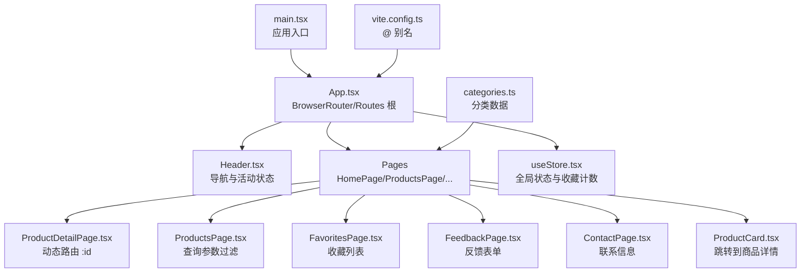
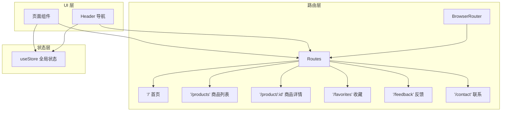
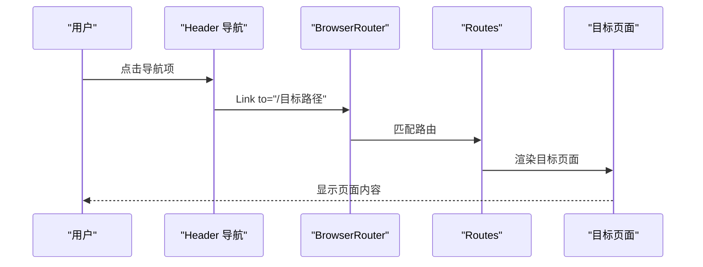
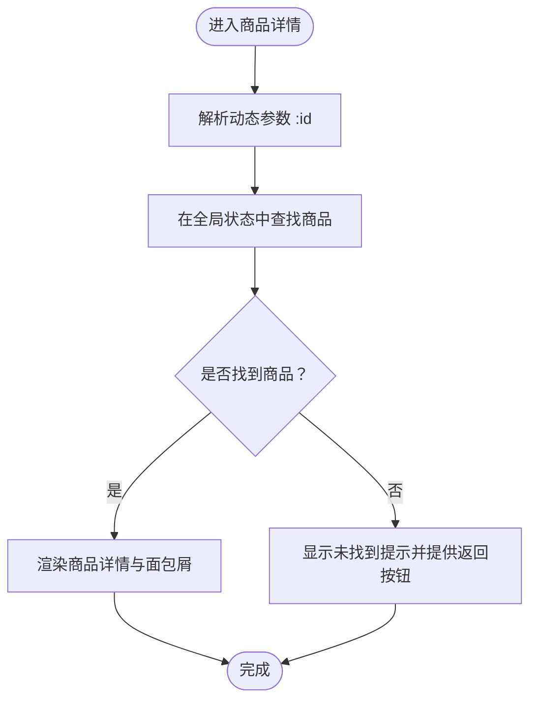
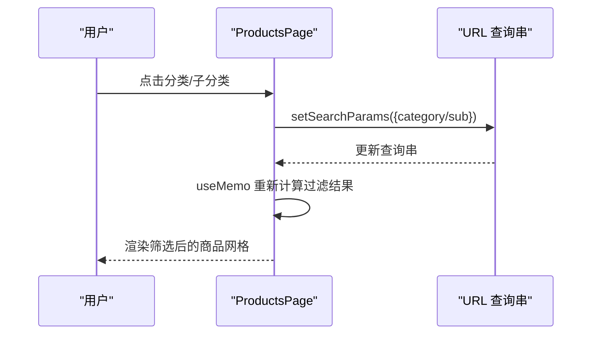
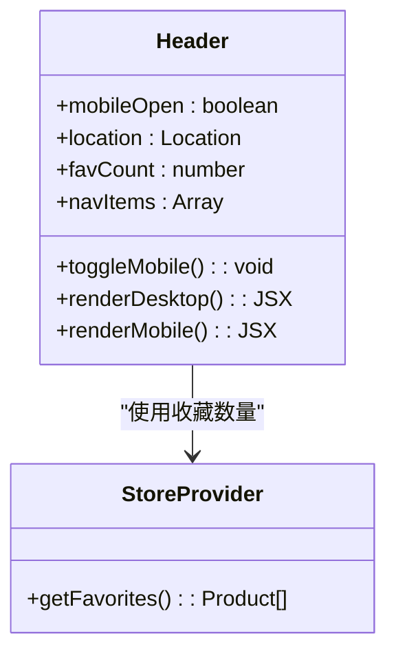
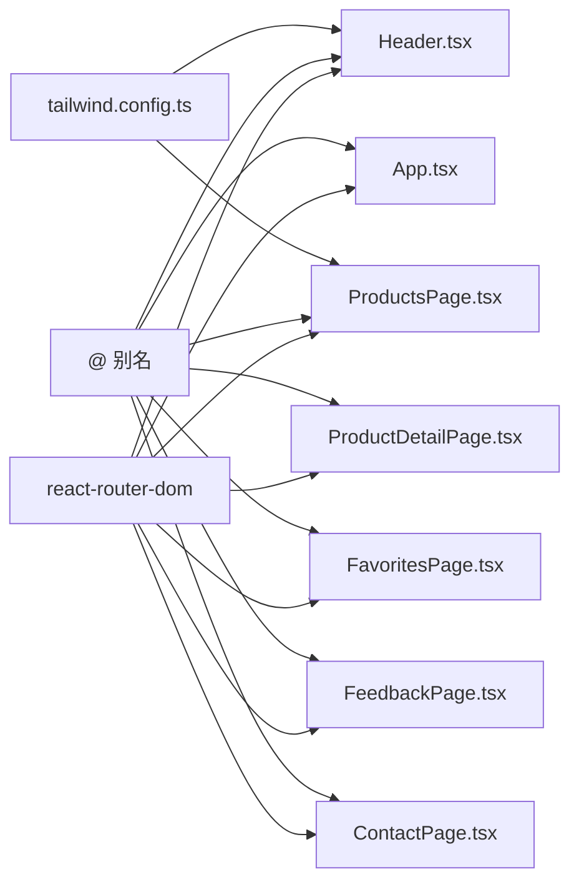

# 路由与导航

<cite>
**本文引用的文件**
- [App.tsx](file://lienpet-website/src/App.tsx)
- [main.tsx](file://lienpet-website/src/main.tsx)
- [Header.tsx](file://lienpet-website/src/components/Header.tsx)
- [ProductsPage.tsx](file://lienpet-website/src/pages/ProductsPage.tsx)
- [ProductDetailPage.tsx](file://lienpet-website/src/pages/ProductDetailPage.tsx)
- [FavoritesPage.tsx](file://lienpet-website/src/pages/FavoritesPage.tsx)
- [FeedbackPage.tsx](file://lienpet-website/src/pages/FeedbackPage.tsx)
- [ContactPage.tsx](file://lienpet-website/src/pages/ContactPage.tsx)
- [HomePage.tsx](file://lienpet-website/src/pages/HomePage.tsx)
- [ProductCard.tsx](file://lienpet-website/src/components/ProductCard.tsx)
- [useStore.tsx](file://lienpet-website/src/store/useStore.tsx)
- [categories.ts](file://lienpet-website/src/data/categories.ts)
- [package.json](file://lienpet-website/package.json)
- [vite.config.ts](file://lienpet-website/vite.config.ts)
- [tailwind.config.ts](file://lienpet-website/tailwind.config.ts)
</cite>

## 目录
1. [简介](#简介)
2. [项目结构](#项目结构)
3. [核心组件](#核心组件)
4. [架构总览](#架构总览)
5. [详细组件分析](#详细组件分析)
6. [依赖分析](#依赖分析)
7. [性能考虑](#性能考虑)
8. [故障排查指南](#故障排查指南)
9. [结论](#结论)
10. [附录](#附录)

## 简介
本文件系统性梳理 LienPet 项目的前端路由与导航体系，围绕基于 React Router DOM 的 SPA 路由配置展开，重点覆盖以下方面：
- 路由表设计与路径规划
- 动态路由参数处理（如商品详情页的 :id）
- 嵌套路由与页面级导航的协作
- Header 导航组件的响应式设计（桌面端与移动端）
- 活动状态指示、面包屑导航与页面标题管理现状
- 路由守卫与权限控制的实现建议
- 导航性能优化、预加载策略与用户体验改进

## 项目结构
LienPet 采用 Vite + React + TailwindCSS 技术栈，路由与导航相关的核心文件分布如下：
- 应用入口与路由根：App.tsx、main.tsx
- 导航与布局：Header.tsx、Footer.tsx（在 App.tsx 中被引入）
- 页面组件：HomePage、ProductsPage、ProductDetailPage、FavoritesPage、FeedbackPage、ContactPage
- 数据模型与状态：categories.ts、useStore.tsx
- 构建与别名：vite.config.ts、tailwind.config.ts、package.json

图表来源
- [main.tsx:1-10](file://lienpet-website/src/main.tsx#L1-L10)
- [App.tsx:1-37](file://lienpet-website/src/App.tsx#L1-L37)
- [Header.tsx:1-93](file://lienpet-website/src/components/Header.tsx#L1-L93)
- [ProductsPage.tsx:1-167](file://lienpet-website/src/pages/ProductsPage.tsx#L1-L167)
- [ProductDetailPage.tsx:1-254](file://lienpet-website/src/pages/ProductDetailPage.tsx#L1-L254)
- [FavoritesPage.tsx:1-42](file://lienpet-website/src/pages/FavoritesPage.tsx#L1-L42)
- [FeedbackPage.tsx:1-111](file://lienpet-website/src/pages/FeedbackPage.tsx#L1-L111)
- [ContactPage.tsx:1-75](file://lienpet-website/src/pages/ContactPage.tsx#L1-L75)
- [HomePage.tsx:1-152](file://lienpet-website/src/pages/HomePage.tsx#L1-L152)
- [ProductCard.tsx:1-51](file://lienpet-website/src/components/ProductCard.tsx#L1-L51)
- [useStore.tsx:1-100](file://lienpet-website/src/store/useStore.tsx#L1-L100)
- [categories.ts:1-244](file://lienpet-website/src/data/categories.ts#L1-L244)
- [vite.config.ts:1-12](file://lienpet-website/vite.config.ts#L1-L12)

章节来源
- [main.tsx:1-10](file://lienpet-website/src/main.tsx#L1-L10)
- [App.tsx:1-37](file://lienpet-website/src/App.tsx#L1-L37)
- [vite.config.ts:1-12](file://lienpet-website/vite.config.ts#L1-L12)

## 核心组件
- 路由根与容器
  - App.tsx 使用 BrowserRouter 包裹整个应用，并在 Routes 中声明所有页面级路由，包含首页、商品列表、商品详情、收藏、反馈、联系等。
- 导航与活动状态
  - Header.tsx 通过 useLocation 获取当前路径，使用 className 条件判断实现“活动状态”高亮；同时提供桌面端与移动端两种导航视图。
- 页面级导航与交互
  - ProductsPage.tsx 使用 useSearchParams 实现查询参数驱动的分类筛选；ProductDetailPage.tsx 使用 useParams 提取动态参数 :id；FavoritesPage.tsx 从全局状态读取收藏列表；各页面通过 Link 或 Button 触发导航。

章节来源
- [App.tsx:13-35](file://lienpet-website/src/App.tsx#L13-L35)
- [Header.tsx:6-93](file://lienpet-website/src/components/Header.tsx#L6-L93)
- [ProductsPage.tsx:9-44](file://lienpet-website/src/pages/ProductsPage.tsx#L9-L44)
- [ProductDetailPage.tsx:8-25](file://lienpet-website/src/pages/ProductDetailPage.tsx#L8-L25)
- [FavoritesPage.tsx:7-42](file://lienpet-website/src/pages/FavoritesPage.tsx#L7-L42)

## 架构总览
下图展示路由与导航的整体关系：BrowserRouter 作为根容器，Routes 定义静态路由；Header 在任意页面均可见，负责主导航与移动端菜单；页面组件通过 Link/导航函数与参数化路由进行交互；全局状态用于收藏计数与消息提示。

图表来源
- [App.tsx:15-29](file://lienpet-website/src/App.tsx#L15-L29)
- [Header.tsx:19-91](file://lienpet-website/src/components/Header.tsx#L19-L91)
- [useStore.tsx:27-93](file://lienpet-website/src/store/useStore.tsx#L27-L93)

## 详细组件分析

### 路由表设计与导航实现
- 静态路由
  - 首页、商品列表、收藏、反馈、联系均为静态路径，直接匹配。
  - 商品详情使用动态参数 :id，通过 useParams 在组件内解析。
- 路由渲染
  - 所有页面组件在 App.tsx 的 Routes 中注册，形成单一出口的页面级路由。
- 导航触发
  - Header.tsx 使用 Link 组件进行同站跳转；移动端菜单点击后自动收起。
  - ProductCard.tsx 将用户引导至商品详情页。

图表来源
- [Header.tsx:26-40](file://lienpet-website/src/components/Header.tsx#L26-L40)
- [App.tsx:21-28](file://lienpet-website/src/App.tsx#L21-L28)

章节来源
- [App.tsx:21-28](file://lienpet-website/src/App.tsx#L21-L28)
- [Header.tsx:12-17](file://lienpet-website/src/components/Header.tsx#L12-L17)
- [ProductCard.tsx:16](file://lienpet-website/src/components/ProductCard.tsx#L16)

### 动态路由参数与商品详情导航
- 参数提取
  - ProductDetailPage.tsx 使用 useParams 解析 :id，并据此在全局状态中查找对应商品。
- 错误处理
  - 当未找到商品时，显示提示并提供返回按钮。
- 面包屑导航
  - 通过 Link 与 useNavigate 实现“返回上一页”“全部商品”“分类/子分类”的层级跳转，增强可发现性与可回溯性。

图表来源
- [ProductDetailPage.tsx:8-25](file://lienpet-website/src/pages/ProductDetailPage.tsx#L8-L25)
- [ProductDetailPage.tsx:80-101](file://lienpet-website/src/pages/ProductDetailPage.tsx#L80-L101)

章节来源
- [ProductDetailPage.tsx:8-25](file://lienpet-website/src/pages/ProductDetailPage.tsx#L8-L25)
- [ProductDetailPage.tsx:80-101](file://lienpet-website/src/pages/ProductDetailPage.tsx#L80-L101)

### 查询参数与商品筛选导航
- 参数解析
  - ProductsPage.tsx 使用 useSearchParams 读取 category 与 sub 查询参数，实现分类与子分类的筛选。
- 状态更新
  - setSearchParams 更新 URL 查询串，配合 useMemo 进行本地过滤，避免重复渲染。
- 移动端侧边栏
  - 通过状态控制侧边栏显隐，点击分类项后自动关闭面板，提升移动端可用性。

图表来源
- [ProductsPage.tsx:10-44](file://lienpet-website/src/pages/ProductsPage.tsx#L10-L44)
- [ProductsPage.tsx:66-126](file://lienpet-website/src/pages/ProductsPage.tsx#L66-L126)

章节来源
- [ProductsPage.tsx:9-44](file://lienpet-website/src/pages/ProductsPage.tsx#L9-L44)
- [ProductsPage.tsx:66-126](file://lienpet-website/src/pages/ProductsPage.tsx#L66-L126)

### Header 导航组件的响应式设计
- 桌面端
  - 使用 Flex 布局展示导航项，通过 useLocation 的 pathname 与当前路径比较，动态切换活动样式。
- 移动端
  - 通过按钮切换 mobileOpen 状态，渲染移动端导航面板；点击项后自动收起菜单。
- 收藏角标
  - 通过 useStore 获取收藏数量，在图标右上角以徽章形式显示。

图表来源
- [Header.tsx:6-93](file://lienpet-website/src/components/Header.tsx#L6-L93)
- [useStore.tsx:48-50](file://lienpet-website/src/store/useStore.tsx#L48-L50)

章节来源
- [Header.tsx:6-93](file://lienpet-website/src/components/Header.tsx#L6-L93)
- [useStore.tsx:48-50](file://lienpet-website/src/store/useStore.tsx#L48-L50)

### 活动状态指示、面包屑导航与页面标题管理
- 活动状态
  - Header.tsx 通过比较 location.pathname 与导航项路径，动态设置活动样式，直观指示当前位置。
- 面包屑
  - ProductDetailPage.tsx 提供多层级面包屑：返回上一页 → 全部商品 → 分类 → 子分类 → 当前商品，便于用户定位与快速跳转。
- 页面标题管理
  - 当前代码未实现页面标题（title）的动态更新。建议在各页面组件中使用浏览器原生 API 或第三方库（如 react-helmet）在组件挂载时设置 document.title。

章节来源
- [Header.tsx:31-35](file://lienpet-website/src/components/Header.tsx#L31-L35)
- [ProductDetailPage.tsx:80-101](file://lienpet-website/src/pages/ProductDetailPage.tsx#L80-L101)

### 路由守卫与权限控制策略
- 当前实现
  - 项目未实现路由守卫或权限拦截逻辑，所有路由均可直接访问。
- 推荐方案
  - 自定义 Hook：在 App.tsx 的 Routes 外层封装一个带权限校验的组件，根据用户登录状态或角色决定是否允许进入目标路由。
  - 前置检查：在进入路由前检查 token 或用户信息，未通过则重定向至登录页或首页。
  - 嵌套守卫：为需要权限的页面（如收藏、反馈）单独配置守卫，未登录时统一跳转至登录页。
  - 注意：以上为实现建议，需结合后端接口与认证流程具体落地。

[本节为概念性指导，不直接分析具体文件，故无章节来源]

### 导航性能优化、预加载策略与用户体验
- 图片懒加载
  - ProductCard.tsx 对图片使用 loading="lazy"，减少首屏资源压力。
- 本地过滤与记忆化
  - ProductsPage.tsx 使用 useMemo 缓存过滤结果，避免每次渲染都重新计算。
- 移动端交互优化
  - Header.tsx 的移动端菜单使用动画类，提供顺滑过渡体验。
- 预加载建议
  - 针对高频访问的页面（如首页、商品列表），可在路由切换前进行轻量预取（如预取分类数据）。
  - 对于商品详情页，可在用户悬停或即将进入时预取相关数据（如评论、推荐商品）。
- 用户体验
  - Toast 提示：useStore.tsx 提供 addToast，用于反馈操作结果（如添加/删除商品、提交反馈）。
  - 加载与错误状态：商品详情页对“未找到商品”提供明确提示与返回路径。

章节来源
- [ProductCard.tsx:21](file://lienpet-website/src/components/ProductCard.tsx#L21)
- [ProductsPage.tsx:16-25](file://lienpet-website/src/pages/ProductsPage.tsx#L16-L25)
- [useStore.tsx:32-38](file://lienpet-website/src/store/useStore.tsx#L32-L38)
- [ProductDetailPage.tsx:18-25](file://lienpet-website/src/pages/ProductDetailPage.tsx#L18-L25)

## 依赖分析
- 路由与导航
  - react-router-dom：BrowserRouter、Routes、Route、Link、useNavigate、useParams、useLocation、useSearchParams。
- 构建与别名
  - vite.config.ts 设置 @ 别名指向 src，简化导入路径。
- 样式与动画
  - tailwind.config.ts 定义主题色、圆角、字体与动画 keyframes，Header 的移动端菜单使用 fade-in 动画类。
- 依赖版本
  - package.json 指定 react-router-dom 版本为 ^7.1.1，确保与当前实现兼容。

图表来源
- [package.json:11-20](file://lienpet-website/package.json#L11-L20)
- [vite.config.ts:7-11](file://lienpet-website/vite.config.ts#L7-L11)
- [tailwind.config.ts:72-100](file://lienpet-website/tailwind.config.ts#L72-L100)

章节来源
- [package.json:11-20](file://lienpet-website/package.json#L11-L20)
- [vite.config.ts:7-11](file://lienpet-website/vite.config.ts#L7-L11)
- [tailwind.config.ts:72-100](file://lienpet-website/tailwind.config.ts#L72-L100)

## 性能考虑
- 路由切换性能
  - 使用静态路由与轻量页面组件，避免不必要的重渲染。
  - 对高频页面采用 useMemo 与 useCallback 降低计算成本。
- 资源加载
  - 图片懒加载与移动端菜单动画，减少首屏阻塞与交互抖动。
- 状态共享
  - 将收藏等跨页面状态集中管理，避免重复请求与状态分散。

[本节为通用性能建议，不直接分析具体文件，故无章节来源]

## 故障排查指南
- 路由无法匹配
  - 检查 App.tsx 中 Routes 是否包含目标路径；确认 Link 的 to 与 Route 的 path 一致。
- 动态路由参数无效
  - 确认 ProductDetailPage.tsx 使用 useParams 提取 :id，并在全局状态中存在对应商品。
- 查询参数筛选异常
  - 检查 ProductsPage.tsx 的 useSearchParams 与 setSearchParams 调用，确保 category 与 sub 参数正确传递。
- 活动状态不生效
  - 确认 Header.tsx 使用 useLocation 并与导航项路径完全一致（含末尾斜杠）。
- 移动端菜单无法收起
  - 检查 Header.tsx 的 onClick 事件与 mobileOpen 状态切换逻辑。

章节来源
- [App.tsx:21-28](file://lienpet-website/src/App.tsx#L21-L28)
- [ProductDetailPage.tsx:8-25](file://lienpet-website/src/pages/ProductDetailPage.tsx#L8-L25)
- [ProductsPage.tsx:10-44](file://lienpet-website/src/pages/ProductsPage.tsx#L10-L44)
- [Header.tsx:31-35](file://lienpet-website/src/components/Header.tsx#L31-L35)

## 结论
LienPet 的路由与导航体系以 React Router DOM 为核心，采用简洁的静态路由与动态参数相结合的方式，辅以 Header 的活动状态指示与移动端响应式设计，满足基础的页面导航需求。商品筛选与详情页的参数化导航体现了良好的可扩展性。后续可在页面标题管理、路由守卫与权限控制、预加载策略等方面进一步完善，以提升安全性与用户体验。

[本节为总结性内容，不直接分析具体文件，故无章节来源]

## 附录
- 关键文件速览
  - 路由与入口：[main.tsx:1-10](file://lienpet-website/src/main.tsx#L1-L10)、[App.tsx:1-37](file://lienpet-website/src/App.tsx#L1-L37)
  - 导航与布局：[Header.tsx:1-93](file://lienpet-website/src/components/Header.tsx#L1-L93)
  - 页面组件：[HomePage.tsx:1-152](file://lienpet-website/src/pages/HomePage.tsx#L1-L152)、[ProductsPage.tsx:1-167](file://lienpet-website/src/pages/ProductsPage.tsx#L1-L167)、[ProductDetailPage.tsx:1-254](file://lienpet-website/src/pages/ProductDetailPage.tsx#L1-L254)、[FavoritesPage.tsx:1-42](file://lienpet-website/src/pages/FavoritesPage.tsx#L1-L42)、[FeedbackPage.tsx:1-111](file://lienpet-website/src/pages/FeedbackPage.tsx#L1-L111)、[ContactPage.tsx:1-75](file://lienpet-website/src/pages/ContactPage.tsx#L1-L75)
  - 状态与数据：[useStore.tsx:1-100](file://lienpet-website/src/store/useStore.tsx#L1-L100)、[categories.ts:1-244](file://lienpet-website/src/data/categories.ts#L1-L244)
  - 工程配置：[vite.config.ts:1-12](file://lienpet-website/vite.config.ts#L1-L12)、[tailwind.config.ts:1-106](file://lienpet-website/tailwind.config.ts#L1-L106)、[package.json:1-31](file://lienpet-website/package.json#L1-L31)

[本节为补充信息，不直接分析具体文件，故无章节来源]