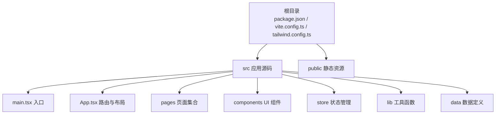
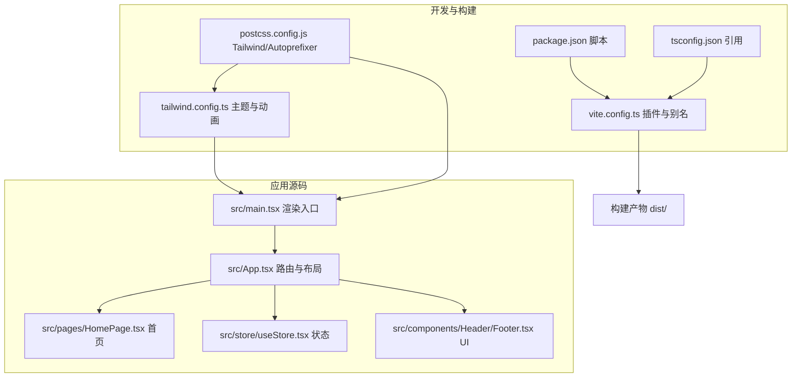
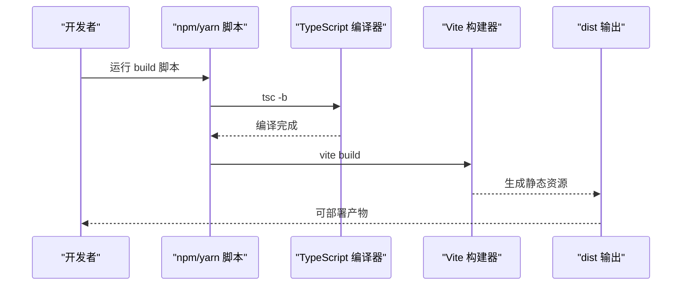
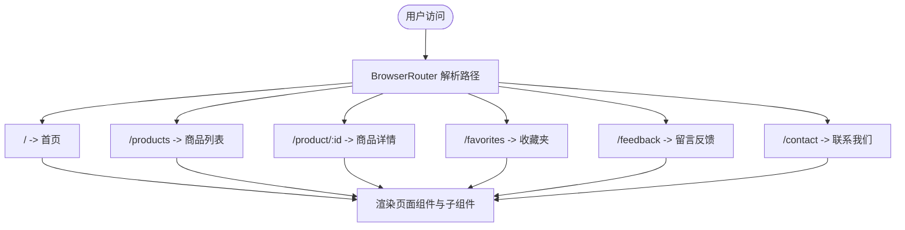
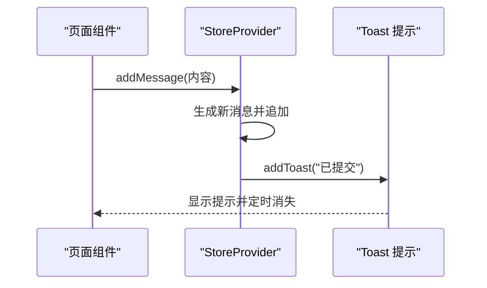
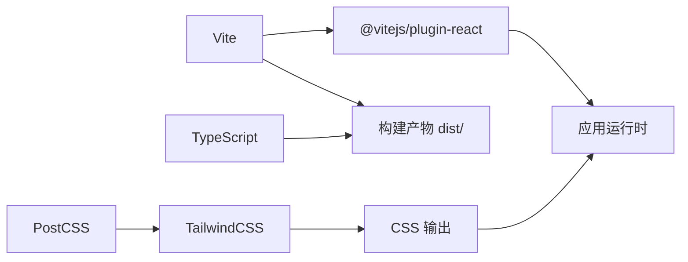

# 部署指南

<cite>
**本文引用的文件**
- [package.json](file://lienpet-website/package.json)
- [vite.config.ts](file://lienpet-website/vite.config.ts)
- [index.html](file://lienpet-website/index.html)
- [tailwind.config.ts](file://lienpet-website/tailwind.config.ts)
- [postcss.config.js](file://lienpet-website/postcss.config.js)
- [tsconfig.json](file://lienpet-website/tsconfig.json)
- [src/main.tsx](file://lienpet-website/src/main.tsx)
- [src/App.tsx](file://lienpet-website/src/App.tsx)
- [src/pages/HomePage.tsx](file://lienpet-website/src/pages/HomePage.tsx)
- [src/store/useStore.tsx](file://lienpet-website/src/store/useStore.tsx)
- [src/components/Header.tsx](file://lienpet-website/src/components/Header.tsx)
- [src/components/Footer.tsx](file://lienpet-website/src/components/Footer.tsx)
</cite>

## 目录
1. [简介](#简介)
2. [项目结构](#项目结构)
3. [核心组件](#核心组件)
4. [架构总览](#架构总览)
5. [详细组件分析](#详细组件分析)
6. [依赖分析](#依赖分析)
7. [性能考虑](#性能考虑)
8. [故障排查指南](#故障排查指南)
9. [结论](#结论)
10. [附录](#附录)

## 简介
本指南面向LienPet网站（React + Vite）在生产环境的部署与运维，覆盖构建流程、部署平台选择（静态托管、云平台、CI/CD）、环境变量与敏感信息管理、域名与HTTPS配置、部署后监控与日志、性能指标采集、回滚与紧急修复等全生命周期实践。本文所有技术建议均基于仓库中现有配置与代码结构进行提炼与扩展。

## 项目结构
LienPet为前端单页应用（SPA），采用Vite作为构建工具，使用React 18与TailwindCSS进行样式组织。核心目录与职责如下：
- 根目录：构建脚本、依赖声明、Vite与Tailwind配置
- src：应用入口、路由、页面、组件、状态管理与工具函数
- public：静态资源（如图片、图标），HTML模板由根目录index.html提供

图表来源
- [package.json:1-31](file://lienpet-website/package.json#L1-L31)
- [vite.config.ts:1-12](file://lienpet-website/vite.config.ts#L1-L12)
- [index.html:1-14](file://lienpet-website/index.html#L1-L14)
- [tailwind.config.ts:1-106](file://lienpet-website/tailwind.config.ts#L1-L106)

章节来源
- [package.json:1-31](file://lienpet-website/package.json#L1-L31)
- [vite.config.ts:1-12](file://lienpet-website/vite.config.ts#L1-L12)
- [index.html:1-14](file://lienpet-website/index.html#L1-L14)
- [tailwind.config.ts:1-106](file://lienpet-website/tailwind.config.ts#L1-L106)
- [postcss.config.js:1-6](file://lienpet-website/postcss.config.js#L1-L6)
- [tsconfig.json:1-6](file://lienpet-website/tsconfig.json#L1-L6)

## 核心组件
- 构建与打包
  - 使用Vite进行开发与生产构建，支持TypeScript与React JSX转换
  - 生产构建输出静态资源，适合部署到静态托管或反向代理
- 路由与页面
  - 基于React Router的SPA路由，包含首页、商品列表、详情、收藏、反馈、联系等页面
- 状态管理
  - 自定义React Context实现的轻量状态管理，包含产品数据、消息、收藏与通知提示
- UI与样式
  - TailwindCSS + 动画插件，通过别名@指向src目录，便于模块化开发

章节来源
- [package.json:6-10](file://lienpet-website/package.json#L6-L10)
- [vite.config.ts:5-12](file://lienpet-website/vite.config.ts#L5-L12)
- [src/App.tsx:1-37](file://lienpet-website/src/App.tsx#L1-L37)
- [src/pages/HomePage.tsx:1-152](file://lienpet-website/src/pages/HomePage.tsx#L1-L152)
- [src/store/useStore.tsx:1-100](file://lienpet-website/src/store/useStore.tsx#L1-L100)
- [tailwind.config.ts:1-106](file://lienpet-website/tailwind.config.ts#L1-L106)

## 架构总览
下图展示从源码到生产产物的关键路径与依赖关系：

图表来源
- [package.json:6-10](file://lienpet-website/package.json#L6-L10)
- [vite.config.ts:5-12](file://lienpet-website/vite.config.ts#L5-L12)
- [tsconfig.json:1-6](file://lienpet-website/tsconfig.json#L1-L6)
- [postcss.config.js:1-6](file://lienpet-website/postcss.config.js#L1-L6)
- [tailwind.config.ts:1-106](file://lienpet-website/tailwind.config.ts#L1-L106)
- [src/main.tsx:1-10](file://lienpet-website/src/main.tsx#L1-L10)
- [src/App.tsx:1-37](file://lienpet-website/src/App.tsx#L1-L37)
- [src/pages/HomePage.tsx:1-152](file://lienpet-website/src/pages/HomePage.tsx#L1-L152)
- [src/store/useStore.tsx:1-100](file://lienpet-website/src/store/useStore.tsx#L1-L100)
- [src/components/Header.tsx:1-93](file://lienpet-website/src/components/Header.tsx#L1-L93)
- [src/components/Footer.tsx:1-71](file://lienpet-website/src/components/Footer.tsx#L1-L71)

## 详细组件分析

### 构建与打包流程
- 开发模式：通过Vite提供的开发服务器提供热更新与快速启动
- 生产构建：先执行TypeScript编译，再由Vite生成静态资源产物
- 输出结构：dist目录包含HTML、JS、CSS与静态资源，可直接部署至静态托管或反向代理

图表来源
- [package.json:6-10](file://lienpet-website/package.json#L6-L10)
- [vite.config.ts:5-12](file://lienpet-website/vite.config.ts#L5-L12)

章节来源
- [package.json:6-10](file://lienpet-website/package.json#L6-L10)
- [vite.config.ts:5-12](file://lienpet-website/vite.config.ts#L5-L12)

### 路由与页面渲染
- SPA路由：BrowserRouter包裹，定义多条页面路由
- 首页：包含横幅、分类网格、精选商品与联系方式区域
- 状态与UI：Header显示导航与收藏数量；Footer提供快速链接与联系方式

图表来源
- [src/App.tsx:1-37](file://lienpet-website/src/App.tsx#L1-L37)
- [src/pages/HomePage.tsx:1-152](file://lienpet-website/src/pages/HomePage.tsx#L1-L152)
- [src/components/Header.tsx:1-93](file://lienpet-website/src/components/Header.tsx#L1-L93)
- [src/components/Footer.tsx:1-71](file://lienpet-website/src/components/Footer.tsx#L1-L71)

章节来源
- [src/App.tsx:1-37](file://lienpet-website/src/App.tsx#L1-L37)
- [src/pages/HomePage.tsx:1-152](file://lienpet-website/src/pages/HomePage.tsx#L1-L152)
- [src/components/Header.tsx:1-93](file://lienpet-website/src/components/Header.tsx#L1-L93)
- [src/components/Footer.tsx:1-71](file://lienpet-website/src/components/Footer.tsx#L1-L71)

### 状态管理与交互
- StoreProvider提供产品、消息、收藏与Toast提示的状态与方法
- 交互行为：添加/更新/删除产品、切换收藏、提交留言、自动提示

图表来源
- [src/store/useStore.tsx:52-60](file://lienpet-website/src/store/useStore.tsx#L52-L60)
- [src/store/useStore.tsx:32-38](file://lienpet-website/src/store/useStore.tsx#L32-L38)

章节来源
- [src/store/useStore.tsx:1-100](file://lienpet-website/src/store/useStore.tsx#L1-L100)

## 依赖分析
- 构建工具链
  - Vite：开发与构建
  - TypeScript：类型检查与编译
  - PostCSS + TailwindCSS：样式处理与原子类
- 运行时依赖
  - React与Router：UI与路由
  - Tailwind相关工具：clsx、tailwind-merge、class-variance-authority等
- 开发依赖
  - React插件、PostCSS、TailwindCSS、TypeScript、Vite

图表来源
- [package.json:21-30](file://lienpet-website/package.json#L21-L30)
- [postcss.config.js:1-6](file://lienpet-website/postcss.config.js#L1-L6)
- [tailwind.config.ts:1-106](file://lienpet-website/tailwind.config.ts#L1-L106)

章节来源
- [package.json:11-30](file://lienpet-website/package.json#L11-L30)
- [postcss.config.js:1-6](file://lienpet-website/postcss.config.js#L1-L6)
- [tailwind.config.ts:1-106](file://lienpet-website/tailwind.config.ts#L1-L106)

## 性能考虑
- 构建优化
  - 合理拆分与懒加载页面组件，减少首屏体积
  - 图片资源按需加载与尺寸优化，避免阻塞渲染
- 样式与主题
  - Tailwind按需扫描路径确保仅产出所需CSS
  - 使用CSS变量与动画提升渲染性能
- 运行时性能
  - 将大型计算放入Web Worker或服务端处理
  - 对频繁更新的UI使用防抖与节流

## 故障排查指南
- 构建失败
  - 检查TypeScript编译是否通过，确认tsconfig引用正确
  - 确认Vite插件与别名配置无误
- 预览异常
  - 使用本地预览命令验证构建产物可用性
- 运行时错误
  - 查看浏览器控制台与网络面板，定位资源加载问题
  - 检查路由与静态资源路径是否匹配
- 样式问题
  - 确认Tailwind扫描路径包含所有页面与组件
  - 检查PostCSS插件顺序与版本兼容性

章节来源
- [package.json:6-10](file://lienpet-website/package.json#L6-L10)
- [vite.config.ts:5-12](file://lienpet-website/vite.config.ts#L5-L12)
- [tailwind.config.ts:5-8](file://lienpet-website/tailwind.config.ts#L5-L8)
- [postcss.config.js:1-6](file://lienpet-website/postcss.config.js#L1-L6)

## 结论
LienPet项目具备清晰的前端工程化结构与可移植的构建产物，适合在多种部署平台上快速上线。结合本文的部署准备、平台配置、安全与监控建议，可在保证稳定性的同时实现高效迭代与维护。

## 附录

### A. 生产环境构建与部署准备
- 本地构建
  - 执行构建脚本生成dist目录
  - 使用预览命令验证产物
- 静态托管准备
  - 将dist目录上传至托管平台
  - 配置CNAME或自定义域名解析
- 云平台准备
  - 选择支持静态站点托管或反向代理的容器/函数服务
  - 准备环境变量与密钥注入（见“环境变量与敏感信息”）

章节来源
- [package.json:6-10](file://lienpet-website/package.json#L6-L10)
- [index.html:1-14](file://lienpet-website/index.html#L1-L14)

### B. 多种部署平台配置方案
- 静态托管服务（如GitHub Pages、Vercel、Netlify）
  - 推荐：将dist作为发布目录，启用SPA回退至index.html
  - 注意：确保路由模式与托管平台的SPA支持一致
- 云平台部署（如阿里云OSS+CDN、AWS S3+CloudFront）
  - 推荐：OSS静态托管 + CDN加速 + 自定义域名
  - 注意：配置CORS与缓存策略，开启Gzip/Brotli压缩
- CI/CD集成（如GitHub Actions、GitLab CI、Jenkins）
  - 推荐：流水线包含安装依赖、构建、测试、上传制品、部署到目标环境
  - 注意：在CI中注入环境变量与密钥，避免硬编码

### C. 环境变量与敏感信息管理
- 环境变量
  - 在构建阶段注入的变量前缀应遵循平台规范（如Vite默认前缀）
  - 仅暴露必要参数，避免泄露业务密钥
- 密钥与令牌
  - 使用平台提供的密钥管理服务或加密存储
  - 不将任何密钥写入仓库或构建产物

### D. 域名配置、HTTPS与SSL
- 域名解析
  - 将域名指向托管平台提供的CNAME或IP
- HTTPS与SSL
  - 托管平台通常提供免费SSL证书与自动续期
  - 如使用自定义域名，确保证书覆盖主域与泛域名

### E. 部署后监控、日志与性能指标
- 监控
  - 前端埋点：记录页面访问、交互事件与错误
  - 性能指标：首屏时间、资源加载时延、TTFB、FID/LCP
- 日志
  - 浏览器错误上报：统一收集并归档
  - 服务端日志：若存在API网关或边缘函数，开启访问与错误日志
- 告警
  - 设定阈值告警（错误率、响应时延、离线率）

### F. 回滚策略与紧急修复
- 回滚策略
  - 版本化发布：以构建产物哈希命名，保留最近N个版本
  - 快速回滚：一键切换到上一个稳定版本
- 紧急修复
  - 热修复分支：最小改动修复后立即合并并重新发布
  - A/B灰度：逐步扩大流量，观察指标后再全量