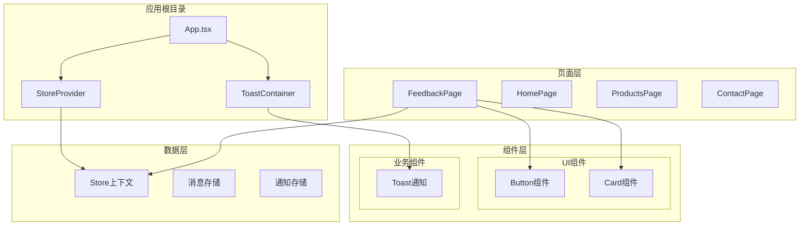
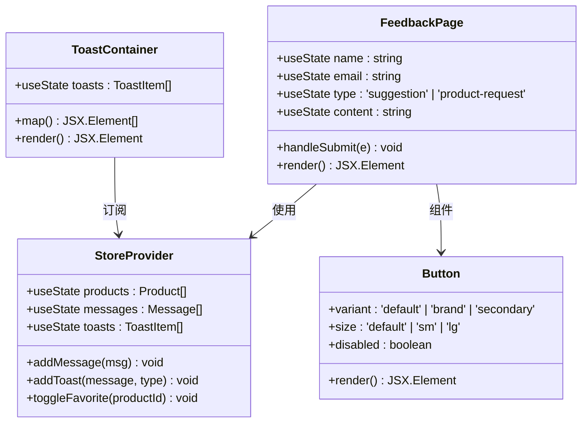
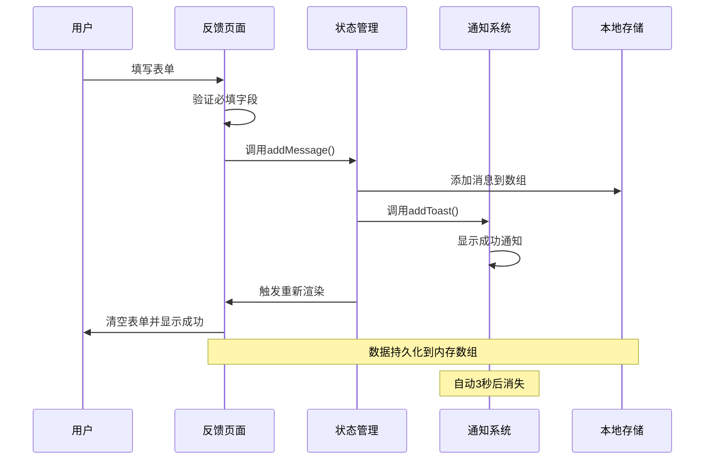
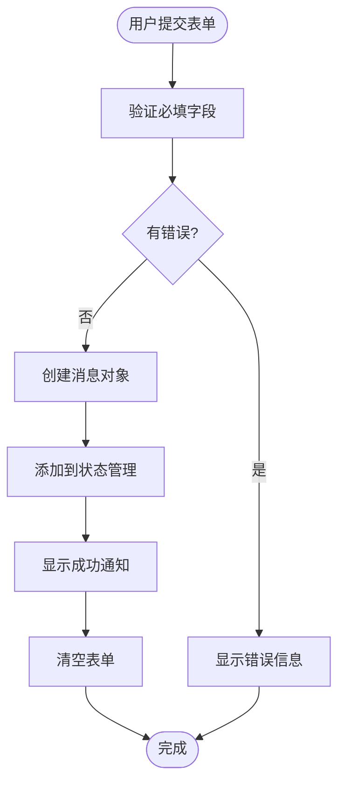
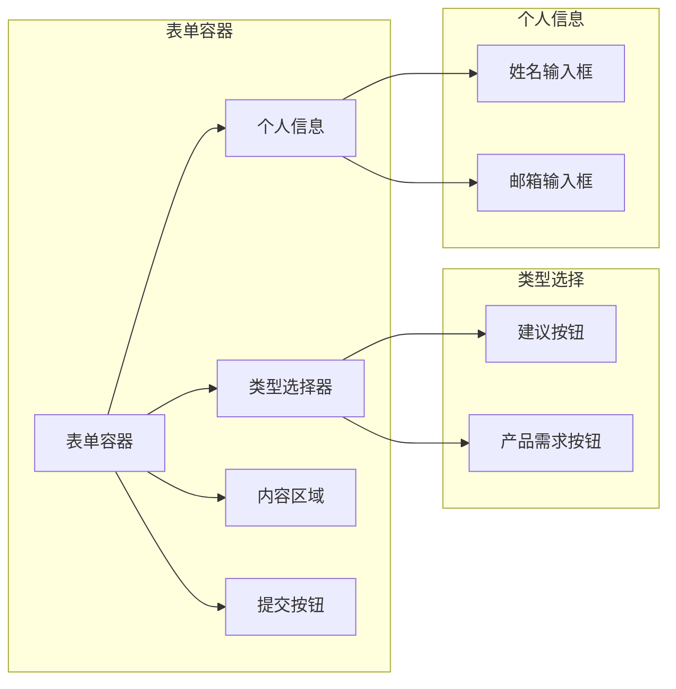
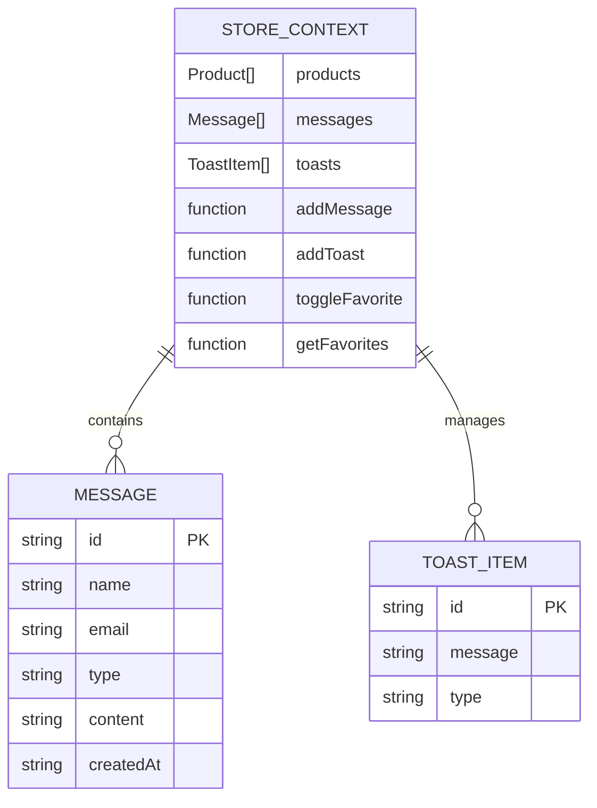
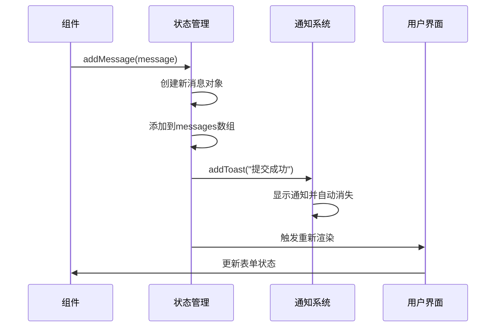
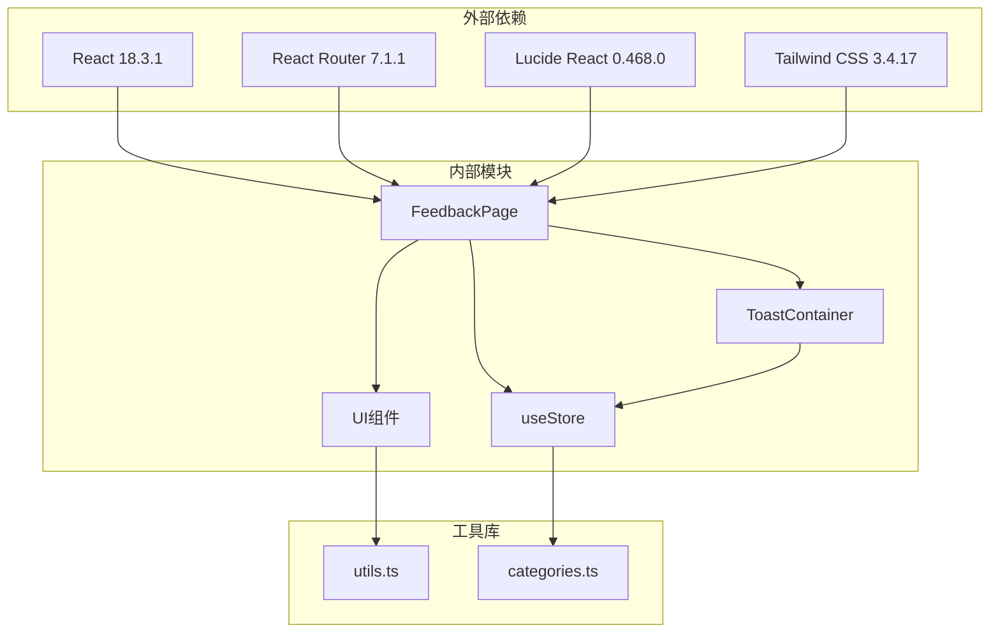

# 反馈页面

<cite>
**本文档引用的文件**
- [FeedbackPage.tsx](file://lienpet-website/src/pages/FeedbackPage.tsx)
- [useStore.tsx](file://lienpet-website/src/store/useStore.tsx)
- [App.tsx](file://lienpet-website/src/App.tsx)
- [ToastContainer.tsx](file://lienpet-website/src/components/ToastContainer.tsx)
- [button.tsx](file://lienpet-website/src/components/ui/button.tsx)
- [card.tsx](file://lienpet-website/src/components/ui/card.tsx)
- [utils.ts](file://lienpet-website/src/lib/utils.ts)
- [categories.ts](file://lienpet-website/src/data/categories.ts)
- [tailwind.config.ts](file://lienpet-website/tailwind.config.ts)
- [package.json](file://lienpet-website/package.json)
</cite>

## 目录
1. [简介](#简介)
2. [项目结构](#项目结构)
3. [核心组件](#核心组件)
4. [架构概览](#架构概览)
5. [详细组件分析](#详细组件分析)
6. [依赖关系分析](#依赖关系分析)
7. [性能考虑](#性能考虑)
8. [故障排除指南](#故障排除指南)
9. [结论](#结论)
10. [附录](#附录)

## 简介

反馈页面是 Lienpet 宠物用品网站的重要组成部分，为用户提供了一个简洁而直观的界面来提交建议、意见或产品需求。该系统采用现代化的 React 技术栈构建，结合了状态管理、表单验证和用户体验优化等最佳实践。

本系统的核心目标是：
- 提供多类型的反馈收集机制（建议和产品需求）
- 实现实时的表单验证和用户反馈
- 确保数据的安全性和完整性
- 优化用户的交互体验

## 项目结构

Lienpet 项目采用模块化架构设计，反馈功能作为独立页面集成在整体应用中：

**图表来源**
- [App.tsx:13-35](file://lienpet-website/src/App.tsx#L13-L35)
- [FeedbackPage.tsx:6-111](file://lienpet-website/src/pages/FeedbackPage.tsx#L6-L111)
- [useStore.tsx:27-94](file://lienpet-website/src/store/useStore.tsx#L27-L94)

**章节来源**
- [App.tsx:1-37](file://lienpet-website/src/App.tsx#L1-L37)
- [package.json:1-31](file://lienpet-website/package.json#L1-L31)

## 核心组件

反馈页面由多个精心设计的组件构成，每个组件都有明确的职责和功能：

### 主要组件架构

**图表来源**
- [FeedbackPage.tsx:6-111](file://lienpet-website/src/pages/FeedbackPage.tsx#L6-L111)
- [useStore.tsx:27-94](file://lienpet-website/src/store/useStore.tsx#L27-L94)
- [ToastContainer.tsx:4-28](file://lienpet-website/src/components/ToastContainer.tsx#L4-L28)
- [button.tsx:32-49](file://lienpet-website/src/components/ui/button.tsx#L32-L49)

### 数据模型

反馈系统的核心数据结构包括消息和通知两种主要类型：

| 字段名 | 类型 | 必填 | 描述 |
|--------|------|------|------|
| id | string | 是 | 消息唯一标识符 |
| name | string | 是 | 用户姓名 |
| email | string | 否 | 用户邮箱地址 |
| type | 'suggestion' \| 'product-request' | 是 | 反馈类型 |
| content | string | 是 | 反馈内容 |
| createdAt | string | 是 | 创建时间戳 |

**章节来源**
- [categories.ts:31-38](file://lienpet-website/src/data/categories.ts#L31-L38)
- [useStore.tsx:52-60](file://lienpet-website/src/store/useStore.tsx#L52-L60)

## 架构概览

反馈系统采用分层架构设计，确保了代码的可维护性和扩展性：

**图表来源**
- [FeedbackPage.tsx:13-20](file://lienpet-website/src/pages/FeedbackPage.tsx#L13-L20)
- [useStore.tsx:52-60](file://lienpet-website/src/store/useStore.tsx#L52-L60)
- [ToastContainer.tsx:32-38](file://lienpet-website/src/store/useStore.tsx#L32-L38)

### 状态管理流程

**图表来源**
- [FeedbackPage.tsx:13-20](file://lienpet-website/src/pages/FeedbackPage.tsx#L13-L20)
- [useStore.tsx:52-60](file://lienpet-website/src/store/useStore.tsx#L52-L60)

## 详细组件分析

### 反馈页面组件

反馈页面是整个系统的核心入口点，负责处理用户输入和展示反馈结果：

#### 表单设计与布局

反馈页面采用了响应式设计，支持不同屏幕尺寸的设备访问：

**图表来源**
- [FeedbackPage.tsx:34-108](file://lienpet-website/src/pages/FeedbackPage.tsx#L34-L108)

#### 表单验证机制

系统实现了多层次的验证策略：

1. **前端即时验证**：实时检查必填字段
2. **格式验证**：邮箱格式检查
3. **状态控制**：根据验证结果动态启用/禁用提交按钮

**章节来源**
- [FeedbackPage.tsx:8-20](file://lienpet-website/src/pages/FeedbackPage.tsx#L8-L20)
- [FeedbackPage.tsx:104](file://lienpet-website/src/pages/FeedbackPage.tsx#L104)

### 状态管理系统

状态管理采用 React Context 和自定义 Hook 的模式，提供了集中化的数据管理：

#### 存储结构

**图表来源**
- [useStore.tsx:5-17](file://lienpet-website/src/store/useStore.tsx#L5-L17)
- [categories.ts:31-38](file://lienpet-website/src/data/categories.ts#L31-L38)

#### 数据流管理

**图表来源**
- [useStore.tsx:52-60](file://lienpet-website/src/store/useStore.tsx#L52-L60)
- [ToastContainer.tsx:32-38](file://lienpet-website/src/store/useStore.tsx#L32-L38)

**章节来源**
- [useStore.tsx:27-94](file://lienpet-website/src/store/useStore.tsx#L27-L94)

### 通知系统

通知系统提供了用户友好的反馈机制，通过 ToastContainer 组件实现：

#### 通知类型

| 类型 | 图标 | 颜色 | 用途 |
|------|------|------|------|
| success | ✓ | 品牌色 | 成功操作确认 |
| error | ✗ | 错误色 | 失败或异常情况 |
| info | ℹ️ | 主色调 | 信息提示 |

#### 自动消失机制

通知系统实现了智能的生命周期管理：
- 显示时长：3秒
- 自动清理：过期后从DOM中移除
- 动画效果：滑入滑出动画

**章节来源**
- [ToastContainer.tsx:4-28](file://lienpet-website/src/components/ToastContainer.tsx#L4-L28)
- [useStore.tsx:32-38](file://lienpet-website/src/store/useStore.tsx#L32-L38)

### UI 组件库

系统使用了统一的 UI 组件库，确保视觉一致性和开发效率：

#### 按钮组件

按钮组件支持多种变体和尺寸：

| 变体 | 用途 | 特性 |
|------|------|------|
| default | 默认按钮 | 标准样式 |
| brand | 品牌按钮 | 渐变背景 |
| secondary | 次要按钮 | 淡色背景 |
| destructive | 危险按钮 | 红色警告 |

#### 卡片组件

卡片组件提供了统一的容器样式：
- 圆角边框
- 阴影效果
- 内边距统一
- 背景色适配主题

**章节来源**
- [button.tsx:5-30](file://lienpet-website/src/components/ui/button.tsx#L5-L30)
- [card.tsx:4-13](file://lienpet-website/src/components/ui/card.tsx#L4-L13)

## 依赖关系分析

反馈系统的依赖关系清晰且模块化，便于维护和扩展：

**图表来源**
- [package.json:11-20](file://lienpet-website/package.json#L11-L20)
- [FeedbackPage.tsx:1-5](file://lienpet-website/src/pages/FeedbackPage.tsx#L1-L5)
- [useStore.tsx:1-4](file://lienpet-website/src/store/useStore.tsx#L1-L4)

### 核心依赖特性

| 依赖项 | 版本 | 用途 | 关键特性 |
|--------|------|------|----------|
| react | ^18.3.1 | 核心框架 | 组件化开发 |
| react-router-dom | ^7.1.1 | 路由管理 | SPA导航 |
| lucide-react | ^0.468.0 | 图标库 | 矢量图标 |
| tailwind-merge | ^2.6.0 | 样式合并 | 类名优化 |
| class-variance-authority | ^0.7.1 | 变体系统 | 组件变体 |

**章节来源**
- [package.json:11-31](file://lienpet-website/package.json#L11-L31)

## 性能考虑

反馈系统在设计时充分考虑了性能优化：

### 渲染优化

1. **状态分离**：将表单状态与全局状态分离，避免不必要的重渲染
2. **回调函数缓存**：使用 useCallback 优化函数组件性能
3. **条件渲染**：ToastContainer 仅在有通知时渲染

### 内存管理

1. **自动清理**：Toast 通知自动3秒后清理，防止内存泄漏
2. **轻量级数据结构**：使用简单对象存储消息数据
3. **事件委托**：减少事件监听器数量

### 用户体验优化

1. **即时反馈**：表单验证实时进行
2. **加载状态**：提交按钮禁用状态提示
3. **无障碍设计**：语义化HTML标签和ARIA属性

## 故障排除指南

### 常见问题及解决方案

#### 表单提交失败

**症状**：点击提交按钮无反应
**原因**：必填字段验证失败
**解决方法**：
1. 检查姓名和内容字段是否填写
2. 确认必填字段标记正确
3. 查看浏览器控制台错误信息

#### 通知不显示

**症状**：提交成功但看不到通知
**原因**：ToastContainer 未正确渲染
**解决方法**：
1. 确认 StoreProvider 包裹了应用
2. 检查 ToastContainer 组件导入路径
3. 验证样式类名是否正确

#### 样式问题

**症状**：组件样式异常
**原因**：Tailwind 配置问题
**解决方法**：
1. 检查 tailwind.config.ts 配置
2. 确认品牌色变量定义
3. 验证 CSS 构建过程

**章节来源**
- [FeedbackPage.tsx:13-20](file://lienpet-website/src/pages/FeedbackPage.tsx#L13-L20)
- [ToastContainer.tsx:13](file://lienpet-website/src/components/ToastContainer.tsx#L13)

### 开发调试技巧

1. **使用 React DevTools**：检查组件树和状态变化
2. **浏览器开发者工具**：监控网络请求和JavaScript错误
3. **日志输出**：在关键函数中添加 console.log 进行调试

## 结论

反馈页面系统展现了现代前端开发的最佳实践，通过合理的架构设计和组件化开发，实现了功能完整、用户体验优秀的反馈收集平台。

### 系统优势

1. **架构清晰**：分层设计便于维护和扩展
2. **用户体验优秀**：即时验证和反馈机制提升用户满意度
3. **代码质量高**：类型安全和模块化设计确保代码可靠性
4. **性能优化**：合理的渲染策略和内存管理

### 改进建议

1. **后端集成**：当前版本仅支持前端存储，建议集成后端API
2. **数据持久化**：考虑使用 localStorage 或数据库存储
3. **国际化支持**：添加多语言支持以服务更广泛的用户群体
4. **高级验证**：实现更复杂的表单验证规则
5. **文件上传**：支持图片或其他文件的上传功能

## 附录

### 最佳实践指南

#### 表单设计最佳实践

1. **清晰的标签**：使用简洁明了的标签描述
2. **适当的占位符**：提供有用的示例文本
3. **一致的样式**：保持与其他页面风格一致
4. **响应式设计**：确保在移动设备上的良好体验

#### 数据安全考虑

1. **输入验证**：客户端和服务端双重验证
2. **敏感信息保护**：避免收集不必要的个人信息
3. **数据传输安全**：使用 HTTPS 加密传输
4. **隐私政策**：明确的数据使用和保护政策

#### 用户体验优化

1. **加载状态**：提供提交过程的视觉反馈
2. **错误处理**：友好的错误信息和恢复指导
3. **无障碍访问**：支持键盘导航和屏幕阅读器
4. **性能监控**：持续监控和优化系统性能