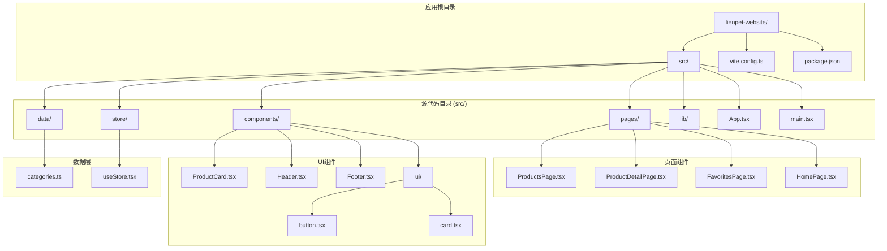
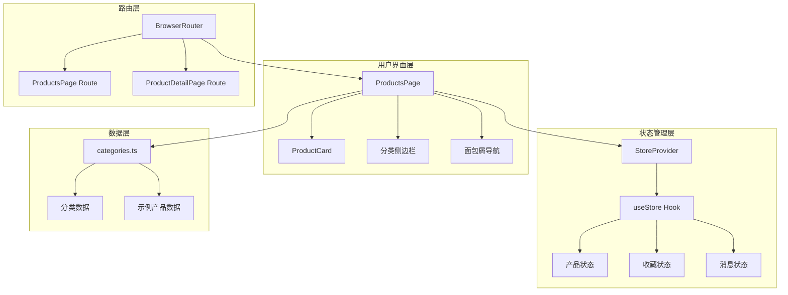
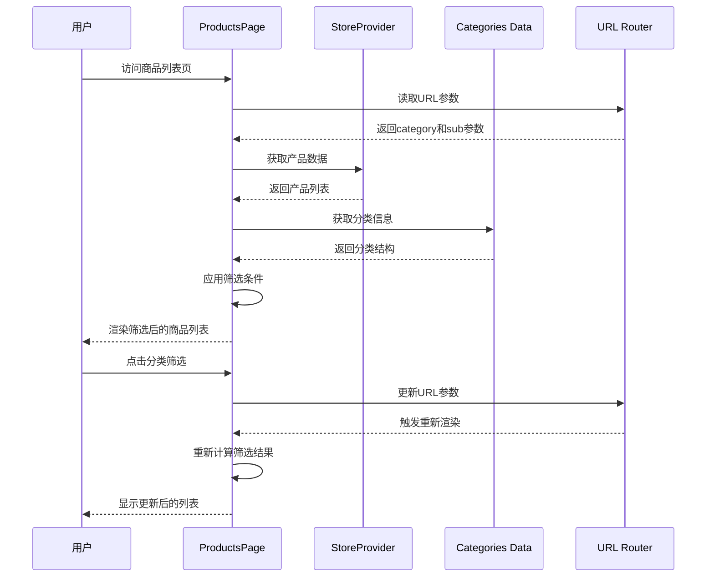
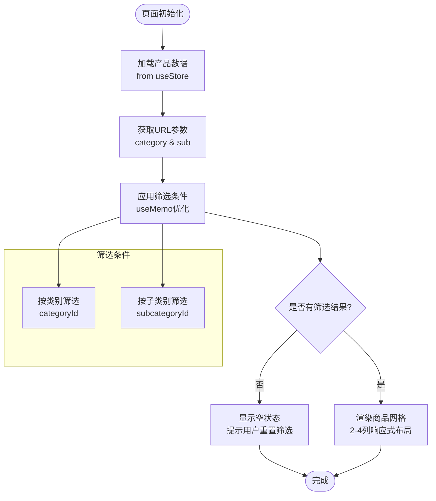
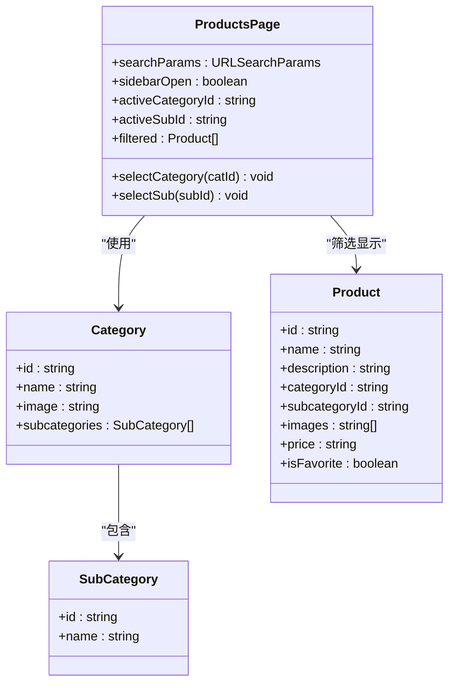
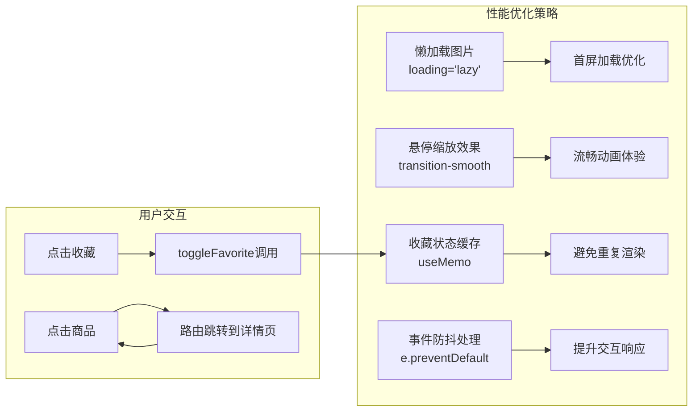
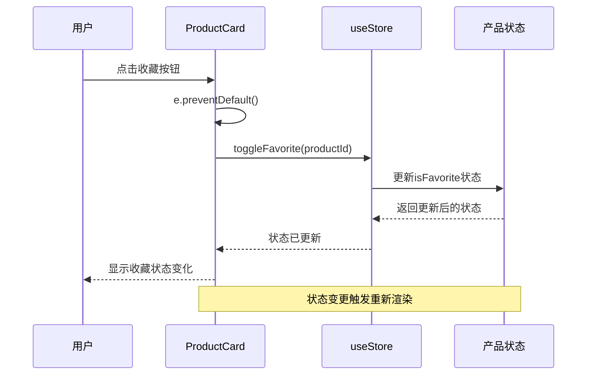
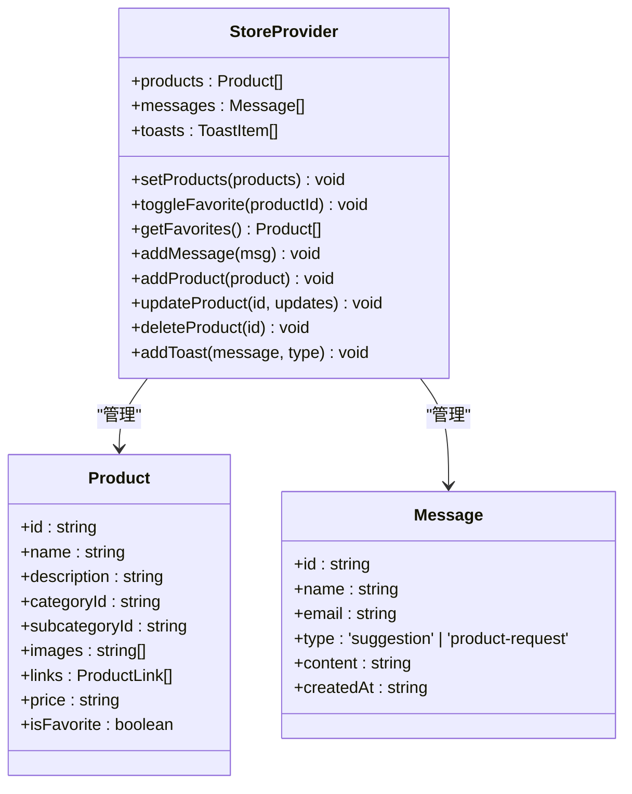
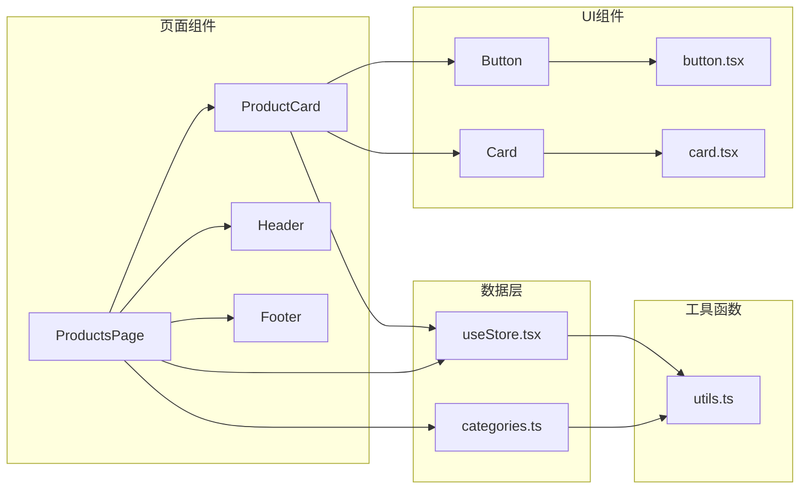
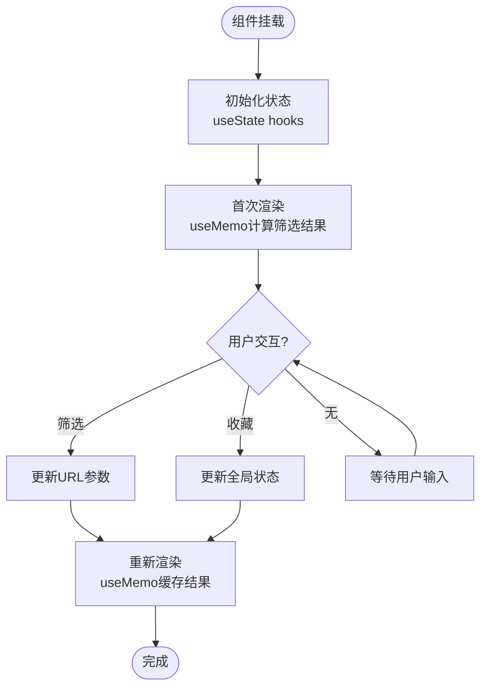

# 商品列表页

<cite>
**本文档引用的文件**
- [ProductsPage.tsx](file://lienpet-website/src/pages/ProductsPage.tsx)
- [ProductCard.tsx](file://lienpet-website/src/components/ProductCard.tsx)
- [categories.ts](file://lienpet-website/src/data/categories.ts)
- [useStore.tsx](file://lienpet-website/src/store/useStore.tsx)
- [App.tsx](file://lienpet-website/src/App.tsx)
- [main.tsx](file://lienpet-website/src/main.tsx)
- [button.tsx](file://lienpet-website/src/components/ui/button.tsx)
- [card.tsx](file://lienpet-website/src/components/ui/card.tsx)
- [utils.ts](file://lienpet-website/src/lib/utils.ts)
</cite>

## 目录
1. [简介](#简介)
2. [项目结构](#项目结构)
3. [核心组件](#核心组件)
4. [架构概览](#架构概览)
5. [详细组件分析](#详细组件分析)
6. [依赖关系分析](#依赖关系分析)
7. [性能考虑](#性能考虑)
8. [故障排除指南](#故障排除指南)
9. [结论](#结论)

## 简介

商品列表页是宠物用品电商平台的核心功能模块，负责展示和管理商品数据。该页面实现了完整的商品浏览体验，包括分类筛选、商品卡片展示、收藏功能和响应式布局设计。系统采用React + TypeScript构建，结合自定义状态管理和路由参数处理，为用户提供流畅的商品浏览和筛选体验。

## 项目结构

该项目采用模块化组织方式，主要目录结构如下：



**图表来源**
- [App.tsx:1-37](file://lienpet-website/src/App.tsx#L1-L37)
- [main.tsx:1-10](file://lienpet-website/src/main.tsx#L1-L10)

**章节来源**
- [App.tsx:1-37](file://lienpet-website/src/App.tsx#L1-L37)
- [main.tsx:1-10](file://lienpet-website/src/main.tsx#L1-L10)

## 核心组件

### 商品列表页面 (ProductsPage)

商品列表页面是整个功能的核心，实现了以下关键功能：

- **URL参数处理**: 使用`useSearchParams`钩子处理分类筛选参数
- **实时筛选**: 基于类别和子类别的动态筛选
- **响应式布局**: 移动端侧边栏和桌面端导航的适配
- **状态管理**: 集成全局状态管理系统

### 商品卡片组件 (ProductCard)

每个商品以卡片形式展示，包含：
- **图片懒加载**: 优化首屏加载性能
- **收藏功能**: 支持商品收藏状态切换
- **价格显示**: 清晰的价格信息展示
- **悬停效果**: 用户友好的交互反馈

### 分类数据模型

系统定义了完整的分类层次结构：
- **一级分类**: 主要商品类别
- **二级分类**: 具体商品子类别
- **商品实体**: 包含完整商品信息的数据结构

**章节来源**
- [ProductsPage.tsx:9-167](file://lienpet-website/src/pages/ProductsPage.tsx#L9-L167)
- [ProductCard.tsx:10-51](file://lienpet-website/src/components/ProductCard.tsx#L10-L51)
- [categories.ts:40-141](file://lienpet-website/src/data/categories.ts#L40-L141)

## 架构概览

系统采用分层架构设计，确保各组件职责清晰分离：



**图表来源**
- [App.tsx:13-35](file://lienpet-website/src/App.tsx#L13-L35)
- [useStore.tsx:27-94](file://lienpet-website/src/store/useStore.tsx#L27-L94)
- [ProductsPage.tsx:9-167](file://lienpet-website/src/pages/ProductsPage.tsx#L9-L167)

### 数据流图



**图表来源**
- [ProductsPage.tsx:10-25](file://lienpet-website/src/pages/ProductsPage.tsx#L10-L25)
- [useStore.tsx:28](file://lienpet-website/src/store/useStore.tsx#L28)
- [categories.ts:40-141](file://lienpet-website/src/data/categories.ts#L40-L141)

## 详细组件分析

### 商品列表页面组件分析

#### 状态管理与筛选逻辑

页面使用React的`useState`和`useMemo`实现高效的状态管理：



**图表来源**
- [ProductsPage.tsx:16-25](file://lienpet-website/src/pages/ProductsPage.tsx#L16-L25)
- [ProductsPage.tsx:149-162](file://lienpet-website/src/pages/ProductsPage.tsx#L149-L162)

#### 分类筛选器交互

分类筛选器实现了层级化的交互逻辑：



**图表来源**
- [ProductsPage.tsx:9-167](file://lienpet-website/src/pages/ProductsPage.tsx#L9-L167)
- [categories.ts:6-29](file://lienpet-website/src/data/categories.ts#L6-L29)

**章节来源**
- [ProductsPage.tsx:9-167](file://lienpet-website/src/pages/ProductsPage.tsx#L9-L167)
- [categories.ts:40-141](file://lienpet-website/src/data/categories.ts#L40-L141)

### 商品卡片组件分析

#### 性能优化特性

商品卡片实现了多项性能优化策略：



**图表来源**
- [ProductCard.tsx:17-22](file://lienpet-website/src/components/ProductCard.tsx#L17-L22)
- [ProductCard.tsx:24-36](file://lienpet-website/src/components/ProductCard.tsx#L24-L36)

#### 收藏功能实现

收藏功能通过全局状态管理实现：



**图表来源**
- [ProductCard.tsx:24-28](file://lienpet-website/src/components/ProductCard.tsx#L24-L28)
- [useStore.tsx:40-46](file://lienpet-website/src/store/useStore.tsx#L40-L46)

**章节来源**
- [ProductCard.tsx:10-51](file://lienpet-website/src/components/ProductCard.tsx#L10-L51)
- [useStore.tsx:40-50](file://lienpet-website/src/store/useStore.tsx#L40-L50)

### 状态管理系统分析

#### 全局状态架构

状态管理系统提供了完整的CRUD操作和状态同步：



**图表来源**
- [useStore.tsx:27-94](file://lienpet-website/src/store/useStore.tsx#L27-L94)
- [categories.ts:19-38](file://lienpet-website/src/data/categories.ts#L19-L38)

**章节来源**
- [useStore.tsx:1-100](file://lienpet-website/src/store/useStore.tsx#L1-L100)
- [categories.ts:19-38](file://lienpet-website/src/data/categories.ts#L19-L38)

## 依赖关系分析

### 外部依赖关系

项目使用现代化的前端技术栈，主要依赖包括：

```mermaid
graph TB
subgraph "核心框架"
A[React 18.3.1] --> B[React Router DOM 7.1.1]
A --> C[Lucide React 0.468.0]
end
subgraph "样式系统"
D[Tailwind CSS 3.4.17] --> E[Tailwind Merge 2.6.0]
D --> F[Class Variance Authority 0.7.1]
end
subgraph "开发工具"
G[Vite 6.0.5] --> H[TypeScript ~5.6.2]
G --> I[@ViteJS Plugin React ^4.3.4]
end
subgraph "应用组件"
J[ProductsPage] --> A
J --> D
J --> B
K[ProductCard] --> A
K --> C
L[StoreProvider] --> A
end
```

**图表来源**
- [package.json:11-30](file://lienpet-website/package.json#L11-L30)

### 内部组件依赖



**图表来源**
- [ProductsPage.tsx:4-7](file://lienpet-website/src/pages/ProductsPage.tsx#L4-L7)
- [ProductCard.tsx:1-4](file://lienpet-website/src/components/ProductCard.tsx#L1-L4)
- [utils.ts:1-6](file://lienpet-website/src/lib/utils.ts#L1-L6)

**章节来源**
- [package.json:11-30](file://lienpet-website/package.json#L11-L30)
- [ProductsPage.tsx:4-7](file://lienpet-website/src/pages/ProductsPage.tsx#L4-L7)
- [ProductCard.tsx:1-4](file://lienpet-website/src/components/ProductCard.tsx#L1-L4)

## 性能考虑

### 渲染优化策略

系统采用了多种性能优化技术：

1. **记忆化计算**: 使用`useMemo`避免不必要的筛选计算
2. **懒加载图片**: 图片标签设置`loading="lazy"`优化首屏加载
3. **事件处理优化**: 使用`e.preventDefault()`防止默认行为
4. **状态更新优化**: 通过局部状态更新减少重渲染

### 内存管理



**图表来源**
- [ProductsPage.tsx:16-25](file://lienpet-website/src/pages/ProductsPage.tsx#L16-L25)
- [ProductCard.tsx:24-28](file://lienpet-website/src/components/ProductCard.tsx#L24-L28)

### 响应式设计优化

系统实现了完整的响应式布局：

- **移动端优先**: 移动端使用侧边栏模式
- **断点适配**: 使用Tailwind CSS断点系统
- **网格布局**: 2-4列自适应网格布局
- **触摸友好**: 按钮尺寸和间距优化

## 故障排除指南

### 常见问题及解决方案

#### 筛选功能异常

**问题**: 筛选后无法正确显示结果
**可能原因**:
- URL参数格式不正确
- 产品数据结构不匹配
- 筛选逻辑错误

**解决步骤**:
1. 检查URL参数格式: `?category=xxx&sub=yyy`
2. 验证产品数据结构完整性
3. 确认筛选条件匹配逻辑

#### 收藏功能失效

**问题**: 点击收藏按钮无反应
**可能原因**:
- 状态更新函数未正确调用
- 产品ID不匹配
- 全局状态未正确配置

**解决步骤**:
1. 检查`toggleFavorite`函数调用
2. 验证产品ID唯一性
3. 确认`StoreProvider`正确包装应用

#### 性能问题

**问题**: 页面加载缓慢或卡顿
**可能原因**:
- 过多的DOM元素渲染
- 缺少必要的性能优化
- 资源加载阻塞

**优化建议**:
1. 实施虚拟滚动（如需大量数据）
2. 添加图片懒加载
3. 优化CSS类名合并
4. 减少不必要的重渲染

**章节来源**
- [ProductsPage.tsx:16-25](file://lienpet-website/src/pages/ProductsPage.tsx#L16-L25)
- [useStore.tsx:40-46](file://lienpet-website/src/store/useStore.tsx#L40-L46)

## 结论

商品列表页是一个功能完整、架构清晰的电商商品展示系统。通过合理的组件拆分、状态管理和性能优化，实现了良好的用户体验和可维护性。

### 主要优势

1. **模块化设计**: 组件职责明确，便于维护和扩展
2. **响应式布局**: 适配多种设备和屏幕尺寸
3. **性能优化**: 采用多种优化策略确保流畅体验
4. **类型安全**: 完整的TypeScript类型定义
5. **状态管理**: 集中的状态管理简化了数据流

### 改进建议

1. **搜索功能**: 可添加关键词搜索功能
2. **排序选项**: 支持按价格、评价等排序
3. **分页机制**: 对于大量商品数据实现分页加载
4. **缓存策略**: 添加本地缓存减少重复请求
5. **错误边界**: 实现更完善的错误处理机制

该系统为后续功能扩展奠定了良好的基础，特别是在电商场景中具有很高的实用价值和扩展潜力。