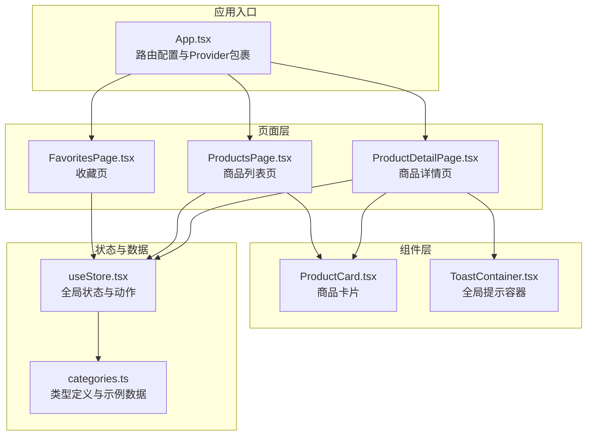
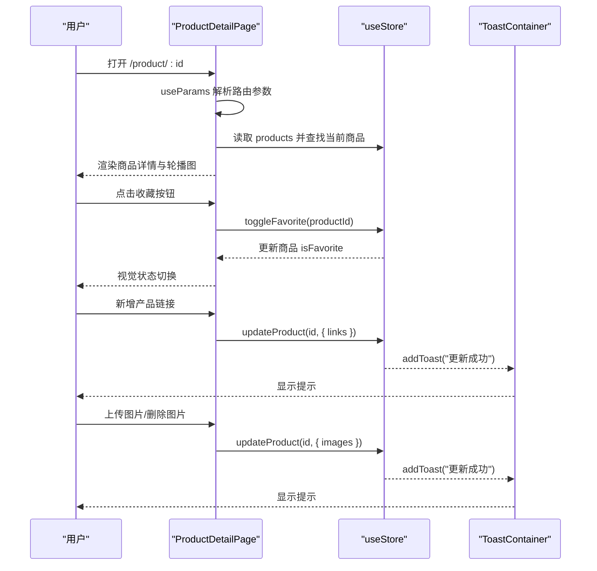
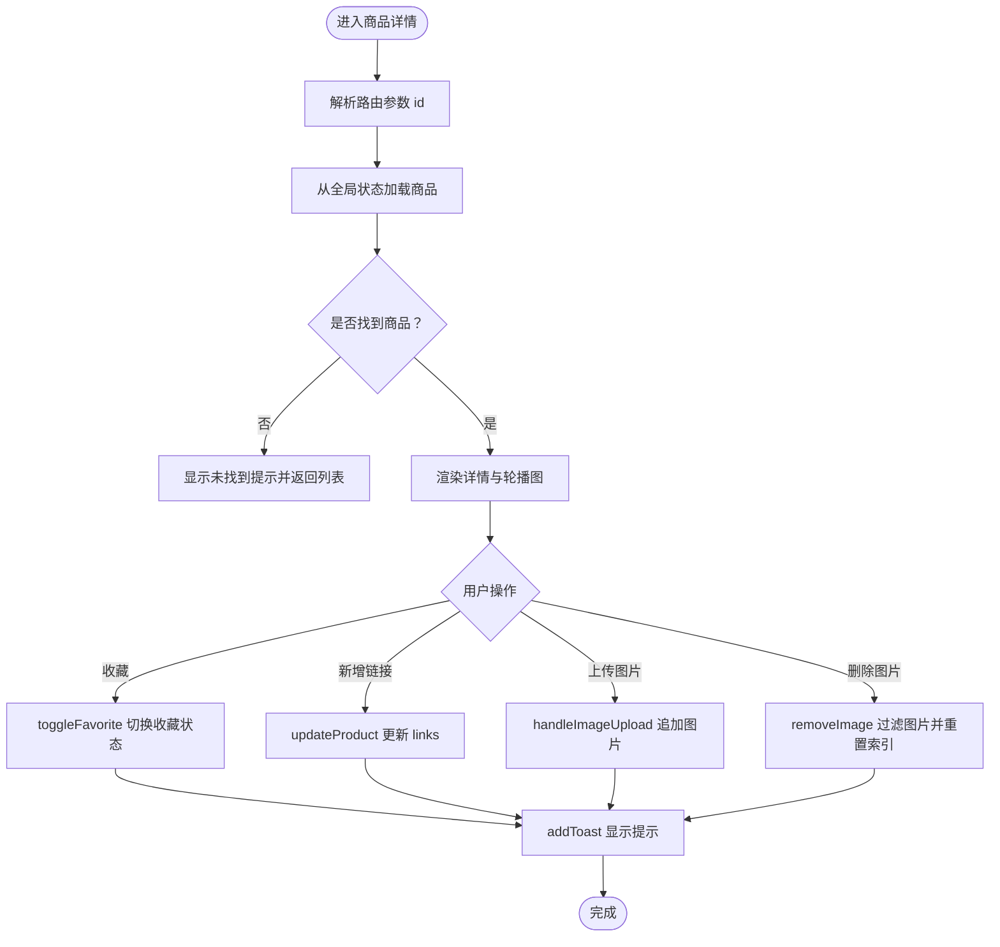
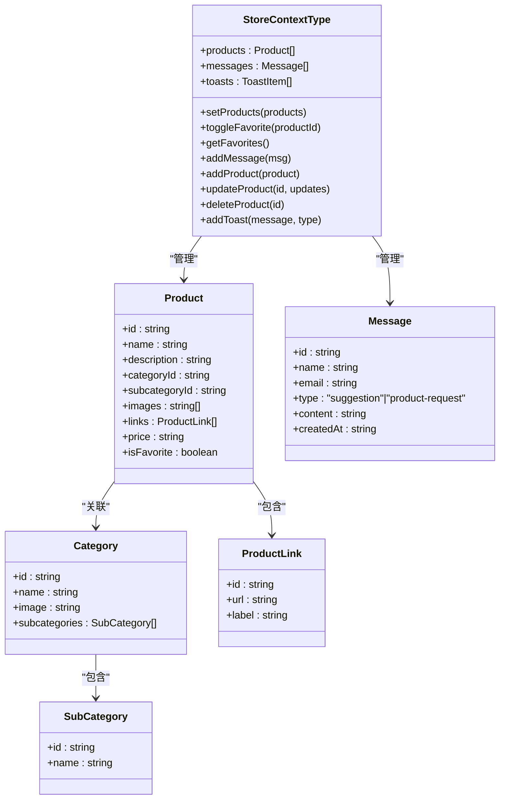
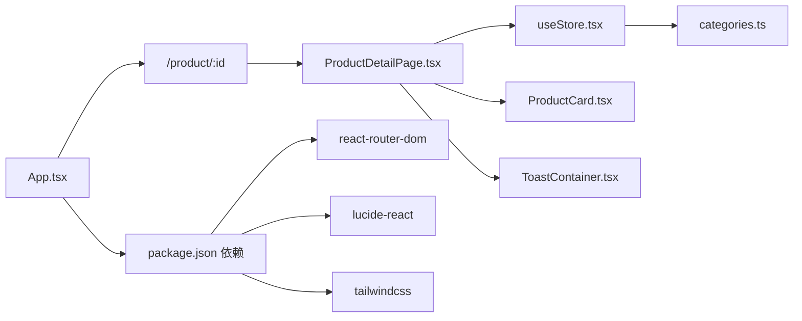

# 商品详情页

<cite>
**本文引用的文件列表**
- [ProductDetailPage.tsx](file://lienpet-website/src/pages/ProductDetailPage.tsx)
- [useStore.tsx](file://lienpet-website/src/store/useStore.tsx)
- [App.tsx](file://lienpet-website/src/App.tsx)
- [categories.ts](file://lienpet-website/src/data/categories.ts)
- [ProductCard.tsx](file://lienpet-website/src/components/ProductCard.tsx)
- [ToastContainer.tsx](file://lienpet-website/src/components/ToastContainer.tsx)
- [FavoritesPage.tsx](file://lienpet-website/src/pages/FavoritesPage.tsx)
- [ProductsPage.tsx](file://lienpet-website/src/pages/ProductsPage.tsx)
- [package.json](file://lienpet-website/package.json)
- [tailwind.config.ts](file://lienpet-website/tailwind.config.ts)
</cite>

## 目录
1. [简介](#简介)
2. [项目结构](#项目结构)
3. [核心组件](#核心组件)
4. [架构总览](#架构总览)
5. [详细组件分析](#详细组件分析)
6. [依赖关系分析](#依赖关系分析)
7. [性能考量](#性能考量)
8. [故障排查指南](#故障排查指南)
9. [结论](#结论)
10. [附录](#附录)

## 简介
本文件面向“商品详情页”的完整技术文档，聚焦于以下目标：
- 深入解析商品详情页面的核心功能：商品信息展示、图片轮播与缩略图导航、链接管理、收藏功能、交互反馈（Toast）。
- 详细说明路由参数解析、商品数据来源与更新机制、用户交互事件处理与状态同步。
- 提供最佳实践与用户体验优化建议，帮助开发者在现有基础上扩展规格选择、数量调整、购买按钮状态管理等能力。

## 项目结构
该站点采用 React + Vite + TailwindCSS 构建，路由基于 react-router-dom，全局状态通过自定义 Context Provider 管理。商品详情页位于 pages 目录，使用 store 中的 products 数据源，并通过 useStore 钩子进行读写操作。

图表来源
- [App.tsx:13-35](file://lienpet-website/src/App.tsx#L13-L35)
- [ProductDetailPage.tsx:8-254](file://lienpet-website/src/pages/ProductDetailPage.tsx#L8-L254)
- [ProductsPage.tsx:9-167](file://lienpet-website/src/pages/ProductsPage.tsx#L9-L167)
- [FavoritesPage.tsx:7-42](file://lienpet-website/src/pages/FavoritesPage.tsx#L7-L42)
- [useStore.tsx:27-94](file://lienpet-website/src/store/useStore.tsx#L27-L94)
- [categories.ts:19-244](file://lienpet-website/src/data/categories.ts#L19-L244)

章节来源
- [App.tsx:13-35](file://lienpet-website/src/App.tsx#L13-L35)
- [package.json:1-31](file://lienpet-website/package.json#L1-L31)

## 核心组件
- 商品详情页组件：负责渲染商品标题、分类标签、描述、价格、图片轮播、链接列表与新增、收藏切换、返回上一页等交互。
- 全局状态管理：提供 products 列表、toggleFavorite、updateProduct、addToast 等动作；所有页面共享同一状态树。
- 商品卡片组件：用于列表页与收藏页的商品展示，支持收藏切换。
- Toast 容器：全局显示成功/错误/信息类提示，自动消失。
- 类型与示例数据：定义 Product、Category、SubCategory、Message、ProductLink 等接口及 sampleProducts 示例数据。

章节来源
- [ProductDetailPage.tsx:8-254](file://lienpet-website/src/pages/ProductDetailPage.tsx#L8-L254)
- [useStore.tsx:27-94](file://lienpet-website/src/store/useStore.tsx#L27-L94)
- [ProductCard.tsx:10-51](file://lienpet-website/src/components/ProductCard.tsx#L10-L51)
- [ToastContainer.tsx:4-28](file://lienpet-website/src/components/ToastContainer.tsx#L4-L28)
- [categories.ts:19-244](file://lienpet-website/src/data/categories.ts#L19-L244)

## 架构总览
商品详情页的数据流与交互链路如下：

图表来源
- [ProductDetailPage.tsx:8-254](file://lienpet-website/src/pages/ProductDetailPage.tsx#L8-L254)
- [useStore.tsx:40-81](file://lienpet-website/src/store/useStore.tsx#L40-L81)
- [ToastContainer.tsx:4-28](file://lienpet-website/src/components/ToastContainer.tsx#L4-L28)

## 详细组件分析

### 商品详情页（ProductDetailPage）
- 路由参数解析与数据获取
  - 使用 useParams 获取 id 参数，从全局 products 中匹配当前商品；若未找到则提示并返回列表页。
  - 同时根据 categoryId/subcategoryId 解析分类与子分类名称，用于面包屑导航。
- 图片轮播与缩略图
  - 主图区域展示当前索引图片，左右箭头实现循环切换；右上角删除按钮仅在多图时可用；底部缩略图支持点击切换；当图片数小于上限时显示“上传”占位按钮。
  - 支持本地文件上传（限制最多 10 张），并即时更新到商品 images。
  - 删除图片时有最小数量保护（至少保留一张），并自动调整当前索引。
- 产品链接管理
  - 支持为产品添加新链接（可选 label 与 URL），回车触发提交；支持删除已有链接。
- 收藏功能
  - 点击收藏按钮切换商品的 isFavorite 状态；样式随状态变化。
- 返回与导航
  - 提供“返回”按钮与面包屑导航，便于用户快速回到上一页或列表页。
- 交互反馈
  - 通过 useStore.addToast 统一弹出提示，包含成功/错误/信息三类图标与消息。

图表来源
- [ProductDetailPage.tsx:8-254](file://lienpet-website/src/pages/ProductDetailPage.tsx#L8-L254)
- [useStore.tsx:40-81](file://lienpet-website/src/store/useStore.tsx#L40-L81)

章节来源
- [ProductDetailPage.tsx:8-254](file://lienpet-website/src/pages/ProductDetailPage.tsx#L8-L254)

### 全局状态与数据模型（useStore + categories）
- 状态结构
  - products: 商品数组（含 id、name、description、categoryId、subcategoryId、images、links、price、isFavorite）。
  - messages: 留言数组（用于反馈页）。
  - toasts: 当前显示的提示队列。
- 动作方法
  - toggleFavorite(productId): 切换指定商品的收藏状态。
  - updateProduct(id, updates): 增量更新商品字段（如 images、links）。
  - addToast(message, type): 添加提示并在 3 秒后自动移除。
  - getFavorites(): 过滤出收藏商品。
  - addMessage/addProduct/deleteProduct: 用于留言与商品管理（当前详情页未直接使用）。
- 数据模型
  - Product、Category、SubCategory、ProductLink、Message 接口定义清晰；sampleProducts 提供演示数据。

图表来源
- [useStore.tsx:5-17](file://lienpet-website/src/store/useStore.tsx#L5-L17)
- [categories.ts:19-38](file://lienpet-website/src/data/categories.ts#L19-L38)

章节来源
- [useStore.tsx:27-94](file://lienpet-website/src/store/useStore.tsx#L27-L94)
- [categories.ts:19-244](file://lienpet-website/src/data/categories.ts#L19-L244)

### 商品卡片组件（ProductCard）
- 作用：在列表页与收藏页复用，展示商品图片、标题、描述、价格与收藏按钮。
- 交互：点击卡片跳转至详情页；点击收藏按钮调用 useStore.toggleFavorite。

章节来源
- [ProductCard.tsx:10-51](file://lienpet-website/src/components/ProductCard.tsx#L10-L51)

### Toast 容器（ToastContainer）
- 作用：全局显示提示，按类型显示不同图标与颜色。
- 行为：监听 toasts 变化，自动移除已过期提示（3 秒）。

章节来源
- [ToastContainer.tsx:4-28](file://lienpet-website/src/components/ToastContainer.tsx#L4-L28)

### 收藏页（FavoritesPage）
- 作用：展示用户收藏的商品列表，空状态引导至商品列表。
- 交互：通过 useStore.getFavorites 获取收藏集合，渲染 ProductCard。

章节来源
- [FavoritesPage.tsx:7-42](file://lienpet-website/src/pages/FavoritesPage.tsx#L7-L42)

### 商品列表页（ProductsPage）
- 作用：支持按分类与子分类筛选商品，面包屑与侧边栏交互。
- 与详情页关系：列表页的卡片点击跳转至详情页路由。

章节来源
- [ProductsPage.tsx:9-167](file://lienpet-website/src/pages/ProductsPage.tsx#L9-L167)

## 依赖关系分析
- 路由与入口
  - App.tsx 使用 BrowserRouter 包裹 StoreProvider，并注册 /product/:id 等路由。
- 页面与组件
  - ProductDetailPage 依赖 useStore 的 products、toggleFavorite、updateProduct、addToast。
  - ProductCard 依赖 useStore 的 toggleFavorite。
  - ToastContainer 依赖 useStore 的 toasts。
- 外部依赖
  - react-router-dom：路由与参数解析。
  - lucide-react：图标库。
  - tailwindcss：样式系统与动画。

图表来源
- [App.tsx:13-35](file://lienpet-website/src/App.tsx#L13-L35)
- [ProductDetailPage.tsx:8-254](file://lienpet-website/src/pages/ProductDetailPage.tsx#L8-L254)
- [useStore.tsx:27-94](file://lienpet-website/src/store/useStore.tsx#L27-L94)
- [ProductCard.tsx:10-51](file://lienpet-website/src/components/ProductCard.tsx#L10-L51)
- [ToastContainer.tsx:4-28](file://lienpet-website/src/components/ToastContainer.tsx#L4-L28)
- [categories.ts:19-244](file://lienpet-website/src/data/categories.ts#L19-L244)
- [package.json:11-20](file://lienpet-website/package.json#L11-L20)

章节来源
- [package.json:11-20](file://lienpet-website/package.json#L11-L20)
- [tailwind.config.ts:18-100](file://lienpet-website/tailwind.config.ts#L18-L100)

## 性能考量
- 图片轮播
  - 当前使用浏览器对象 URL 生成临时预览，上传完成后立即更新到商品 images。建议在生产环境考虑服务端上传与 CDN 缓存策略，避免大图阻塞首屏。
- 状态更新
  - updateProduct 采用浅拷贝合并，适合小字段更新；若商品数据体量增大，可考虑分模块拆分状态或引入更细粒度的更新策略。
- 动画与交互
  - Toast 自动消失与轮播切换均使用轻量动画，保持流畅体验；建议在移动端测试触摸滑动与键盘交互的兼容性。
- 样式与主题
  - Tailwind 配置了品牌色与动画，确保视觉一致性；建议统一品牌色变量以提升可维护性。

## 故障排查指南
- 无法打开商品详情
  - 检查路由是否正确注册为 /product/:id，确认 App.tsx 中 Routes 配置。
  - 确认 useParams 是否能解析到 id，以及 useStore.products 中是否存在对应 id 的商品。
- 收藏状态不生效
  - 确认 toggleFavorite 是否被调用，检查 isFavorite 字段是否更新。
- 图片上传/删除异常
  - 检查 handleImageUpload 与 removeImage 的边界条件（最多 10 张、至少保留 1 张）。
  - 确认 updateProduct 是否正确更新 images 字段。
- Toast 不显示
  - 检查 addToast 是否被调用，确认 ToastContainer 是否在 App.tsx 中渲染。

章节来源
- [App.tsx:21-28](file://lienpet-website/src/App.tsx#L21-L28)
- [ProductDetailPage.tsx:34-60](file://lienpet-website/src/pages/ProductDetailPage.tsx#L34-L60)
- [useStore.tsx:32-38](file://lienpet-website/src/store/useStore.tsx#L32-L38)
- [ToastContainer.tsx:13-27](file://lienpet-website/src/components/ToastContainer.tsx#L13-L27)

## 结论
商品详情页在现有实现中已经具备完整的商品信息展示、图片轮播、链接管理、收藏与交互反馈能力。通过统一的全局状态管理与清晰的组件职责划分，系统具备良好的可扩展性。建议后续在以下方面进一步完善：
- 规格选择与数量调整：新增规格选项与数量输入框，结合状态机管理购买按钮可用态与文案。
- 购买按钮状态管理：根据库存与规格选择动态启用/禁用购买按钮，并提供实时库存提示。
- 用户交互优化：增强轮播图的手势与键盘支持，优化移动端触摸体验。
- 数据缓存策略：在本地存储中持久化收藏与浏览历史，提升二次访问体验。

## 附录
- 最佳实践清单
  - 使用 useParams 精确解析路由参数，配合兜底逻辑与返回导航。
  - 对用户输入进行校验（如链接 URL、数量范围），并在 updateProduct 前进行格式化。
  - 将 Toast 类型与文案集中管理，便于国际化与统一风格。
  - 在组件层面尽量保持纯函数式更新，减少副作用，便于测试与调试。
- 用户体验优化建议
  - 图片加载采用懒加载与骨架屏，提升感知速度。
  - 轮播图增加指示点与自动播放控制，满足不同用户偏好。
  - 收藏与链接管理操作提供撤销或二次确认，降低误操作风险。