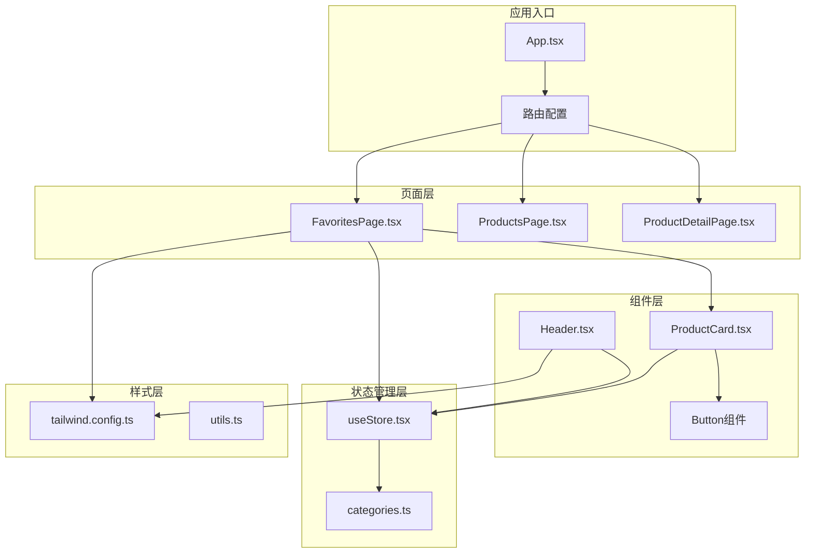
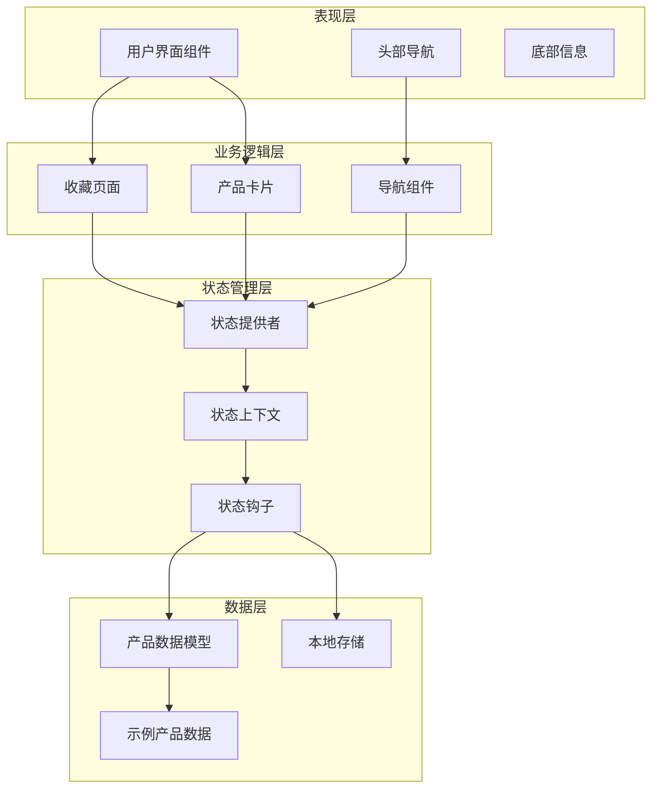
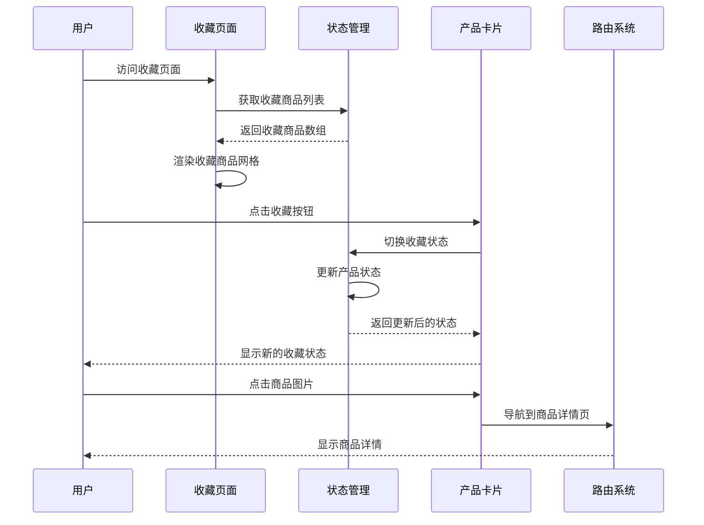
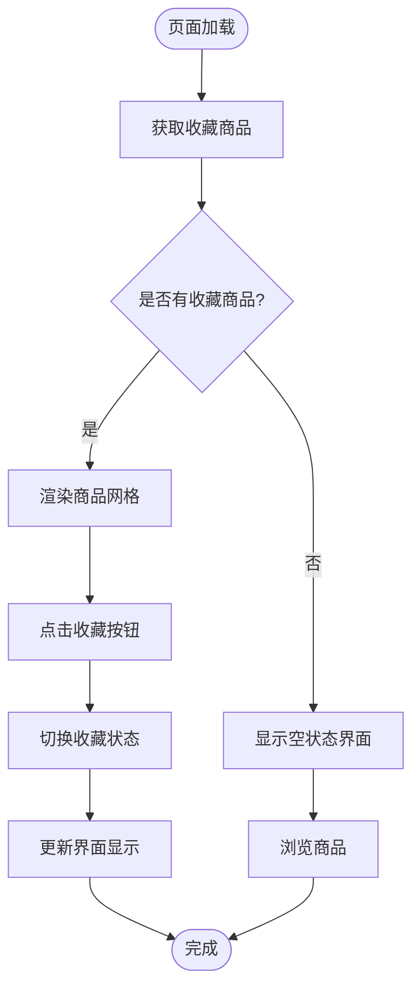
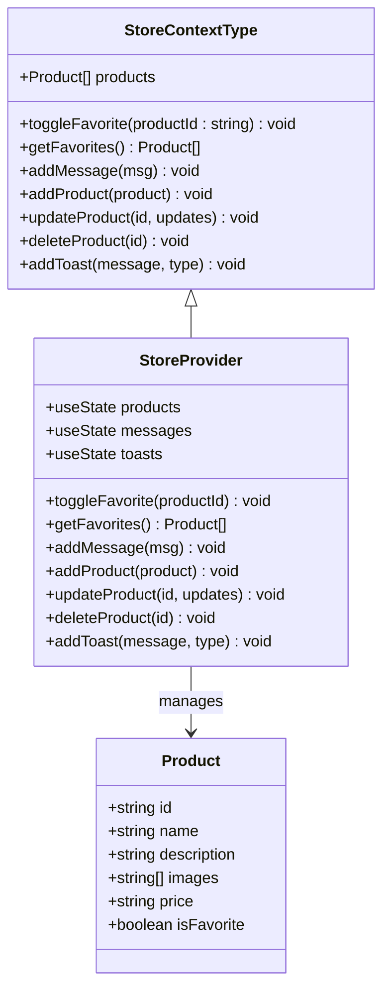
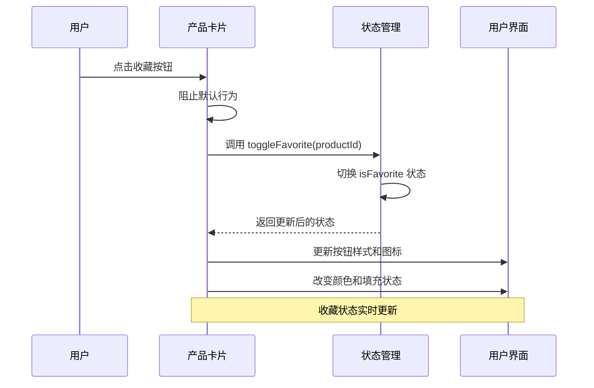
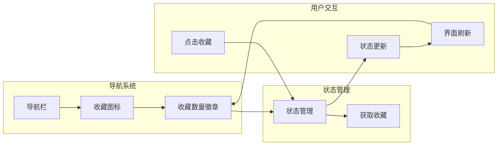
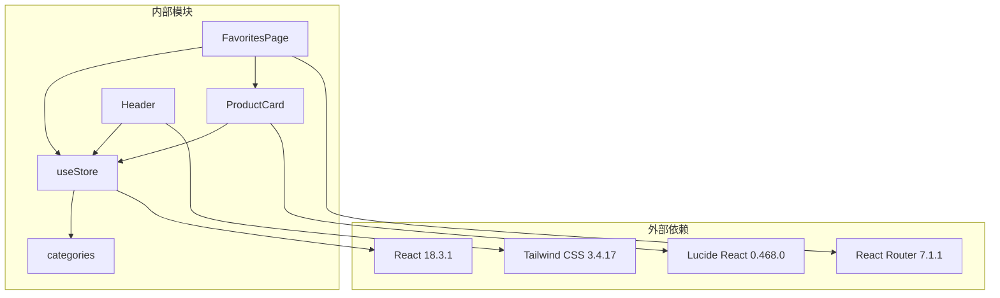

# 收藏页面

<cite>
**本文档引用的文件**
- [FavoritesPage.tsx](file://lienpet-website/src/pages/FavoritesPage.tsx)
- [useStore.tsx](file://lienpet-website/src/store/useStore.tsx)
- [ProductCard.tsx](file://lienpet-website/src/components/ProductCard.tsx)
- [categories.ts](file://lienpet-website/src/data/categories.ts)
- [App.tsx](file://lienpet-website/src/App.tsx)
- [Header.tsx](file://lienpet-website/src/components/Header.tsx)
- [button.tsx](file://lienpet-website/src/components/ui/button.tsx)
- [tailwind.config.ts](file://lienpet-website/tailwind.config.ts)
- [package.json](file://lienpet-website/package.json)
</cite>

## 目录
1. [简介](#简介)
2. [项目结构](#项目结构)
3. [核心组件](#核心组件)
4. [架构概览](#架构概览)
5. [详细组件分析](#详细组件分析)
6. [依赖关系分析](#依赖关系分析)
7. [性能考虑](#性能考虑)
8. [故障排除指南](#故障排除指南)
9. [结论](#结论)

## 简介

收藏页面是 LienPet 宠物用品网站的重要功能模块，为用户提供商品收藏管理能力。该功能实现了完整的收藏生命周期管理，包括收藏商品的展示、收藏状态的实时更新、批量操作支持以及本地存储策略。系统采用 React + TypeScript 构建，使用自定义状态管理方案和 Tailwind CSS 样式系统。

## 项目结构

该项目采用基于功能的组织方式，收藏功能涉及以下关键目录和文件：

**图表来源**
- [App.tsx:13-35](file://lienpet-website/src/App.tsx#L13-L35)
- [FavoritesPage.tsx:1-42](file://lienpet-website/src/pages/FavoritesPage.tsx#L1-L42)
- [useStore.tsx:27-94](file://lienpet-website/src/store/useStore.tsx#L27-L94)

**章节来源**
- [App.tsx:1-37](file://lienpet-website/src/App.tsx#L1-L37)
- [package.json:1-31](file://lienpet-website/package.json#L1-L31)

## 核心组件

### 收藏页面组件

收藏页面是整个收藏功能的核心展示组件，负责：
- 展示用户收藏的商品列表
- 提供空状态时的引导信息
- 实现响应式网格布局
- 集成产品卡片组件

### 状态管理组件

状态管理采用自定义 Hook 模式，提供：
- 全局状态存储和管理
- 收藏状态切换逻辑
- 收藏商品过滤功能
- 通知提示系统集成

### 产品卡片组件

产品卡片组件实现：
- 收藏按钮的视觉反馈
- 图片懒加载优化
- 响应式布局适配
- 导航链接集成

**章节来源**
- [FavoritesPage.tsx:7-42](file://lienpet-website/src/pages/FavoritesPage.tsx#L7-L42)
- [useStore.tsx:5-17](file://lienpet-website/src/store/useStore.tsx#L5-L17)
- [ProductCard.tsx:10-51](file://lienpet-website/src/components/ProductCard.tsx#L10-L51)

## 架构概览

系统采用分层架构设计，各层职责明确：

**图表来源**
- [useStore.tsx:27-94](file://lienpet-website/src/store/useStore.tsx#L27-L94)
- [FavoritesPage.tsx:7-42](file://lienpet-website/src/pages/FavoritesPage.tsx#L7-L42)
- [ProductCard.tsx:10-51](file://lienpet-website/src/components/ProductCard.tsx#L10-L51)

## 详细组件分析

### 收藏页面组件分析

收藏页面组件实现了完整的收藏功能展示：

**图表来源**
- [FavoritesPage.tsx:7-42](file://lienpet-website/src/pages/FavoritesPage.tsx#L7-L42)
- [ProductCard.tsx:24-36](file://lienpet-website/src/components/ProductCard.tsx#L24-L36)
- [useStore.tsx:40-50](file://lienpet-website/src/store/useStore.tsx#L40-L50)

#### 组件特性

收藏页面具有以下关键特性：

1. **响应式布局**：使用 CSS Grid 实现自适应网格布局
2. **空状态处理**：提供友好的空收藏引导界面
3. **实时状态更新**：收藏状态变更立即反映在页面上
4. **导航集成**：与全局导航系统无缝集成

#### 数据流分析

**图表来源**
- [FavoritesPage.tsx:23-39](file://lienpet-website/src/pages/FavoritesPage.tsx#L23-L39)
- [useStore.tsx:48-50](file://lienpet-website/src/store/useStore.tsx#L48-L50)

**章节来源**
- [FavoritesPage.tsx:7-42](file://lienpet-website/src/pages/FavoritesPage.tsx#L7-L42)

### 状态管理系统分析

状态管理系统采用 React Context 模式，提供集中化的状态管理：

**图表来源**
- [useStore.tsx:5-17](file://lienpet-website/src/store/useStore.tsx#L5-L17)
- [useStore.tsx:27-94](file://lienpet-website/src/store/useStore.tsx#L27-L94)
- [categories.ts:19-29](file://lienpet-website/src/data/categories.ts#L19-L29)

#### 核心功能实现

1. **收藏状态切换**：通过 `toggleFavorite` 方法实现收藏状态的实时切换
2. **收藏商品过滤**：使用 `getFavorites` 方法从所有商品中筛选收藏商品
3. **状态持久化**：当前实现为内存状态，可扩展为本地存储
4. **通知系统**：集成 Toast 通知机制提供用户反馈

**章节来源**
- [useStore.tsx:40-50](file://lienpet-website/src/store/useStore.tsx#L40-L50)
- [useStore.tsx:83-93](file://lienpet-website/src/store/useStore.tsx#L83-L93)

### 产品卡片组件分析

产品卡片组件实现了收藏功能的交互界面：

**图表来源**
- [ProductCard.tsx:24-36](file://lienpet-website/src/components/ProductCard.tsx#L24-L36)
- [useStore.tsx:40-46](file://lienpet-website/src/store/useStore.tsx#L40-L46)

#### 交互设计特点

1. **视觉反馈**：收藏状态通过颜色和图标变化直观显示
2. **悬停效果**：提供平滑的过渡动画和缩放效果
3. **无障碍设计**：支持键盘导航和屏幕阅读器
4. **响应式设计**：适配不同屏幕尺寸的显示需求

**章节来源**
- [ProductCard.tsx:10-51](file://lienpet-website/src/components/ProductCard.tsx#L10-L51)

### 导航集成分析

收藏功能与全局导航系统的深度集成：

**图表来源**
- [Header.tsx:42-61](file://lienpet-website/src/components/Header.tsx#L42-L61)
- [useStore.tsx:48-50](file://lienpet-website/src/store/useStore.tsx#L48-L50)

**章节来源**
- [Header.tsx:6-93](file://lienpet-website/src/components/Header.tsx#L6-L93)

## 依赖关系分析

系统依赖关系清晰，各模块耦合度适中：

**图表来源**
- [package.json:11-20](file://lienpet-website/package.json#L11-L20)
- [FavoritesPage.tsx:1-5](file://lienpet-website/src/pages/FavoritesPage.tsx#L1-L5)
- [useStore.tsx:1-3](file://lienpet-website/src/store/useStore.tsx#L1-L3)

### 关键依赖说明

1. **React 生态系统**：使用现代 React 特性如 Hooks 和 Context
2. **UI 库**：采用 Lucide React 提供图标支持
3. **样式框架**：使用 Tailwind CSS 实现快速样式开发
5. **类型安全**：完整的 TypeScript 类型定义确保代码质量

**章节来源**
- [package.json:1-31](file://lienpet-website/package.json#L1-L31)

## 性能考虑

### 当前实现的性能特征

1. **内存状态管理**：使用 React 内置状态管理，避免额外的性能开销
2. **懒加载优化**：产品图片使用懒加载减少初始加载时间
3. **响应式设计**：CSS Grid 实现高效的布局计算
4. **事件处理优化**：使用 useCallback 优化函数引用稳定性

### 性能优化建议

1. **虚拟滚动**：对于大量收藏商品，可考虑实现虚拟滚动
2. **状态分片**：将收藏状态与其他状态分离，减少不必要的重渲染
3. **缓存策略**：实现本地存储缓存，提升页面加载速度
4. **图片优化**：使用 WebP 格式和适当的图片尺寸

## 故障排除指南

### 常见问题及解决方案

1. **收藏状态不更新**
   - 检查 `toggleFavorite` 函数是否正确调用
   - 确认 `isFavorite` 状态字段存在且可访问
   - 验证状态更新后组件是否重新渲染

2. **空状态显示异常**
   - 确认 `favorites.length` 计算正确
   - 检查条件渲染逻辑
   - 验证空状态组件样式

3. **导航徽章不显示**
   - 检查 `getFavorites()` 返回值
   - 确认徽章条件判断逻辑
   - 验证状态更新触发机制

**章节来源**
- [FavoritesPage.tsx:23-39](file://lienpet-website/src/pages/FavoritesPage.tsx#L23-L39)
- [Header.tsx:56-60](file://lienpet-website/src/components/Header.tsx#L56-L60)

## 结论

收藏页面功能实现了完整的商品收藏管理体验，具有以下优势：

1. **简洁直观**：用户界面设计简洁，操作流程直观易懂
2. **响应迅速**：状态更新即时反馈，提供良好的用户体验
3. **扩展性强**：模块化设计便于功能扩展和维护
4. **技术先进**：采用现代 React 技术栈，代码质量高

### 建议的改进方向

1. **本地存储集成**：实现持久化存储，保存用户的收藏偏好
2. **批量操作功能**：添加批量删除和清空收藏的功能
3. **搜索和分类**：增强收藏商品的搜索和分类能力
4. **社交分享**：允许用户分享自己的收藏列表
5. **个性化推荐**：基于收藏历史提供个性化商品推荐

该收藏功能为 LienPet 网站提供了重要的用户粘性功能，通过持续优化可以进一步提升用户体验和平台价值。