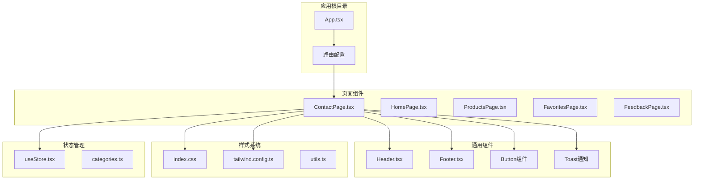
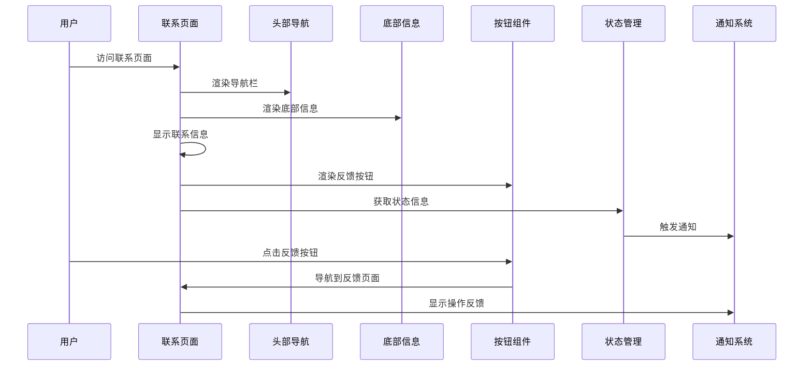
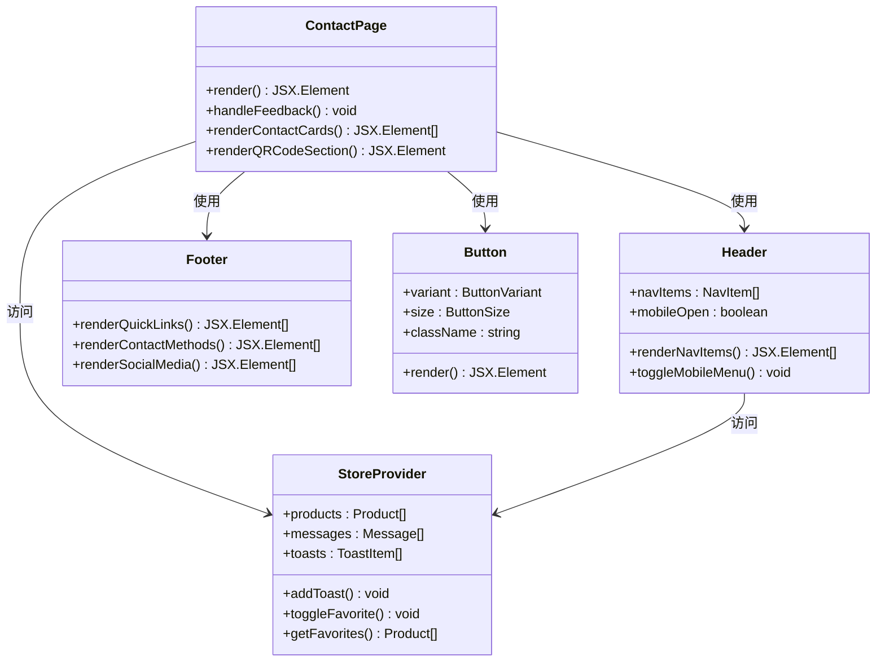
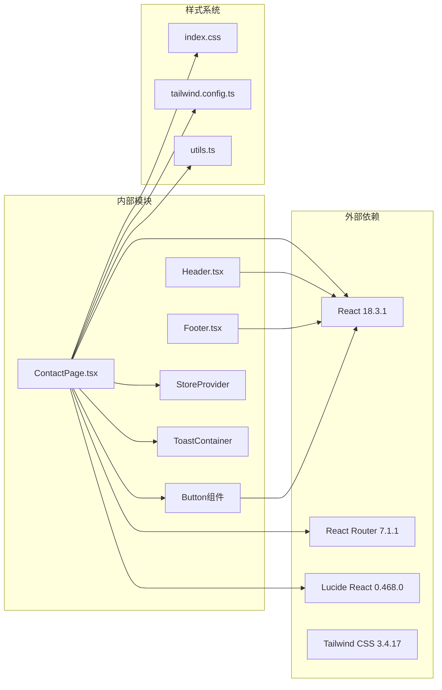

# 联系页面

<cite>
**本文档引用的文件**
- [ContactPage.tsx](file://lienpet-website/src/pages/ContactPage.tsx)
- [Header.tsx](file://lienpet-website/src/components/Header.tsx)
- [Footer.tsx](file://lienpet-website/src/components/Footer.tsx)
- [App.tsx](file://lienpet-website/src/App.tsx)
- [button.tsx](file://lienpet-website/src/components/ui/button.tsx)
- [index.css](file://lienpet-website/src/index.css)
- [tailwind.config.ts](file://lienpet-website/tailwind.config.ts)
- [package.json](file://lienpet-website/package.json)
- [vite.config.ts](file://lienpet-website/vite.config.ts)
- [useStore.tsx](file://lienpet-website/src/store/useStore.tsx)
- [ToastContainer.tsx](file://lienpet-website/src/components/ToastContainer.tsx)
- [categories.ts](file://lienpet-website/src/data/categories.ts)
</cite>

## 目录
1. [简介](#简介)
2. [项目结构](#项目结构)
3. [核心组件](#核心组件)
4. [架构概览](#架构概览)
5. [详细组件分析](#详细组件分析)
6. [依赖关系分析](#依赖关系分析)
7. [性能考虑](#性能考虑)
8. [故障排除指南](#故障排除指南)
9. [结论](#结论)
10. [附录](#附录)

## 简介

联系页面是 LienPet 官方网站的重要组成部分，负责向用户展示公司的联系方式、服务方式以及与客户建立联系的多种渠道。该页面采用现代化的 React 技术栈构建，结合 Tailwind CSS 实现响应式设计，为用户提供直观、便捷的联系体验。

本页面不仅展示了传统的联系方式（邮箱、电话、地址），还集成了现代通讯工具（微信、WhatsApp）的二维码，以及用户反馈入口，形成了完整的客户沟通生态系统。

## 项目结构

该项目采用基于功能模块的组织方式，联系页面位于 `src/pages/` 目录下，与其他页面组件并列：

**图表来源**
- [App.tsx:13-35](file://lienpet-website/src/App.tsx#L13-L35)
- [ContactPage.tsx:5-75](file://lienpet-website/src/pages/ContactPage.tsx#L5-L75)

**章节来源**
- [package.json:1-31](file://lienpet-website/package.json#L1-L31)
- [vite.config.ts:1-12](file://lienpet-website/vite.config.ts#L1-L12)

## 核心组件

联系页面的核心组件由多个精心设计的元素组成，每个组件都有明确的功能定位和视觉表现：

### 主要组件构成

1. **联系信息卡片网格**：展示三种基础联系方式（邮箱、电话、地址）
2. **二维码区域**：集成微信和 WhatsApp 两种主流通讯工具
3. **反馈按钮**：连接到专门的反馈页面
4. **品牌标识**：统一的品牌视觉元素

### 设计特色

- **响应式布局**：在移动端和桌面端提供优化的显示效果
- **渐变色彩系统**：使用品牌绿色主题色
- **悬停交互效果**：提供流畅的用户体验
- **图标系统**：使用 Lucide React 图标库

**章节来源**
- [ContactPage.tsx:13-35](file://lienpet-website/src/pages/ContactPage.tsx#L13-L35)
- [ContactPage.tsx:37-63](file://lienpet-website/src/pages/ContactPage.tsx#L37-L63)

## 架构概览

联系页面的架构体现了现代前端开发的最佳实践，采用组件化设计和状态管理模式：

**图表来源**
- [ContactPage.tsx:66-72](file://lienpet-website/src/pages/ContactPage.tsx#L66-L72)
- [Header.tsx:12-17](file://lienpet-website/src/components/Header.tsx#L12-L17)
- [Footer.tsx:16-42](file://lienpet-website/src/components/Footer.tsx#L16-L42)

### 组件层次结构

**图表来源**
- [ContactPage.tsx:5-75](file://lienpet-website/src/pages/ContactPage.tsx#L5-L75)
- [Header.tsx:6-93](file://lienpet-website/src/components/Header.tsx#L6-L93)
- [Footer.tsx:4-71](file://lienpet-website/src/components/Footer.tsx#L4-L71)
- [button.tsx:5-49](file://lienpet-website/src/components/ui/button.tsx#L5-L49)
- [useStore.tsx:27-94](file://lienpet-website/src/store/useStore.tsx#L27-L94)

## 详细组件分析

### 联系信息展示区

联系信息展示区是页面的核心功能模块，采用三列网格布局展示三种基础联系方式：

#### 邮箱联系信息

邮箱卡片采用品牌渐变背景，配合邮件图标，提供清晰的联系方式展示。卡片包含：
- 圆形图标背景（品牌渐变）
- 标题文本（中文显示）
- 联系信息文本
- 悬停阴影效果

#### 电话联系信息

电话卡片同样采用统一的设计风格，突出显示联系电话：
- 电话图标设计
- 国际格式的电话号码
- 响应式字体大小

#### 地址信息

地址卡片展示公司所在地信息：
- 地图定位图标
- 中国城市名称
- 简洁的地址信息

**章节来源**
- [ContactPage.tsx:13-35](file://lienpet-website/src/pages/ContactPage.tsx#L13-L35)

### 二维码集成区

二维码区域集成了两种主流通讯工具，为用户提供便捷的即时通讯方式：

#### 微信二维码

微信二维码区域包含：
- 36x36像素的二维码容器
- 微信图标装饰
- "微信"和"WeChat"标签
- 联系方式说明文字

#### WhatsApp 二维码

WhatsApp 二维码区域设计类似：
- 36x36像素的二维码容器
- 电话图标装饰
- "WhatsApp"标签
- 电话号码显示

**章节来源**
- [ContactPage.tsx:37-63](file://lienpet-website/src/pages/ContactPage.tsx#L37-L63)

### 反馈入口组件

页面底部提供专门的反馈入口按钮，连接到反馈页面：

#### 按钮设计

反馈按钮采用品牌配色方案：
- 大号尺寸设计
- 品牌渐变背景
- 消息图标装饰
- "给我们留言"文本

#### 导航行为

点击按钮后会导航到 `/feedback` 路径，为用户提供完整的反馈流程。

**章节来源**
- [ContactPage.tsx:65-72](file://lienpet-website/src/pages/ContactPage.tsx#L65-L72)

### 响应式设计实现

联系页面实现了完整的响应式设计，适配不同屏幕尺寸：

#### 移动端优化

- 单列布局设计
- 放大字体尺寸
- 增大触摸目标
- 简化信息层级

#### 桌面端优化

- 三列网格布局
- 增强的视觉层次
- 更丰富的交互效果
- 宽屏优势利用

**章节来源**
- [ContactPage.tsx:7-11](file://lienpet-website/src/pages/ContactPage.tsx#L7-L11)

## 依赖关系分析

联系页面的依赖关系体现了模块化的架构设计，各组件之间保持松耦合：

**图表来源**
- [package.json:11-20](file://lienpet-website/package.json#L11-L20)
- [ContactPage.tsx:1-3](file://lienpet-website/src/pages/ContactPage.tsx#L1-L3)

### 样式系统依赖

联系页面的样式系统采用分层设计：

#### CSS 层级结构

- **Base 层**：基础样式定义
- **Components 层**：组件特定样式
- **Utilities 层**：实用工具类

#### 主题变量系统

页面使用 CSS 自定义属性实现主题控制：
- 品牌色彩变量
- 字体家族定义
- 阴影效果配置
- 过渡动画设置

**章节来源**
- [index.css:7-115](file://lienpet-website/src/index.css#L7-L115)
- [tailwind.config.ts:18-101](file://lienpet-website/tailwind.config.ts#L18-L101)

## 性能考虑

联系页面在性能方面采用了多项优化策略：

### 代码分割

- 页面组件按需加载
- 图标组件懒加载
- 样式文件独立打包

### 渲染优化

- 使用 React.memo 优化组件渲染
- 合理的 DOM 结构设计
- 减少不必要的重排重绘

### 资源优化

- 图片资源压缩
- 字体文件优化
- CSS 选择器简化

### 缓存策略

- 浏览器缓存配置
- CDN 加速
- 静态资源版本控制

## 故障排除指南

### 常见问题及解决方案

#### 图标显示异常

**问题描述**：Lucide 图标无法正常显示

**解决方法**：
1. 检查网络连接是否正常
2. 验证图标导入路径正确性
3. 确认图标库版本兼容性

#### 样式渲染问题

**问题描述**：页面样式显示异常或不生效

**解决方法**：
1. 检查 Tailwind CSS 配置
2. 验证 CSS 变量定义
3. 确认样式优先级设置

#### 响应式布局问题

**问题描述**：在移动设备上显示异常

**解决方法**：
1. 检查断点设置
2. 验证媒体查询语法
3. 确认容器宽度配置

#### 导航功能异常

**问题描述**：页面间跳转失效

**解决方法**：
1. 检查路由配置
2. 验证路径拼写
3. 确认组件导出

**章节来源**
- [ContactPage.tsx:1-3](file://lienpet-website/src/pages/ContactPage.tsx#L1-L3)
- [index.css:1-3](file://lienpet-website/src/index.css#L1-L3)

## 结论

联系页面成功地将传统的企业联系方式与现代数字通讯方式相结合，为用户提供了完整、便捷的联系体验。通过精心设计的组件架构、响应式布局和品牌一致性的视觉设计，该页面有效地传达了企业的专业形象。

页面的主要优势包括：
- **功能完整性**：涵盖所有主要联系渠道
- **用户体验优化**：直观的界面设计和交互效果
- **技术实现先进**：采用现代前端技术和最佳实践
- **可维护性强**：模块化设计便于后续扩展和维护

## 附录

### 定制化建议

#### 品牌个性化

1. **色彩调整**：修改 CSS 变量中的品牌色彩值
2. **字体替换**：更新字体家族配置
3. **图标定制**：替换为品牌专属图标
4. **Logo 更新**：替换页面中的品牌标识

#### 功能扩展

1. **地图集成**：添加 Google Maps 或高德地图
2. **在线客服**：集成即时聊天功能
3. **表单增强**：添加联系表单组件
4. **社交链接**：扩展社交媒体平台支持

#### 多语言支持

1. **国际化框架**：集成 i18n 解决方案
2. **文本提取**：将所有显示文本提取到翻译文件
3. **RTL 支持**：添加从右到左语言支持
4. **本地化测试**：验证多语言显示效果

### 性能优化建议

#### 代码层面

1. **组件懒加载**：对非关键组件实施懒加载
2. **图片优化**：使用 WebP 格式和适当的尺寸
3. **CSS 优化**：移除未使用的样式规则
4. **JavaScript 压缩**：启用生产环境压缩

#### 网络层面

1. **CDN 部署**：使用内容分发网络加速
2. **缓存策略**：配置合理的缓存头
3. **预加载优化**：对关键资源实施预加载
4. **HTTP/2**：启用 HTTP/2 多路复用

#### 用户体验

1. **加载指示器**：添加适当的加载状态提示
2. **错误边界**：实现全局错误处理机制
3. **离线支持**：提供基本的离线显示能力
4. **无障碍访问**：确保符合 WCAG 标准