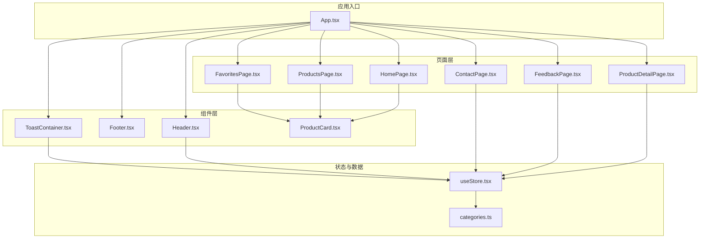
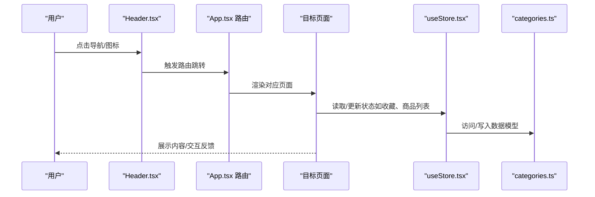
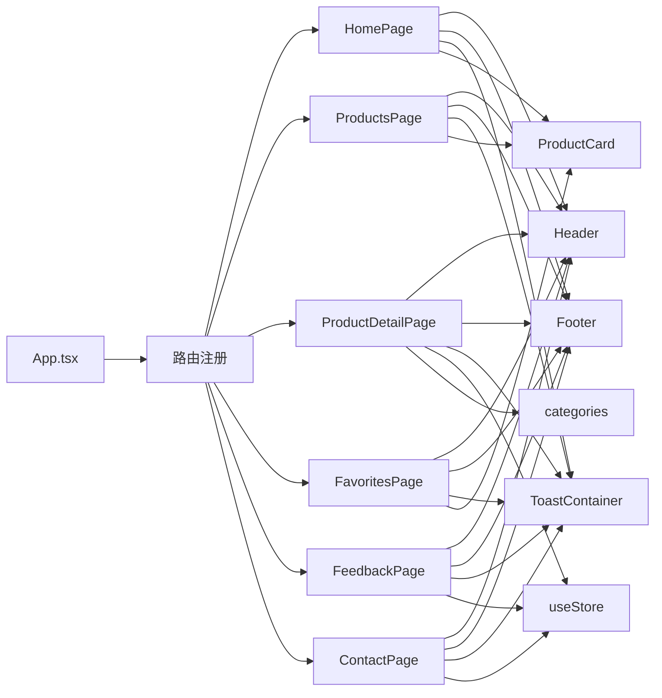

# 页面组件

<cite>
**本文引用的文件**
- [App.tsx](file://lienpet-website/src/App.tsx)
- [Header.tsx](file://lienpet-website/src/components/Header.tsx)
- [Footer.tsx](file://lienpet-website/src/components/Footer.tsx)
- [ToastContainer.tsx](file://lienpet-website/src/components/ToastContainer.tsx)
- [HomePage.tsx](file://lienpet-website/src/pages/HomePage.tsx)
- [ProductsPage.tsx](file://lienpet-website/src/pages/ProductsPage.tsx)
- [ProductDetailPage.tsx](file://lienpet-website/src/pages/ProductDetailPage.tsx)
- [FavoritesPage.tsx](file://lienpet-website/src/pages/FavoritesPage.tsx)
- [FeedbackPage.tsx](file://lienpet-website/src/pages/FeedbackPage.tsx)
- [ContactPage.tsx](file://lienpet-website/src/pages/ContactPage.tsx)
- [useStore.tsx](file://lienpet-website/src/store/useStore.tsx)
- [categories.ts](file://lienpet-website/src/data/categories.ts)
- [ProductCard.tsx](file://lienpet-website/src/components/ProductCard.tsx)
- [package.json](file://lienpet-website/package.json)
</cite>

## 目录
1. [简介](#简介)
2. [项目结构](#项目结构)
3. [核心组件](#核心组件)
4. [架构总览](#架构总览)
5. [详细组件分析](#详细组件分析)
6. [依赖分析](#依赖分析)
7. [性能考虑](#性能考虑)
8. [故障排查指南](#故障排查指南)
9. [结论](#结论)
10. [附录](#附录)

## 简介
本文件系统性梳理 LienPet 电商网站的页面组件，覆盖首页、商品列表、商品详情、收藏页、反馈页与联系页六大页面，以及通用头部、底部与全局状态管理。文档从功能职责、实现逻辑、用户交互流程入手，深入分析页面间导航关系、数据传递与状态共享机制，并给出生命周期管理与性能优化建议，帮助开发者与产品人员快速理解与维护系统。

## 项目结构
项目采用基于页面的组织方式，页面位于 pages 目录，通用 UI 组件位于 components 目录，全局状态通过自定义 Hook 管理，路由在应用入口集中配置。

图表来源
- [App.tsx:13-35](file://lienpet-website/src/App.tsx#L13-L35)
- [Header.tsx:6-92](file://lienpet-website/src/components/Header.tsx#L6-L92)
- [Footer.tsx:4-70](file://lienpet-website/src/components/Footer.tsx#L4-L70)
- [ToastContainer.tsx:4-27](file://lienpet-website/src/components/ToastContainer.tsx#L4-L27)
- [HomePage.tsx:8-151](file://lienpet-website/src/pages/HomePage.tsx#L8-L151)
- [ProductsPage.tsx:9-166](file://lienpet-website/src/pages/ProductsPage.tsx#L9-L166)
- [ProductDetailPage.tsx:8-253](file://lienpet-website/src/pages/ProductDetailPage.tsx#L8-L253)
- [FavoritesPage.tsx:7-41](file://lienpet-website/src/pages/FavoritesPage.tsx#L7-L41)
- [FeedbackPage.tsx:6-110](file://lienpet-website/src/pages/FeedbackPage.tsx#L6-L110)
- [ContactPage.tsx:5-74](file://lienpet-website/src/pages/ContactPage.tsx#L5-L74)
- [useStore.tsx:27-93](file://lienpet-website/src/store/useStore.tsx#L27-L93)
- [categories.ts:40-244](file://lienpet-website/src/data/categories.ts#L40-L244)
- [ProductCard.tsx:10-50](file://lienpet-website/src/components/ProductCard.tsx#L10-L50)

章节来源
- [App.tsx:13-35](file://lienpet-website/src/App.tsx#L13-L35)
- [package.json:1-31](file://lienpet-website/package.json#L1-L31)

## 核心组件
- 应用入口与路由：集中注册页面路由与全局 Provider，统一挂载头部、底部与全局提示容器。
- 头部导航：响应式导航栏，包含主导航、反馈入口、收藏计数徽标与移动端菜单。
- 商品卡片：统一的商品展示卡片，支持收藏切换与跳转详情。
- 全局状态：集中管理商品、消息、收藏与提示，提供增删改查与自动清理能力。
- 数据模型：定义类目、商品、链接与消息的数据结构，提供示例数据用于演示。

章节来源
- [App.tsx:13-35](file://lienpet-website/src/App.tsx#L13-L35)
- [Header.tsx:6-92](file://lienpet-website/src/components/Header.tsx#L6-L92)
- [ProductCard.tsx:10-50](file://lienpet-website/src/components/ProductCard.tsx#L10-L50)
- [useStore.tsx:27-93](file://lienpet-website/src/store/useStore.tsx#L27-L93)
- [categories.ts:40-244](file://lienpet-website/src/data/categories.ts#L40-L244)

## 架构总览
页面组件围绕“路由 + 状态 + UI 组件”的分层架构组织，页面负责业务编排与交互，状态层提供数据与副作用，UI 组件负责可复用的视觉与交互。

图表来源
- [App.tsx:21-28](file://lienpet-website/src/App.tsx#L21-L28)
- [Header.tsx:12-17](file://lienpet-website/src/components/Header.tsx#L12-L17)
- [useStore.tsx:27-93](file://lienpet-website/src/store/useStore.tsx#L27-L93)
- [categories.ts:40-244](file://lienpet-website/src/data/categories.ts#L40-L244)

## 详细组件分析

### 首页 HomePage
- 功能职责
  - 英雄区展示品牌信息与行动按钮，引导至商品列表与联系页面。
  - 分类网格展示类目，点击进入商品列表并按类目筛选。
  - 精选商品区域展示部分商品，点击进入商品详情。
  - 联系区块展示邮箱、电话、地址与二维码入口。
- 实现逻辑
  - 使用全局状态读取商品列表，截取前四件作为精选。
  - 类目网格通过类目数据渲染，点击时携带查询参数 category 进入商品列表。
  - 商品卡片复用通用组件，支持收藏切换。
- 用户交互
  - 按钮与链接均为路由跳转；分类网格悬停缩放与指示器过渡。
- 关键路径
  - [HomePage.tsx:8-151](file://lienpet-website/src/pages/HomePage.tsx#L8-L151)
  - [useStore.tsx:8-10](file://lienpet-website/src/store/useStore.tsx#L8-L10)
  - [categories.ts:40-141](file://lienpet-website/src/data/categories.ts#L40-L141)

章节来源
- [HomePage.tsx:8-151](file://lienpet-website/src/pages/HomePage.tsx#L8-L151)
- [useStore.tsx:8-10](file://lienpet-website/src/store/useStore.tsx#L8-L10)
- [categories.ts:40-141](file://lienpet-website/src/data/categories.ts#L40-L141)

### 商品列表 ProductsPage
- 功能职责
  - 基于 URL 查询参数进行类目与子类目筛选。
  - 移动端侧边栏分类导航，支持清空筛选条件。
  - 展示筛选面包屑与清空按钮，提升筛选可见性。
  - 空结果时提供一键查看全部的引导。
- 实现逻辑
  - 通过 useSearchParams 获取 category 与 sub 参数，使用 useMemo 对商品进行双层过滤。
  - 侧边栏展开/收起控制移动端体验，点击项更新查询参数。
  - 面包屑动态显示当前类目与子类目，支持逐级清除。
- 用户交互
  - 点击类目/子类目更新 URL，实时刷新列表；点击面包屑清空对应筛选。
- 关键路径
  - [ProductsPage.tsx:9-166](file://lienpet-website/src/pages/ProductsPage.tsx#L9-L166)
  - [useStore.tsx:14-14](file://lienpet-website/src/store/useStore.tsx#L14-L14)

章节来源
- [ProductsPage.tsx:9-166](file://lienpet-website/src/pages/ProductsPage.tsx#L9-L166)
- [useStore.tsx:14-14](file://lienpet-website/src/store/useStore.tsx#L14-L14)

### 商品详情 ProductDetailPage
- 功能职责
  - 展示商品图片画廊、缩略图与切换，支持上传新图与删除图。
  - 展示商品名称、类目标签、描述与价格。
  - 支持添加/删除商品链接，便于外部渠道展示。
  - 提供收藏切换与返回上一页的能力。
  - 面包屑导航回到商品列表与类目层级。
- 实现逻辑
  - 通过 useParams 获取商品 ID，从全局状态中查找商品。
  - 图片上传限制最多 10 张，删除至少保留 1 张；更新商品时触发状态变更与提示。
  - 链接新增支持回车快捷键，删除即时生效。
- 用户交互
  - 图片轮播与缩略图选择；上传按钮懒加载文件输入；收藏按钮即时切换。
- 关键路径
  - [ProductDetailPage.tsx:8-253](file://lienpet-website/src/pages/ProductDetailPage.tsx#L8-L253)
  - [useStore.tsx:11-11](file://lienpet-website/src/store/useStore.tsx#L11-L11)

章节来源
- [ProductDetailPage.tsx:8-253](file://lienpet-website/src/pages/ProductDetailPage.tsx#L8-L253)
- [useStore.tsx:11-11](file://lienpet-website/src/store/useStore.tsx#L11-L11)

### 收藏页 FavoritesPage
- 功能职责
  - 展示用户收藏的所有商品，统计数量。
  - 无收藏时提供引导至商品列表的按钮。
- 实现逻辑
  - 通过 getFavorites 从全局状态筛选收藏商品，传给商品卡片渲染。
- 用户交互
  - 点击卡片跳转到商品详情；无收藏时点击按钮前往商品列表。
- 关键路径
  - [FavoritesPage.tsx:7-41](file://lienpet-website/src/pages/FavoritesPage.tsx#L7-L41)
  - [useStore.tsx:48-50](file://lienpet-website/src/store/useStore.tsx#L48-L50)

章节来源
- [FavoritesPage.tsx:7-41](file://lienpet-website/src/pages/FavoritesPage.tsx#L7-L41)
- [useStore.tsx:48-50](file://lienpet-website/src/store/useStore.tsx#L48-L50)

### 反馈页 FeedbackPage
- 功能职责
  - 表单收集用户姓名、邮箱与反馈类型（建议/商品需求）。
  - 文本域根据类型动态提示，必填字段校验后提交。
  - 提交成功后清空表单并弹出全局提示。
- 实现逻辑
  - 表单状态通过本地 useState 管理；提交时调用 addMessage 写入消息队列并触发 toast。
- 用户交互
  - 切换反馈类型改变占位提示；提交按钮禁用未满足必填条件。
- 关键路径
  - [FeedbackPage.tsx:6-110](file://lienpet-website/src/pages/FeedbackPage.tsx#L6-L110)
  - [useStore.tsx:52-60](file://lienpet-website/src/store/useStore.tsx#L52-L60)

章节来源
- [FeedbackPage.tsx:6-110](file://lienpet-website/src/pages/FeedbackPage.tsx#L6-L110)
- [useStore.tsx:52-60](file://lienpet-website/src/store/useStore.tsx#L52-L60)

### 联系页 ContactPage
- 功能职责
  - 展示邮箱、电话、地址等基础联系方式。
  - 展示微信与 WhatsApp 二维码与说明，提供“给我留言”按钮直达反馈页。
- 实现逻辑
  - 纯展示页面，不涉及状态变更；通过 Link 导航到反馈页。
- 用户交互
  - 点击“给我留言”按钮跳转反馈页。
- 关键路径
  - [ContactPage.tsx:5-74](file://lienpet-website/src/pages/ContactPage.tsx#L5-L74)

章节来源
- [ContactPage.tsx:5-74](file://lienpet-website/src/pages/ContactPage.tsx#L5-L74)

### 头部 Header 与底部 Footer
- 头部 Header
  - 响应式导航，移动端抽屉菜单；高亮当前页；反馈入口；收藏徽标显示收藏数量。
- 底部 Footer
  - 快速链接、联系方式与关注入口。
- 关键路径
  - [Header.tsx:6-92](file://lienpet-website/src/components/Header.tsx#L6-L92)
  - [Footer.tsx:4-70](file://lienpet-website/src/components/Footer.tsx#L4-L70)

章节来源
- [Header.tsx:6-92](file://lienpet-website/src/components/Header.tsx#L6-L92)
- [Footer.tsx:4-70](file://lienpet-website/src/components/Footer.tsx#L4-L70)

### 全局状态 useStore 与数据模型 categories
- 状态管理
  - 提供商品 CRUD、收藏切换、消息提交与全局提示；自动清理提示。
  - 通过上下文暴露给所有页面与组件使用。
- 数据模型
  - 定义类目、商品、链接与消息接口；提供示例商品数据。
- 关键路径
  - [useStore.tsx:27-93](file://lienpet-website/src/store/useStore.tsx#L27-L93)
  - [categories.ts:40-244](file://lienpet-website/src/data/categories.ts#L40-L244)

章节来源
- [useStore.tsx:27-93](file://lienpet-website/src/store/useStore.tsx#L27-L93)
- [categories.ts:40-244](file://lienpet-website/src/data/categories.ts#L40-L244)

## 依赖分析
- 路由与页面
  - App.tsx 注册六个页面路由，统一包裹 StoreProvider，确保页面可访问全局状态。
- 组件依赖
  - 页面普遍依赖 Header、Footer、ToastContainer 与 ProductCard。
  - 商品详情与反馈页直接依赖 useStore 的状态方法。
- 数据依赖
  - 页面通过 useStore 访问 categories.ts 中的类目与示例商品数据。
- 外部依赖
  - React Router DOM 提供路由能力；Lucide React 提供图标；Tailwind CSS 提供样式。

图表来源
- [App.tsx:13-35](file://lienpet-website/src/App.tsx#L13-L35)
- [Header.tsx:6-92](file://lienpet-website/src/components/Header.tsx#L6-L92)
- [Footer.tsx:4-70](file://lienpet-website/src/components/Footer.tsx#L4-L70)
- [ToastContainer.tsx:4-27](file://lienpet-website/src/components/ToastContainer.tsx#L4-L27)
- [ProductCard.tsx:10-50](file://lienpet-website/src/components/ProductCard.tsx#L10-L50)
- [useStore.tsx:27-93](file://lienpet-website/src/store/useStore.tsx#L27-L93)
- [categories.ts:40-244](file://lienpet-website/src/data/categories.ts#L40-L244)

章节来源
- [App.tsx:13-35](file://lienpet-website/src/App.tsx#L13-L35)
- [package.json:11-20](file://lienpet-website/package.json#L11-L20)

## 性能考虑
- 渲染优化
  - 商品列表使用 useMemo 基于查询参数与商品集合进行稳定化过滤，避免重复计算。
  - 商品卡片与图片懒加载，减少首屏压力。
- 状态与副作用
  - useStore 中对常用方法使用 useCallback 包裹，降低子组件重渲染频率。
  - Toast 自动 3 秒清理，避免内存泄漏与冗余 DOM。
- 资源加载
  - 图片资源通过相对路径引入，建议在生产环境启用 CDN 与压缩。
- 路由与导航
  - 使用 Link 替代原生 a 标签，避免整页刷新；面包屑与筛选条件通过 URL 同步，利于分享与回退。

章节来源
- [ProductsPage.tsx:16-25](file://lienpet-website/src/pages/ProductsPage.tsx#L16-L25)
- [useStore.tsx:32-38](file://lienpet-website/src/store/useStore.tsx#L32-L38)
- [ProductCard.tsx:17-22](file://lienpet-website/src/components/ProductCard.tsx#L17-L22)

## 故障排查指南
- 商品未找到
  - 商品详情页若未匹配到商品，会提示并提供返回按钮；检查 URL 中的 ID 是否正确。
  - 关键路径：[ProductDetailPage.tsx:18-25](file://lienpet-website/src/pages/ProductDetailPage.tsx#L18-L25)
- 图片上传/删除异常
  - 上传超过上限或删除至只剩一张会触发错误提示；检查上传文件类型与数量限制。
  - 关键路径：[ProductDetailPage.tsx:34-60](file://lienpet-website/src/pages/ProductDetailPage.tsx#L34-L60)
- 收藏状态不同步
  - 确认 Header 徽标与页面收藏数量一致；检查 getFavorites 与 toggleFavorite 的调用链。
  - 关键路径：[Header.tsx:9-10](file://lienpet-website/src/components/Header.tsx#L9-L10)，[useStore.tsx:48-50](file://lienpet-website/src/store/useStore.tsx#L48-L50)
- 反馈提交失败
  - 表单必填字段为空时提交按钮禁用；确认姓名与内容均填写后再提交。
  - 关键路径：[FeedbackPage.tsx:13-20](file://lienpet-website/src/pages/FeedbackPage.tsx#L13-L20)，[useStore.tsx:52-60](file://lienpet-website/src/store/useStore.tsx#L52-L60)
- Toast 不消失
  - Toast 默认 3 秒自动清理；若长时间存在，检查 addToast 调用是否正确触发。
  - 关键路径：[useStore.tsx:32-38](file://lienpet-website/src/store/useStore.tsx#L32-L38)，[ToastContainer.tsx:13-27](file://lienpet-website/src/components/ToastContainer.tsx#L13-L27)

章节来源
- [ProductDetailPage.tsx:18-25](file://lienpet-website/src/pages/ProductDetailPage.tsx#L18-L25)
- [ProductDetailPage.tsx:34-60](file://lienpet-website/src/pages/ProductDetailPage.tsx#L34-L60)
- [Header.tsx:9-10](file://lienpet-website/src/components/Header.tsx#L9-L10)
- [useStore.tsx:48-50](file://lienpet-website/src/store/useStore.tsx#L48-L50)
- [FeedbackPage.tsx:13-20](file://lienpet-website/src/pages/FeedbackPage.tsx#L13-L20)
- [useStore.tsx:32-38](file://lienpet-website/src/store/useStore.tsx#L32-L38)
- [ToastContainer.tsx:13-27](file://lienpet-website/src/components/ToastContainer.tsx#L13-L27)

## 结论
LienPet 页面组件以清晰的分层与简洁的状态管理实现了完整的购物流程闭环：从首页引导、分类筛选、商品详情到收藏与反馈，配合全局提示与响应式导航，为用户提供了流畅的浏览与交互体验。通过 useMemo、useCallback 与懒加载等手段，系统在保证功能完整性的同时兼顾了性能与可维护性。

## 附录
- 页面导航关系与数据流
  - 首页 -> 商品列表（带筛选参数）-> 商品详情（收藏/上传/链接管理）-> 收藏页（收藏聚合）-> 反馈页（消息提交）
  - 联系页提供联系方式与“给我留言”直达反馈页
- 状态共享机制
  - 所有页面通过 useStore 访问全局状态；ToastContainer 通过订阅 toasts 实时渲染
- 生命周期管理建议
  - 在需要持久化筛选条件时，可将查询参数映射到浏览器历史；在离开页面时清理临时状态（如上传预览 URL）