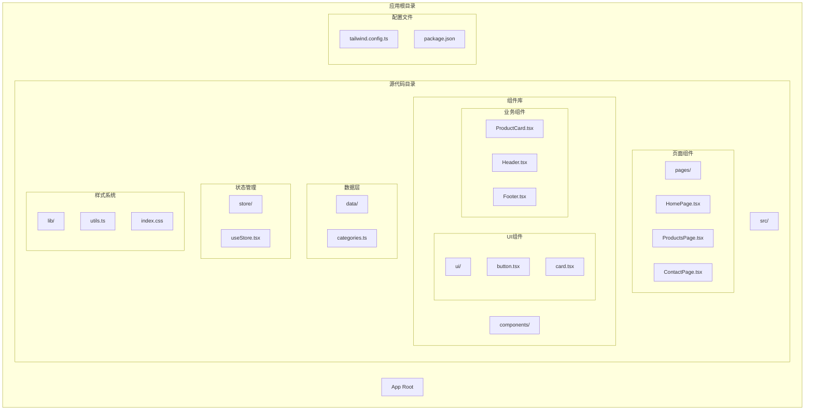
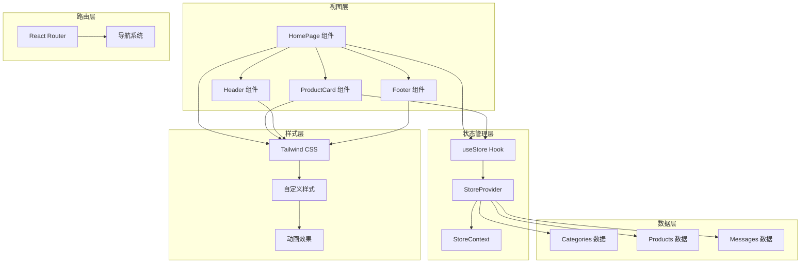
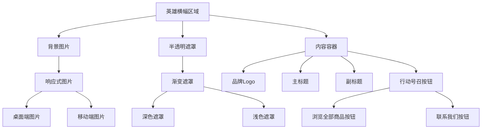
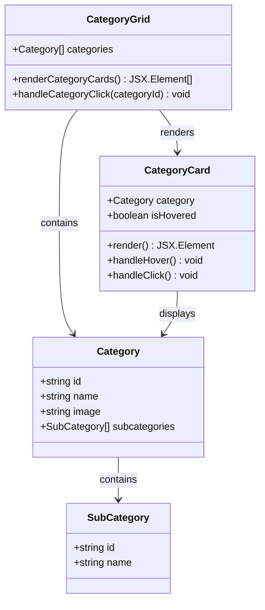
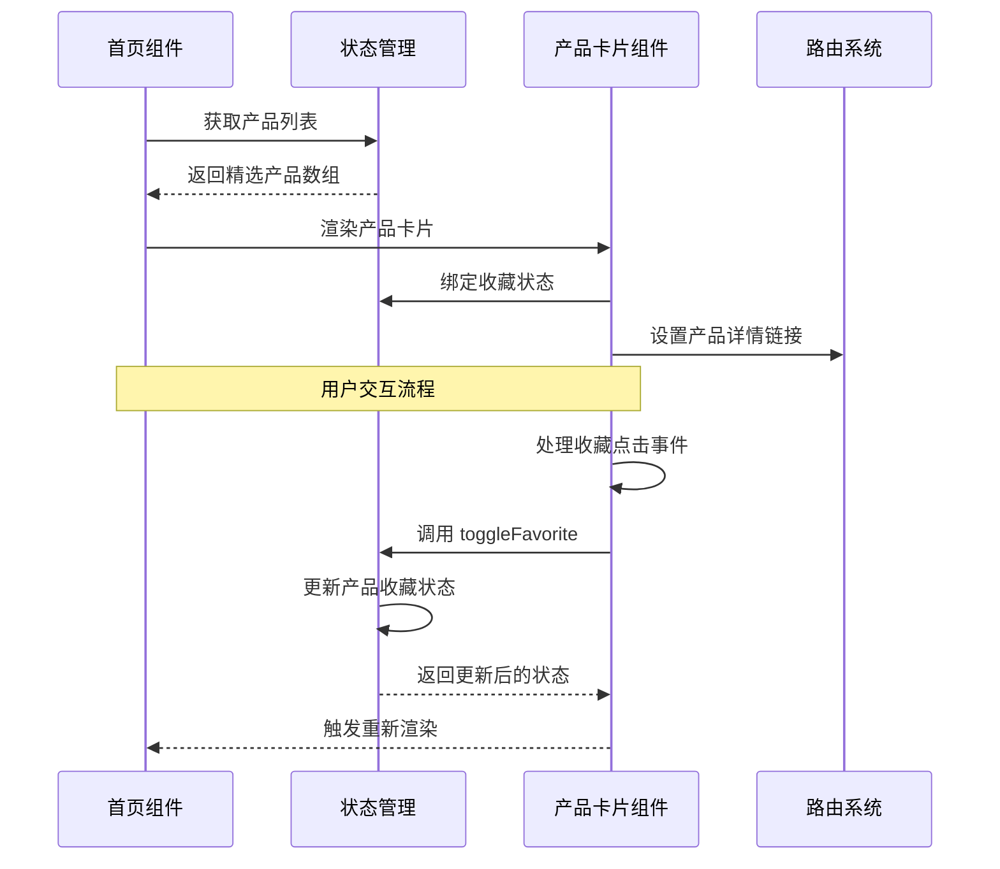
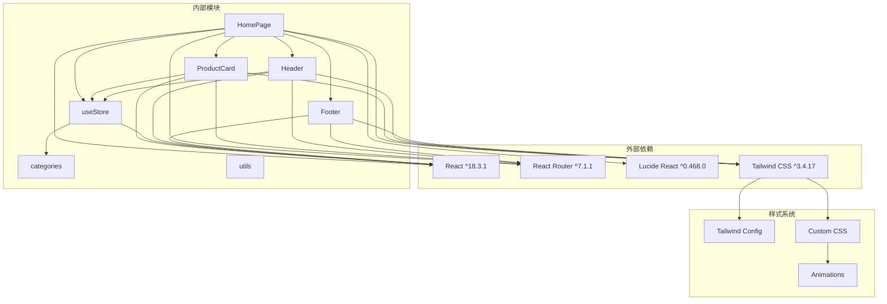

# 首页组件

<cite>
**本文档引用的文件**
- [HomePage.tsx](file://lienpet-website/src/pages/HomePage.tsx)
- [ProductCard.tsx](file://lienpet-website/src/components/ProductCard.tsx)
- [categories.ts](file://lienpet-website/src/data/categories.ts)
- [useStore.tsx](file://lienpet-website/src/store/useStore.tsx)
- [Header.tsx](file://lienpet-website/src/components/Header.tsx)
- [Footer.tsx](file://lienpet-website/src/components/Footer.tsx)
- [card.tsx](file://lienpet-website/src/components/ui/card.tsx)
- [utils.ts](file://lienpet-website/src/lib/utils.ts)
- [tailwind.config.ts](file://lienpet-website/tailwind.config.ts)
- [index.css](file://lienpet-website/src/index.css)
- [package.json](file://lienpet-website/package.json)
</cite>

## 目录
1. [简介](#简介)
2. [项目结构](#项目结构)
3. [核心组件](#核心组件)
4. [架构概览](#架构概览)
5. [详细组件分析](#详细组件分析)
6. [依赖关系分析](#依赖关系分析)
7. [性能考虑](#性能考虑)
8. [故障排除指南](#故障排除指南)
9. [结论](#结论)

## 简介

LienPet 首页组件是一个现代化的宠物用品电商网站主页，采用 React + TypeScript + TailwindCSS 技术栈构建。该组件实现了完整的用户体验流程，包括品牌展示、产品分类导航、精选商品推荐和客户联系信息展示等核心功能模块。

## 项目结构

该项目采用基于功能的模块化组织方式，主要目录结构如下：



**图表来源**
- [HomePage.tsx:1-152](file://lienpet-website/src/pages/HomePage.tsx#L1-L152)
- [useStore.tsx:1-100](file://lienpet-website/src/store/useStore.tsx#L1-L100)
- [categories.ts:1-244](file://lienpet-website/src/data/categories.ts#L1-L244)

**章节来源**
- [package.json:1-31](file://lienpet-website/package.json#L1-L31)
- [tailwind.config.ts:1-106](file://lienpet-website/tailwind.config.ts#L1-L106)

## 核心组件

首页组件由四个主要功能区域构成，每个区域都有明确的设计目标和交互逻辑：

### 英雄横幅区域
- **品牌展示**：包含品牌 Logo 和核心标语
- **产品介绍**：突出显示"全球定制 | 优质宠物用品"的品牌定位
- **行动号召按钮**：提供"浏览全部商品"和"联系我们"两个主要导航入口

### 商品分类网格
- **动态渲染**：基于 categories 数据源动态生成分类卡片
- **视觉层次**：每个分类卡片包含主图、渐变遮罩和子分类信息
- **交互效果**：悬停时的缩放动画和箭头指示器显示

### 精选商品展示区
- **数据获取**：从全局状态管理中获取产品数据
- **产品卡片集成**：使用专门的 ProductCard 组件进行渲染
- **收藏功能**：支持商品收藏状态的实时更新

### 联系信息展示区
- **服务信息布局**：包含邮箱、电话、地址三种联系方式
- **社交媒体集成**：提供微信和 WhatsApp 二维码展示
- **响应式设计**：适配移动端和桌面端的不同布局需求

**章节来源**
- [HomePage.tsx:8-152](file://lienpet-website/src/pages/HomePage.tsx#L8-L152)
- [ProductCard.tsx:10-51](file://lienpet-website/src/components/ProductCard.tsx#L10-L51)

## 架构概览

该首页组件采用了清晰的分层架构设计，确保了代码的可维护性和扩展性：



**图表来源**
- [HomePage.tsx:1-152](file://lienpet-website/src/pages/HomePage.tsx#L1-L152)
- [useStore.tsx:27-94](file://lienpet-website/src/store/useStore.tsx#L27-L94)
- [Header.tsx:6-93](file://lienpet-website/src/components/Header.tsx#L6-L93)

## 详细组件分析

### 英雄横幅区域分析

英雄横幅是用户进入网站后的第一印象，采用了全屏背景图片配合半透明遮罩的设计：



**图表来源**
- [HomePage.tsx:14-48](file://lienpet-website/src/pages/HomePage.tsx#L14-L48)

该区域的关键特性包括：
- **全屏背景**：使用绝对定位的背景图片覆盖整个视口
- **渐变遮罩**：半透明的前景色遮罩确保文字可读性
- **响应式设计**：通过媒体查询调整标题大小和内边距
- **品牌一致性**：使用品牌绿色作为主要配色方案

**章节来源**
- [HomePage.tsx:14-48](file://lienpet-website/src/pages/HomePage.tsx#L14-L48)

### 商品分类网格分析

分类网格实现了动态内容渲染和丰富的交互效果：



**图表来源**
- [HomePage.tsx:50-83](file://lienpet-website/src/pages/HomePage.tsx#L50-L83)
- [categories.ts:6-11](file://lienpet-website/src/data/categories.ts#L6-L11)

关键实现细节：
- **动态渲染**：使用 map 方法遍历 categories 数组生成卡片
- **悬停效果**：通过 group-hover 伪类实现平滑的缩放动画
- **渐变遮罩**：底部渐变遮罩提升文字可读性
- **延迟动画**：使用 animation-delay 实现卡片依次淡入的效果

**章节来源**
- [HomePage.tsx:56-82](file://lienpet-website/src/pages/HomePage.tsx#L56-L82)
- [categories.ts:40-141](file://lienpet-website/src/data/categories.ts#L40-L141)

### 精选商品展示区分析

精选商品区域展示了从全局状态中获取的热门商品：



**图表来源**
- [HomePage.tsx:85-103](file://lienpet-website/src/pages/HomePage.tsx#L85-L103)
- [ProductCard.tsx:10-51](file://lienpet-website/src/components/ProductCard.tsx#L10-L51)
- [useStore.tsx:40-46](file://lienpet-website/src/store/useStore.tsx#L40-L46)

**章节来源**
- [HomePage.tsx:97-101](file://lienpet-website/src/pages/HomePage.tsx#L97-L101)
- [ProductCard.tsx:24-36](file://lienpet-website/src/components/ProductCard.tsx#L24-L36)

### 联系信息展示区分析

联系信息区域提供了多种客户沟通渠道：

```mermaid
flowchart LR
ContactSection[联系信息区域] --> ContactInfo[联系方式]
ContactSection --> SocialMedia[社交媒体]
ContactInfo --> Email[邮箱]
ContactInfo --> Phone[电话]
ContactInfo --> Address[地址]
SocialMedia --> WeChat[微信]
SocialMedia --> WhatsApp[WhatsApp]
Email --> EmailIcon[邮件图标]
Phone --> PhoneIcon[电话图标]
Address --> LocationIcon[位置图标]
WeChat --> WeChatQR[微信二维码]
WhatsApp --> WhatsAppQR[WhatsApp二维码]
EmailIcon --> EmailContent[contact@lienpet.com]
PhoneIcon --> PhoneContent[+86 400-888-8888]
LocationIcon --> AddressContent[中国·深圳]
WeChatQR --> WeChatText[微信]
WhatsAppQR --> WhatsAppText[WhatsApp]
```

**图表来源**
- [HomePage.tsx:105-149](file://lienpet-website/src/pages/HomePage.tsx#L105-L149)

**章节来源**
- [HomePage.tsx:111-148](file://lienpet-website/src/pages/HomePage.tsx#L111-L148)

## 依赖关系分析

首页组件的依赖关系体现了清晰的关注点分离：



**图表来源**
- [package.json:11-20](file://lienpet-website/package.json#L11-L20)
- [HomePage.tsx:1-6](file://lienpet-website/src/pages/HomePage.tsx#L1-L6)

**章节来源**
- [package.json:1-31](file://lienpet-website/package.json#L1-L31)

## 性能考虑

### 状态管理优化
- **局部状态缓存**：使用 useCallback 包装函数以避免不必要的重渲染
- **选择性更新**：toggleFavorite 函数只更新特定产品的状态
- **批量操作**：通过单个状态更新操作处理多个产品变化

### 图片加载优化
- **懒加载策略**：所有图片都设置了 loading="lazy" 属性
- **响应式图片**：根据设备类型加载不同尺寸的图片资源
- **渐进式加载**：使用占位符和淡入动画提升用户体验

### 渲染性能
- **虚拟滚动**：对于大量商品的情况，可以考虑实现虚拟滚动
- **代码分割**：将大型组件拆分为更小的可复用模块
- **记忆化计算**：对昂贵的计算结果进行缓存

## 故障排除指南

### 常见问题及解决方案

**问题1：商品图片不显示**
- 检查图片路径是否正确
- 确认图片文件是否存在
- 验证图片格式是否受支持

**问题2：收藏功能异常**
- 确认 useStore hook 正确导入
- 检查产品 ID 是否唯一
- 验证 isFavorite 状态初始化

**问题3：响应式布局问题**
- 检查 Tailwind CSS 配置
- 验证断点设置是否正确
- 确认容器宽度配置

**问题4：导航链接失效**
- 检查路由配置
- 验证 Link 组件的 to 属性
- 确认路由参数传递

**章节来源**
- [ProductCard.tsx:17-22](file://lienpet-website/src/components/ProductCard.tsx#L17-L22)
- [useStore.tsx:40-46](file://lienpet-website/src/store/useStore.tsx#L40-L46)

## 结论

LienPet 首页组件展现了现代前端开发的最佳实践，通过清晰的架构设计、完善的响应式布局和高效的性能优化，为用户提供了优质的购物体验。组件的模块化设计使得代码易于维护和扩展，同时保持了良好的性能表现。

该组件的核心优势包括：
- **模块化架构**：清晰的职责分离和依赖管理
- **响应式设计**：适配各种设备和屏幕尺寸
- **性能优化**：合理的状态管理和渲染策略
- **用户体验**：流畅的交互效果和直观的信息架构

未来可以考虑的改进方向：
- 添加更多的动画效果和过渡效果
- 实现商品搜索和筛选功能
- 增强无障碍访问支持
- 优化移动端触摸交互体验