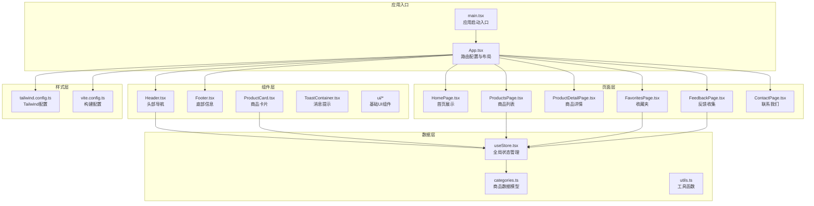
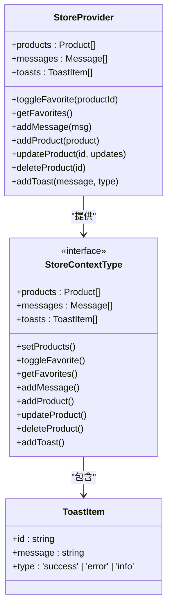
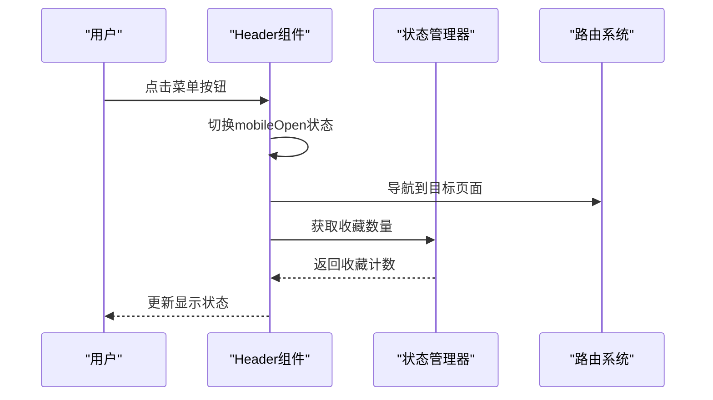
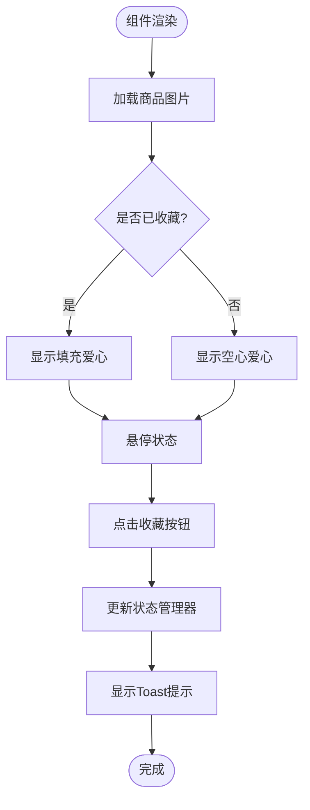
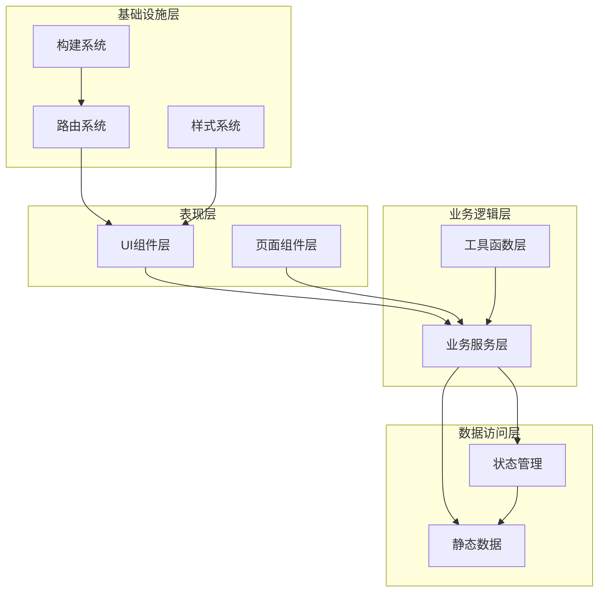
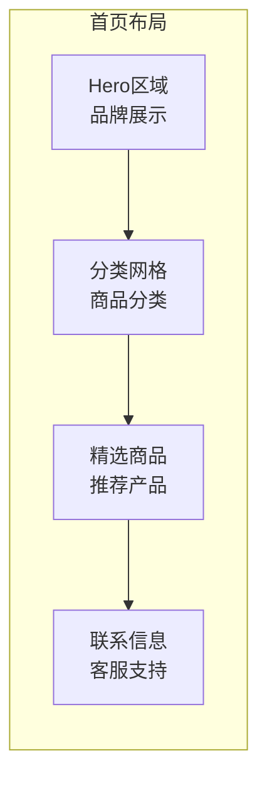
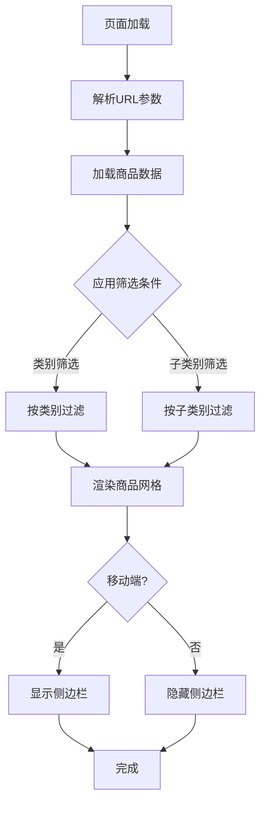
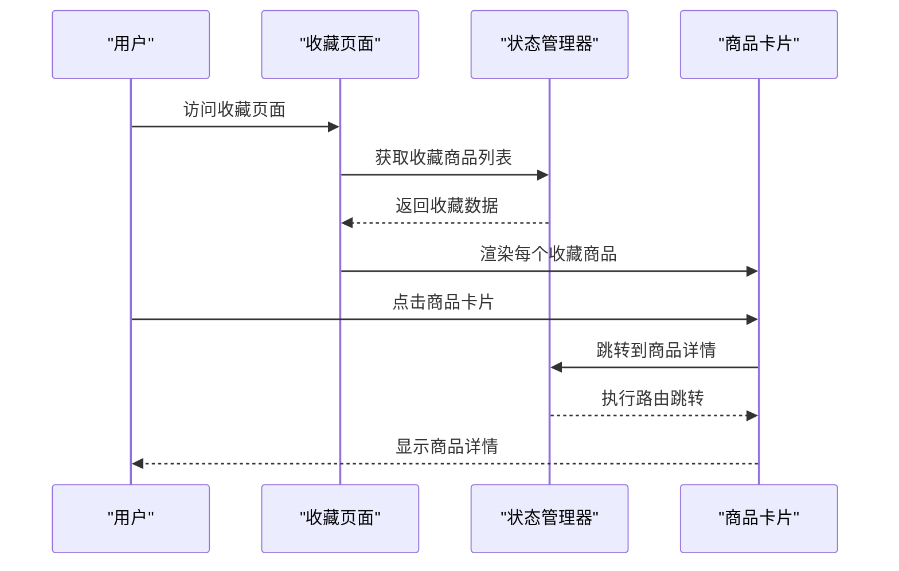
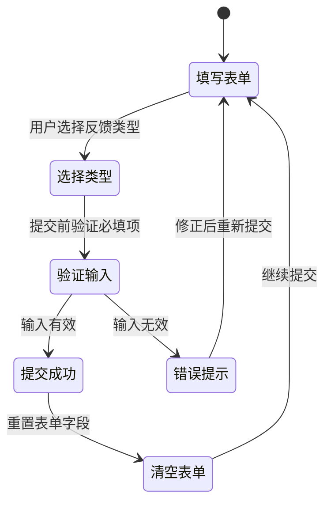

# 项目概述

<cite>
**本文档引用的文件**
- [package.json](file://lienpet-website/package.json)
- [App.tsx](file://lienpet-website/src/App.tsx)
- [main.tsx](file://lienpet-website/src/main.tsx)
- [tailwind.config.ts](file://lienpet-website/tailwind.config.ts)
- [vite.config.ts](file://lienpet-website/vite.config.ts)
- [useStore.tsx](file://lienpet-website/src/store/useStore.tsx)
- [Header.tsx](file://lienpet-website/src/components/Header.tsx)
- [Footer.tsx](file://lienpet-website/src/components/Footer.tsx)
- [HomePage.tsx](file://lienpet-website/src/pages/HomePage.tsx)
- [ProductsPage.tsx](file://lienpet-website/src/pages/ProductsPage.tsx)
- [FavoritesPage.tsx](file://lienpet-website/src/pages/FavoritesPage.tsx)
- [FeedbackPage.tsx](file://lienpet-website/src/pages/FeedbackPage.tsx)
- [categories.ts](file://lienpet-website/src/data/categories.ts)
- [ProductCard.tsx](file://lienpet-website/src/components/ProductCard.tsx)
- [utils.ts](file://lienpet-website/src/lib/utils.ts)
</cite>

## 目录
1. [引言](#引言)
2. [项目结构](#项目结构)
3. [核心组件](#核心组件)
4. [架构总览](#架构总览)
5. [详细组件分析](#详细组件分析)
6. [依赖关系分析](#依赖关系分析)
7. [性能考虑](#性能考虑)
8. [故障排除指南](#故障排除指南)
9. [结论](#结论)

## 引言

LienPet是一个基于React 18 + TypeScript + Tailwind CSS构建的单页应用（SPA），专注于为全球用户提供高品质宠物用品的一站式购物体验。该项目采用现代化前端技术栈，结合响应式设计与状态管理，旨在为宠物主提供便捷、直观且美观的在线购物平台。

项目的核心目标是通过清晰的商品分类体系、直观的用户界面以及高效的交互流程，帮助用户快速找到并购买所需的宠物用品。同时，项目内置了用户收藏功能、反馈收集系统等增强用户体验的功能模块，并通过响应式导航设计确保在不同设备上的良好使用体验。

## 项目结构

LienPet采用模块化的项目组织方式，按照功能域进行分层：



**图表来源**
- [main.tsx:1-10](file://lienpet-website/src/main.tsx#L1-L10)
- [App.tsx:1-37](file://lienpet-website/src/App.tsx#L1-L37)
- [tailwind.config.ts:1-106](file://lienpet-website/tailwind.config.ts#L1-L106)
- [vite.config.ts:1-12](file://lienpet-website/vite.config.ts#L1-L12)

**章节来源**
- [package.json:1-31](file://lienpet-website/package.json#L1-L31)
- [main.tsx:1-10](file://lienpet-website/src/main.tsx#L1-L10)
- [App.tsx:1-37](file://lienpet-website/src/App.tsx#L1-L37)

## 核心组件

### 全局状态管理器

项目采用自定义的全局状态管理方案，通过React Context实现跨组件的状态共享：



**图表来源**
- [useStore.tsx:1-100](file://lienpet-website/src/store/useStore.tsx#L1-L100)

该状态管理器提供了以下核心功能：
- 商品收藏状态管理：支持添加/移除收藏，实时更新收藏数量
- 反馈消息处理：收集用户建议和产品需求
- 消息提示系统：统一的Toast通知机制
- 商品增删改查：演示用的商品管理功能

**章节来源**
- [useStore.tsx:1-100](file://lienpet-website/src/store/useStore.tsx#L1-L100)

### 响应式导航系统

Header组件实现了移动端友好的导航体验：



**图表来源**
- [Header.tsx:1-93](file://lienpet-website/src/components/Header.tsx#L1-L93)
- [useStore.tsx:48-50](file://lienpet-website/src/store/useStore.tsx#L48-L50)

导航系统特点：
- 桌面端：固定导航栏，高亮当前页面
- 移动端：汉堡菜单，展开式导航
- 实时收藏提醒：通过徽章显示收藏数量

**章节来源**
- [Header.tsx:1-93](file://lienpet-website/src/components/Header.tsx#L1-L93)

### 商品展示系统

ProductCard组件负责单个商品的展示和交互：



**图表来源**
- [ProductCard.tsx:1-51](file://lienpet-website/src/components/ProductCard.tsx#L1-L51)
- [useStore.tsx:40-46](file://lienpet-website/src/store/useStore.tsx#L40-L46)

**章节来源**
- [ProductCard.tsx:1-51](file://lienpet-website/src/components/ProductCard.tsx#L1-L51)

## 架构总览

LienPet采用分层架构设计，各层职责明确，耦合度低：



**图表来源**
- [App.tsx:1-37](file://lienpet-website/src/App.tsx#L1-L37)
- [useStore.tsx:1-100](file://lienpet-website/src/store/useStore.tsx#L1-L100)

### 技术栈优势

1. **React 18 + TypeScript**: 提供类型安全和现代React特性
2. **Tailwind CSS**: 快速构建响应式界面，减少CSS代码量
3. **Vite构建工具**: 提供极速开发体验和优化的构建流程
4. **React Router DOM**: 支持客户端路由，实现单页应用体验

## 详细组件分析

### 首页展示模块

HomePage组件作为应用的门面，集成了多种营销元素：



**图表来源**
- [HomePage.tsx:1-152](file://lienpet-website/src/pages/HomePage.tsx#L1-L152)

首页特色功能：
- 全屏Hero背景图展示品牌理念
- 动态商品分类网格，支持悬停效果
- 精选商品展示，引导用户浏览
- 多渠道联系方式展示

**章节来源**
- [HomePage.tsx:1-152](file://lienpet-website/src/pages/HomePage.tsx#L1-L152)

### 商品筛选系统

ProductsPage实现了复杂的产品筛选和过滤功能：



**图表来源**
- [ProductsPage.tsx:1-167](file://lienpet-website/src/pages/ProductsPage.tsx#L1-L167)

筛选系统特点：
- 支持多级分类筛选（类别+子类别）
- URL参数同步，支持分享和书签
- 移动端侧边栏设计，优化小屏幕体验
- 实时筛选结果展示

**章节来源**
- [ProductsPage.tsx:1-167](file://lienpet-website/src/pages/ProductsPage.tsx#L1-L167)

### 收藏夹功能

FavoritesPage专门用于展示用户的收藏商品：



**图表来源**
- [FavoritesPage.tsx:1-42](file://lienpet-website/src/pages/FavoritesPage.tsx#L1-L42)
- [useStore.tsx:48-50](file://lienpet-website/src/store/useStore.tsx#L48-L50)

**章节来源**
- [FavoritesPage.tsx:1-42](file://lienpet-website/src/pages/FavoritesPage.tsx#L1-L42)

### 反馈收集系统

FeedbackPage提供了完整的用户反馈收集流程：



**图表来源**
- [FeedbackPage.tsx:1-111](file://lienpet-website/src/pages/FeedbackPage.tsx#L1-L111)
- [useStore.tsx:52-60](file://lienpet-website/src/store/useStore.tsx#L52-L60)

反馈系统特性：
- 两种反馈类型：建议和产品需求
- 实时表单验证
- 成功提交后的Toast提示
- 表单自动清空机制

**章节来源**
- [FeedbackPage.tsx:1-111](file://lienpet-website/src/pages/FeedbackPage.tsx#L1-L111)

## 依赖关系分析

项目的技术依赖关系清晰明确：

```mermaid
graph TB
subgraph "运行时依赖"
React[react ^18.3.1]
ReactDOM[react-dom ^18.3.1]
Router[react-router-dom ^7.1.1]
Icons[lucide-react ^0.468.0]
Tailwind[tailwind-merge ^2.6.0]
Animate[tailwindcss-animate ^1.0.7]
end
subgraph "开发依赖"
Typescript[typescript ~5.6.2]
Vite[vite ^6.0.5]
PostCSS[autoprefixer ^10.4.20]
TailwindDev[tailwindcss ^3.4.17]
ReactPlugin[@vitejs/plugin-react ^4.3.4]
end
App --> React
App --> ReactDOM
App --> Router
App --> Icons
App --> Tailwind
App --> Animate
App --> Typescript
App --> Vite
App --> PostCSS
App --> TailwindDev
App --> ReactPlugin
```

**图表来源**
- [package.json:11-30](file://lienpet-website/package.json#L11-L30)

**章节来源**
- [package.json:1-31](file://lienpet-website/package.json#L1-L31)

## 性能考虑

### 代码分割与懒加载

项目采用React.lazy和Suspense实现组件懒加载，减少首屏加载时间。虽然当前版本未完全启用，但项目结构已为未来的代码分割做好准备。

### 图片优化

- 使用`loading="lazy"`属性实现图片懒加载
- Hero区域使用全屏背景图，通过CSS控制显示效果
- 商品图片采用`object-cover`保持一致的视觉比例

### 状态管理优化

- 使用`useCallback`包装回调函数，避免不必要的重渲染
- 通过`useMemo`缓存计算结果，特别是在ProductsPage的筛选逻辑中
- 合理的状态粒度划分，避免全局状态频繁更新

### 构建优化

- Vite提供快速的开发服务器和优化的生产构建
- Tailwind CSS的按需生成，减少CSS体积
- TypeScript编译时的类型检查，提高运行时性能

## 故障排除指南

### 常见问题及解决方案

1. **路由跳转失效**
   - 检查`react-router-dom`版本兼容性
   - 确认`BrowserRouter`正确包裹应用根组件
   - 验证路由路径与组件映射关系

2. **样式不生效**
   - 确认Tailwind配置中的content路径正确
   - 检查CSS类名拼写和大小写
   - 验证构建过程中Tailwind插件正常工作

3. **状态更新异常**
   - 确保在`StoreProvider`范围内使用`useStore`钩子
   - 检查状态更新函数的调用时机
   - 验证状态值的类型和默认值设置

4. **移动端适配问题**
   - 检查断点设置和响应式类名
   - 验证触摸事件在移动设备上的表现
   - 确认字体大小和间距在小屏幕上的可读性

**章节来源**
- [useStore.tsx:96-100](file://lienpet-website/src/store/useStore.tsx#L96-L100)
- [tailwind.config.ts:1-106](file://lienpet-website/tailwind.config.ts#L1-L106)

## 结论

LienPet项目展现了现代前端开发的最佳实践，通过合理的架构设计和丰富的功能实现，为宠物用品电商提供了优秀的用户体验。项目的主要优势包括：

**技术优势**：
- 清晰的分层架构，便于维护和扩展
- 完善的TypeScript类型系统，提升代码质量
- 响应式设计确保多设备兼容性
- 高效的状态管理模式

**业务价值**：
- 提供一站式宠物用品购物体验
- 通过收藏功能增强用户粘性
- 完善的反馈收集机制促进产品改进
- 简洁直观的导航设计降低学习成本

对于初学者而言，该项目提供了良好的学习范例，展示了从项目搭建到功能实现的完整流程。对于有经验的开发者，项目在状态管理、性能优化和架构设计方面都有深入的考量，值得进一步研究和借鉴。